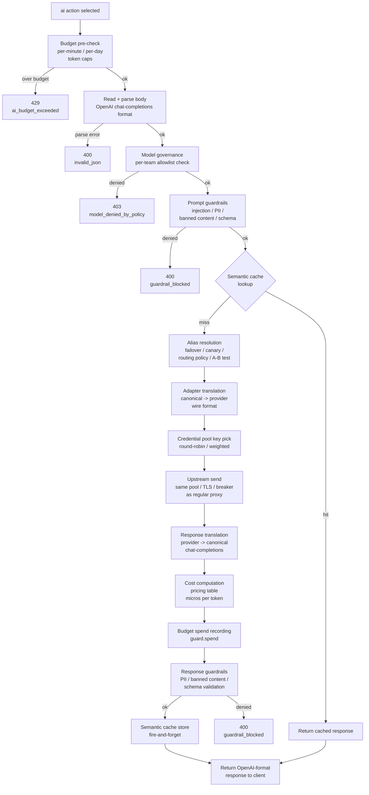
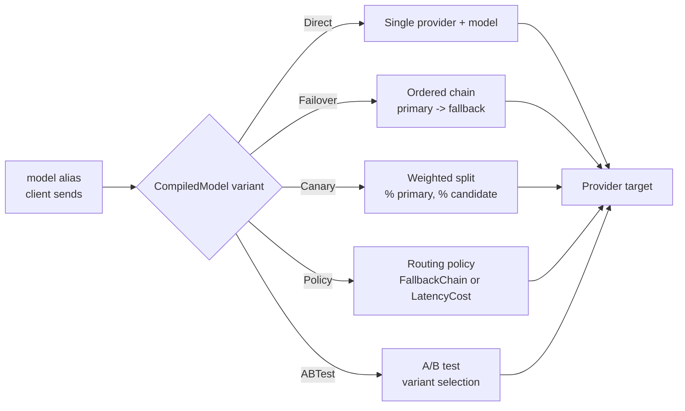

# AI gateway architecture

How Dwara translates, routes, and governs AI provider calls. For the
operator-facing configuration and feature guides, see
[AI gateway](../guide/ai-gateway) and the pages under it. This page
covers the runtime architecture: how the pieces compose and where each
sits in the AI request flow.

The AI gateway is a pure-translation layer on top of the regular proxy
machinery. An `ai` route action deviates from the normal `proxy` action
after route resolution: instead of forwarding the raw request, Dwara
parses it as a canonical chat-completions request, applies governance
and guardrails, resolves a model alias to a provider target, translates
the request to the provider's wire format, sends it through the same
upstream pool/TLS/breaker path as any other request, translates the
response back, and records token spend.

## The AI request flow

When a route's action is `ai`, the dispatch in
[request pipeline](./request-pipeline) phase 1 selects the AI branch
instead of the proxy branch. The following shows what happens inside
that branch:

### Stage order (as implemented)

The exact order, verified against `dataplane/ai_proxy.rs::serve_ai`:

1. **Token budget pre-check** — runs before the body is read. If the
   consumer or policy has a per-minute or per-day token cap and it is
   exceeded, the request is rejected with 429 immediately.
2. **Read and parse body** — the request body is parsed as an OpenAI
   chat-completions request (the canonical format all clients send).
3. **Model governance** — checks the requested model against the
   consumer's team allowlist. A model not on the allowlist is rejected
   with 403.
4. **Prompt guardrails** — the prompt phase checks for prompt
   injection, PII, banned content, and schema violations. Denials are
   403.
5. **Semantic cache lookup** — an embedding-similarity cache is
   checked (compiled into the OSS build; streaming and
   non-streaming requests alike). A hit returns the cached response
   — or replays the cached SSE frames — without contacting the
   provider.
6. **Alias resolution / routing** — the model alias is resolved to a
   provider target. This may involve failover chains, canary splits,
   routing policies, or A/B test selection.
7. **Adapter translation (request)** — the canonical request is
   translated to the provider's wire format (OpenAI, Anthropic, Gemini,
   or A2A).
8. **Credential pool key pick** — if the provider has a credential
   pool (Enterprise), a key is selected by round-robin or weighted
   hash. Keys in 429 quarantine are skipped.
9. **Upstream send** — the translated request goes through the same
   upstream pool, TLS, connection cap, and circuit breaker as a
   regular proxy request.
10. **Response translation** — the provider response is parsed and
    translated back to the canonical chat-completions format.
11. **Cost computation** — token counts are matched against the
    pricing table to compute micro-dollar cost.
12. **Budget spend recording** — the token and cost spend is recorded
    against the consumer's budget.
13. **Response guardrails** — the response phase checks for PII,
    banned content, and schema violations. Denials are 403.
14. **Semantic cache store** — the response is stored in the semantic
    cache (fire-and-forget; streams are cached through a bounded tee
    buffer when they complete within its cap).
15. **Return** — the canonical response is serialized to OpenAI format
    and returned to the client.

## The adapter translation model

The `ProviderAdapter` trait is stateless: it translates a canonical
`ChatRequest` to a provider's wire format and a provider's response
back to a canonical `ChatResponse`. Four adapters ship today:

| Adapter | Provider | Wire format |
|---|---|---|
| OpenAI | OpenAI | `/v1/chat/completions` JSON |
| Anthropic | Anthropic | `/v1/messages` JSON |
| Gemini | Google | `:generateContent` JSON |
| A2A | Agent-to-agent | A2A task JSON |

The adapters are stateless by design: TLS, connection pooling,
breakers, retries, and health checks are handled by the regular
upstream machinery. An adapter only owns the request/response shape
translation. This means a new provider is added by writing one trait
implementation — no proxy-path changes.

## Model alias resolution

A model alias is the `model` value a client puts in its request. The
alias table maps it to a provider and a provider-side model id, with
optional composition:

| Variant | How it selects a target |
|---|---|
| **Direct** | One provider + one model id. The common case. |
| **Failover** | Ordered chain: try the primary, on failure try the next, and so on. |
| **Canary** | Weighted split: a percentage of traffic goes to the candidate, the rest to the primary. |
| **Policy (FallbackChain)** | Calls an external classifier with the prompt text; if the score is below a threshold, use the cheap model, otherwise escalate to the configured target. |
| **Policy (LatencyCost)** | Candidates pre-sorted at compile time by cost, latency, or cost+latency; returns the first candidate. Synchronous, no external call. |
| **A/B test** | Variant selection by configured test assignment. |

See [AI routing policies](../guide/ai-routing-policies) for
configuration.

## Policy scoping

Governance, guardrails, token budgets, and prompt logging are all
policy-scoped — they attach at the same five levels as regular
policies (consumer > route > service > listener > global), with
deny-anywhere-wins for governance and guardrails. This means a team
(consumer group) can have its own model allowlist, a route can have
its own guardrail rules, and a consumer can have its own token budget,
all composing independently.

| Subsystem | Scope | Where it runs | Guide |
|---|---|---|---|
| Governance | Per-policy (team) allowlist | Before prompt guardrails | [AI governance](../guide/ai-governance) |
| Guardrails | Per-policy rules | Prompt + response phases | [AI guardrails](../guide/ai-guardrails) |
| Token budgets | Per-consumer / per-policy | Pre-check + spend recording | [AI token budgets](../guide/ai-token-budgets) |
| Prompt logging | Per-consumer toggle | After response guardrails | [AI prompt logging](../guide/ai-prompt-logging) |
| Semantic cache | Per-route config | Before alias resolution | [AI semantic caching](../guide/ai-semantic-caching) |

## See also

- [Request pipeline](./request-pipeline) — the regular proxy flow; the
  AI action is one branch of the action dispatch.
- [AI gateway](../guide/ai-gateway) — the operator-facing overview.
- [AI routing policies](../guide/ai-routing-policies) — FallbackChain
  and LatencyCost configuration.
- [AI governance](../guide/ai-governance) — model allowlists and
  shadow audit.
- [AI guardrails](../guide/ai-guardrails) — prompt and response phase
  rules.
- [AI token budgets](../guide/ai-token-budgets) — per-consumer and
  per-policy token caps.
