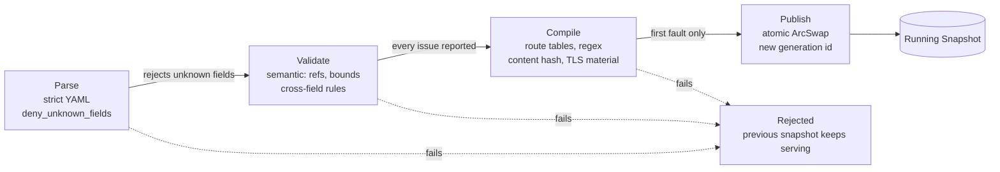
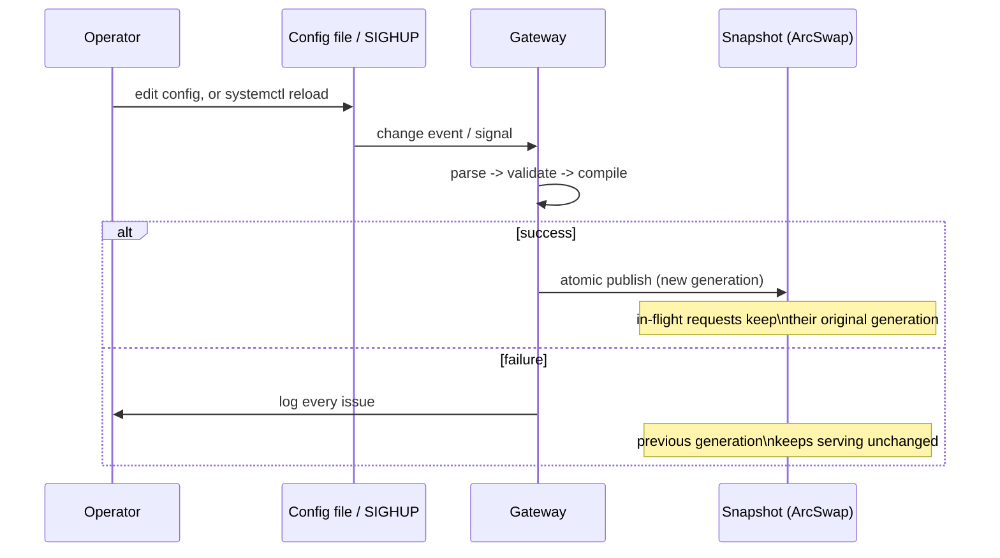

# Config, state, and extensions

How Dwara manages its own state: the config lifecycle, the three kinds
of durable state, and the five swappable extension points.

## Config lifecycle

Every config — at startup, on file-watch reload, on `SIGHUP`, via a
`PATCH /config` to the admin API, or pushed from the controller's
gRPC stream — passes through the same four-stage pipeline:

A config that fails at any stage never replaces the running gateway —
the previous snapshot keeps serving, and every problem found is
reported at once (never fail-fast on the first error). A successful
publish gets a new generation id, visible via `GET /config` on the
admin API and the `config_generation` metric.

The pipeline is split into a **pure half** (validate, compile — no
side effects, testable without a running gateway) and an **effectful
half** (publish — the only step that touches the live `ArcSwap`).
Rollback semantics are "atomic not-publish": on any failure, the swap
simply never happens, so a malformed config can never leave the
gateway serving a half-updated state.

Config, TLS certificate material, and the upstream connection pools all
swap together in the same atomic publish — a new route table is never
paired with stale upstream pools. See [Operations](../guide/operations)
for the full mechanics (debouncing, `SIGHUP`, certificate rotation,
listener-bind-set limitations).

In the enterprise topology the same pipeline runs on the controller,
and a successful publish becomes a generation pushed to every edge; an
edge that fails to compile a generation keeps serving its cached one
and reports the failure back.

## Hot reload

A reload replaces the `Arc` behind the `ArcSwap` atomically; every
in-flight request keeps working against the `Arc` it loaded at the
start of the request, so a reload never causes a request to observe a
torn mix of old and new state.

## State and durability

Dwara distinguishes three kinds of state, each with different
durability guarantees:

| State | Storage | Lifetime | What it holds |
|---|---|---|---|
| **Snapshot** | In-memory (`ArcSwap`) | Process lifetime; rebuilt on reload | Compiled routes, upstream pools, TLS material, auth state, policy bundles |
| **State store** | SQLite file (optional) | Persistent across restarts | Consumers, credentials, quota counters, MCP sessions, prompt overrides |
| **Analytics store** | SQLite file (optional) | Persistent with retention | Raw access records, rollups (1m/5m/1h/1d), AI spend, governance events, prompt logs |

The Snapshot is the hot path — every request reads from it, and it
swaps atomically on config publish. In-flight requests keep their
original snapshot for the entire request duration, so a reload never
causes a request to observe a torn mix of old and new state.

The state store and analytics store are optional and independent: each
has its own SQLite file with bounded disk usage. The analytics store
runs incremental vacuum and per-granularity retention, and its
fire-and-forget writer channel must never block the request path
(records are dropped and counted on channel-full).

See [Analytics](../guide/analytics) for the analytics store design and
[Operations](../guide/operations) for backup and maintenance.

## Extension points

Five subsystems are swappable behind async traits in
`dwara_core::extensions`, each with a local in-tree implementation
that ships by default:

| Trait | Local impl | What it does | Enterprise alternative |
|---|---|---|---|
| `RateLimiter` | In-memory GCRA | Per-scope rate limiting with stacked windows | Redis-backed distributed limiter |
| `ConfigSource` | File / env / admin API | Where config comes from | Controller gRPC stream |
| `CacheStore` | In-memory two-tier | Response caching with TTL + LRU | Redis-backed distributed cache |
| `AnalyticsSink` | Embedded SQLite store | Request records + rollups | Federated analytics to controller |
| `SecretSource` | Env / file references | `${...}` secret resolution | Vault / KMS secret resolution |

An extension is selected at compile time or config time; the request
path is the same regardless of which implementation is active. This is
how the OSS edition and the enterprise edition share one codebase —
the enterprise edition swaps in Redis-backed and Vault-backed
implementations behind the same traits.

See [Enterprise](../guide/enterprise) for the enterprise extension
implementations and the [developer docs on extension
points](https://github.com/shristilabs/dwara/tree/main/docs/features/extension-points.md)
for the trait contracts.

## See also

- [Architecture overview](./overview) — the high-level map.
- [Configuration](../guide/configuration) — the YAML shape and
  vocabulary.
- [Operations](../guide/operations) — reload, shutdown, health,
  backup.
- [Enterprise](../guide/enterprise) — the enterprise extension
  implementations.
