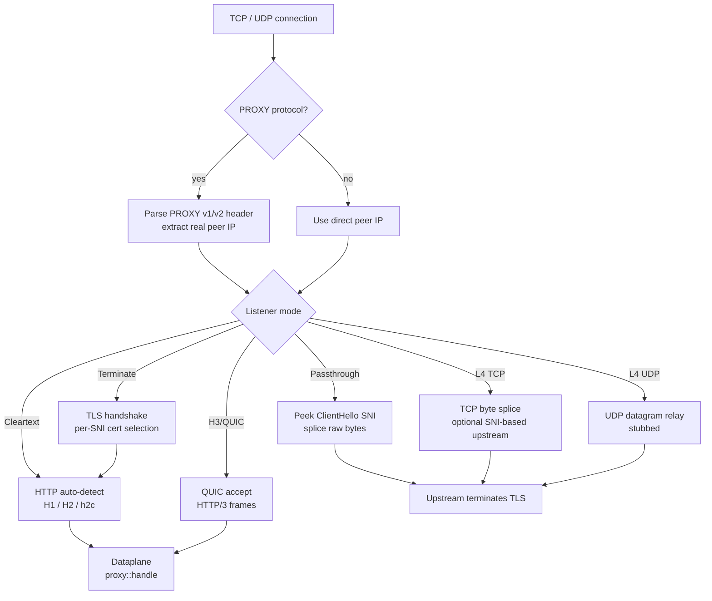
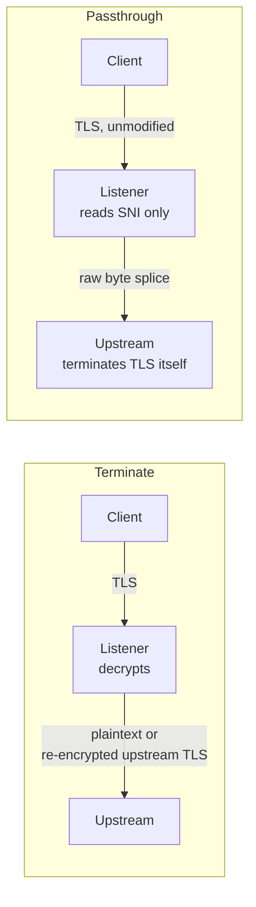

# Connection and TLS

How Dwara accepts connections, handles protocols, and manages TLS —
everything that happens before a request enters the
[request pipeline](./request-pipeline).

## Connection and protocol handling

A listener is the front door. Each listener binds an address and port,
selects a protocol, and decides how TLS is handled. The protocol
determines what the listener does with the bytes it accepts:

| Listener mode | Protocol | What happens |
|---|---|---|
| **Terminate** | `https` | Dwara terminates TLS (multiple certificates keyed by SNI on one listener), then serves HTTP/1.1 or HTTP/2 via ALPN negotiation |
| **Passthrough** | `https` | Dwara never decrypts — it peeks the ClientHello's SNI (reassembling it across fragmented TLS records if needed) to pick an upstream, then splices raw bytes; the upstream terminates TLS itself |
| **Cleartext** | `http` / `h2c` | No TLS; hyper's auto builder sniffs the h2 preface for h2c, otherwise serves HTTP/1.1 |
| **H3/QUIC** | `h3` | A QUIC listener (feature-gated `h3`) accepts connections and serves HTTP/3 frames through the same routing and policy pipeline as h1/h2 |
| **L4 TCP** | `tcp` | Raw TCP byte splice (feature-gated `l4`); optionally peeks SNI to select the upstream, reusing the same SNI extraction as passthrough mode |
| **L4 UDP** | `udp` | UDP datagram relay (feature-gated `l4`); currently stubbed |

PROXY protocol (v1 or v2) is accepted as the first bytes of any
connection when `proxy_protocol: true` is set on the listener. The
real peer IP extracted from the PROXY header is used for IP-ACL
authorization, `X-Forwarded-For`/`X-Real-IP` construction, and
`ip_hash` load balancing — the same effective-client-IP resolution
shared across every subsystem that needs it.

See [Concepts and taxonomy](../guide/concepts) for the
Listener -> Route -> Service -> Upstream -> Endpoint chain, and
[Operations](../guide/operations) for protocol hardening (smuggling
guards, slow-trickle defenses, header read timeouts).

## TLS: terminate vs. passthrough

Terminate mode supports multiple certificates keyed by SNI on one
listener. Passthrough mode never decrypts the connection — Dwara peeks
the ClientHello's SNI (reassembling it across fragmented TLS records if
needed) to pick an upstream, then splices bytes; the upstream sees the
original, untouched TLS session.

## Upstream TLS

Upstream TLS is independent of listener TLS: an `https` or `http2`
upstream can use its own TLS with a configurable trusted CA file,
mTLS client certificates, or (feature-gated) certificate pinning by
SPKI hash. The gateway presents its own client certificate when
`upstreams[].mtls` is configured, and can obtain OAuth2 tokens to
present to the upstream as a client-credentials client.

| Upstream TLS option | What it does | Guide |
|---|---|---|
| `trusted_ca_file` | PEM file of CA certificates the upstream's TLS connections trust | [Security](../guide/security) |
| `mtls` | Client certificate the gateway presents to the upstream | [OAuth2 and mTLS](../guide/oauth2-mtls) |
| `oauth2_client_credentials` | Gateway acts as an OAuth2 client-credentials client to the upstream | [OAuth2 and mTLS](../guide/oauth2-mtls) |
| `cert_pinning` | Pin the upstream cert by SPKI SHA-256 hash (feature-gated; https/http2 only, not h3) | [Feature reference](../guide/feature-reference) |
| `pq` | Post-quantum hybrid key exchange for the upstream TLS connection (feature-gated, experimental) | [Post-quantum TLS](../guide/post-quantum-tls) |

## See also

- [Request pipeline](./request-pipeline) — what happens after the
  connection reaches the dataplane.
- [Security](../guide/security) — authentication and secrets.
- [Operations](../guide/operations) — protocol hardening, header
  timeouts, smuggling guards.
- [HTTP/3](../guide/http3) — the H3/QUIC ingress listener.
- [L4 proxying](../guide/l4-proxying) — TCP/UDP proxying.
