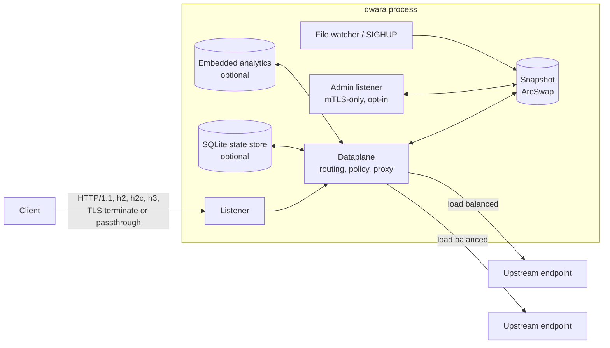
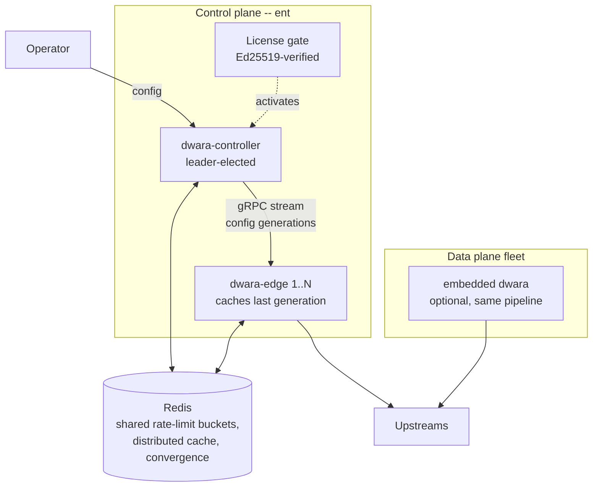

# Architecture overview

This page is a high-level map of how Dwara handles a request and how it
manages its own state, for anyone deploying or operating the gateway.
For internals aimed at contributors (crate/module layout, dependency
rules, implementation rationale), see the
[developer documentation](https://github.com/shristilabs/dwara/tree/main/docs)
in the repository.

## Editions at a glance

Dwara ships in two editions from one codebase:

- The **OSS edition** (the default build, Apache-2.0) is a single,
  self-contained gateway binary. One process owns routing, policy,
  TLS, and its own config file — everything needed to run a gateway,
  including a fleet of independent instances behind one load balancer.
- The **Enterprise edition** (built with the `ent` cargo feature and
  activated by a license) adds the features that span *multiple*
  instances or need external infrastructure: a control plane / data
  plane split, shared Redis-backed rate limiting and caching, config
  convergence across a fleet, Vault/KMS secrets, multi-tenant
  workspaces with RBAC and audit, and external policy engines.

The request path is identical in both editions — enterprise features
extend how instances are *managed* and *coordinated*, never how a
request is proxied. See
[Editions: OSS vs Enterprise](../guide/editions) for the complete
feature-by-feature comparison and how the license gate works.

## Software components

### The OSS gateway: one process

The default deployment is a single `dwara` process in *embedded mode*:
data plane, admin surface, and state all live in one binary.

| Component | What it is | Notes |
|---|---|---|
| `dwara` | The gateway binary | Listeners, dataplane, snapshot, admin listener in one process |
| Listeners | Connection acceptors | TLS terminate (per-SNI certificates), SNI passthrough splice, or L4 TCP/UDP splice; PROXY protocol v1/v2 optional |
| Dataplane | The proxy engine | Route resolution, policy chain, streaming proxy — buffers nothing by default |
| Snapshot | Immutable config state | Routes, upstream pools, TLS material, and auth state swap atomically behind an `ArcSwap` |
| Admin listener | mTLS-only management surface | Optional; `GET`/`PATCH /config`, `/health`, `/stats` |
| SQLite state store | Durable identity state | Optional; stored consumers, credentials, quota counters |
| Embedded analytics | Request records + rollups | Optional; its own SQLite file, bounded disk |
| `dwara` CLI | Operator tooling | `validate`, `fmt`, `diff`, `lint`, `schema`, `import`, `upgrade` — plus the `dwara-loadgen` load-generator rig |

An OSS fleet is simply N independent `dwara` processes with the same
config file (or one per team/service). Nothing coordinates them — that
is what the enterprise edition adds.

### The Enterprise topology: control plane + data planes

With the `ent` feature, two more binaries are compiled and the
topology gains a management layer:

| Component | Edition | Role |
|---|---|---|
| `dwara-controller` | Enterprise | The control plane: watches config sources, compiles generations, pushes them to edges over a gRPC stream (xDS-inspired). Multiple controllers run HA with leader election |
| `dwara-edge` | Enterprise | A data-plane instance that subscribes to the controller's stream and applies config updates without restart. Caches the last received generation, so the fleet keeps serving through a controller outage |
| License gate | Enterprise | Verifies the signed license at startup and activates enterprise features per claim; a degraded license falls back to OSS behavior |
| Redis backend | Enterprise | Shared GCRA rate-limit buckets, the two-tier distributed cache, and config-convergence generation state |
| `dwara` (embedded) | Both | The embedded mode remains first-class in enterprise builds — the controller and an embedded gateway run the *same* compile-and-publish pipeline, just without the gRPC transport |

The key property: an edge applies a config generation through the same
`validate -> compile -> atomic publish` pipeline as an embedded
gateway, so behavior is identical whether config arrives from a file,
the admin API, or the controller's stream.

### Compile-time feature packs

Both editions keep heavy optional features behind cargo feature flags
(default OFF) so the base binary stays small. These are OSS — no
license involved. See the
[feature reference](../guide/feature-reference) for the complete list
of all 29 flags with build commands, dependency chains, and maturity
status.

## Architecture in detail

The overview above is the 30-second map. The following pages go into
each area in depth:

- **[Request pipeline](./request-pipeline)** — the fixed order of
  stages every request passes through, split into routing/policy and
  proxy/response phases, with two detailed flow diagrams and the
  operator-facing consequences of the ordering.
- **[Connection and TLS](./connection-and-tls)** — how listeners
  accept connections, the six listener modes (terminate, passthrough,
  cleartext, H3/QUIC, L4 TCP, L4 UDP), PROXY protocol, and upstream
  TLS options.
- **[Config, state, and extensions](./config-and-state)** — the
  four-stage config pipeline (parse -> validate -> compile -> publish),
  hot reload, the three kinds of durable state, and the five
  swappable extension-point traits.
- **[Error handling](./error-handling)** — the unified JSON error
  envelope, the complete status-to-code mapping, and upstream error
  classification.
- **[Resilience](./resilience)** — the layered state machines
  (endpoint health, circuit breaker, retry budget, adaptive rate
  limiting) and how they compose to keep traffic flowing when
  upstreams degrade.
- **[Security](./security)** — the authentication dispatch order,
  the authorization evaluation model, secret resolution, and how
  they fit into the request pipeline.
- **[AI gateway](./ai-gateway)** — the AI request flow, the adapter
  translation model, alias resolution, and the policy-scoped
  governance, guardrails, and budgets.
- **[Plugins and extensibility](./plugins-and-extensibility)** — the
  shared phase model, the dispatch chain, and the lifecycle of a
  plugin instance across the three runtimes (native, Proxy-Wasm,
  Extism).
- **[Observability](./observability)** — the request ID, access log,
  metric families, trace spans, and how they correlate across the
  request path.

## Where to go next

- [Concepts and taxonomy](../guide/concepts) — the vocabulary of
  Dwara: listeners, routes, services, upstreams, consumers, policies,
  and how they relate.
- [Editions: OSS vs Enterprise](../guide/editions) — which features
  ship in which edition and how the license gate works.
- [Getting started](../guide/getting-started) — run a gateway locally.
- [Configuration](../guide/configuration) — the YAML shape and the
  config pipeline.
- [Operations](../guide/operations) — reload, shutdown, health,
  hardening.
- [Observability](../guide/observability) — logs, metrics, tracing.
- [Feature reference](../guide/feature-reference) — all 29 feature
  flags with build commands and maturity status.
