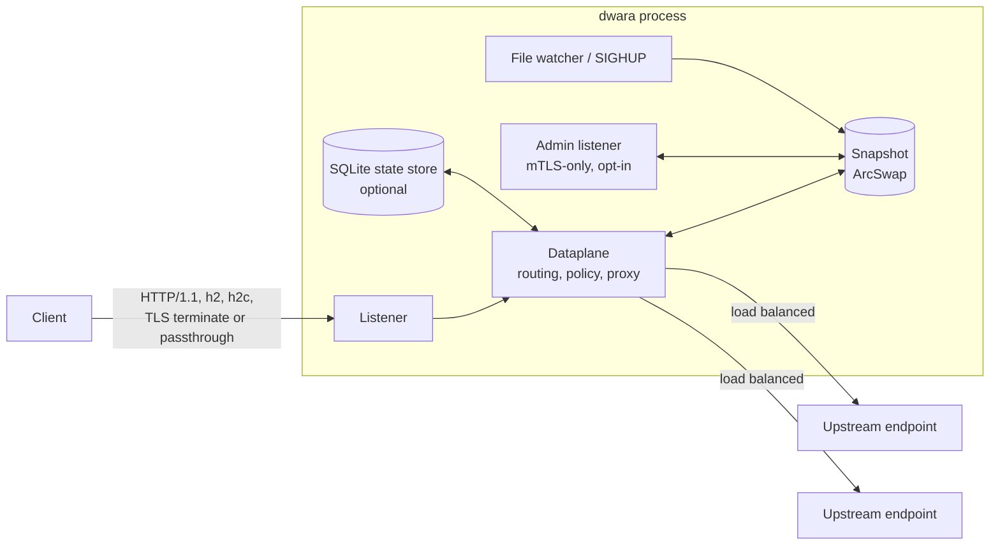
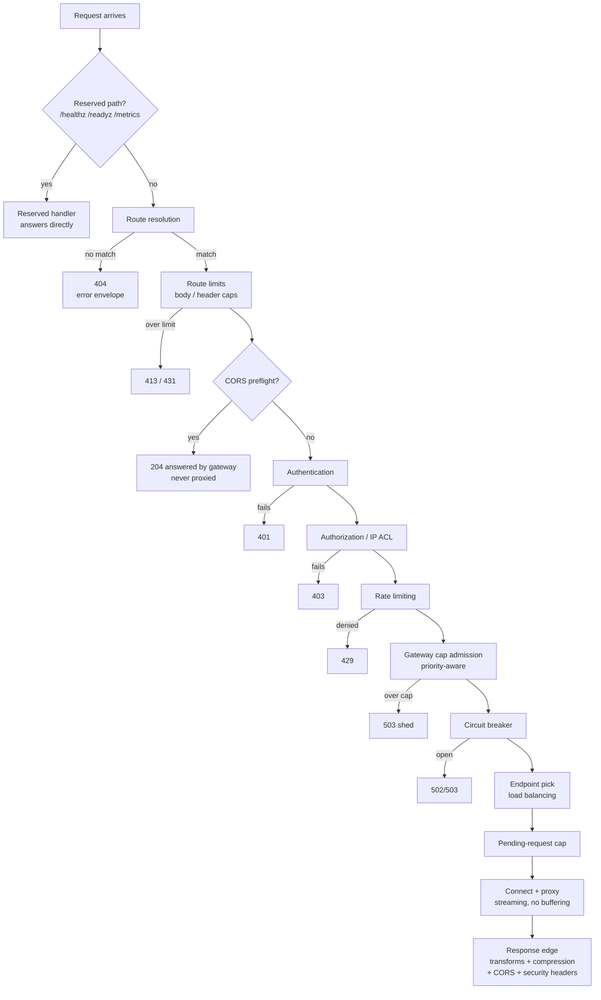
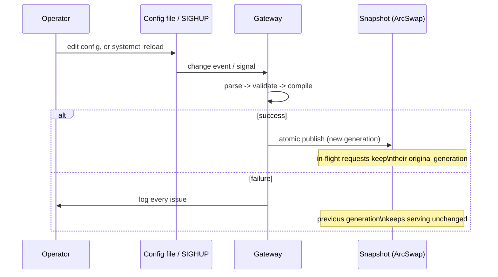
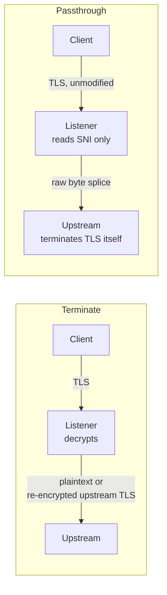

# Architecture overview

This page is a high-level map of how dwara handles a request and how it
manages its own state, for anyone deploying or operating the gateway.
For internals aimed at contributors (crate/module layout, dependency
rules, implementation rationale), see the
[developer documentation](https://github.com/shristilabs/dwara/tree/main/docs)
in the repository.

## Components

- **Listeners** accept connections and either terminate TLS (per-SNI
  certificates) or splice a TLS-passthrough connection straight to an
  upstream.
- The **dataplane** resolves a route, applies policy, and proxies to an
  upstream endpoint.
- All of that runs against an immutable, atomically-swapped
  **Snapshot** — routes, upstream pools, TLS material, and auth state
  all swap together on a successful config publish.
- The **admin listener** is a separate, optional, mTLS-only surface for
  inspecting and patching the live config (see [Admin API](../guide/admin-api)).
- An optional **SQLite state store** persists things like stored
  credentials across restarts.

## Request pipeline

Every request that reaches a data-plane listener passes through a fixed
order of stages. This order is intentional and does not change based on
configuration:

A few consequences worth knowing as an operator:

- **Unrouted traffic still gets rate-limited.** Listener- and
  global-attached rate limits run *before* route resolution decides
  there's no match, so a flood of garbage paths is still capped before
  it turns into a wall of 404s.
- **Authentication and authorization never run for unrouted traffic** —
  they're per-route/service/listener concerns, so they only make sense
  once a route has matched.
- **Route limits and CORS preflights run between routing and auth.**
  A matched request is first checked against the route's `limits`
  (413/431), and on a route with a `cors` block a browser preflight is
  answered 204 by the gateway itself — before authentication, never
  forwarded upstream. On the way out, a response can gain compression
  and CORS headers. See
  [CORS, compression, and request limits](../guide/edge-policies).
- **Policy precedence is deny-anywhere-wins**, evaluated most-specific
  first: consumer > route > service > listener > global.

## Hot reload

Config, TLS certificate material, and the upstream connection pools all
swap together in the same atomic publish — a new route table is never
paired with stale upstream pools. See [Operations](../guide/operations)
for the full mechanics (debouncing, `SIGHUP`, certificate rotation,
listener-bind-set limitations).

## TLS: terminate vs. passthrough

Terminate mode supports multiple certificates keyed by SNI on one
listener. Passthrough mode never decrypts the connection — dwara peeks
the ClientHello's SNI (reassembling it across fragmented TLS records if
needed) to pick an upstream, then splices bytes; the upstream sees the
original, untouched TLS session.

## Where to go next

- [Getting started](../guide/getting-started) — run a gateway locally.
- [Configuration](../guide/configuration) — the YAML shape and concepts.
- [Operations](../guide/operations) — reload, shutdown, health, hardening.
- [Observability](../guide/observability) — logs, metrics, tracing.
