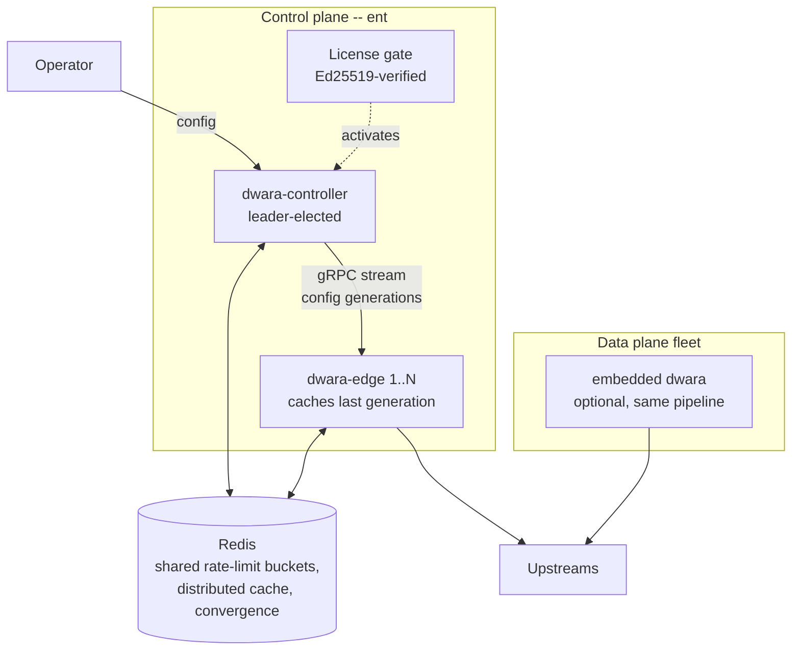
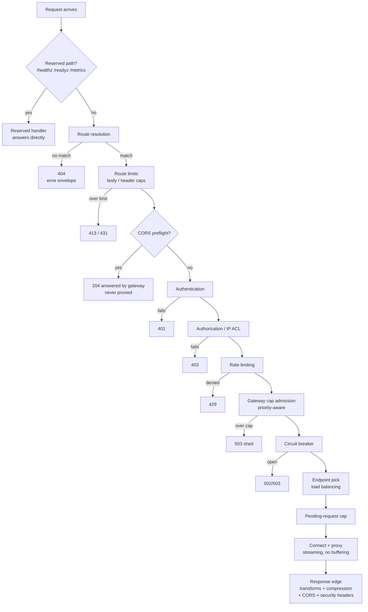
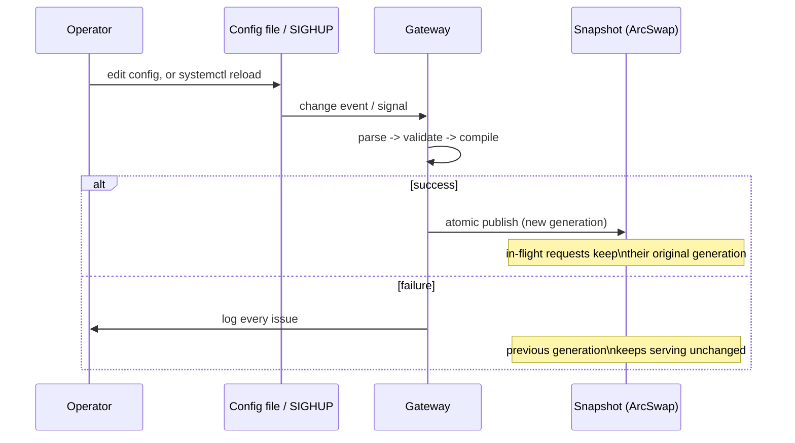
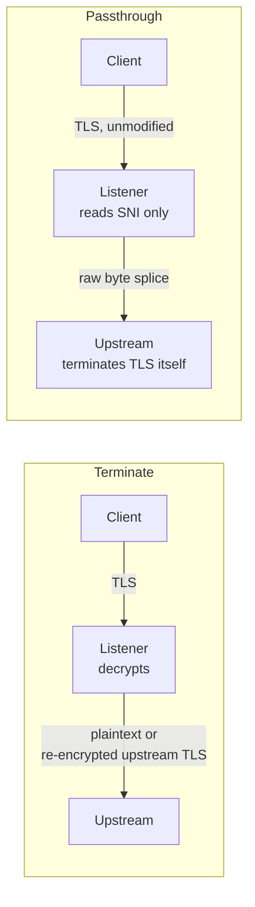

# Architecture overview

This page is a high-level map of how Dwara handles a request and how it
manages its own state, for anyone deploying or operating the gateway.
For internals aimed at contributors (crate/module layout, dependency
rules, implementation rationale), see the
[developer documentation](https://github.com/shristilabs/dwara/tree/main/docs)
in the repository.

## Editions at a glance

Dwara ships in two editions from one codebase:

- The **OSS edition** (the default build, Apache-2.0) is a single,
  self-contained gateway binary. One process owns routing, policy,
  TLS, and its own config file — everything needed to run a gateway,
  including a fleet of independent instances behind one load balancer.
- The **Enterprise edition** (built with the `ent` cargo feature and
  activated by a license) adds the features that span *multiple*
  instances or need external infrastructure: a control plane / data
  plane split, shared Redis-backed rate limiting and caching, config
  convergence across a fleet, Vault/KMS secrets, multi-tenant
  workspaces with RBAC and audit, and external policy engines.

The request path is identical in both editions — enterprise features
extend how instances are *managed* and *coordinated*, never how a
request is proxied. See
[Editions: OSS vs Enterprise](../guide/editions) for the complete
feature-by-feature comparison and how the license gate works.

## Software components

### The OSS gateway: one process

The default deployment is a single `dwara` process in *embedded mode*:
data plane, admin surface, and state all live in one binary.

| Component | What it is | Notes |
|---|---|---|
| `dwara` | The gateway binary | Listeners, dataplane, snapshot, admin listener in one process |
| Listeners | Connection acceptors | TLS terminate (per-SNI certificates) or SNI-passthrough splice |
| Dataplane | The proxy engine | Route resolution, policy chain, streaming proxy — buffers nothing by default |
| Snapshot | Immutable config state | Routes, upstream pools, TLS material, and auth state swap atomically behind an `ArcSwap` |
| Admin listener | mTLS-only management surface | Optional; `GET`/`PATCH /config`, `/health`, `/stats` |
| SQLite state store | Durable identity state | Optional; stored consumers, credentials, quota counters |
| Embedded analytics | Request records + rollups | Optional; its own SQLite file, bounded disk |
| `dwara` CLI | Operator tooling | `validate`, `fmt`, `diff`, `lint`, `schema`, `import`, `upgrade` — plus the `dwara-loadgen` load-generator rig |

An OSS fleet is simply N independent `dwara` processes with the same
config file (or one per team/service). Nothing coordinates them — that
is what the enterprise edition adds.

### The Enterprise topology: control plane + data planes

With the `ent` feature, two more binaries are compiled and the
topology gains a management layer:

| Component | Edition | Role |
|---|---|---|
| `dwara-controller` | Enterprise | The control plane: watches config sources, compiles generations, pushes them to edges over a gRPC stream (xDS-inspired). Multiple controllers run HA with leader election |
| `dwara-edge` | Enterprise | A data-plane instance that subscribes to the controller's stream and applies config updates without restart. Caches the last received generation, so the fleet keeps serving through a controller outage |
| License gate | Enterprise | Verifies the signed license at startup and activates enterprise features per claim; a degraded license falls back to OSS behavior |
| Redis backend | Enterprise | Shared GCRA rate-limit buckets, the two-tier distributed cache, and config-convergence generation state |
| `dwara` (embedded) | Both | The embedded mode remains first-class in enterprise builds — the controller and an embedded gateway run the *same* compile-and-publish pipeline, just without the gRPC transport |

The key property: an edge applies a config generation through the same
`validate -> compile -> atomic publish` pipeline as an embedded
gateway, so behavior is identical whether config arrives from a file,
the admin API, or the controller's stream.

### Compile-time feature packs

Both editions keep heavy optional features behind cargo feature flags
(default OFF) so the base binary stays small. These are OSS — no
license involved:

| Flag | Adds |
|---|---|
| `wasm` | proxy-wasm host (run community Kong/Envoy filters unmodified) |
| `plugins` | native Rust filter chain (compile-in extensions) |
| `cel` | CEL expression evaluation in policies |
| `cedar` | Cedar policy + OPA callout authorization |
| `openapi_validation` | upstream response validation against OpenAPI schemas |
| `k8s` | Kubernetes Gateway API / Ingress translation and controller |
| `aggregation` | multi-upstream response composition (KrakenD-style) |
| `mcp` | agent-operable administration via MCP |

See [Editions: OSS vs Enterprise](../guide/editions) for the full
matrix, including which optional packs belong to which edition and how
each is gated.

## Request pipeline

Every request that reaches a data-plane listener passes through a fixed
order of stages. This order is intentional and does not change based on
configuration:

A few consequences worth knowing as an operator:

- **Unrouted traffic still gets rate-limited.** Listener- and
  global-attached rate limits run *before* route resolution decides
  there's no match, so a flood of garbage paths is still capped before
  it turns into a wall of 404s.
- **Authentication and authorization never run for unrouted traffic** —
  they're per-route/service/listener concerns, so they only make sense
  once a route has matched.
- **Route limits and CORS preflights run between routing and auth.**
  A matched request is first checked against the route's `limits`
  (413/431), and on a route with a `cors` block a browser preflight is
  answered 204 by the gateway itself — before authentication, never
  forwarded upstream. On the way out, a response can gain compression
  and CORS headers. See
  [CORS, compression, and request limits](../guide/edge-policies).
- **Policy precedence is deny-anywhere-wins**, evaluated most-specific
  first: consumer > route > service > listener > global.

## Hot reload

Config, TLS certificate material, and the upstream connection pools all
swap together in the same atomic publish — a new route table is never
paired with stale upstream pools. See [Operations](../guide/operations)
for the full mechanics (debouncing, `SIGHUP`, certificate rotation,
listener-bind-set limitations).

In the enterprise topology the same pipeline runs on the controller,
and a successful publish becomes a generation pushed to every edge; an
edge that fails to compile a generation keeps serving its cached one
and reports the failure back.

## TLS: terminate vs. passthrough

Terminate mode supports multiple certificates keyed by SNI on one
listener. Passthrough mode never decrypts the connection — Dwara peeks
the ClientHello's SNI (reassembling it across fragmented TLS records if
needed) to pick an upstream, then splices bytes; the upstream sees the
original, untouched TLS session.

## Where to go next

- [Editions: OSS vs Enterprise](../guide/editions) — which features
  ship in which edition and how the license gate works.
- [Getting started](../guide/getting-started) — run a gateway locally.
- [Configuration](../guide/configuration) — the YAML shape and concepts.
- [Operations](../guide/operations) — reload, shutdown, health, hardening.
- [Observability](../guide/observability) — logs, metrics, tracing.
