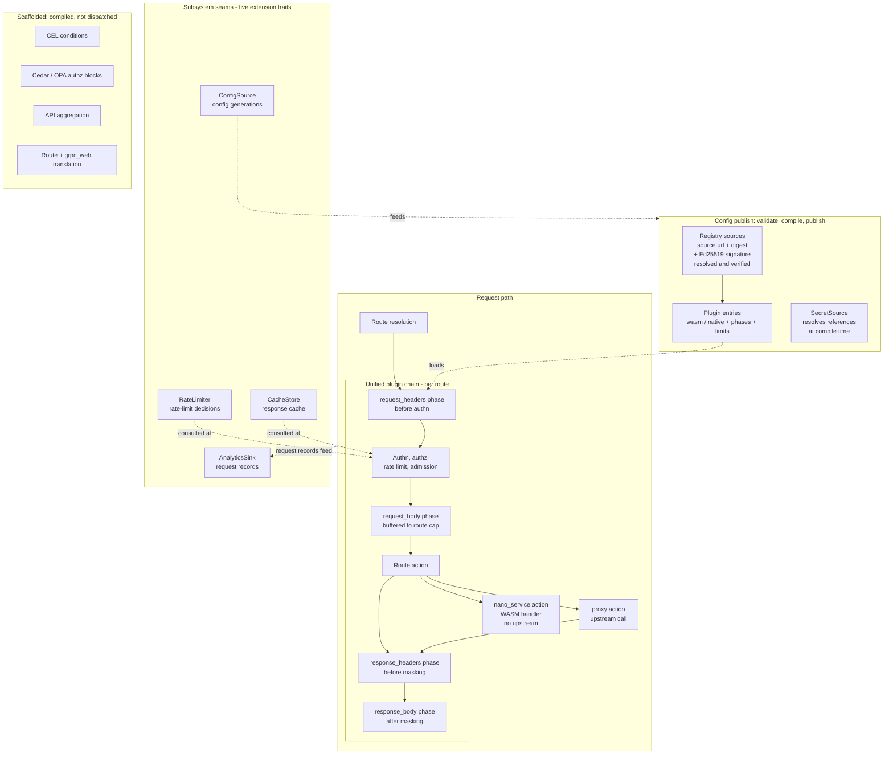
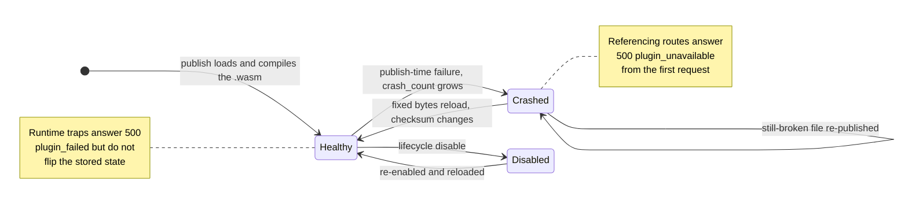

# Plugins and extensibility architecture

Where Dwara accepts extension, and what is live on the request path
versus scaffolded. Everything on this page ships in the default OSS
build — the plugin runtime, the native filter chain, nano-services,
and the extension traits compile unconditionally; there are no cargo
features to enable. For task-oriented configuration, see the
[Extensibility and plugins](../guide/extensibility-overview) guide
section.

Two plugin paths run on the live request path, selected per plugin
entry in config and dispatched by one unified chain:

1. **Proxy-Wasm plugins** — portable `.wasm` modules run in a
   Wasmtime sandbox (fuel and memory caps) against the proxy-wasm
   HTTP filter ABI. Community Kong and Envoy filters run unmodified.
2. **Native plugin filters** — Rust filters compiled into the gateway
   binary and registered by an embedding binary. No built-in native
   filters ship with the stock gateway; registration is an embedder
   seam (`DataPlane::native_plugin_registry()`).

An Extism PDK runtime was scaffolded as a third path once but was
removed before it was ever wired in; Proxy-Wasm and native filters
are the supported plugin paths.

## The extensibility seams

Dashed nodes and edges mark what is scaffolded: CEL condition blocks,
Cedar and OPA authorization blocks, API aggregation, and route plus
gRPC-Web translation compile and validate in every build but are not
dispatched on the live request path yet.

## The shared phase model

Both plugin paths hook the same four phases, in pipeline order:

| Phase | Runs | Notes |
|---|---|---|
| `request_headers` | after route resolution, before authn | Authn sees plugin-modified headers. |
| `request_body` | after authz and rate limiting, before the route action | Buffered up to the route's `limits.max_body_bytes` (default 1 MiB); over-cap answers 500 `plugin_body_too_large`. A cache hit skips the phase. |
| `response_headers` | after the response arrives (any action), before masking | A cache hit skips the phase (stored bytes are post-plugin). |
| `response_body` | after masking, before compression | Skipped and logged for streaming and content-encoded bodies. A cache hit skips the phase. |

A route references plugins by name from its `plugins` list; the chain
runs the entries in list order, phase by phase. Duplicate names in a
route's list are a config validation error. A route with no plugins
builds nothing — the request path is allocation-free and
byte-identical to a no-plugin gateway (the fast path).

See [Request pipeline](./request-pipeline) for the four hook points in
the full pipeline, and [Proxy-Wasm plugins](../guide/proxy-wasm-plugins)
for the phase contract in depth.

### Outcome semantics

A phase callback either continues the request or answers it:

- **Continue** — proceed to the next plugin or the next pipeline
  stage.
- **Local response** — the plugin decides the request locally
  (`proxy_send_local_response` for proxy-wasm, `LocalResponse` for a
  native filter). The gateway returns the plugin's status, headers,
  and body verbatim and never dials the upstream.

There is no open-fallback mode: a plugin that cannot run, traps, or
exceeds a limit fails closed on the referencing route with a 500
(`plugin_unavailable` / `plugin_failed` / `plugin_body_too_large`).
Every failure increments `dwara_plugin_failures_total{name,reason}`.
Other routes are unaffected.

## Plugin lifecycle and health

The status surface additionally reports two dispatch-time states for
declared plugins that never reached the runtime: `not_loaded` (a
declared plugin absent from the loaded set) and `not_registered` (a
native filter name with no registered factory). Both fail closed the
same way. All five states surface in `dwara_plugin_total{state}`
(healthy / crashed / disabled / not_loaded / not_registered), in the
admin API's `GET /plugins`, and in the CLI status section.

Hot swap is checksum-keyed: a reload that leaves a plugin's `.wasm`
bytes and config unchanged reuses the loaded module; changed bytes
replace it and reset health to Healthy. A plugin definition change
also bumps the response-cache epoch of every route referencing the
plugin, so cached pre-change responses are never replayed against the
new plugin. Registry `source:` plugins re-resolve and re-verify their
digest (and signature, when configured) at every publish, cache hit
included — see [Plugin registry](../guide/plugin-registry).

## Nano-services and extension traits

- **Nano-services** are not filters: a route action with `type:
  nano_service` whose WASM module generates the whole response with
  no upstream. They use a small dedicated ABI (not proxy-wasm) and
  run in the same Wasmtime sandbox family. See
  [Nano-services](../guide/nano-services).
- **Extension traits** replace whole subsystems rather than shape
  individual requests: RateLimiter, ConfigSource, CacheStore,
  AnalyticsSink, SecretSource. The default build ships a local
  implementation of each; the enterprise edition adds Redis- and
  Vault-backed implementations of the same traits. See
  [Extension traits](../guide/extension-traits) and
  [Config, state, and extensions](./config-and-state).

## See also

- [Proxy-Wasm plugins](../guide/proxy-wasm-plugins) — configuration
  and the phase contract.
- [Native plugins](../guide/native-plugins) — the compiled-in filter
  path and the registration seam.
- [Plugin lifecycle](../guide/plugin-lifecycle) — load, hot-swap,
  health states, failure isolation.
- [Plugin SDK](../guide/plugin-sdk) — the developer workflow and the
  hostcall support matrix.
- [Plugin registry](../guide/plugin-registry) — verified remote
  sources, the cache layout, and the registry spec.
- [Request pipeline](./request-pipeline) — where the four phases sit
  in the full request path.
