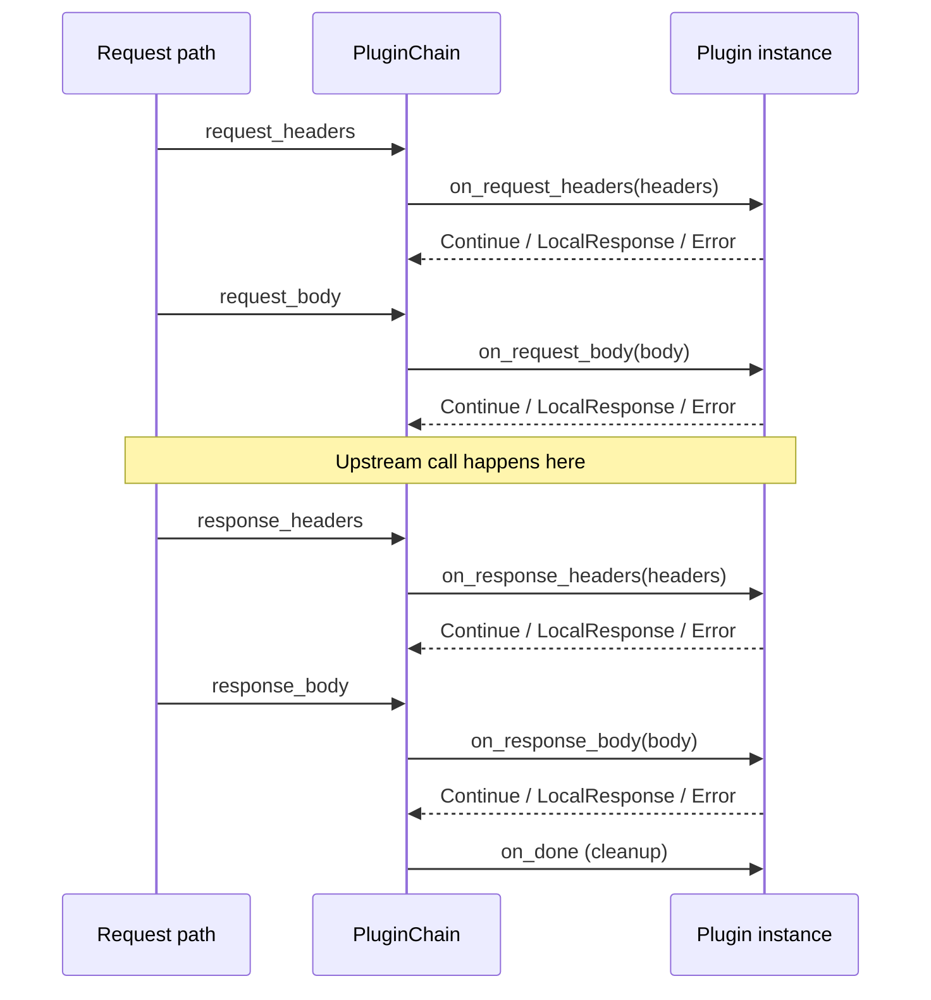
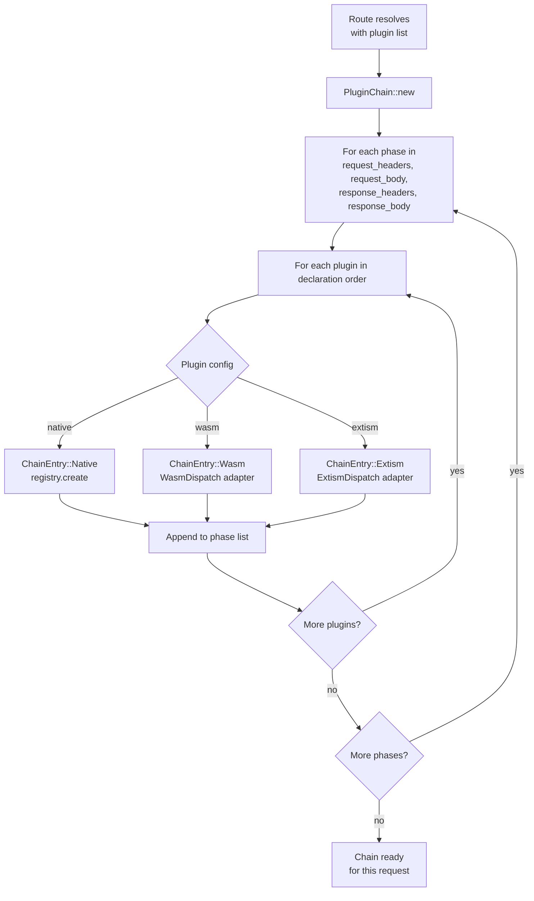
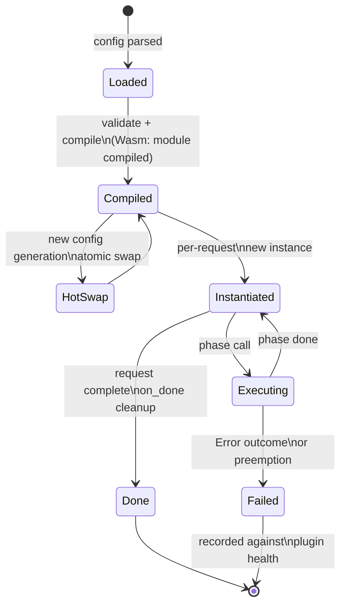

# Plugins and extensibility architecture

How Dwara's three plugin runtimes compose into a single dispatch
chain. For configuration and the per-runtime guides, see
[Proxy-Wasm plugins](../guide/proxy-wasm-plugins) and
[Native plugins](../guide/native-plugins). This page covers the
runtime architecture: the shared phase model, the dispatch chain, and
the lifecycle of a plugin instance.

Dwara unifies three plugin runtimes behind one dispatch model:

1. **Native filters** — Rust types implementing the `NativeFilter`
   trait, compiled into the gateway binary.
2. **Proxy-Wasm modules** — Wasm modules compiled against the
   Proxy-Wasm ABI, run in a Wasmtime engine with fuel, memory, and
   epoch preemption.
3. **Extism PDK modules** — Wasm modules compiled against the Extism
   PDK. The trait and adapter are defined, but the runtime is stubbed
   in this revision; see the status note below.

All three share the same phase order, the same attachment semantics,
and the same per-request execution model. A route attaches a list of
plugins by name; at request time Dwara builds a chain that runs each
plugin's configured phases in deterministic order.

## The shared phase model

Every plugin runtime maps to the same four phases, run in this order:



A plugin may implement any subset of the four phases. The chain only
calls a plugin for a phase it declared in its config.

### Outcome semantics

Each phase call returns one of:

| Outcome | Meaning |
|---|---|
| `Continue` | Proceed to the next plugin / next phase. |
| `LocalResponse` | Short-circuit: synthesize a response, skip remaining plugins and the upstream call. |
| `Error` | Treat as a plugin failure; recorded against plugin health. The request continues unless the plugin is configured `fail_closed`. |

The chain short-circuits on `LocalResponse` or `Error` within a phase.
A `LocalResponse` from `request_headers` or `request_body` skips the
upstream call entirely.

## The dispatch chain

`PluginChain` is built per request from the route's plugin list:



The chain is a flat per-phase list. Within a phase, plugins run in
declaration order. Phase order is fixed and deterministic — a plugin
cannot run its `response_headers` before another plugin's
`request_body`.

## The three runtimes

### Native filters

A native filter is a Rust type implementing `NativeFilter`:

```rust
pub trait NativeFilter: Send + Sync {
    fn on_request_headers(&mut self, headers: Vec<(String, String)>) -> FilterOutcome { ... }
    fn on_request_body(&mut self, body: Vec<u8>) -> FilterOutcome { ... }
    fn on_response_headers(&mut self, headers: Vec<(String, String)>) -> FilterOutcome { ... }
    fn on_response_body(&mut self, body: Vec<u8>) -> FilterOutcome { ... }
}
```

The `NativeRegistry` constructs filter instances from config. Native
filters have no isolation boundary — they run in the gateway process
with full performance and full access to the request. They are the
right choice for built-in filters shipped with Dwara and for
enterprise extensions compiled into the binary.

### Proxy-Wasm modules

A Proxy-Wasm module is a Wasm module compiled against the Proxy-Wasm
ABI. Dwara runs it in a Wasmtime engine with:

- **Fuel** — a per-call instruction budget; a module that exceeds it
  is preempted.
- **Memory** — a per-instance memory cap.
- **Epoch** — a cooperative preemption deadline.

The `WasmChainAdapter` implements `WasmDispatch` by driving the
Wasmtime instance through the four phases and translating
`wasm::runner::PhaseOutcome` to `plugins::ChainOutcome`. A
`LocalResponse` from the module becomes a `plugins::LocalResponse`
that short-circuits the chain.

See [Proxy-Wasm plugins](../guide/proxy-wasm-plugins) for module
authoring and [Plugin SDK](../guide/plugin-sdk) for the host API.

### Extism PDK modules

The `ExtismDispatch` trait mirrors `WasmDispatch`. The
`ExtismChainAdapter` drives `ExtismInstance`s that implement
`NativeFilter`-style phase methods.

**Status:** The Extism runtime is stubbed in this revision. The
`extism` crate is not a dependency; `ExtismInstance` phase methods are
no-ops returning `FilterOutcome::Continue`. The trait, adapter, and
config schema are in place for a future dependency addition subject
to license review. The Extism PDK scaffold was removed from the
codebase before it was ever wired in (issue #259); Extism may be
re-introduced in a future milestone.

## Plugin lifecycle

A plugin instance goes through these stages:



| Stage | What happens |
|---|---|
| **Load** | Plugin config is parsed and validated at config compile time. |
| **Compile** | Native filters are constructed; Wasm modules are compiled to Wasmtime. |
| **Hot-swap** | On config reload, a new compiled instance atomically replaces the old via `ArcSwap`. In-flight requests finish on the old instance. |
| **Instantiate** | A new per-request instance is created (Wasm: new Wasmtime instance; native: fresh filter state). |
| **Execute** | Phase methods are called in chain order. |
| **on_done** | After the response is sent, the instance is cleaned up (Wasm: instance dropped; native: filter dropped). |

### Failure isolation

A plugin failure does not crash the gateway:

- A Wasm preemption (fuel/memory/epoch) terminates the instance, not
  the request. The outcome is recorded as `Error` and the request
  continues unless the plugin is `fail_closed`.
- A native filter panic is caught at the chain boundary; the outcome
  is `Error`.
- Plugin health is tracked: repeated failures can disable a plugin
  for a route without affecting other routes.

## Status note

The plugin chain (`PluginChain`, `WasmDispatch`, `ExtismDispatch`)
and the per-runtime adapters are fully defined and compile under
their capabilities. In this revision the main dataplane request path
does not invoke the chain directly; the chain is reached through
compiled into the OSS build construction. The phase model, outcome semantics, and
lifecycle described here are the contract the chain implements and
the contract future wiring will satisfy.

## See also

- [Proxy-Wasm plugins](../guide/proxy-wasm-plugins) — module authoring
  and configuration.
- [Native plugins](../guide/native-plugins) — built-in and compiled-in
  filters.
- [Plugin lifecycle](../guide/plugin-lifecycle) — load, compile,
  hot-swap, health.
- [Plugin SDK](../guide/plugin-sdk) — the host API surface.
- [Config, state, and extensions](./config-and-state) — how plugin
  config is compiled and hot-swapped.
