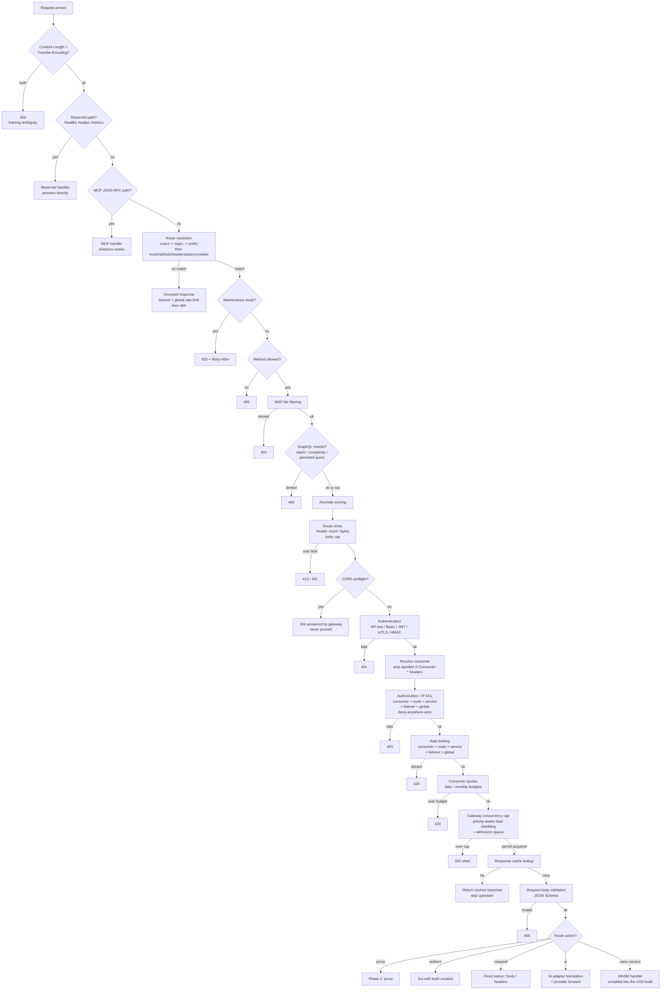

# Request pipeline

Every request that reaches a data-plane listener passes through a
fixed order of stages. This order is intentional and does not change
based on configuration. The pipeline is split into two phases:
**routing and policy** (decide whether the request is allowed and
where it goes) and **proxy and response** (forward it and decorate
the response).

For the high-level architecture map, see
[Architecture overview](./overview). For the concepts behind the
routing chain (Listener -> Route -> Service -> Upstream -> Endpoint),
see [Concepts and taxonomy](../guide/concepts).

## Phase 1: routing and policy

From connection accept to action dispatch — everything before the
upstream is contacted:

## Phase 2: proxy and response

Once the `proxy` action is selected, the request enters the upstream
forward path with retries, hedging, and the response decoration tail:

```mermaid
flowchart TD
    P0[Proxy action selected] --> FI{Fault injection?}
    FI -->|abort| FIX[Return injected error]
    FI -->|delay| FID[Sleep then continue]
    FI -->|none| MIR{Mirror / shadow traffic?}
    FID --> MIR
    MIR -->|yes| MIRS[Fire-and-forget duplicate\nto mirror upstream]
    MIR -->|no| RW[Path rewrite\nstrip / replace / regex]
    MIRS --> RW
    RW --> QT[Query transforms]
    QT --> HH[Strip hop-by-hop headers\nrebuild Host, XFF, X-Real-IP]
    HH --> MTLS[mTLS forward headers\nOAuth2 token injection]
    MTLS --> RHT[Request header transforms]
    RHT --> RBT[Request body transform\nsize-capped JSON]
    RBT --> BUF{Retries or hedging?}
    BUF -->|yes| BUFB[Buffer body for replay]
    BUF -->|no| BUFS[Stream body as-is]
    BUFB --> ATT[Attempt loop]
    BUFS --> ATT
    ATT --> CB{Circuit breaker open?}
    CB -->|yes| CBX[502 / 503]
    CB -->|no| EP[Endpoint pick\nload balancing\nround-robin / least-conn / peak-EWMA]
    EP --> PC{Pending-request cap?\nmax_pending}
    PC -->|over cap| PCX[502]
    PC -->|ok| CC[Connection cap acquire\nconnection_cap]
    CC -->|ok| CONN[Connect + send\nstreaming, no buffering\nper-attempt read timeout]
    CONN --> HDG{Hedging enabled?\nfirst attempt only}
    HDG -->|yes| HDGR[Race primary vs hedge timer\nfirst Ok wins]
    HDG -->|no| RESP[Upstream response]
    HDGR --> RESP
    RESP --> BR[Breaker observation]
    BR --> RT{Retryable status\nor transport error?}
    RT -->|yes, attempts remain| ATT
    RT -->|no| ADP[Adaptive / canary\noutcome recording]
    ADP --> FPR[Finish proxy response\nupgrade tunnel\npermit release]
    FPR --> RT2[Response decoration tail]
    RT2 --> MK[1. Response field masking\nfail-closed redaction]
    MK --> RBT2[2. Response body transforms]
    RBT2 --> RHT2[3. Response header transforms]
    RHT2 --> RCS[4. Response cache store\nif miss or bypass]
    RCS --> CMP[5. Response compression\nnegotiated]
    CMP --> VER[6. API versioning / deprecation\nVary + Sunset headers]
    VER --> CORS2[7. CORS actual-response headers]
    CORS2 --> SH[8. Security headers\nHSTS / nosniff / CSP / X-Frame-Options]
    SH --> RLH[9. X-RateLimit headers\nif a rate limit applied]
    RLH --> OBS[Observability + analytics\nmetrics / SLO / access log\nanalytics store / stream]
    OBS --> DONE[Response sent to client]
```

## Consequences worth knowing as an operator

- **Unrouted traffic still gets rate-limited.** Listener- and
  global-attached rate limits run *before* the 404 is returned, so a
  flood of garbage paths is capped before it turns into a wall of
  404s. Consumer- and route-level rate limits do not run (there is no
  consumer or route to check).
- **Authentication and authorization never run for unrouted traffic** —
  they're per-route/service/listener concerns, so they only make sense
  once a route has matched.
- **Maintenance mode, method allowlist, WAF-lite, and GraphQL checks
  run between routing and route limits.** A request that matches a
  route but hits any of these gates is rejected before the body-size
  and header-count limits are evaluated, and before authentication.
- **Route limits and CORS preflights run between routing and auth.**
  A matched request is first checked against the route's `limits`
  (413/431), and on a route with a `cors` block a browser preflight is
  answered 204 by the gateway itself — before authentication, never
  forwarded upstream.
- **Response cache lookup happens after the concurrency cap but before
  request validation and the action dispatch.** A cache hit bypasses
  the upstream entirely — no validation, no proxy, no transforms
  beyond cache-level freshness. The response still goes through the
  decoration tail (compression, CORS, security headers).
- **Request transforms (path rewrite, query, header, body) happen
  inside the proxy action**, after all policy checks have passed and
  the action is dispatched — never before authentication or
  authorization.
- **Retries, hedging, and mirror traffic are per-attempt concerns
  inside the proxy action.** The circuit breaker is checked before
  each attempt; the load balancer re-picks an endpoint for every
  attempt so health ejection naturally routes a retry away from a
  just-failed endpoint.
- **Policy precedence is deny-anywhere-wins**, evaluated most-specific
  first: consumer > route > service > listener > global. This applies
  to both authorization and rate limiting.
- **The response decoration tail runs in a fixed order**: masking
  first (redact before anything else sees the body), then body
  transforms, then header transforms, then cache store, then
  compression, then versioning/deprecation headers, then CORS, then
  security headers, then rate-limit headers. Each stage sees the
  output of the previous one.

## See also

- [Connection and TLS](./connection-and-tls) — how connections are
  accepted and protocols are handled before the request enters this
  pipeline.
- [Error handling](./error-handling) — the unified error envelope and
  upstream error classification.
- [Traffic policy](../guide/traffic-policy) — rate limiting, retries,
  circuit breaking, and load shedding in detail.
- [Routing](../guide/routing) — route matching, rewrites, and actions.
- [Configuration](../guide/configuration) — the YAML shape and the
  config pipeline.
