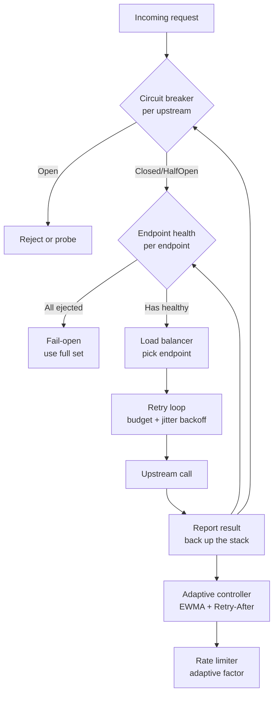
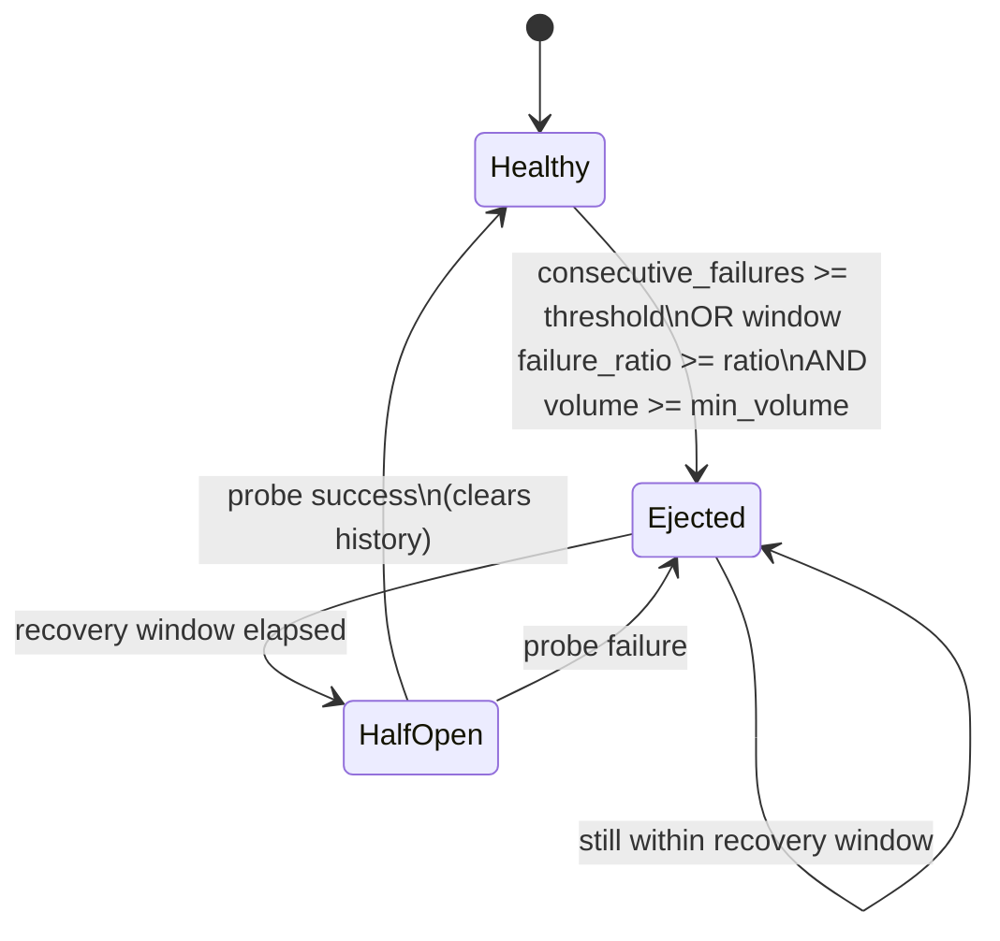
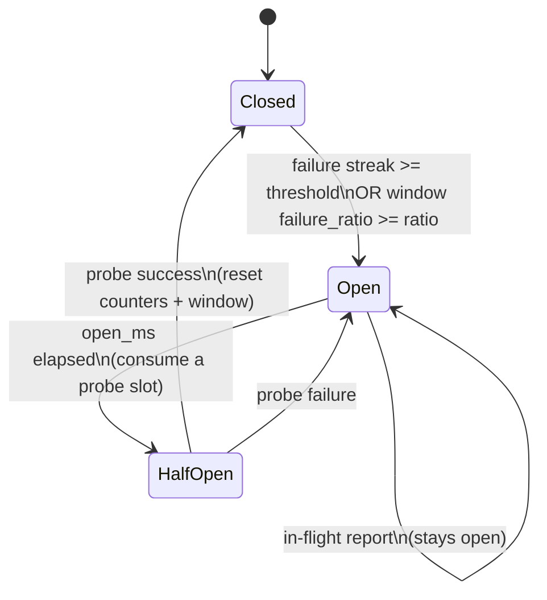
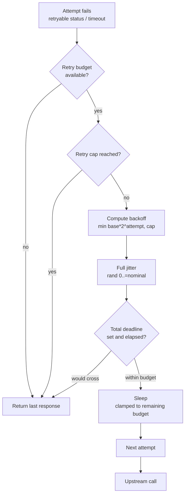
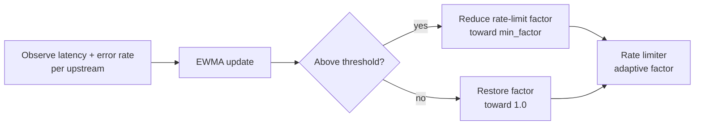

# Resilience architecture

How Dwara keeps traffic flowing when upstreams degrade. For
operator-facing configuration, see
[Traffic policy](../guide/traffic-policy). This page covers the
runtime architecture: the state machines, the layering, and how the
pieces compose.

Resilience is layered. Each layer owns one concern and feeds the next:



The order matters: the circuit breaker gates the whole upstream, then
endpoint health filters the pool, then the load balancer picks, then
the retry loop drives the attempt sequence, then the adaptive
controller tunes the rate limiter based on observed latency and
origin backoff.

## Endpoint health

Each endpoint in an upstream pool has a passive health state:



| State | Meaning |
|---|---|
| **Healthy** | Eligible for selection. Failures are counted. |
| **Ejected** | Removed from the load balancer's candidate set. |
| **HalfOpen** | Recovery window elapsed; a probe request is allowed through. |

Ejection triggers (any one):

- `consecutive_failures >= params.consecutive_failures`
- `window volume >= failure_min_volume` AND
  `failures / volume >= failure_ratio`

Recovery clears the failure history so a flapping endpoint does not
re-eject immediately on the first post-recovery failure.

### Fail-open

When every endpoint in an upstream is ejected, the load balancer falls
back to the full set rather than returning 503. The
`upstream_fail_open_picks` counter tracks how often this happens, so
operators can alert on a fully-degraded upstream. Fail-open is the
default; it trades a chance of success for a hard failure.

### Active probes

Passive health observes real traffic. Active probes supplement it: a
probe loop sends periodic health checks to each endpoint and feeds
the results back into the same state machine. An endpoint that has
no real traffic can still be ejected or recovered by probes. See
[the active probe section of traffic policy](../guide/traffic-policy#active-health-checks).

## Circuit breaker

The circuit breaker gates an entire upstream, not individual
endpoints. It has three states:



| State | Meaning |
|---|---|
| **Closed** | Requests flow. Failures are counted. |
| **Open** | Requests are rejected (or a probe is allowed after `open_ms`). |
| **HalfOpen** | A bounded number of probe requests are allowed through. |

The breaker trips on either a consecutive failure streak or a windowed
failure ratio, whichever fires first. In-flight reports while open do
not change the state — the breaker stays open until `open_ms` elapses.

The `breaker_state` gauge exposes `0=closed, 1=open, 2=half-open` per
upstream for alerting.

## Retry loop

Retries are bounded by a budget and paced by full-jitter backoff:



### Retry budget

The budget is a ratio of retries to original requests:

```
allowed when (retries + 1) * 100 <= percent * requests
```

This caps retry amplification: a 20% budget means at most 20 retries
per 100 original requests across the whole upstream. The budget is
shared across all in-flight requests for an upstream, so a burst of
retries from one client cannot starve another.

### Jitter backoff

The nominal backoff is exponential with a cap:

```
nominal = min(base * 2^(attempt-1), cap)
```

The actual sleep is full jitter — a uniform random value in
`[0, nominal]`. Full jitter avoids the thundering-herd problem where
many clients retry in lockstep after a downstream recovery.

### Total deadline

`retries.total_deadline_ms` caps the wall-clock time from the first
attempt to the last, including the backoff delays between attempts.
When the next backoff would cross the deadline, the retry is aborted
and the last response (or error) is returned to the client; the sleep
is clamped to the remaining budget so a retry never sleeps past the
deadline. It composes with the per-attempt `read_ms` timeout:
`read_ms` bounds a single attempt, `total_deadline_ms` bounds the
whole chain. A deadline-aborted retry is not charged against the retry
budget. The default (unset) is unbounded — the retry loop runs until
the attempt cap or the retry budget is exhausted, the original
behavior. Validation rejects `0` (omit the field for unbounded) and
caps the value at 600000 ms (10 minutes). This is the same knob Envoy
and NGINX expose for cross-attempt retry budgets.

### Retry classification

Not every failure is retryable. The classifier maps upstream outcomes
to retry decisions:

| Outcome | Retryable? |
|---|---|
| 5xx from upstream | Yes (configurable) |
| 429 from upstream | Yes, respects `Retry-After` |
| Connect error / TLS error | Yes |
| Mid-stream body error | No (response already started) |
| 4xx (except 429) | No |

## Adaptive rate limiting

The adaptive controller (Enterprise) tunes the rate limiter based on
observed upstream behavior:



### EWMA

The controller tracks exponentially-weighted moving averages of
latency and error rate per upstream:

```
w = exp(-td / tau)         # td = time delta, tau = smoothing window
err_ewma = prev_err * w + error * (1 - w)
lat_ewma = prev_lat * w + latency_ms * (1 - w)
```

When the EWMA exceeds a threshold, the controller reduces the
rate-limiter factor toward `min_factor`. When it recovers, the factor
is restored toward 1.0. The `dwara_rate_limiter_adaptive_factor` gauge
exposes the current factor per policy.

### Origin-driven Retry-After backoff

When an upstream returns 429 with a `Retry-After` header, the
controller records a `retry_after_until` deadline and immediately
drops the factor to `min_factor`. The factor stays at `min_factor`
until the deadline elapses, regardless of the EWMA. This lets an
overloaded upstream back off the gateway directly, faster than the
EWMA would.

## Endpoint state persistence

Endpoint health and ejection state persist across config reloads,
keyed by `(upstream, endpoint)`. A reload that changes the upstream
or endpoint identity starts fresh; a reload that only changes routing
or transforms preserves the observed health. This avoids a flapping
upstream looking healthy for one request cycle after every reload.

## See also

- [Traffic policy](../guide/traffic-policy) — operator configuration
  for retries, breakers, health checks, and timeouts.
- [Request pipeline](./request-pipeline) — where resilience sits in
  the request path.
- [Observability](./observability) — the metrics exposed for each
  resilience layer.
- [Config, state, and extensions](./config-and-state) — how endpoint
  state persists across reloads.
