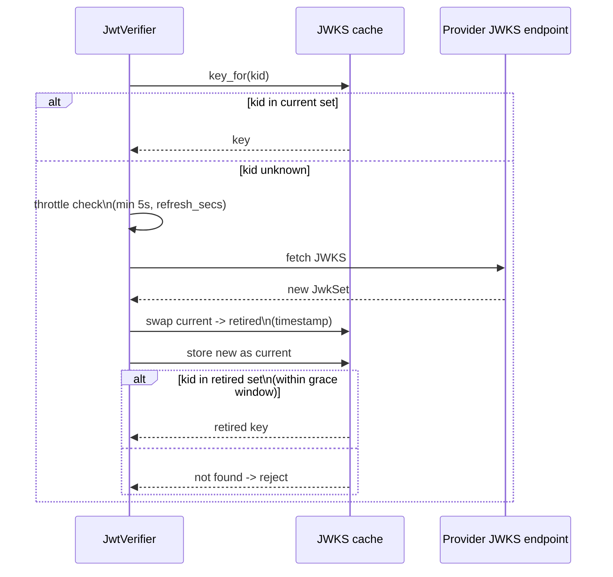
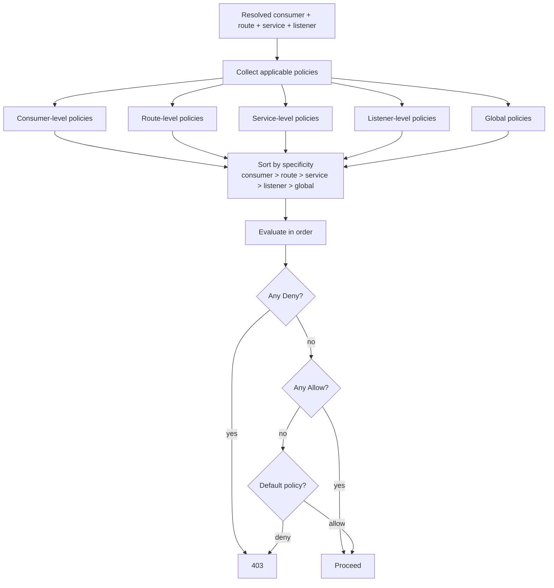

# Security architecture

How Dwara authenticates, authorizes, and protects requests. For
operator-facing configuration, see
[Security](../guide/security) and [Authorization](../guide/authorization).
This page covers the runtime architecture: the authn dispatch order,
the authz evaluation model, secret resolution, and the TLS layers.

Security is applied in two phases of the
[request pipeline](./request-pipeline):

- **Phase 1, before the upstream call:** authentication, consumer
  resolution, authorization, IP ACL, and rate limiting.
- **Phase 1/2 boundary:** the request body is validated against route
  limits and the route action is dispatched.

TLS is handled at the listener and upstream layers; see
[Connection and TLS](./connection-and-tls) for that architecture.
This page covers the HTTP-layer security machinery.

## Authentication

Dwara supports five authentication families, dispatched in a fixed
precedence order by the `CompositeAuthenticator`:

```mermaid
flowchart TD
    A[Incoming request] --> B{X-API-Key header?}
    B -->|yes| AK[API key auth]
    B -->|no| C{Authorization: Basic?}
    C -->|yes| BA[Basic auth]
    C -->|no| D{Authorization: Bearer?}
    D -->|yes| D1{JWT provider?}
    D1 -->|yes| JWT[JWT / JWKS verify]
    D1 -->|no| OIDC[OIDC verify]
    D1 -->|JWT rejects| OIDC
    D -->|no| E{X-Dwara-Signature?}
    E -->|yes| HMAC[HMAC request signing verify]
    E -->|no| F{mTLS client cert present?}
    F -->|yes| MTLS[mTLS client cert auth]
    F -->|no| ANON[Anonymous\n(no consumer resolved)]
```

### Precedence

The order is fixed and deliberate:

1. **API key** — `X-API-Key` header. Cheapest check, most common.
2. **Basic** — `Authorization: Basic ...` header.
3. **Bearer** — `Authorization: Bearer ...` header. JWT is tried
   first, then OIDC. If a JWT provider is configured and rejects the
   token, OIDC is tried as a fallback.
4. **HMAC request signing** — `X-Dwara-Signature` header with a
   canonical-request digest.
5. **mTLS client certificate** — the verified client certificate from
   the TLS handshake, available as an ambient credential. Consulted
   only when no header credential was presented.

A request may carry at most one credential family. The first family
that matches a configured authenticator wins; later families are not
tried. A request with no matching credential is anonymous (no consumer
resolved), and authorization then decides whether anonymous access
is allowed for the route.

### mTLS client certificate auth

The TLS listener verifies the client certificate against
`client_ca_file` before the HTTP layer runs. The verified certificate
is inserted into request extensions as `ClientCertificate`. The HTTP
authn layer then resolves it in two stages:

1. **Gateway-level map** — if `mtls_consumer_map` is configured and
   non-empty, the subject CN is checked first, then the colon-separated
   fingerprint.
2. **Per-consumer credentials** — falls back to per-consumer `mtls`
   credentials in the registry, matched by subject CN then SHA-256
   fingerprint.

See [mTLS authentication](../guide/security#mtls-client-certificate)
for configuration.

### JWT JWKS key rotation

JWT verification fetches the provider's JWKS and caches it. Rotation
is handled with a dual-validity window:



- The cache refreshes when older than `refresh_secs`.
- Unknown-`kid` fetches (rotation signal) are throttled to
  `min(5s, refresh_secs)` to avoid hammering the provider.
- On a successful fetch, the old set moves to `retired` with a
  timestamp. Retired keys remain valid for `retired_key_grace_secs`,
  giving a dual-validity window so tokens signed just before rotation
  still verify.

## Authorization

Authorization is policy-scoped at five levels, evaluated
most-specific-first with deny-anywhere-wins:



### Evaluation rules

- **Most-specific-first:** consumer policies are evaluated before
  route, route before service, service before listener, listener
  before global.
- **Deny-anywhere-wins:** a `Deny` at any level overrides any `Allow`
  at any level.
- **Dry-run / monitor mode:** a policy can be configured in dry-run
  mode, where a `Deny` is logged but not enforced. The
  `dwara_policy_dry_run_total{phase,route}` counter tracks how many
  requests would have been denied.

### Policy engines

Dwara supports two policy engines, selectable per policy:

- **CEL** — inline expressions evaluated against the request context
  (consumer, route, method, path, headers, JWT claims).
- **Cedar** — Cedar policy documents evaluated against the same
  context.

Both engines see the same request context; the choice is per-policy
based on authoring preference.

### IP ACL and GeoIP

IP ACL and GeoIP gates run alongside authorization:

- **IP ACL** — allow/deny lists of CIDRs, evaluated at the listener
  or route level.
- **GeoIP gate** — allow/deny by country, using the client IP (after
  PROXY-protocol resolution if present).

See [Authorization](../guide/authorization) for configuration.

## Secret resolution

Secrets (API keys, JWT signing keys, mTLS client keys, HMAC secrets)
are resolved at config compile time, not at request time. The request
path never resolves secrets dynamically — this keeps the hot path free
of secret-store I/O and failure modes.

```mermaid
flowchart LR
    A[Config parse] --> B[Compile]
    B --> C{Secret reference?}
    C -->|inline value| D[Use as-is]
    C -->|${ENV:NAME}| E[Read env var\nat compile time]
    C -->|${file:/path}| F[Read file\nat compile time]
    C -->|${vault:...}\n${kms:...}| G[SecretSource trait\nEnterprise]
    D --> H[Store in snapshot\nredacted placeholder in logs]
    E --> H
    F --> H
    G --> H
```

| Reference form | Resolution |
|---|---|
| Inline value | Used as-is. |
| `${ENV:NAME}` | Read from the environment at compile time. |
| `${file:/path}` | Read from the file at compile time. |
| `${vault:...}` / `${kms:...}` | Resolved via the `SecretSource` extension trait (Enterprise). |

Resolved secrets live in the compiled snapshot. Logs, access records,
and error envelopes never include secret values — they use redacted
placeholders. A config reload re-resolves all secrets, so a vault
rotation is picked up on the next reload without restarting the
gateway.

See [Config, state, and extensions](./config-and-state) for the
extension trait model and [Secrets](../guide/security#secrets) for
configuration.

## TLS layers

TLS is covered in detail in
[Connection and TLS](./connection-and-tls). The security-relevant
summary:

- **Listener TLS** — termination or passthrough, with optional client
  certificate verification (`client_ca_file`).
- **Upstream TLS** — separate trust store, optional mTLS client
  certificate, optional certificate pinning.
- **FIPS** — startup provider/self-test, cipher restrictions, and
  health attestation when built with the `fips` feature.
- **Post-quantum TLS** — hybrid key-exchange wiring, experimental,
  behind the `pq` feature.

## See also

- [Security](../guide/security) — operator configuration for authn,
  TLS, and secrets.
- [Authorization](../guide/authorization) — policy engines, IP ACL,
  and GeoIP.
- [Connection and TLS](./connection-and-tls) — the TLS architecture.
- [Request pipeline](./request-pipeline) — where authn and authz sit
  in the request path.
- [Config, state, and extensions](./config-and-state) — the
  `SecretSource` extension trait.
