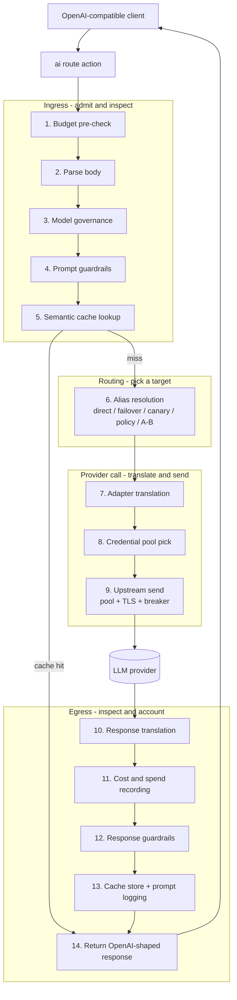
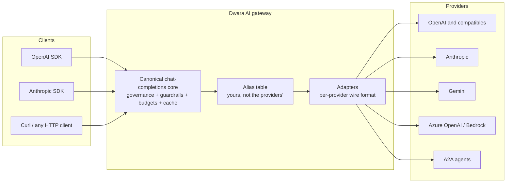

# AI gateway

The AI gateway lets clients send one request shape -- the OpenAI
chat-completions format -- to Dwara, and Dwara translates the call to
whichever provider actually serves it: OpenAI, Anthropic, Google
Gemini, Azure OpenAI, or AWS Bedrock. Responses (and errors) are
translated back to the OpenAI shape, so any OpenAI-compatible client
or SDK works unchanged.

Your model names stay yours: clients ask for the alias you publish
(`gpt-4o-mini`, `claude-sonnet`, or your own names like `prod-chat`),
and the provider's real model identifier never leaves the gateway.
Rotate providers by editing the alias table -- no client changes.

## How it works

An `ai` route hands the request to the AI branch of the [request
pipeline](../architecture/request-pipeline) instead of the regular
proxy branch. The branch is a pure translation and policy layer on
top of the normal proxy machinery: governance, guardrails, budgets,
and caching inspect the request and response, while the actual
provider call rides the same upstream pool, TLS, connection caps,
and circuit breaking as any other proxied request.

Every AI request flows through four stage groups -- ingress (admit
and inspect), routing (pick a target), the provider call (translate
and send), and egress (inspect and account):



From the outside it is one facade with many providers -- clients
speak the OpenAI dialect (Anthropic Messages and Gemini
`generateContent` shapes are also accepted), and the adapters speak
each provider's native wire format:



### The phases

| # | Phase | What happens | Rejects with | Details |
|---|---|---|---|---|
| 1 | Budget pre-check | Per-minute token / per-day spend caps checked before the body is read; a second estimate-based check runs after parsing | 429 `ai_budget_exceeded` | [Token budgets](./ai-token-budgets) |
| 2 | Parse body | Body parsed into the canonical chat-completions request; prompt templates resolved; OpenAI, Anthropic, and Gemini dialects accepted | 400 `invalid_json` | [Prompt experimentation](./ai-prompt-experimentation) |
| 3 | Model governance | Model alias checked against the consumer's team allowlist, before routing | 403 `model_denied_by_policy` | [Governance](./ai-governance) |
| 4 | Prompt guardrails | Injection, PII, banned-content, and schema checks on the parsed prompt | 400 `guardrail_blocked` | [Guardrails](./ai-guardrails) |
| 5 | Semantic cache | Embedding-similarity lookup; a hit returns the cached response (or replays cached SSE frames) with no provider call | -- hit short-circuits | [Semantic caching](./ai-semantic-caching) |
| 6 | Alias resolution | Alias mapped to a provider target via direct, failover chain, canary split, routing policy, or A/B test | 404 `model_not_found` | [Failover and canary](#failover-and-canary), [routing policies](./ai-routing-policies) |
| 7 | Adapter translation | Canonical request translated to the provider's wire format | 502 translation error | [Providers](#providers) |
| 8 | Credential pick | Round-robin or weighted key pick from the provider's credential pool; 429'd keys are quarantined (Enterprise) | 429 when the pool is exhausted | [Credential pools](#credential-pools) |
| 9 | Upstream send | Provider call through the standard pool / TLS / breaker path; failover retries happen here | 502 `provider_unreachable` | [Failover chains](#failover-chains) |
| 10 | Response translation | Provider response (or SSE chunks) translated back to the canonical shape | 502 `provider_malformed_response` | [Streaming](#streaming) |
| 11 | Cost and spend | Provider-reported tokens matched against the pricing table; micro-USD cost recorded against the consumer's budget | -- | [Cost attribution](./ai-token-budgets) |
| 12 | Response guardrails | PII, banned-content, and schema checks on the response | 400 `guardrail_blocked` / `response_schema_violation` | [Guardrails](./ai-guardrails) |
| 13 | Cache store + logging | Fire-and-forget semantic-cache store; opt-in prompt/response capture with PII redaction | -- | [Prompt logging](./ai-prompt-logging) |
| 14 | Return | OpenAI-shaped response returned to the client | -- | [Errors](#errors) |

Details worth knowing:

- **Token accounting is provider-reported.** A lightweight local
  estimate is used only for the phase-1 pre-check; everything
  recorded -- budgets, metrics, cost -- uses the provider's numbers.
- **Failover stops at the first chunk.** Failover and canary
  selection happen before the provider call commits. Once a stream
  is flowing, the serving provider is committed; budget or
  banned-content violations mid-stream end the stream cleanly
  (`ai_budget_exceeded_midstream`, `guardrail_blocked_midstream`)
  instead of resetting the connection.
- **All policy phases are scoped like regular policies** (consumer >
  route > service > listener > global): a team can carry its own
  model allowlist, a route its own guardrails, a consumer its own
  budget -- composing independently.
- **Everything is a hot reload.** Alias changes, policy edits, and
  credential rotations take effect on the next request after a
  config reload, with no restart.

For the runtime deep dive -- where each stage sits in the dispatch
and how the adapter trait composes -- see [AI gateway
architecture](../architecture/ai-gateway).

## When to use this

Use the AI gateway when:

- You want to switch or combine LLM providers without changing client
  code.
- Provider credentials should live in one place (the gateway) instead
  of in every client.
- You want gateway metrics for AI traffic (requests per provider,
  token usage) alongside your other routing metrics.
- You want to cap how many tokens (or how much spend) one consumer
  or team may burn -- see [Token budgets](#token-budgets).

## Configuration

Three pieces: an upstream per provider (the transport), an `ai:`
block mapping providers and model aliases, and a route with the `ai`
action.

```yaml
upstreams:
  - name: openai-pool
    endpoints:
      - address: api.openai.com
        port: 443
    # TLS is negotiated toward the endpoint; the provider path
    # (/v1/chat/completions, /v1/messages, ...) is added by the adapter
  - name: anthropic-pool
    endpoints:
      - address: api.anthropic.com
        port: 443

ai:
  providers:
    - name: openai
      kind: openai
      upstream: openai-pool
      auth:
        header: Authorization
        # the reference must span the WHOLE value, so the "Bearer "
        # prefix belongs to the variable: OPENAI_API_KEY_BEARER
        # should be set to "Bearer sk-..."
        value: ${OPENAI_API_KEY_BEARER}
    - name: anthropic
      kind: anthropic
      upstream: anthropic-pool
      auth:
        header: x-api-key
        value: ${ANTHROPIC_API_KEY}
  models:
    gpt-4o-mini:
      provider: openai
      provider_model: gpt-4o-mini-2024-07-18
    claude-sonnet:
      provider: anthropic
      provider_model: claude-sonnet-4-5

routes:
  - name: chat
    service: ai-svc
    match:
      path:
        type: prefix
        value: /v1
    action:
      type: ai

services:
  - name: ai-svc
    upstream: openai-pool
```

### Providers

| Field | Default | Description |
|---|---|---|
| `name` | (required) | Provider name, referenced by model aliases. Unique within the `ai:` block. |
| `kind` | (required) | Wire dialect: `openai`, `anthropic`, `gemini`, `azure_openai`, or `bedrock`. |
| `upstream` | (required) | Name of the upstream that carries this provider's transport (endpoints, TLS, timeouts, connection pooling, circuit breaking). |
| `auth.header` | (required with `auth`) | Header name the provider expects (`Authorization`, `x-api-key`, `x-goog-api-key`). |
| `auth.value` | (required with `auth`) | Header value, verbatim. Use a `${...}` [secret reference](./secrets) (env var or file); inline values are redacted in every config echo. Omit `auth` entirely for providers that need none (for example a local OpenAI-compatible endpoint on an internal network). |
| `credential_pool` | (optional, Ent) | A multi-key credential pool for this provider. See [Credential pools](#credential-pools) below. Mutually exclusive with `auth`. |

Notes on providers:

- Because a provider names a standard upstream, everything upstreams
  get applies: multiple endpoints with load balancing, per-upstream
  TLS trust, timeouts, and circuit breaking.
- The `openai` kind also speaks to OpenAI-COMPATIBLE servers (vLLM,
  Ollama's compatibility endpoint, and others): point the upstream at
  one of those and no other change is needed.

#### Credential pools

::: tip Enterprise feature
Credential pools require the enterprise edition (build with
`--features ent`). The config schema is accepted in the OSS edition
too, but validation rejects it at publish time.
:::

A credential pool lets a single provider declare multiple API keys and
rotate across them to aggregate rate-limit headroom (the LiteLLM
pattern). When a key receives a 429 from the provider, it is
quarantined for a configurable window and subsequent requests rotate
to the next available key.

```yaml
ai:
  providers:
    - name: openai
      kind: openai
      upstream: openai-pool
      credential_pool:
        credentials:
          - header: Authorization
            value: ${OPENAI_KEY_1}
          - header: Authorization
            value: ${OPENAI_KEY_2}
          - header: Authorization
            value: ${OPENAI_KEY_3}
        strategy: round_robin    # or weighted (per-request-id hash)
        quarantine_secs: 60      # default; capped at 600
```

| Field | Default | Notes |
|---|---|---|
| `credentials` | (required) | Two or more `AiProviderAuth` entries (same shape as `auth`). At least 2 required. |
| `strategy` | `round_robin` | `round_robin` cycles in config order; `weighted` picks by request-id hash. |
| `quarantine_secs` | `60` | How long a 429'd key is skipped. The provider's `Retry-After` header overrides per-429 (capped at 600s). |

Pool exhaustion (all keys quarantined) degrades gracefully: the request
fails with a 429 + `Retry-After` (based on the earliest quarantine
expiry), not a panic.

Monitor pool state via the admin API:

```
GET /ai/credential-pools              # all providers
GET /ai/credential-pools?provider=openai  # one provider
```

The response includes per-key quarantine status (index, header name,
quarantined flag, cumulative quarantine count) -- never secret values.

### Models

The `models` map is the alias table your clients see. The key is the
`model` value clients put in their request body; `provider` names an
`ai.providers` entry; `provider_model` is what Dwara sends to that
provider instead of the alias.

Changing an alias (or adding one) is a config reload -- the next
request uses the new mapping, with no restart.

### The route

A route with `action: { type: ai }` accepts OpenAI chat-completions
POST bodies. The request's `model` field selects the provider through
the alias table. The route's `service` is required by the schema but
is not dialed for `ai` routes.

The optional `endpoint` field selects which AI endpoint the route
serves. The default is `chat` (the full adapter translation pipeline).
Other endpoints (`embeddings`, `images`, `audio`, `moderation`) are
proxied as a passthrough: the request body is forwarded to the
provider as-is, and the response is returned as-is. Model governance
(allowlist check) still applies using the `model` field from the
request body.

```yaml
routes:
  - name: embeddings
    service: ai-svc
    match:
      path:
        type: prefix
        value: /v1/embeddings
    action:
      type: ai
      endpoint: embeddings
```

## Pointing clients at the gateway

Any OpenAI SDK works: set the base URL to the gateway route and use
your alias as the model name.

```sh
curl http://gateway:8080/v1/chat/completions \
  -H 'content-type: application/json' \
  -d '{
        "model": "claude-sonnet",
        "messages": [{"role": "user", "content": "hello"}],
        "max_tokens": 64
      }'
```

The response is the OpenAI response shape regardless of the provider
that served it:

```json
{
  "id": "msg_01X...",
  "object": "chat.completion",
  "model": "claude-sonnet",
  "choices": [
    {
      "index": 0,
      "message": {"role": "assistant", "content": "Hi! How can I help?"},
      "finish_reason": "stop"
    }
  ],
  "usage": {"prompt_tokens": 11, "completion_tokens": 3, "total_tokens": 14}
}
```

Tool calling works end to end: tool definitions, tool calls in
assistant replies, and tool results are translated to each provider's
native form. Requests may also carry images as `data:` URIs (as the
OpenAI SDKs send them); remote image URLs are supported for OpenAI
only.

Request parameters specific to one provider's API (for example
OpenAI's `seed` or `response_format`) pass through when the serving
provider is OpenAI or an OpenAI-compatible server, and are dropped
for Anthropic and Gemini.

## Streaming

Send `"stream": true` and the response streams back as
`text/event-stream`: each provider chunk is translated to the OpenAI
chunk shape and forwarded as it arrives — the gateway does not wait
for the provider to finish, so the first tokens reach your client at
the provider's own pace.

What clients receive, regardless of which provider served the call:

- `chat.completion.chunk` frames with your model alias, in order.
- A terminal usage frame (`"choices": []` with a `usage` object) when
  the provider reported token usage. Token counts are
  PROVIDER-REPORTED for accounting -- the gateway uses the provider's
  numbers, not a local estimate. (A lightweight local estimate is used
  only for the budget pre-check before the provider call; see
  [Token budgets](./ai-token-budgets).) Usage
  reporting is requested from the provider even when the client did
  not ask, so the counts are always available for metrics.
- A final `data: [DONE]` frame. The gateway writes this terminator
  itself for every provider, so the stream shape is identical across
  OpenAI, Anthropic, and Gemini.

If the provider dies mid-stream, already-received content stands and
the stream ends cleanly with an error chunk
(`provider_stream_aborted`) followed by `data: [DONE]` — the
connection is not reset. Failover (see below) applies only BEFORE the
stream starts; once chunks are flowing, the serving provider is
committed.

Streaming metrics (per provider):

- `dwara_ai_stream_chunks_total` — forwarded chunks.
- `dwara_ai_first_token_seconds` — time from request to the first
  forwarded chunk (the number streaming consumers feel).
- `dwara_ai_stream_duration_seconds` — total stream duration.
- `dwara_ai_tokens_total` — the stream's provider-reported usage,
  attributed to the serving provider (and canary version).

## Failover and canary

A model alias can do more than name one provider. Two optional
additions control availability and rollout — but not both on the same
alias.

### Failover chains

```yaml
ai:
  models:
    chat:
      provider: openai
      provider_model: gpt-4o-mini-2024-07-18
      failover:
        - provider: anthropic
          provider_model: claude-sonnet-4-5
```

When the serving provider answers 429 or a 5xx, is unreachable, or
rejects the conversation in its dialect, the gateway retries the next
entry in the chain — up to 4 alternates. The client sees one response
and nothing about a failed attempt: providers are only answered after
the gateway has their full response. Deterministic provider errors
(a 400, an invalid key, an unknown model) are NOT retried on another
provider — another provider would only re-diagnose them. If every
entry fails, the client receives the LAST provider's answer.

Use failover when one logical model must stay up across provider
outages. Note that every extra entry adds a full provider round-trip
to a failing request's latency — that is why the bound is 4.

### Canary splits

```yaml
ai:
  models:
    summarize:
      provider: openai
      provider_model: placeholder    # unused when canary is present
      canary:
        - version: stable            # the attribution label
          weight: 9
          provider: openai
          provider_model: gpt-4o-mini-2024-07-18
        - version: canary
          weight: 1
          provider: anthropic
          provider_model: claude-haiku-4-5
```

Traffic for the alias splits across 2..=8 versions by a deterministic
weighted hash of the request id: the same request id always lands on
the same version, and the split follows the configured ratios over
many requests. Versions may live on different providers.

To ramp a canary, RE-BALANCE the weights (90/10 to 95/5, keeping the
total constant) and reload the config — the next requests use the new
split, no restart needed. Growing one side alone also works but
reshuffles which ids land where; re-balancing moves the fewest
requests between versions.

### What you observe

- `dwara_ai_requests_total{provider,route,outcome,version}` — one
  outcome per provider ATTEMPT: a failed-over request shows
  `provider_error` on the failing provider and `success` on the one
  that served. The `version` label is the canary version name, or
  `default` for aliases without a split.
- `dwara_ai_tokens_total{provider,kind,version}` — token usage
  attributed to the provider and version that actually served.
- The access log's `attempts` field is the candidate number that
  succeeded (1 = the primary answered).

An alias cannot declare both `failover` and `canary`: failover would
retry a canary request onto the stable version and silently undo the
experiment. Run the failover chain and the canary split on separate
aliases.

## Routing policies

Routing policies add within-request escalation (cheap-first fallback
chain) and latency-vs-cost static selection, composed over the
failover/canary foundation. A model alias with a `routing_policy`
cannot also declare `failover` or `canary` (mutual exclusivity).

See [AI routing policies](./ai-routing-policies) for the full
configuration, classifier service contract, and metrics.

## Prompt experimentation

Prompt experimentation adds prompt versioning, A/B model comparison,
regression evals, and feedback ingestion. All four live under the
`ai.experiments` config block and are OFF by default.

See [AI prompt experimentation](./ai-prompt-experimentation) for the
full configuration, admin API endpoints, scorers, and verdict
computation.

## Agent principals & governance

Agent principals extend the consumer model with typed identities
(`user` vs `agent`), per-agent tool allowlists, and per-agent token
budgets. Model governance adds per-team model allowlists with shadow
audit. Both layers compose with the token budget and MCP gateway
features.

See [AI governance and agent principals](./ai-governance) for the
full configuration, enforcement behavior, and audit queries.

## MCP gateway

The MCP gateway turns Dwara into an MCP (Model Context Protocol)
server and router. Configured tools are exposed over JSON-RPC 2.0 on
a reserved HTTP path; the gateway authenticates every request,
authorizes per-tool access, proxies tool calls to upstream HTTP
endpoints, and manages agent sessions.

See [MCP gateway](./ai-mcp-gateway) for the full configuration, tool
definitions, session management, auth, and admin API endpoints.

## Token budgets and cost attribution

Token budgets cap AI consumption per consumer or team (provider-reported
tokens per minute, spend per UTC day). Cost attribution maps each
provider model to per-1k-token costs in integer micro-USD, tracks
spend per consumer/team/model, and exports it for billing
reconciliation.

See [AI token budgets and cost attribution](./ai-token-budgets) for
the full configuration, enforcement behavior, pricing tables, spend
tracking, and billing exports.

## Prompt and response logging

Opt-in capture of AI prompts and responses with PII redaction,
sampling, and retention. Capture is OFF by default (privacy-first);
when on, a redaction pass scrubs PII and secrets before storage.

See [AI prompt and response logging](./ai-prompt-logging) for the
full configuration, per-consumer toggle, built-in PII patterns, and
admin API query endpoints.

## Model governance

Per-team model allowlists control which model aliases each team may
call, with a shadow audit recording every model usage for review.
This is covered alongside agent principals in the governance page.

See [AI governance and agent principals](./ai-governance) for the
full configuration, enforcement, and audit queries.

## Guardrails

Guardrails are pattern-based checks that inspect prompts and responses
for prompt-injection attempts, PII, banned content, and output-schema
conformance. They run as a middleware chain on the AI proxy action,
after governance and before the provider call (prompt phase) and after
the provider response is parsed (response phase).

See [AI guardrails](./ai-guardrails) for the full configuration, rule
kinds, actions, policy scoping, and false-positive guidance.

## Semantic caching

Semantic caching caches AI responses by prompt embedding similarity:
a paraphrased prompt within the similarity threshold returns the
cached response with no provider call and no token spend. Feature-gated
in the default OSS build.

See [AI semantic caching](./ai-semantic-caching) for the full
configuration, how it works, limitations, and cost savings analysis.

## Errors

Errors come back in the OpenAI error shape, so SDK error handling
works unchanged:

```json
{
  "error": {
    "message": "the model 'gpt-5' does not exist",
    "type": "invalid_request_error",
    "code": "model_not_found",
    "request_id": "req-..."
  }
}
```

| Situation | Status | `code` |
|---|---|---|
| Over the [token budget](#token-budgets) (checked before the body is read) | 429 | `ai_budget_exceeded` |
| Model denied by [governance](#model-governance) policy | 403 | `model_denied_by_policy` |
| Prompt blocked by a [guardrail](#guardrails) rule | 400 | `guardrail_blocked` |
| Response blocked by a [guardrail](#guardrails) rule | 400 | `guardrail_blocked` or `response_schema_violation` |
| Unknown model alias | 404 | `model_not_found` |
| Malformed body or request | 400 | `invalid_json` / others |
| Request body over 16 MiB | 413 | `body_too_large` |
| Provider returned an error | the provider's status | the provider's code, when sent |
| Provider unreachable | 502 | `provider_unreachable` |
| Provider response could not be translated | 502 | `provider_malformed_response` and similar |

Provider errors pass through with the provider's own status code and
message (in the OpenAI error envelope), so client retry logic sees
the real 429/5xx. The budget 429 additionally carries a `Retry-After`
header (seconds until the denying window resets).

## Metrics

Metric families exported on `/metrics`:

- `dwara_ai_requests_total{provider,route,outcome,version}` --
  outcomes are `success`, `provider_error`, `transport_error`, and
  `translation_error`; `version` is the canary version that served,
  or `default` for aliases without a split.
- `dwara_ai_tokens_total{provider,kind,version}` -- token usage as
  REPORTED BY THE PROVIDER (`kind` is `prompt` or `completion`). The
  gateway does not estimate token counts.
- `dwara_ai_budget_denied_total{kind}` -- token-budget pre-check
  rejections and mid-stream cutoffs. A pre-check records the kind of
  the window that denied (`tokens` or `cost`); a mid-stream cutoff
  records `tokens`.
- `dwara_ai_cost_micros_total{provider,model}` -- total AI spend in
  micro-USD, attributed to the serving provider and provider model.
  No consumer label (cardinality stays config-bounded).
- `dwara_ai_governance_denied_total{reason}` -- model-governance
  denials. `reason` is the denial reason string
  (config-bounded).
- `dwara_ai_guardrail_blocked_total{rule,kind}` -- AI guardrail
  blocks. `rule` is the rule name; `kind` is the phase/kind
  label (`prompt`, `response`, `schema`, or `banned` for mid-stream
  banned-content cutoffs). Both labels are config-bounded.
- `dwara_ai_semantic_cache_hits_total{model}` -- semantic cache hits.
  `model` is the model alias (config-bounded).
- `dwara_ai_semantic_cache_misses_total{model}` -- semantic cache
  misses. `model` is the model alias (config-bounded).
- `dwara_ai_routing_policy_escalations_total{policy}` -- FallbackChain
  policy escalations. `policy` is the policy name
  (config-bounded).
- `dwara_ai_routing_policy_cheap_total{policy}` -- FallbackChain
  cheap-model selections.
- `dwara_ai_routing_policy_latency_cost_selections_total{policy}` --
  LatencyCost policy selections.
- `dwara_ai_experiment_variant_selections_total{experiment,variant}` --
  A/B test variant selections. `experiment` is the A/B test
  name; `variant` is the selected variant name. Both labels are
  config-bounded. No consumer label (cardinality rule).
- `dwara_mcp_sessions_total{state}` -- MCP session lifecycle
  transitions. `state` is `initialized`, `closed`, or
  `expired`.
- `dwara_mcp_tool_calls_total{tool,status}` -- MCP tool calls.
  `tool` is the config-declared tool name (config-bounded);
  `status` is `success`, `error`, or `denied`. No consumer label
  (cardinality rule).
- `dwara_mcp_tool_duration_seconds{tool}` -- MCP tool call duration,
  by tool (config-bounded label).

## Validation and secrets

Configuration is checked at publish time. A config is rejected when:
an `ai` route action has no `ai:` block; a provider names an upstream
that does not exist; a model alias names a provider that does not
exist; or a provider's `auth.value` is a `${...}` reference that does
not resolve (the referenced environment variable or file must exist
in the gateway's environment). Rejected configs never interrupt the
running generation.

Inline auth values are replaced by a redaction placeholder in every
config echo (admin API, config dumps). Prefer `${...}` references so
the secret never appears in the config file at all; see
[Secrets](./secrets).

## Runnable demo

Run provider adapters, model aliasing, and streaming against a live
gateway: [`demos/07-ai-gateway/`](https://github.com/shristilabs/dwara/tree/main/demos/07-ai-gateway) in the repository (test scripts:
`test-01-provider-adapters.sh`, `test-02-model-alias.sh`,
`test-14-streaming-sse.sh`). The category README covers prerequisites
and teardown.

## M10 features

The M10 milestone (AI Gateway Maturity) added several capabilities to
the AI gateway. This section covers the operator-facing configuration
for each.

### Batch API support

Clients can submit bulk chat-completion requests that providers serve
asynchronously at a discount (typically 50%). Batch results are metered
with half-price token accounting. See the
[batch API documentation](#) for details.

### Multi-dialect ingress

The AI gateway accepts Anthropic Messages API and Gemini
`generateContent` request shapes in addition to the OpenAI facade.
Each dialect is parsed into the canonical request and routed through
the same adapter pipeline. Passthrough mode forwards the request body
verbatim to the provider without canonical translation.

### Structured-output translation

Clients can request structured output using the `response_format`
field. The gateway translates the format to each provider's native
shape: OpenAI emits the original format; Anthropic uses forced tool
calls; Gemini uses `generationConfig.responseMimeType` and
`responseSchema`. Supported formats: `text`, `json_object`, and
`json_schema` (with a custom schema).

### Multimodal image URL fetching

The Anthropic and Gemini adapters fetch image content from URLs in
request messages before translating the request. This enables
multimodal requests where the client references images by URL rather
than embedding base64 directly. The fetched bytes are embedded inline
in the provider request.

### Server-side prompt templates

Clients can reference a server-side prompt template by name in their
chat request. The gateway resolves the template from
`ai.experiments.prompts`, substitutes `{{var}}` placeholders with
client-supplied variables, and prepends the result as a system
message. Two request fields control this:

| Field | Description |
|---|---|
| `prompt` | The template reference: `"name"` (active version) or `"name/version"`. |
| `prompt_variables` | A map of variable names to values for `{{var}}` substitution. |

```json
{
  "model": "gpt-4o-mini",
  "messages": [{"role": "user", "content": "Hello"}],
  "prompt": "greeting",
  "prompt_variables": {"name": "Alice"}
}
```

The gateway resolves the `greeting` prompt template, substitutes
`{{name}}` with `Alice`, and prepends the result as a system message
before any existing system message. See
[Prompt experimentation](./ai-prompt-experimentation) for prompt
versioning configuration.
