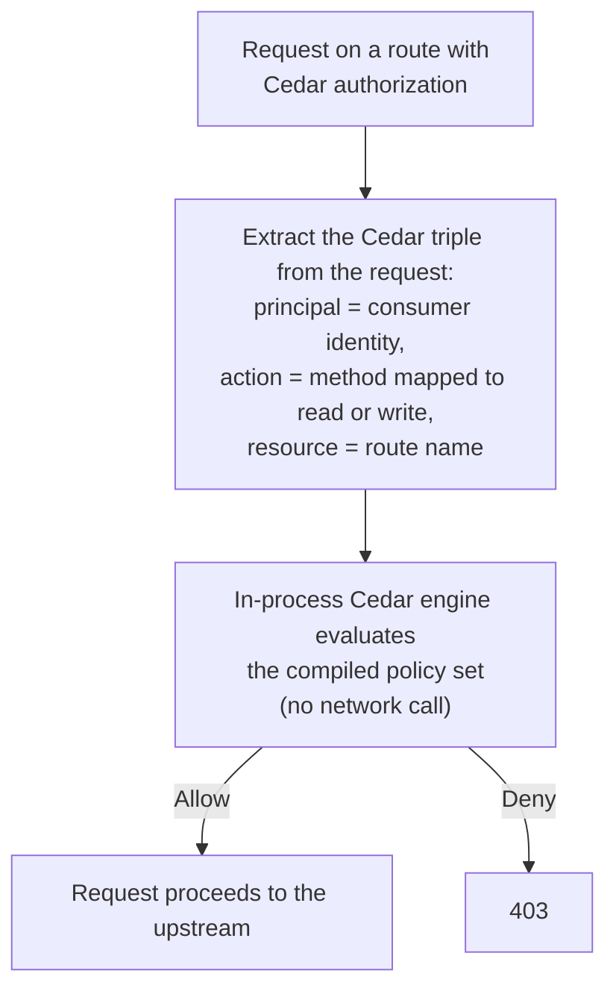

# Cedar authorization

Cedar is a policy language developed by AWS for fine-grained
authorization. Policies are declarative, composable, and
side-effect-free, and the gateway evaluates them in-process -- no
external policy service is needed.

Cedar is one of two external policy engines Dwara supports for
authorization; the other, [OPA authorization](./opa-authz), is
queried over HTTP. Both complement the built-in authz
(consumer/route/service policies) -- see
[Authorization](./authorization) -- and sit behind a single
compile-time capability (`cedar`, default OFF, no license) that
covers both engines. See [Editions: OSS vs Enterprise](./editions)
for how capabilities differ from enterprise features.

::: info Status
The pack is not included in the published OSS binaries. The
in-process Cedar authorizer, like the OPA HTTP client, is complete
and test-covered as a library component. The config wiring has not
landed yet -- the `authz:` blocks below illustrate the target
surface (the built-in rules live under `authorization:` today) and
the Cedar/OPA keys are not in the generated
[configuration schema](../reference/configuration-schema).
:::

## When to use this

Use Cedar (or OPA) when the built-in policy model is not expressive
enough:

- Attribute-based access control (ABAC) with complex rules.
- Externalized policy management (policies stored outside the
  gateway config).
- Centralized policy across multiple services.

The built-in authz covers consumer allow/deny lists, IP ACLs, and
route-level method restrictions. Cedar/OPA are for everything beyond
that. Prefer Cedar when you want fine-grained authorization without
an extra network hop; prefer [OPA](./opa-authz) when you want a
standalone policy service shared across your stack.

## Enabling

Cedar and OPA support are compiled into the OSS build behind the
`cedar` feature -- the feature compiles in the Cedar authorizer and
the OPA client together:

```sh
cargo build -p dwara-core
```

## Configuration

Configure a Cedar policy set in the config:

```yaml
authz:
  cedar:
    policies: |
      permit(
        principal == User::"alice",
        action == Action::"read",
        resource == Resource::"api"
      );
    schema: |
      {
        "entities": {
          "User": {},
          "Action": {},
          "Resource": {}
        }
      }
```

| Field | Default | Description |
|---|---|---|
| `policies` | (required) | The Cedar policy set, inline as a string. |
| `schema` | (none) | The entity-type schema for the policy set, inline JSON. |

## How it works



1. The gateway extracts the principal (consumer identity), action
   (HTTP method mapped to read/write), and resource (route name)
   from the request.
2. The Cedar authorizer evaluates the policy set against the
   request.
3. If the decision is `Allow`, the request proceeds. If `Deny`, the
   request is rejected with 403.

## Cedar policy format

Cedar policies use a `permit` or `forbid` clause:

```cedar
permit(
  principal == User::"alice",
  action == Action::"read",
  resource == Resource::"api"
);

forbid(
  principal,
  action == Action::"delete",
  resource
)
unless {
  principal has role && principal.role == "admin"
};
```

See the [Cedar docs](https://docs.cedarpolicy.com/) for the full
language reference.

## Fail-closed vs fail-open

Both Cedar and OPA support a `fail_closed` mode:

- **Fail-closed** (default): if the policy engine is unavailable or
  returns an error, the request is denied. This is the safe default
  -- never let a policy engine outage accidentally allow traffic.
- **Fail-open**: if the policy engine is unavailable, the request is
  allowed. Use this only when availability is more important than
  security (e.g. internal tools behind a VPN).

## Interaction with built-in authz

Cedar/OPA run **after** the built-in authz checks. A request must
pass both:

1. Built-in authz (consumer allow/deny, IP ACL, method allowlist).
2. Cedar/OPA (if configured).

If either denies, the request is rejected with 403.

## Runnable demo

Run this feature against a live gateway: [`demos/04-security-auth/`](https://github.com/shristilabs/dwara/tree/main/demos/04-security-auth) (test
script: `test-21-cedar-authz.sh`) in the repository.
The demo documents the current limitations alongside what
runs today; see its README.
