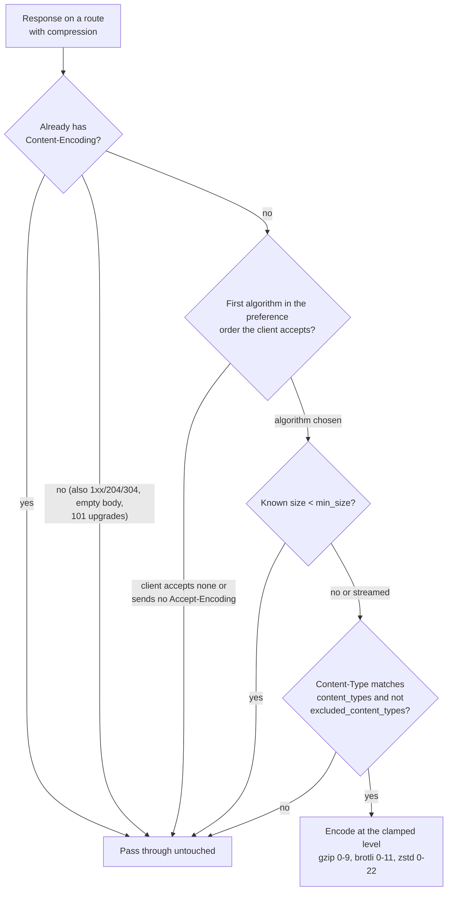

# Compression

Compression shrinks response bodies at the edge. When enabled on a
route, the gateway negotiates against the request's
[`Accept-Encoding`](https://developer.mozilla.org/en-US/docs/Web/HTTP/Headers/Accept-Encoding)
and compresses the response with the first algorithm the client
accepts -- gzip, brotli, or zstd. This cuts bandwidth on large text
and JSON responses without any change to the upstream service.

Compression is opt-in per route with a `compression` block, and it
is off by default. Like [CORS](./cors) and
[request limits](./request-limits), the block is a plain part of the
route (exactly one per route), not a reusable `policies` attachment
like [retries](./retries) or [rate limiting](./rate-limiting). For
the exhaustive field list see the
[configuration schema](../reference/configuration-schema).

## When to use this

Use compression when a route serves large compressible bodies --
JSON APIs, HTML, CSS, JavaScript -- and bandwidth or transfer time
matters. Small bodies are skipped via `min_size`, payloads that are
already encoded are never recompressed, and the codec streams
chunk-by-chunk, so Server-Sent Events and slow streams are safe (see
below). Clients that do not accept any offered algorithm simply get
the body untouched.

## Configuration

```yaml
routes:
  - name: api
    service: api-service
    match:
      path:
        type: prefix
        value: /api/
    action:
      type: proxy
    compression:
      algorithms: [gzip, brotli, zstd]   # preference order
      level: 6                           # clamped per algorithm
      min_size: 1024                     # skip small bodies
      content_types: [text/, application/json]
      excluded_content_types: [text/event-stream]
```

| Field | Default | Description |
|---|---|---|
| `algorithms` | none | Compression algorithms in **preference order**: the first entry the client accepts wins. Config spelling is the algorithm name (`brotli`), not the wire token (`br`). |
| `level` | per-algorithm defaults | One compression level across all algorithms, clamped per algorithm at encode time (gzip 0-9, [brotli](https://en.wikipedia.org/wiki/Brotli) 0-11, [zstd](https://en.wikipedia.org/wiki/Zstandard) 0-22). Omitted: per-algorithm defaults tuned for a proxy hot path. |
| `min_size` | `1024` | Skips responses whose known size is below it. Responses of unknown length (streamed) are always candidates. |
| `content_types` | empty (all types) | Restricts compression to matching `Content-Type` prefixes. |
| `excluded_content_types` | empty (none) | Excluded `Content-Type` prefixes; checked after `content_types` and wins. |

## How it works



1. The gateway negotiates against the request's `Accept-Encoding`:
   `algorithms` is a preference order, and the first entry the client
   accepts wins. Clients that accept nothing the route offers (or
   send no `Accept-Encoding` at all) get the body untouched -- the
   gateway never errors over compression.
2. `level` is one value across all algorithms and is clamped per
   algorithm at encode time (gzip 0-9, brotli 0-11, zstd 0-22).
3. `min_size` skips responses whose known size is below it -- a
   declared `Content-Length`, or the exact size of bodies the
   gateway generates itself (`respond` actions, redirects, which
   carry no `Content-Length`). Responses of unknown length
   (streamed) are always candidates.
4. `content_types` restricts compression to matching `Content-Type`
   prefixes (empty = every type); `excluded_content_types` is
   checked after it and wins.

Never compressed: responses that already carry a
[`Content-Encoding`](https://developer.mozilla.org/en-US/docs/Web/HTTP/Headers/Content-Encoding),
body-less statuses (1xx/204/304), zero-length bodies, and `101`
protocol upgrades (WebSocket tunnels).

## Streaming and caches

Compression is streaming-safe: the body is compressed and flushed
chunk-by-chunk and never buffered whole, so
[Server-Sent Events](https://developer.mozilla.org/en-US/docs/Web/API/Server-sent_events)
and slow streams reach the client as they arrive. Every response on
a compression route that is not already encoded carries
`Vary: Accept-Encoding`, compressed or not, so shared caches key it
correctly.

## Pipeline order and reload

For a matched request the stages run in a fixed order: route limits,
then [CORS](./cors) preflight handling, then authentication,
authorization, rate limiting, and admission, then the route's
action, and finally the response gains compression and CORS headers.
See the [request pipeline](../architecture/overview#request-pipeline)
for the full picture. The `compression` block reloads live with the
rest of the config -- an atomic snapshot swap, no restart.

## Runnable demo

Run compression against a live gateway: [`demos/05-request-response/`](https://github.com/shristilabs/dwara/tree/main/demos/05-request-response)
(test script: `test-06-compression.sh`) in the repository. The script
requests a JSON file with `Accept-Encoding: gzip` and asserts a
`Content-Encoding: gzip` response. The category README covers
prerequisites and teardown.
