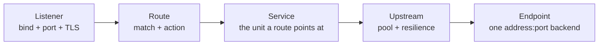
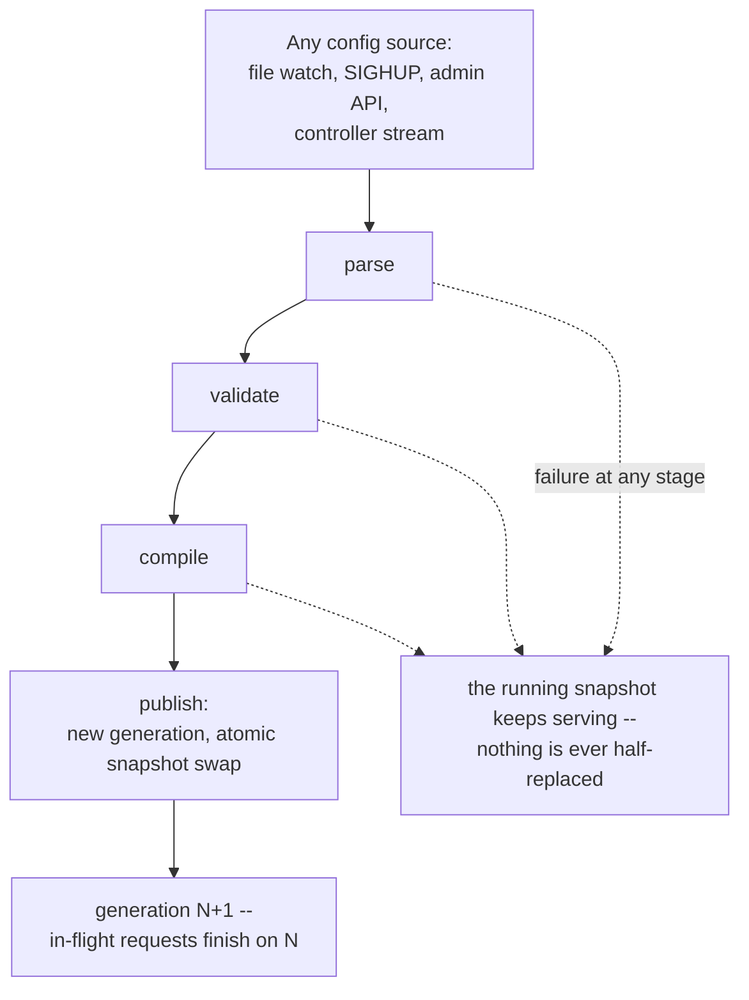

# Concepts and taxonomy

This page is the vocabulary of Dwara: the named concepts an operator
works with, how they classify, and how they relate. Read it once to
orient yourself; every other guide assumes these terms. For the
exhaustive field list, see the
[configuration schema](../reference/configuration-schema); for how a
request flows through these concepts, see the
[architecture overview](../architecture/overview).

## The three axes

Every Dwara deployment is described along three independent axes. Keep
them separate in your head and most configuration questions answer
themselves:

1. **Edition** — *which features exist at all*. One codebase ships two
   editions: **OSS** (the default, Apache-2.0) and **Enterprise**
   (built with the `ent` cargo feature, activated by a signed license).
   Enterprise features are the ones that span *multiple* gateway
   instances or need external infrastructure. See
   [Editions](./editions).
2. **Capability** — *which optional surfaces this build carries*.
   Advanced surfaces ship as compile-time capabilities (`wasm` for the
   proxy-wasm host, `plugins` for native filters, `cel`, `aggregation`,
   `mcp`, ...). They are default-OFF and not included in the published
   binaries; a config block for a capability the build lacks is
   rejected at validation. See
   [compile-time feature packs](./editions#compile-time-feature-packs).
3. **Config** — *what this particular gateway does*. A single strict
   YAML file declares the routing chain, identity, policy, and
   observability. This page is mostly about this axis.

A feature that is Enterprise-only is inert-but-accepted in an OSS build
(it parses and validates, then is ignored). A capability that is not
compiled in is rejected at validation if its config block appears. The
two are different failure modes — know which axis you are on.

## The core routing chain

Traffic flows through a fixed chain of named entities, each referencing
the next by name:



| Entity | What it is | Owns |
|---|---|---|
| **Listener** | A bind address + port (+ optional TLS). The front door. | TLS material, protocol (http/https/h2/h2c/tcp/udp), listener-scoped policy and authorization |
| **Route** | A match rule + an action. Decides what to do with a request that reached a listener. | Path/host/method/header/query/cookie matching, the action, and route-level blocks (CORS, transforms, limits, ...) |
| **Service** | A named target grouping one or more upstreams. The unit a route points at. | The upstream (or a weighted split across upstreams), sticky sessions, service-scoped policy |
| **Upstream** | A pool of endpoints with shared resilience settings. | Endpoints, load-balancing strategy, health checks, circuit breaker, retries, timeouts, connection caps |
| **Endpoint** | A single `address:port` backend. | Nothing — it is the leaf |

A request resolves to **at most one route**; that route names one
service; that service names one upstream (or a split across several);
that upstream picks one endpoint per attempt. Names are unique within
their kind and referenced by string — there is no nesting. See
[Routing](./routing) and [Configuration](./configuration).

### Route actions

A route's `action` decides where the response comes from:

- **`proxy`** — forward to the service/upstream (with an optional path
  rewrite). The common case.
- **`redirect`** — answer a 3xx with a constructed `Location`, no
  upstream.
- **`respond`** — answer directly with a status/body/headers, no
  upstream (synthetic health checks, deprecation notices).
- **`mock`** — serve a canned response without contacting any
  upstream, with an optional artificial delay (contract tests,
  demos).
- **`ai`** — translate and forward to an AI provider through the AI
  adapter pack (requires the `ai` config block; see
  [AI gateway](./ai-gateway)).
- **`nano_service`** — run a WASM module to generate the response
  directly, no upstream (see [Nano-services](./nano-services)).

### Route-level blocks

These are not policy attachments — each is a single optional block on
the route itself: `cors`, `compression`, `limits`, `transforms`,
`masking`, `security_headers`, `cache`, `maintenance`, `deprecation`,
`waf`, `graphql`, `websocket`, `plugins`, `request_validation`,
`fault_injection`, `mirror`, `slo`, `oidc_login`, `grpc_web`,
`translation` (protocol translation), `openapi` (response validation),
`filter_chain` (phase overrides). Each has its own guide; see the
sidebar under *Routing and request handling*.

## Identity and access

### Consumers and credentials

A **consumer** is a named caller of your gateway — an application, a
team, an agent. A consumer carries:

- **credentials** — the secret(s) it authenticates with (API key, Basic,
  JWT, mTLS cert, HMAC signing key). See
  [Secrets](./secrets) for the `${...}` reference form that keeps secret
  bytes out of config files.
- **groups** — group memberships used by authorization rules.
- **`type`** — the principal kind: `user` (default) or `agent`. Agent
  consumers get AI-specific controls (token budgets, MCP tool
  allowlists).
- **`priority`** — a 0-10 load-shedding priority class.
- **`quotas`** — daily/monthly request budgets over the durable state
  store. See [Quotas](./quotas).
- **`policies`** / **`authorization`** — consumer-scoped policy and
  authz (the most-specific precedence level).

Credentials and consumers are separate so one consumer can hold several
credential families, and one credential format (e.g. one JWKS) can map
to many consumers.

### Authentication methods

How a consumer proves identity. Each is a credential family:

| Method | What it checks | Guide |
|---|---|---|
| API key | a shared secret in a header/query | [Security](./security) |
| HTTP Basic | RFC 7617 username/password | [Security](./security) |
| JWT (JWKS) | a Bearer token verified against a JWKS endpoint | [Security](./security) |
| mTLS client cert | a verified client certificate mapped to a consumer | [mTLS](./mtls) |
| HMAC request signing | per-request HMAC-SHA256 signature | [HMAC signing](./hmac-signing) |
| OIDC | Bearer introspection (RFC 7662) or browser login + PKCE | [OpenID Connect](./oidc) |

The gateway can also act as an **OAuth2 client-credentials client**
toward an upstream — that is upstream authn, not consumer authn.

### Authorization

Authorization is the *what may this caller do* layer, evaluated after
authentication. It is a five-level precedence chain, most-specific
first, **deny-anywhere-wins**:

```
consumer > route > service > listener > global
```

Each level can carry allow/deny rules over consumers, groups, JWT
scopes/claims, IP ACLs, and GeoIP gates. A `dry_run` flag turns any
level into monitor-only. External policy engines (Cedar, OPA) plug in
at the same levels when the `cedar` capability is compiled in. See
[Authorization rules](./authorization), [Cedar
authz](./cedar-authz), and [OPA authz](./opa-authz).

## Policy

A **policy** is a named, reusable bundle of traffic-control rules.
Policies are declared once at the top level and *attached by name* at
one or more scopes. All applicable levels' rules AND together.

A policy bundle can contain any combination of:

| Field | Controls | Guide |
|---|---|---|
| `rate_limits` | stacked GCRA rate-limit rules (windows) | [Traffic policy](./traffic-policy) |
| `timeouts` | request/connect/read timeouts | [Traffic policy](./traffic-policy) |
| `adaptive` | EWMA-driven rate-limit tuning from upstream error rates | [Traffic policy](./traffic-policy) |
| `anomaly` | statistical anomaly scoring of abusive requests | [Traffic policy](./traffic-policy) |
| `token_budget` | AI token budget (per-minute / per-day caps) | [AI token budgets](./ai-token-budgets) |
| `dry_run` | monitor mode for the bundle's rate-limit rules | [Traffic policy](./traffic-policy) |

### Attachment scopes

Policies attach at five scopes, matching the authorization precedence
chain: **global** (`global_policies`), **listener**, **service**,
**route**, and **consumer**. Consumer-level always wins; deny-anywhere-
wins across the chain. See
[the request pipeline](../architecture/overview#request-pipeline) for
where each stage runs.

## Resilience

Resilience settings live on the **upstream** (they describe how to talk
to a pool of endpoints), not on policies:

| Setting | What it does | Guide |
|---|---|---|
| `retries` | bounded per-request retry attempts with exponential backoff | [Traffic policy](./traffic-policy) |
| `timeouts` | per-attempt and overall timeout budgets | [Traffic policy](./traffic-policy) |
| `breaker` | per-upstream circuit breaker (opens the whole pool) | [Traffic policy](./traffic-policy) |
| `health` | passive health / outlier detection (eject bad endpoints) | [Operations](./operations) |
| `active_health` | synthetic HTTP/TCP probes per endpoint | [Operations](./operations) |
| `connection_cap` / `max_pending` | outbound connection and queue limits | [Operations](./operations) |
| `slow_start_ms` | ramp-up window for newly-added endpoints | [Operations](./operations) |
| `load_balancer` | strategy: round-robin, least-connections, peak-EWMA, ... | [Routing](./routing) |

Gateway-wide resilience that is *not* per-upstream: `max_concurrent_
requests` (a concurrency cap with `503` load shedding), **admission
queues** (bounded queueing under pressure), and **request hedging**
(fire a duplicate after a latency threshold). See
[Admission queues](./admission-queue) and
[Request hedging](./request-hedging).

## AI gateway

When the top-level `ai` block is present, routes may use the `ai`
action and a separate taxonomy applies. See
[AI gateway](./ai-gateway) for the overview.

| Entity | What it is |
|---|---|
| **Provider** | An upstream that carries AI traffic (OpenAI, Anthropic, Gemini, OpenAI-compatible). Named in `ai.providers[]` and referenced by models. |
| **Model alias** | The `model` value a client sends; maps to a provider + provider-side model id. Supports failover, canary splits, A/B tests, and routing policies. |
| **Credential pool** | A set of API keys for one provider with rotation + 429 quarantine (Enterprise). |
| **Routing policy** | A named strategy for choosing among model targets: `FallbackChain` (cheap-first escalation) or `LatencyCost` (static config-based selection). |
| **Token budget** | Per-consumer or per-policy cap on provider-reported tokens (per-minute / per-day). |
| **Guardrails** | Prompt-injection / PII / banned-content / schema enforcement, prompt + response phases. |
| **Governance** | Per-team model allowlists with shadow audit. |
| **Prompt logging** | Opt-in, redacted, sampled prompt/response capture with retention. |
| **Semantic cache** | Embedding-similarity cache (HNSW ANN + external embedding service; compiled into the OSS build). |
| **Experiments** | Prompt versioning, A/B model comparison, regression evals, feedback ingestion. |
| **MCP gateway** | Model Context Protocol server/router: tool routing to upstreams, session management, auth. |
| **A2A** | Agent-to-agent protocol support with Agent Card parsing. |

## Observability and analytics

| Concept | What it is | Guide |
|---|---|---|
| **Access logs** | Structured JSON logs with request IDs | [Observability](./observability) |
| **Metrics** | Prometheus `/metrics` on every listener | [Observability](./observability) |
| **Tracing** | Optional OTLP trace + metrics export (capability) | [OTel metrics export](./otel-metrics-export) |
| **Analytics store** | Embedded SQLite: raw access records + rollups + retention | [Analytics](./analytics) |
| **Analytics stream** | NDJSON firehose of every completed request to an external sink | [Analytics stream](./analytics-stream) |
| **Webhooks** | Alert/event envelopes for state changes (breaker, ejection, config) | [Alert webhooks](./webhooks) |
| **Synthetic monitoring** | Active probes that feed health and SLO metrics | [Synthetic monitoring](./synthetic-monitoring) |
| **Replay debugging** | Record routing decisions per request, replay them offline against a new config | [Replay debugging](./replay-debugging) |

## Extensibility

Three plugin families, unified under one dispatch chain:

| Family | What it is | Guide |
|---|---|---|
| **Proxy-Wasm** | The proxy-wasm host: community Kong/Envoy filters run unmodified (capability `wasm`) | [Proxy-Wasm plugins](./proxy-wasm-plugins) |
| **Native plugins** | A Rust filter trait compiled into the binary (capability `plugins`) | [Native plugins](./native-plugins) |
| **Nano-services** | WASM route handlers — a route action that runs a WASM module to generate the response | [Nano-services](./nano-services) |

Plugins are declared at the top level and referenced by name from
routes' `plugins` field. See [Plugin lifecycle](./plugin-lifecycle).

## State and lifecycle

| Concept | What it is |
|---|---|
| **Snapshot** | The immutable, compiled view of config the gateway serves from. Swapped atomically behind an ArcSwap. |
| **Generation** | A monotonic id assigned to each successful publish. Visible via `GET /config` and the `config_generation` metric. |
| **Config pipeline** | `parse -> validate -> compile -> publish`. Every config source (file, SIGHUP, admin API, controller stream) runs the same pipeline. A failure at any stage never replaces the running snapshot. |
| **Hot reload** | Debounced file-watch or SIGHUP triggers the pipeline; in-flight requests keep their original generation. |
| **State store** | Optional embedded SQLite holding durable identity state: consumers, credentials, quota counters. |
| **Admin listener** | Optional mTLS-only management surface: `GET`/`PATCH /config`, `/health`, `/stats`. |



See [Operations](./operations) and [Hot reload](../architecture/overview#hot-reload).

## Enterprise fleet concepts

These only exist in the Enterprise edition and concern coordinating
*many* gateways:

| Concept | What it is | Guide |
|---|---|---|
| **Control plane** (`dwara-controller`) | Leader-elected; compiles config generations and pushes them to edges over gRPC | [CP/DP split](./cp-dp-split) |
| **Data plane** (`dwara-edge`) | A gateway instance fed by the controller; caches the last generation | [CP/DP split](./cp-dp-split) |
| **Config convergence** | Fleet-wide consistent config state, backed by Redis | [Config convergence](./config-convergence) |
| **Redis backend** | Shared GCRA buckets, distributed cache, convergence state | [Redis rate limiter](./redis-rate-limiter) |
| **Workspace** | A multi-tenant boundary with its own config, RBAC, and audit | [Workspaces](./workspaces) |
| **Federated analytics** | Edge-to-controller analytics aggregation over gRPC | [Enterprise](./enterprise) |
| **Service mesh** | Sidecar mode with SPIFFE/SPIRE mTLS identity (capability `mesh`) | [Service mesh](./service-mesh) |

## Where to go next

- [Getting started](./getting-started) — run a gateway locally.
- [Configuration](./configuration) — the YAML shape and the config
  pipeline.
- [Architecture overview](../architecture/overview) — the request
  pipeline and component diagrams.
- [Configuration schema](../reference/configuration-schema) — the
  exhaustive field reference.
