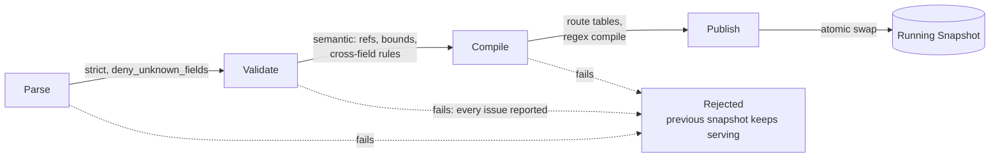

# Configuration

dwara is configured from a single strict YAML file: unknown fields are
rejected, and every error names the path of the offending node. This
page covers the concepts; the exhaustive field list is the generated
[configuration schema](../reference/configuration-schema).

## Vocabulary

Configuration is built from a fixed, frozen set of concepts:

**Listener** → **Route** → **Service** → **Upstream** → **Endpoint**,
plus **Consumer**, **Credential**, **Policy**, and **Workspace**. A
published, compiled configuration is a **Snapshot**.

## A minimal config

```yaml
listeners:
  - name: main
    address: 0.0.0.0
    port: 8080
routes:
  - name: all
    service: echo
    match:
      path:
        type: prefix
        value: /
    action:
      type: proxy
services:
  - name: echo
    upstream: echo-upstream
upstreams:
  - name: echo-upstream
    endpoints:
      - address: 127.0.0.1
        port: 9000
```

More worked examples (minimal and full) live in
`crates/dwara-core/tests/fixtures/` in the repository.

## The config pipeline

Every config — at startup, on file-watch reload, on `SIGHUP`, or via a
`PATCH /config` to the [admin API](./admin-api) — passes through the
same four stages:



A config that fails at any stage never replaces the running gateway —
the previous snapshot keeps serving, and every problem found is
reported at once (never fail-fast on the first error). A successful
publish gets a new generation id, visible via `GET /config` on the
admin API and the `config_generation` metric.

## Route matching

A request path resolves to **at most one** route. Within path matching,
three kinds are checked in a fixed cross-kind order regardless of
declaration order or how specific a pattern looks:

1. **Exact** — radix-tree template match; static segments beat path
   parameters (`/users/active` before `/users/{id}`).
2. **Regex** — first-declared match wins among several matching regex
   routes.
3. **Prefix** — longest matching prefix wins (byte prefix, no segment
   boundary — `/v1` also matches `/v1anything`).

A route may add further criteria, all AND-ed together: `host` (exact,
case-insensitive), `methods`, exact-value `headers`, `query`
parameters, `cookies`, and `accept` (a media type the request's
`Accept` header must name explicitly — see
[API versioning](./api-versioning)). If a path matches a route's path
pattern but its other criteria miss, the request does **not** fall
through to another candidate route — it is answered `404`.

## Route actions

- **`proxy`** — forward to the route's service/upstream, with an
  optional single `rewrite` (`strip_prefix`, `replace_prefix`, or
  `regex`) applied to the path only; the query string always passes
  through verbatim.
- **`redirect`** — answer with a 3xx and a `Location` built from
  `scheme`/`host`/`path` (any omitted, the inbound value is preserved).
- **`respond`** — answer directly with a configured status, optional
  body, and optional headers — no upstream involved (useful for
  synthetic health checks, deprecation notices, etc.).

## Proxying semantics

Proxying is end-to-end streaming: neither request nor response bodies
are buffered by the gateway, so Server-Sent Events and large bodies
pass through with natural backpressure. Hop-by-hop headers are stripped
in both directions, and the outbound `Host` header is set to the
upstream endpoint's authority. Protocol upgrades (e.g. WebSocket) are
tunneled generically once the upstream answers `101` — both connections
are spliced byte-for-byte until either side closes.

Upstream failures are classified for the client without leaking
internals: connect/read timeout → `504`; refused/pool failure/no
endpoints → `502`; upstream TLS misconfiguration → `500`.

## Global settings

- `max_concurrent_requests` — a gateway-wide concurrency cap. A request
  over the cap gets an immediate `503` (no queueing); `/healthz` and
  `/readyz` bypass it.
- `allow_empty_routes` — opt-in flag required to run a gateway with
  zero routes (guards against a truncated/torn config write silently
  dropping all routing while otherwise looking schema-valid).
- `webhooks` — alert/event webhook targets: gateway state changes
  (breaker transitions, endpoint ejection/recovery, config
  published/rejected) POSTed as one JSON envelope, with bounded
  retries. See [Alert webhooks](./webhooks).

## Traffic policy

Retries/timeouts, circuit breaking, load shedding, and rate limiting
are all configured as **policies** that attach at global, listener,
service, route, or consumer scope, with consumer-level policy always
taking precedence (deny-anywhere-wins). See the architecture doc's
[request pipeline](../architecture/overview#request-pipeline) for where
each stage runs, and the [configuration schema](../reference/configuration-schema)
for the exact policy fields.

Cross-origin access (CORS), response compression, per-route request
limits, and the API deprecation-signal block are not policy
attachments — each is a single optional block on the route itself.
The per-route `maintenance` block (answer 503 + `Retry-After` without
touching the upstream), the `transforms` block (header, query, and
size-capped JSON-body manipulation on the route's traffic), the
`masking` block (fail-closed redaction of response fields, per
consumer group), the `security_headers` block (HSTS, nosniff, CSP,
X-Frame-Options stamped on every route response), and the `dry_run`
monitor flags — on request limits, on any `authorization` block, on a
rate-limit policy bundle, and on load shedding — are likewise
route/gateway-level blocks; see
[Maintenance and dry-run](./maintenance),
[CORS, compression, and request limits](./edge-policies),
[Transforms and security headers](./transforms),
[Response field masking](./masking), and
[API versioning](./api-versioning).

## Authentication and authorization

Consumers authenticate via API key, HTTP Basic, JWT Bearer (verified
against a JWKS endpoint), an mTLS client certificate, or per-request
HMAC signatures (see [HMAC signing](./hmac-signing)); authorization
is IP-ACL and consumer/route/service/listener/global policy attachment,
evaluated in that same precedence order. Consumer secrets — API keys
and HMAC signing secrets — can be written inline or as a `${...}`
reference to an environment variable or a secret file — see
[Secrets](./secrets). See the
[configuration schema](../reference/configuration-schema) for the
`consumers`, `credentials`, and `policies` shapes.

## Validating and formatting configs

Before deploying a change, use the CLI (see [CLI](./cli)) rather than
restarting the gateway to find out if a config is valid:

```sh
dwara-cli validate path/to/dwara.yaml   # same pipeline the gateway runs
dwara-cli lint path/to/dwara.yaml       # advisory: shadowed routes, unused policies, ...
dwara-cli fmt path/to/dwara.yaml        # normalize in place
```
