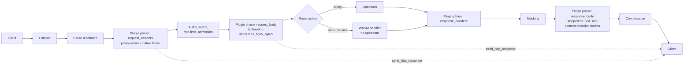
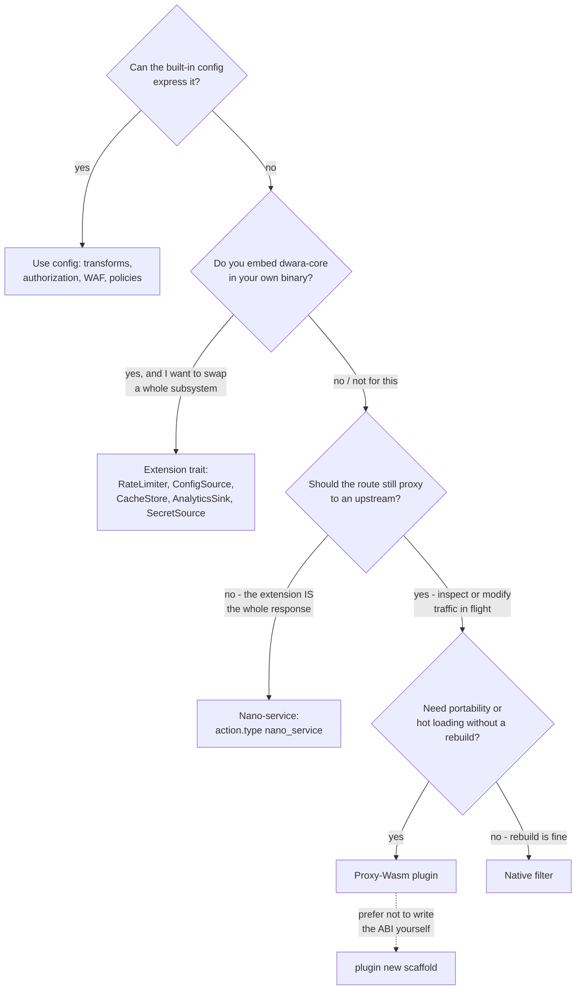

# Extending Dwara: getting started

Dwara is extendable at four surfaces. This page helps you pick the
right one, set up your environment, and ship a first extension; each
surface then has a detailed guide of its own.

::: tip First, check the built-ins
Most "I need a plugin for this" ideas are already config: header
surgery ([transforms](./transforms)), allow/deny logic
([authorization](./authorization)), pattern blocking
([WAF-lite](./waf-lite)), body checks (`request_validation`),
behavioral signals (policies `anomaly`). Plugins are for logic the
config grammar cannot express.
:::

## The four options at a glance

| | [Proxy-Wasm plugin](./proxy-wasm-plugins) | [Native filter](./native-plugins) | [Nano-service](./nano-services) | [Extension trait](./extension-traits) |
|---|---|---|---|---|
| What it is | A route-attached request/response filter | A compiled-in Rust filter | A route handler AS WASM | A subsystem implementation for embedders |
| What you can do | Inspect/modify headers and bodies, rewrite the request target (`:path`/`:method`/`:authority`), short-circuit with your own response, deny, tag, make HTTP callouts to external services | Same filter semantics as WASM, at native speed, with dwara-core types | Own the WHOLE response for a route — no upstream at all | Swap rate limiting, config sourcing, caching, analytics, or secrets for your own backend |
| Runs | In a wasmtime sandbox per request, on routes that reference it | Inside the gateway binary | In a wasmtime sandbox, as the route's action | In your binary that embeds dwara-core |
| Written in | Rust (proxy-wasm SDK; other ABI-compatible languages in principle) | Rust | Any language emitting plain WASM (`#![no_std]` Rust, C, ...) | Rust |
| Packaged as | `.wasm` (cdylib, `wasm32-wasip1`) | Compiled into a custom gateway build | `.wasm` handler module | A crate dependency + startup registration |
| Hot loaded | **Yes** — config reload swaps by checksum; [registry sources](./plugin-registry) re-verify and re-resolve every publish | No — requires a rebuild + [zero-downtime upgrade](./zero-downtime-upgrade) | Module re-read on config publish | No — build time |
| Failure semantics | Fail closed on referencing routes (500 `plugin_unavailable` / `plugin_failed`); sandbox limits (fuel, memory) | Same fail-closed semantics | 502/504 on the route only | Your implementation's contract |
| Prerequisites | Rust + `wasm32-wasip1` target + `dwara-cli` | The dwara source tree | Rust/C toolchain, no SDK | The dwara source tree |
| Best for | Portable, safely sandboxed, hot-loadable edge logic | Maximum performance in an embedding you already build | Tiny endpoints without an upstream service | Products built ON dwara-core |

All four compile into the default OSS build — there are no cargo
features to enable. (A fifth surface — config-file native filters
loadable into the stock binary — does not exist today: native filter
registration is an embedder seam.)

## Where each option sits in the request pipeline

Filter-type extensions (proxy-wasm and native) attach at four phase
points around the built-in stages; a nano-service replaces the route
action itself; extension traits and registry sources sit outside the
request path entirely:



Two things the diagram does not draw, both deliberate:

- **Fast path**: a route with no plugins skips every phase node —
  the chain is not built at all. Plugin work is opt-in per route, so
  unplugged traffic never pays for the machinery.
- **Fail closed**: a plugin that cannot load or run makes its
  referencing routes answer `500 plugin_unavailable` /
  `plugin_failed` — a broken extension fails loudly, never silently
  disappears.

The compact map of every surface to its position:

| Surface | Where it lives |
|---|---|
| Proxy-wasm, `request_headers` phase | After route resolution, before authn — authn sees plugin-modified headers; `:path`/`:method`/`:authority` writes apply to the forwarded request |
| Proxy-wasm, `request_body` phase | After authn/authz/rate-limit, before the route action — body buffered to the route's `limits.max_body_bytes` (default 1 MiB) |
| Proxy-wasm, `response_headers` phase | After the response arrives (any action), before masking |
| Proxy-wasm, `response_body` phase | After masking, before compression — buffered; skipped and logged for streaming (`text/event-stream`) and content-encoded bodies |
| Native plugin filters | The same four phase points — one unified chain with proxy-wasm, same order, at native speed |
| Nano-services | The route action itself — the module generates the whole response, no upstream |
| Extension trait: `RateLimiter` | Behind the rate-limit stage — consulted for rate-limit decisions |
| Extension trait: `ConfigSource` | Publish time — supplies config generations, never per request |
| Extension trait: `CacheStore` | Behind the response-cache lookup and decoration tail |
| Extension trait: `AnalyticsSink` | Fire-and-forget after request completion — never on the request path |
| Extension trait: `SecretSource` | Compile time — resolves secret references before anything serves |
| Plugin registry sources | Publish time — `source.url` + digest (+ signature) resolved and verified on every publish |

See [Proxy-Wasm plugins](./proxy-wasm-plugins) for the phase
contract in detail and [Architecture: plugins and
extensibility](../architecture/plugins-and-extensibility) for the
seam map across the whole system.

## Picking an option



## Prerequisites (proxy-wasm path)

1. A Rust toolchain; add the WASM target (one-time):

   ```sh
   rustup target add wasm32-wasip1
   ```

2. `dwara-cli` on PATH (built from the repo:
   `cargo build --release -p dwara-cli`).

3. A gateway to test against — the default build, any way you run it
   ([quickstart](./getting-started)); a `respond` or `mock` route
   makes a dependency-free test bed.

4. To publish to the community registry later: an Ed25519 keypair
   (`dwara-cli plugin keygen`) and `gh` authenticated (for
   `plugin publish --pr`).

## Your first extension in 15 minutes

The scaffold produces a complete, compiling plugin wired to dwara's
phase contract:

```sh
dwara-cli plugin new my-plugin              # hello-world default
# or start from a working example:
dwara-cli plugin new my-auth --template static-auth
cd my-plugin
cargo build --release --target wasm32-wasip1
dwara-cli validate dwara.yaml               # the generated manifest validates as-is
```

Reference it from the gateway config and load it:

```yaml
plugins:
  - name: my-plugin
    wasm: ./my-plugin/target/wasm32-wasip1/release/my_plugin.wasm
    phases: [request_headers, response_headers]
    limits: { fuel: 1000000, memory_mb: 32 }
routes:
  - name: plugged
    # ... match ...
    plugins: [my-plugin]        # routes opt in; others take the fast path
```

Reload the gateway (file save or SIGHUP) and curl a matching route —
the plugin's header effect is visible on the response. The full
walkthrough with assertions is the [Plugin SDK](./plugin-sdk)
quickstart; the verified demo lives in
[`demos/08-extensibility`](https://github.com/shristilabs/dwara/tree/main/demos/08-extensibility).

## Packaging and distribution

1. **Local** — point `wasm:` at a file path. Simplest; the module is
   checksummed at every publish and hot-swaps when the bytes change.
2. **Registry** — publish the artifact and reference it by
   `source:` with a mandatory SHA-256 digest (and optionally an
   Ed25519 signature). The gateway fetches once, verifies, caches
   content-addressed, and re-verifies on every publish:

   ```yaml
   plugins:
     - name: rate-limiter
       source:
         url: https://shristilabs.github.io/dwara-plugins/rate-limiter-1.2.0.wasm
         digest: <64-hex sha256>
       phases: [request_headers]
   ```

   Publish your own with `dwara-cli plugin publish` (`--pr` opens the
   registry manifest PR); automate on tags with the
   [author CI template](https://github.com/shristilabs/dwara-plugins#author-ci).
   See the [Plugin registry](./plugin-registry) page for the full
   resolution pipeline and the registry spec.

Nano-services package the same way as local WASM (a file path on the
`nano_service` action); extension traits and native filters have no
packaging — they live in your build.

## Hot loading and reload semantics

1. **Proxy-wasm plugins**: adding/removing/re-pointing a plugin is a
   config reload; unchanged modules keep their compiled form and
   health (checksum-keyed), changed modules hot-swap, and a changed
   plugin definition bumps the response-cache epochs of every route
   referencing it (cached old-plugin bytes never replay).
2. **Registry sources**: every publish re-resolves — cache hit means
   zero network; a miss is one verified GET under a 60 s budget.
3. **Nano-services**: the module is re-read when a new config
   generation builds the route handler.
4. **Native filters / extension traits**: build-time only; use the
   zero-downtime binary upgrade (`dwara-cli upgrade`) to roll them.

A plugin that cannot load or run never silently disappears: its
status (`GET /plugins`, `dwara-cli status`) names the failure and
referencing routes answer `500 plugin_unavailable` while everything
else keeps serving.

## Where to go next

- [Use cases and recipes](./use-cases/) — seven complete, runnable
  recipes mapping real problems to these surfaces
- [Plugin SDK](./plugin-sdk) — the full API: hostcall support matrix,
  phases, limits, short-circuiting, troubleshooting
- [Plugin testing](./plugin-testing) — unit, integration, and
  replay-based regression testing
- [Plugin lifecycle](./plugin-lifecycle) — loading, health tracking,
  hot swap
- [Plugin registry](./plugin-registry) — distribution, verification,
  the registry spec
- [Plugin compatibility](./plugin-compat) — ABI level, version pins,
  semver guidance
- [Native plugin filters](./native-plugins) / [Nano-services](./nano-services)
  / [Extension traits](./extension-traits) — the other surfaces
- Signature references, one per surface:
  [Hostcall API reference](./proxy-wasm-hostcalls),
  [Native filter API](./native-filter-api),
  [Nano-service ABI](./nano-service-abi),
  [Extension trait API](./extension-trait-api)
