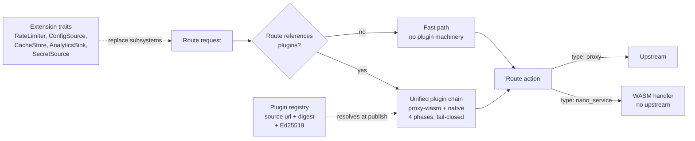

# Extensibility and plugins

Dwara is extensible at four layers: plugin filters that intercept
traffic at four defined phases (proxy-wasm modules and native Rust
filters, dispatched by one chain), WASM route handlers that generate a
response inside a module, extension traits that replace entire
subsystems, and a verified plugin registry that supplies remote
artifacts. A route can run a native filter and a proxy-wasm filter in
sequence; both are plugin entries in the same list, referenced by
name.

All four layers are live in every build — there are no cargo features
to enable and no license involved. An Extism PDK runtime was
previously scaffolded as a third plugin path but was removed before it
was ever wired into the dispatch chain, config schema, or runtime —
proxy-wasm and native filters are the supported plugin
paths, and Extism may be re-introduced in a future milestone if there
is demand.

## In this section

- [Proxy-Wasm plugins](./proxy-wasm-plugins) - the proxy-wasm host:
  community Kong and Envoy filters run unmodified inside Dwara.
- [Native plugin filters](./native-plugins) - a Rust filter trait
  compiled into the binary, running alongside proxy-wasm in the same
  dispatch chain.
- [Nano-services (WASM handlers)](./nano-services) - a route action
  that runs a WASM module to generate the response directly, no
  upstream needed.
- [Plugin lifecycle](./plugin-lifecycle) - how plugins are loaded,
  configured, hot-swapped, and health-tracked across config
  generations.
- [Plugin registry](./plugin-registry) - load plugins from a remote
  registry with digest and signature verification, for
  fleet-consistent pinning.
- [Plugin compatibility](./plugin-compat) - the compatibility
  contract between gateway and plugin builds: ABI level, wasm
  targets, breaking-change policy.
- [Plugin SDK](./plugin-sdk) - the developer workflow for writing
  proxy-wasm plugins: scaffold, build, the hostcall support matrix.
- [Plugin testing](./plugin-testing) - unit, integration, and replay
  regression testing for plugins.
- [Extension traits](./extension-traits) - the five swappable seams
  (RateLimiter, ConfigSource, CacheStore, AnalyticsSink, SecretSource)
  that let you replace entire subsystems with a custom or enterprise
  backend.

Related, outside this section: [Filter-chain
ordering](./filter-chain-ordering) documents the eight pipeline stages
that the plugin phases hook around — the `filter_chain` config block
validates a custom order but the dataplane runs the fixed order today.

## Runnable demo

The [`demos/08-extensibility/`](https://github.com/shristilabs/dwara/tree/main/demos/08-extensibility) directory in the repository runs a live
stack for the features in this section; its README covers
prerequisites, test scripts, and teardown.

## Where to go next

- [Architecture: plugins and extensibility](../architecture/plugins-and-extensibility)
  - where each extensibility seam sits in the architecture, and what
  is still scaffolded.
- [Enterprise and fleet](./enterprise) - the enterprise backends
  (Redis, Vault) are additional implementations of the same extension
  traits.
