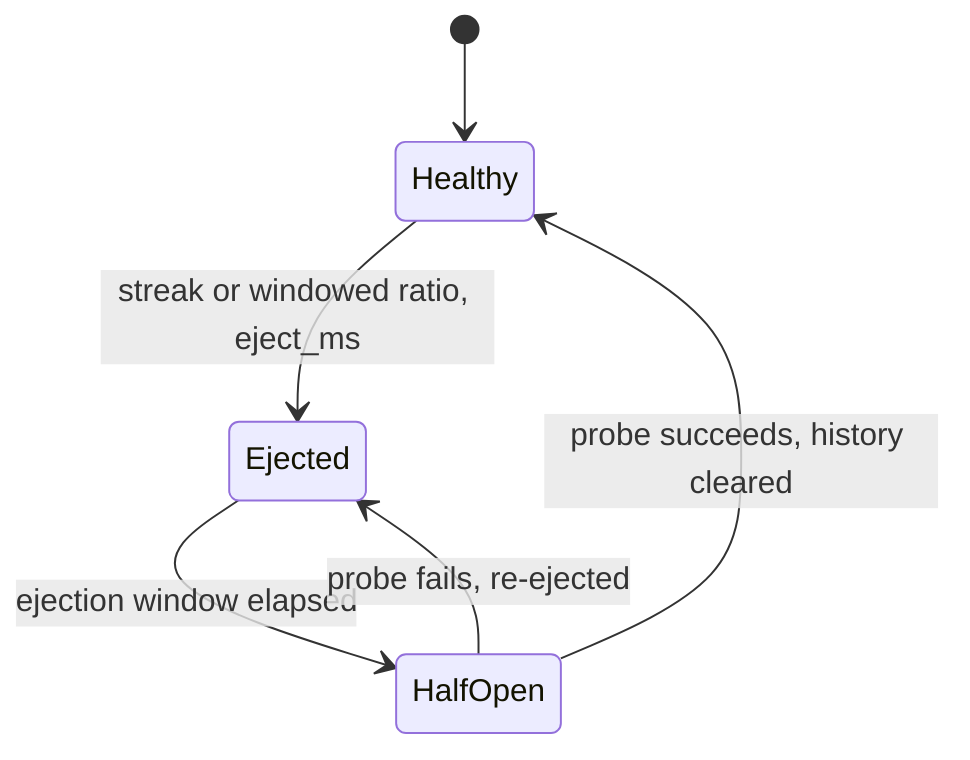

# Health checks

Health checks remove failing endpoints from an upstream's load
balancing pool and put them back when they recover. Dwara has two
complementary kinds:

- **Passive health** (`upstreams[].health`) observes real traffic:
  every request outcome updates a per-endpoint state machine. It
  costs nothing and needs no probe endpoint, but an endpoint with no
  traffic gets no signal.
- **Active health** (`upstreams[].active_health`) sends periodic
  probes (`http` or `tcp`) to each endpoint and feeds the results
  into the same state machine, so idle endpoints are still checked.

```yaml
upstreams:
  - name: api
    endpoints:
      - { address: 10.0.0.1, port: 8080 }
      - { address: 10.0.0.2, port: 8080 }
    health:
      consecutive_failures: 5
      failure_ratio: 0.5
      failure_min_volume: 20
      eject_ms: 30000
    active_health:
      kind: http
      path: /healthz
      interval_ms: 5000
      timeout_ms: 2000
```

## When to use this

Enable passive health on every multi-endpoint upstream: it is the
cheapest way to stop routing to a dead replica. Add active health
when endpoints may have low or bursty traffic (a hot-standby, a
canary, a rarely-hit shard) or when you want failures detected before
real requests pay for them.

An `active_health` block requires a `health` block -- probes report
into the passive state machine, which owns the ejection and recovery
windows.

## Passive fields

A `health:` block with no keys enables ejection with the defaults.

| Field | Default | Description |
|---|---|---|
| `window_ms` | `60000` | Rolling observation window for the failure ratio. |
| `consecutive_failures` | `5` | Eject after this many consecutive failures. |
| `failure_ratio` | `0.5` | Eject when the in-window failure share is >= this ratio AND volume is >= `failure_min_volume`. Must be in (0, 1]. |
| `failure_min_volume` | `20` | Minimum observations in the window before `failure_ratio` applies. |
| `eject_ms` | `30000` | How long an ejected endpoint stays out of rotation. |
| `half_open_probes` | `1` | Trial requests allowed through per recovery attempt. A successful probe restores health; a failed probe re-ejects for another `eject_ms`. |

Failure classification: transport errors (connect timeout, refusal,
reset) and HTTP statuses `>= 500` are failures; `1xx`-`4xx` are
successes. `429` and `408` are deliberately successes -- they
describe the caller or queueing, not endpoint health.

## Active fields

An `active_health:` block with no keys enables HTTP probes with the
defaults.

| Field | Default | Description |
|---|---|---|
| `kind` | `http` | `http` (GET `path`, success = 2xx) or `tcp` (connect within `timeout_ms`). |
| `path` | `/healthz` | Path probed by `http` checks. Ignored by `tcp`. |
| `interval_ms` | `5000` | Time between probe attempts. Must be >= `timeout_ms` and >= `jitter_ms`. |
| `timeout_ms` | `2000` | Per-probe timeout, covering connect plus the response for `http` probes. |
| `success_threshold` | `2` | Consecutive probe SUCCESSES required to (re)admit an ejected endpoint. |
| `failure_threshold` | `3` | Consecutive probe FAILURES required to eject a healthy endpoint. |
| `jitter_ms` | `500` | Full-jitter bound: each loop sleeps `interval_ms` plus a uniform random `0..jitter_ms`. Must be <= `interval_ms`. |

Probe semantics worth knowing:

- `http` probes are issued directly to the endpoint over HTTP/1.1,
  bypassing load balancing and the pooled client.
- Redirects (3xx) are NOT followed -- a health endpoint answering
  3xx is treated as a failure. A load balancer must not chase
  redirects to decide health.
- `tcp` probes succeed when the connection completes within
  `timeout_ms`.

## How it works

Each endpoint moves through three states:



1. **Healthy** -- eligible for selection; failures are counted
   toward both the streak and the window.
2. **Ejected** -- removed from the load balancer's candidate set for
   `eject_ms`, triggered by either the consecutive-failure streak or
   the windowed ratio (once volume reaches `failure_min_volume`).
3. **Half-open** -- the recovery window elapsed; up to
   `half_open_probes` real requests (or successful active probes)
   are let through. Success restores health and CLEARS the failure
   history, so a flapping endpoint does not re-eject on its first
   post-recovery failure.

### Fail-open

When every endpoint in an upstream is ejected, the load balancer
falls back to the full set instead of answering `503` -- a chance of
success beats a certain failure. The `upstream_fail_open_picks`
counter tracks how often this happens, so you can alert on a
fully-degraded upstream.

### State persists across reloads

Endpoint health and ejection state survive config reloads, keyed by
`(upstream, endpoint)`. A reload that changes the upstream or
endpoint identity starts fresh; one that only changes routing or
transforms preserves the observed health. A flapping upstream
therefore cannot look healthy for one request cycle after every
reload.

## Runnable demo

Run both checks against a live gateway with flaky and healthy
upstreams: [`demos/03-resilience/`](https://github.com/shristilabs/dwara/tree/main/demos/03-resilience) (test scripts:
`test-01-passive-health.sh`, `test-02-active-health.sh`) in the
repository. The category README covers prerequisites and teardown.

## See also

- [Circuit breaking](./circuit-breaking) -- the per-upstream layer
  above ejection.
- [Load balancing and traffic splitting](./traffic-splitting) -- the
  pool the health states feed.
- [Resilience architecture](../architecture/resilience) -- the state
  machine in depth.
