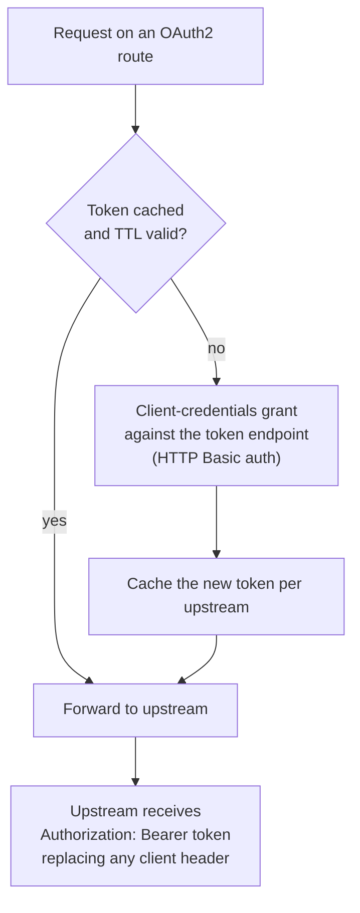

# OAuth2

The gateway can authenticate to an upstream with an
[OAuth2](https://en.wikipedia.org/wiki/OAuth) (an authorization
framework) access token it obtains itself. Using the
client-credentials grant, the gateway acts as a machine client toward
the identity provider's token endpoint and forwards the resulting
token to the upstream as `Authorization: Bearer <token>`, replacing
any client-supplied `Authorization` header.

This is a service-to-service pattern: the gateway is the OAuth2
client, and callers behind the gateway never see or supply the token.
Tokens are cached per upstream and refreshed lazily, so steady-state
traffic costs one token-endpoint call per cache window rather than
one per request.

## When to use this

Use OAuth2 client-credentials when an upstream requires a
[Bearer token](https://www.rfc-editor.org/rfc/rfc6750) (a token
presented in the Authorization header) that the gateway must obtain
itself -- the upstream speaks OAuth2 and the gateway is the client.
If the upstream instead authenticates the gateway's TLS connection
with a client certificate, see [mTLS](./mtls). For authenticating
users at the gateway, see [OIDC](./oidc) and the
[method reference](./authentication-methods).

## Configuration

Add an `oauth2_client_credentials` block to an upstream:

```yaml
upstreams:
  - name: api
    endpoints:
      - address: 10.0.0.5
        port: 8443
    oauth2_client_credentials:
      token_endpoint: https://idp.example.com/oauth2/token
      client_id: dwara-gateway
      client_secret: ${IDP_CLIENT_SECRET}
      scopes: ["read", "write"]
      token_cache_ttl_s: 300
```

| Field | Default | Description |
|---|---|---|
| `token_endpoint` | required | URL of the token endpoint the gateway POSTs the client-credentials grant to. |
| `client_id` | required | OAuth2 client ID the gateway authenticates as. |
| `client_secret` | required | Client secret, inline or a `${...}` reference (see [Secrets](./secrets)). |
| `scopes` | none | Scopes requested in the grant, e.g. `["read", "write"]`. |
| `token_cache_ttl_s` | unset | Cap on the cached-token TTL; when unset, the TTL derives from the response's `expires_in` (see [Token caching and refresh](#token-caching-and-refresh)). |

The client authenticates to the token endpoint with HTTP Basic auth
(`client_id:client_secret`, [RFC 6749](https://www.rfc-editor.org/rfc/rfc6749)
section 2.3.1).

## How it works



1. The gateway obtains an access token from the token endpoint using
   the client-credentials grant ([RFC 6749](https://www.rfc-editor.org/rfc/rfc6749)
   [section 4.4](https://www.rfc-editor.org/rfc/rfc6749#section-4.4) (a
   grant where a machine client gets a token using its own
   credentials, no user)), authenticating with HTTP Basic auth.
2. The token is forwarded to the upstream as
   `Authorization: Bearer <token>`, replacing any client-supplied
   `Authorization` header.
3. The token is cached per upstream and reused until its cache TTL
   expires; only the first request after expiry pays the
   token-endpoint round trip.

## Token caching and refresh

Tokens are cached per upstream and refreshed lazily -- on the first
request after expiry, with no background refresh task. The cache TTL
is `min(expires_in - 60s, token_cache_ttl_s)` (or just
`expires_in - 60s` when no override is set), clamped to at least 1
second. The 60-second skew avoids using a token that expires while an
in-flight request is still streaming. The cache survives config
reloads.

Concurrent requests that need a token coalesce into one
token-endpoint POST (a per-upstream fetch lock), so a burst of
traffic does not drive a fetch-storm.

## mTLS to the token endpoint

If the token endpoint requires a client certificate ([RFC 8705](https://www.rfc-editor.org/rfc/rfc8705)
(OAuth 2.0 mTLS) `tls_client_auth`), add an `mtls` block:

```yaml
oauth2_client_credentials:
  token_endpoint: https://idp.example.com/oauth2/token
  client_id: dwara-gateway
  client_secret: ${IDP_CLIENT_SECRET}
  mtls:
    client_cert: /certs/gateway-client.crt.pem
    client_key: /certs/gateway-client.key.pem
```

| Field | Default | Description |
|---|---|---|
| `mtls.client_cert` | required | Path to the client certificate file presented to the token endpoint. |
| `mtls.client_key` | required | Path to the private key file for that certificate. |

The cert and key files are loaded at startup; a broken bundle
disables that upstream's OAuth2 (the upstream still proxies, just
without the Bearer token).

This block configures the gateway's client certificate toward the
token endpoint only. To present a client certificate on the upstream
TLS handshake itself, see [mTLS](./mtls).

## Failure behavior

A token-endpoint failure (network error, non-2xx response, malformed
body) returns 502 `oauth2_token_unavailable` to the client. The
gateway never forwards without a token. The error response does not
leak the token endpoint's body or headers.

## Security notes

- The `client_secret` is resolved at config-compile time (inline or a
  `${...}` reference) and never logged, never appears in `Debug`
  output, and never appears in error text. See
  [Secrets](./secrets).
- The token cache is per-instance (M2 is a single-process deployment).
  A multi-instance fleet would re-fetch tokens per instance; a shared
  token cache is the enterprise/Redis seam, not this feature.

## Runnable demo

Run this feature against a live gateway: [`demos/04-security-auth/`](https://github.com/shristilabs/dwara/tree/main/demos/04-security-auth) (test
script: `test-19-oauth2-client-credentials.sh`) in the repository.
The category README covers prerequisites and teardown.

## Where to go next

- [mTLS](./mtls) - client-certificate authentication at the gateway,
  and presenting a client certificate to upstreams.
- [OIDC](./oidc) - user-facing authentication via Bearer
  introspection or browser login.
- [Authentication methods](./authentication-methods) - how OAuth2
  upstream authn differs from consumer authn.
- [Secrets and references](./secrets) - the `${...}` form that keeps
  the `client_secret` out of config files.
