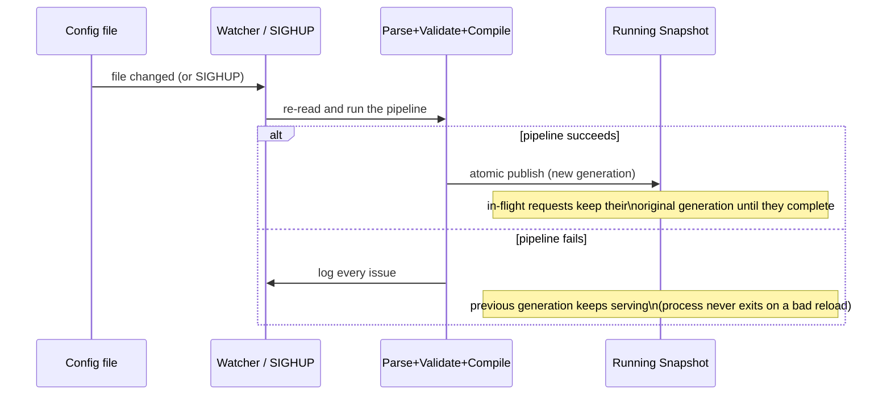

# Operations

## Reload

The config file's directory is watched (so atomic write-temp-then-rename
replacement is observed, and events are debounced), and `SIGHUP` also
triggers a reload:

A file-watch reload of **unchanged** content is a no-op — the
generation only advances when content actually changes. `SIGHUP` always
force-republishes, even if the file content is identical. If the file
watcher fails to start, `SIGHUP` reload still works.

The route table and upstream connection pools hot-swap together in one
atomic publish, so a new route table is never paired with stale pools.
The listener bind set (addresses/ports) is fixed at startup — adding,
removing, or moving listeners requires a restart; only route/policy
content and certificate material reload live.

## Certificate hot-reload

TLS certificate/key files on terminate listeners are watched the same
way as the config file. A change rebuilds the TLS configuration and
swaps it in without dropping connections: new handshakes use the new
material, and handshakes/sessions already in flight keep what they
negotiated. A failed reload (e.g. an unreadable PEM) is logged and the
previous certificates keep serving.

## Health endpoints

dwara reserves `/healthz`, `/readyz`, and `/metrics` on every terminate
and cleartext listener, served **before** route resolution:

| Path | Meaning |
| --- | --- |
| `/healthz` | 200 whenever the process is up (liveness) |
| `/readyz` | 200 once a config generation has published successfully, 503 before that (readiness) |
| `/metrics` | Prometheus text format, see [Observability](./observability) |

These paths are not routable: a configured route matching one of them
is permanently shadowed by the reserved handler. TLS-passthrough
listeners never serve them (they don't speak HTTP).

## Shutdown

`SIGTERM`/`SIGINT` stop accepting new connections, drain live
connections (including ones still in the kernel accept backlog) within
`DWARA_SHUTDOWN_TIMEOUT_SECS` (default 10), then exit 0. Anything still
draining past the budget is force-closed. TLS-passthrough splices are
not drained on shutdown — they run until the process exits.

## Accept-loop supervision

Every serving surface (each data-plane listener and the admin listener)
runs its accept loop under a panic supervisor: a panicked incarnation
is respawned on the same bound socket (no re-bind, no port loss) up to
8 times per surface for the process lifetime, logging a warning each
time. Once that budget is spent, the surface is given up on with an
ERROR log and stays down — loudly — while the process and every other
surface keep serving.

## Protocol hardening

Every serving surface applies one hardening posture: parser and
amplification bounds, plus a request-body inactivity timeout. These are
environment variables, read once at startup (an invalid value falls
back to its default) and applied process-wide — hardening is a property
of the parser, not of a route.

| Env var | Default | Bounds against |
| --- | --- | --- |
| `DWARA_HTTP1_MAX_HEADERS` | 100 | header-count bombs |
| `DWARA_HTTP1_MAX_BUF_KIB` | 64 | oversized header/line bombs |
| `DWARA_HTTP1_HEADER_TIMEOUT_MS` | 10000 | slowloris (headers trickling in) |
| `DWARA_H2_MAX_CONCURRENT_STREAMS` | 128 | HTTP/2 stream floods |
| `DWARA_H2_STREAM_WINDOW_KIB` | 1024 | per-stream h2 receive buffering |
| `DWARA_H2_CONNECTION_WINDOW_KIB` | 4096 | connection-wide h2 receive buffering |
| `DWARA_H2_MAX_SEND_BUF_KIB` | 1024 | outbound h2 send buffer / write amplification |
| `DWARA_REQUEST_BODY_TIMEOUT_MS` | 30000 (`0` disables) | slow-body attacks (inactivity gap between body frames, not total upload time) |

A request head carrying **both** `Content-Length` and
`Transfer-Encoding` is rejected with a bare `400` before parsing and the
connection is closed — the classic CL+TE smuggling vector. This only
needs to inspect the first request head on a connection: every
forwarded request is rebuilt from parsed parts, so framing cannot
desync through the gateway on later keep-alive requests.

## Environment variables reference

See the full [environment variables reference](../reference/environment-variables).
