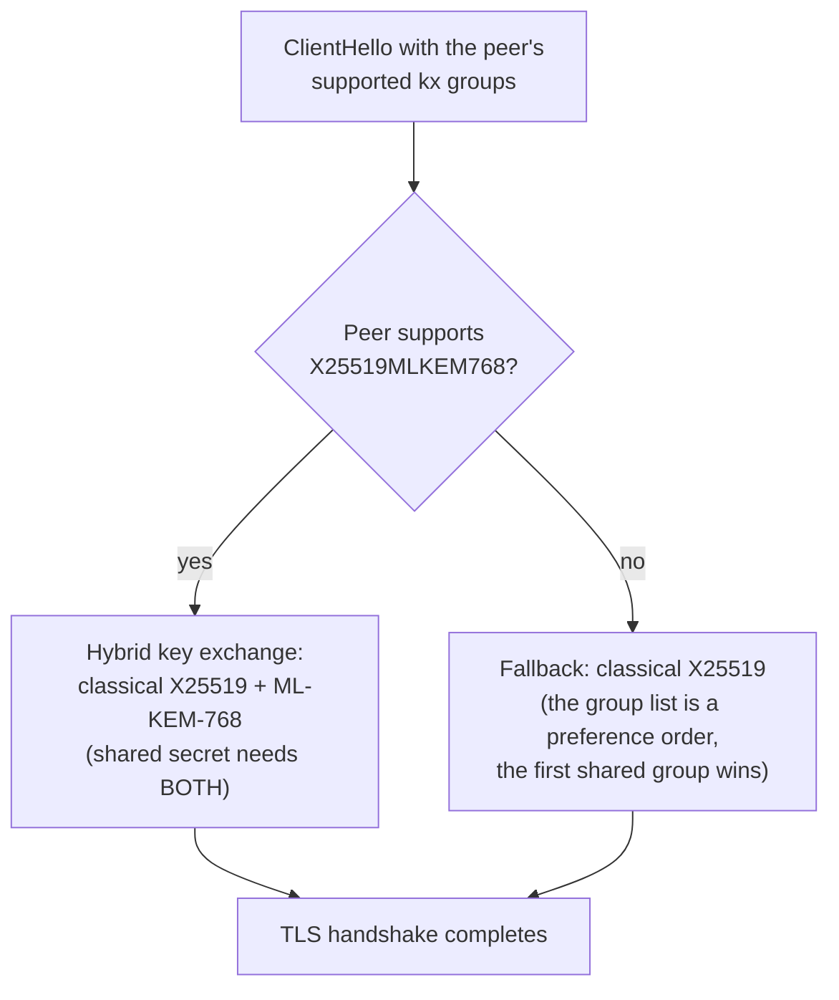

# Post-quantum TLS

Dwara can negotiate a [hybrid post-quantum key exchange](https://en.wikipedia.org/wiki/Post-quantum_cryptography)
on its TLS connections, combining the classical [X25519](https://en.wikipedia.org/wiki/Curve25519)
ECDH curve with [ML-KEM](https://en.wikipedia.org/wiki/Module-Lattice-based_Key_Encapsulation_Mechanism)
(formerly Kyber, the NIST FIPS 203 lattice-based key-encapsulation mechanism).
The hybrid shares are combined so that the connection is secure as long as
EITHER the classical assumption OR the lattice assumption holds -- a future
quantum adversary that breaks ECDH still cannot recover the session key
unless ML-KEM is also broken, and a flaw in the new lattice scheme does not
weaken today's classical security.

## When to use this

Enable post-quantum TLS when you need to protect long-lived traffic against
harvest-now-decrypt-later attacks -- an adversary recording ciphertext today
to decrypt it once a cryptographically relevant quantum computer exists.
This matters for data with a confidentiality horizon of a decade or more
(government, healthcare, long-lived secrets in transit). For short-lived
or low-sensitivity traffic the classical handshake is sufficient and the
hybrid adds handshake bytes and CPU cost for no practical benefit.

## Enabling

Post-quantum key exchange is available in every build (the rustls 0.23
crate exposes the `X25519MLKEM768` hybrid kx group via the aws-lc-rs
provider). No special cargo feature is required.

```sh
cargo build -p dwara-bin
```

The hybrid kx group is prepended to the provider's kx group list only
when `pq: true` is set on a listener or upstream. Builds without any
`pq: true` config use the classical kx group list (no handshake
overhead).

## Configuration

Enable the hybrid exchange per upstream and per listener:

```yaml
listeners:
  - name: ingress
    address: 0.0.0.0
    port: 8443
    tls:
      cert_file: /etc/dwara/ingress.crt
      key_file: /etc/dwara/ingress.key
      pq: true

upstreams:
  - name: sensitive-api
    endpoints:
      - address: 10.0.0.5
        port: 8443
    protocol: https
    pq: true
    trusted_ca_file: /etc/dwara/upstream-ca.pem
```

When `pq: true`, the gateway builds the TLS config with a provider that
has the `X25519MLKEM768` hybrid kx group prepended to the kx group list.
The classical X25519 group remains as a fallback, so a peer that does
not support the hybrid group still completes a classical handshake. This
makes the flag safe to enable ahead of peer support.

## Security considerations

- The hybrid is NOT a substitute for classical TLS hygiene. Certificate
  validation, SNI, and the trust store behave exactly as in a classical
  handshake; `pq` only changes the key-exchange group.
- ML-KEM is a key-encapsulation mechanism, not a signature scheme. The
  certificate signature remains classical (RSA/ECDSA/Ed25519) until
  post-quantum signatures are standardized and deployed widely. A quantum
  adversary could still forge certificates in a recorded handshake -- the
  hybrid protects the session key, not the authentication.
- The hybrid group adds roughly 1 KB to the ClientHello and a comparable
  amount to the ServerHello. This is negligible on modern links but
  visible on constrained or high-latency paths.
- The `pq` flag is available per-listener and per-upstream. Inbound
  (listener-side) post-quantum termination builds the server config with
  the PQ-capable provider; outbound (upstream-side) builds the client
  config with the same provider.
- ML-KEM is NOT on the FIPS-validated list for aws-lc-rs. Combining PQ
  hybrid key exchange with FIPS mode is rejected at config validation:
  a listener or upstream with `pq: true` while FIPS mode is active fails
  validation naming the field.

## How it works



The `pq_provider()` function in `security/pq.rs` builds a
`rustls::crypto::CryptoProvider` from the aws-lc-rs default provider
with the `X25519MLKEM768` hybrid kx group prepended to the kx group
list. The server and client config builders use this provider when
`pq: true` is set, passing it to `ServerConfig::builder_with_provider`
or `ClientConfig::builder_with_provider`. The classical X25519 group
remains in the list as a fallback, so a peer that does not support the
hybrid group still completes a classical handshake (rustls's kx group
list is a preference order: the first group the peer supports wins).

## Experimental status

::: warning Experimental
The `pq` feature is experimental. The ML-KEM implementation tracks the
finalized FIPS 203 standard, but the hybrid group identifier and
negotiation behavior are subject to change as the IETF
`tls-hybrid-design` draft matures. Do not rely on this for a compliance
attestation yet. The feature may be revised or removed in a future
release without a deprecation cycle. Enable it for evaluation and
harvest-now-decrypt-later hardening, not as a substitute for a validated
post-quantum TLS product.
:::

## Runnable demo

Run this feature against a live gateway: [`demos/10-tls-transport/`](https://github.com/shristilabs/dwara/tree/main/demos/10-tls-transport) (test
script: `test-09-pq-tls.sh`) in the repository.
The demo documents the current limitations alongside what
runs today; see its README.
