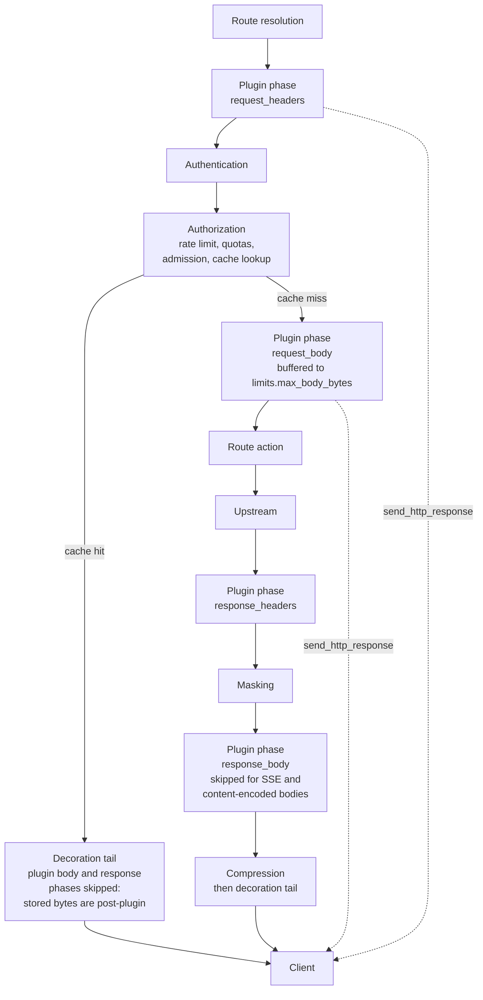

# Proxy-Wasm plugins

Dwara supports [Proxy-Wasm](https://proxy-wasm.spec.vec.io/) plugins
-- WebAssembly modules that run inside the gateway and intercept
requests and responses at defined phases. This is the primary
extension mechanism for custom logic that the built-in config cannot
express.

Plugins run in a sandboxed WebAssembly runtime (wasmtime) with
configurable resource limits (fuel, memory), fail closed when they
cannot run, and load in every build -- there is no feature flag to
enable. This page is the configuration and operations reference.
Full signatures: [Hostcall API reference](./proxy-wasm-hostcalls).
Building guide: [Plugin SDK](./plugin-sdk).

## When to use this

Use proxy-wasm plugins when you need:

- Custom request/response header manipulation logic.
- Request body inspection or transformation.
- Custom authentication or authorization checks (via short-circuit
  responses).
- Route-level logic the declarative config cannot express.

Plugins run per route: attach them where they apply, and routes
without plugins take an unchanged fast path (zero buffering, zero
sandbox cost).

## Configuration

Define plugins at the top level and reference them from routes:

```yaml
plugins:
  - name: rate-limiter
    wasm: ./plugins/rate-limiter.wasm
    phases:
      - request_headers
    limits:
      fuel: 1000000
      memory_mb: 32
      timeout_ms: 100
    config: |
      { "limit": 100, "window": "1m" }

routes:
  - name: api
    service: api-service
    match:
      path: { type: prefix, value: /api }
    action: { type: proxy }
    plugins:
      - rate-limiter
```

### Plugin fields

| Field | Default | Description |
|---|---|---|
| `name` | (required) | Plugin name (referenced by routes). Must be unique. |
| `wasm` | (required for WASM plugins) | Path to the `.wasm` module, resolved relative to the gateway process's working directory. Exactly one of `wasm`/`native`. |
| `native` | (required for native plugins) | Registered native filter name. See [Native plugin filters](./native-plugins). |
| `phases` | (required) | Phases the plugin hooks. Must be non-empty. |
| `limits` | see below | Resource limits for the plugin. |
| `config` | (none) | Plugin-specific config (delivered as bytes to the module's `on_configure`). |

Validation rejects a plugin with both or neither of `wasm`/`native`,
an empty `phases` list, a route referencing an undefined plugin name,
and a route naming the same plugin twice.

### Phase contract

Plugins hook the request lifecycle at defined phases:



A short-circuit (`send_http_response`) answers the client directly —
the upstream is never dialed. Routes without plugins skip every phase
node: the chain is not built at all (allocation-free fast path). See
[Architecture: request pipeline](../architecture/request-pipeline)
for the full pipeline these hook points sit in.

| Phase | Runs | Notes |
|---|---|---|
| `request_headers` | after route resolution, before authn | Authn sees plugin-modified headers. The map carries `:method` and `:path` (path including the query string). Writes to `:path`/`:method`/`:authority` are applied to the forwarded request -- see [Pseudo-header writes](#pseudo-header-writes). |
| `request_body` | after authn/authz/rate-limit, before the route action | The body is buffered up to the route's `limits.max_body_bytes` (default 1 MiB); an over-cap body answers 500 `plugin_body_too_large`. Request validation then sees the post-plugin bytes. |
| `response_headers` | after the response arrives (any action), before masking | The map carries `:status`; writes to it are ignored (the status is pipeline-owned -- see [Pseudo-header writes](#pseudo-header-writes)). |
| `response_body` | after masking, before compression | Skipped, and logged, for streaming bodies (`text/event-stream`, no content length) and content-encoded bodies -- buffering those would stall the route or feed the plugin opaque bytes. |

Header phases always run for a route's plugins; body phases only when
a plugin declares them, and only the side (request/response) that is
declared. Only headers a plugin actually changed are written back --
untouched headers keep their original bytes, including non-UTF-8
values.

### Pseudo-header writes

At `request_headers`, a plugin that changes `:path`, `:method`, or
`:authority` rewrites the forwarded request:

- `:path` is the final upstream target -- origin-form (`/...`), the
  whole target including any query string (a written path without a
  query forwards without one). It composes with the route's own
  `rewrite`: the route rewrite applies first, the plugin's `:path` is
  the final say, and routes are never re-matched. Only the upstream
  sees the rewritten target; route matching, authentication, the
  response cache key, and the access log all evaluated the original
  target and keep it.
- `:method` must be a valid method token; it replaces the forwarded
  method.
- `:authority` overrides the forwarded `Host` header only -- the
  endpoint the gateway dials stays the load balancer's pick (HTTP/1
  upstreams; HTTP/2 and HTTP/3 upstreams derive `:authority` from the
  dialed endpoint).

Only changed values apply: writing back the value the map carried has
zero effect, and removing a pseudo-header is ignored. An invalid value
(empty, non-`/`-prefixed, or unparseable `:path`; a non-token
`:method`; an unparseable `:authority`) fails closed -- 500
`plugin_failed` (metric reason `invalid_rewrite`) and the upstream is
never dialed.

On the response side, `:status` writes are ignored: by the time
`response_headers` runs the status is bound to the response's framing
(204/304/101 carry no body, and `Content-Length` already matches the
upstream bytes). A plugin that wants to decide the answer uses
`send_http_response` at a request phase.

### Resource limits

| Field | Default | Description |
|---|---|---|
| `fuel` | `1000000` | Wasmtime fuel (the effective CPU bound). Exhaustion traps and the route answers 500 `plugin_failed`. |
| `memory_mb` | `32` | Maximum linear memory. Growth beyond the cap traps (500 `plugin_failed`). |
| `timeout_ms` | `100` | An epoch deadline is armed, but no epoch ticker runs by default -- the deadline does not fire on its own. Size `fuel` as the real bound; see [Plugin SDK: limits](./plugin-sdk#resource-limits-and-failure-semantics). |

### Plugin return actions

A phase callback returns one of:

- **Continue** (`0`): proceed to the next phase or plugin.
- **End stream** (`2`): stop calling further callbacks. Returning it
  after `proxy_send_local_response` is the standard short-circuit.
- **Pause** (`1`): the plugin dispatched HTTP callout(s) with
  `proxy_http_call` and awaits the response callback. The gateway
  performs the exchange, delivers `proxy_on_http_call_response`, and
  the phase resumes from the plugin's post-callback state (later
  plugins in the phase then run). A plugin that dispatches a callout
  pauses even if it returns Continue — the phase's outcome cannot be
  known until the callback ran. See
 [Plugin SDK: HTTP callouts](./plugin-sdk#http-callouts-proxy_http_call).

## Short-circuiting

A plugin that calls `send_http_response` decides the request locally:
the gateway returns the plugin's status, headers, and body verbatim
and **never dials the upstream**. The access log entry for such a
request carries the `plugin_short_circuit` flag.

## Failure semantics

Everything fails closed, on the referencing route only -- a plugin
that cannot run never turns into a silently skipped plugin:

| Condition | Client sees | Metric reason |
|---|---|---|
| Plugin crashed (unreadable/uncompilable `.wasm` marked at publish), disabled, or failed per-request instantiation | 500 `plugin_unavailable` | `crashed`, `disabled`, `instantiate_failed` |
| WASM trap (fuel exhaustion, memory cap, panic) | 500 `plugin_failed` | `trap` |
| Plugin writes an invalid `:path`/`:method`/`:authority` at `request_headers` | 500 `plugin_failed` | `invalid_rewrite` |
| Plugin callout cannot complete (timeout, refused connection, over-cap response, SSRF rejection) | 500 `plugin_failed` | `callout_failed` |
| Plugin exceeds 8 callout rounds in one phase (runaway dispatch loop) | 500 `plugin_failed` | `callout_loop` |
| Body over the buffering cap for a body phase | 500 `plugin_body_too_large` | `body_too_large` |
| Response stream died mid-body before the phase could run | 500 `plugin_failed` | `response_stream_ended` |

Every failure increments `dwara_plugin_failures_total{name,reason}`
and logs one server-side event naming the plugin. Routes that do not
reference the failing plugin are unaffected, and the plugin-less fast
path is byte-identical to a no-plugin gateway. Callout outcomes are
additionally counted per exchange in
`dwara_plugin_callouts_total{name,outcome}` (`ok`, `timeout`,
`error`, `loop_guard`) — a non-2xx callout response is an `ok`
outcome, because only the plugin knows what its decision service's
403 means.

The response cache participates: a plugin definition change (config
bytes or `.wasm` checksum) bumps the cache epoch of every route
referencing the plugin, so cached pre-old-plugin bytes are never
replayed against a new plugin.

## Interaction caveats

- **HMAC-signed routes**: a `request_body` plugin that rewrites the
  body breaks the signature (the digest binds the original bytes) --
  the route answers 401 `signature_body_mismatch`. Do not combine
  body-rewriting plugins with HMAC request signing.
- **Streaming responses**: a `response_body` plugin never sees SSE or
  content-encoded bodies (see the phase table). Design for the skip.
- **Response caching**: the cache key uses the ORIGINAL request path.
  A plugin whose `:path` rewrite varies with request headers (per-user
  migration) must not be combined with the route's response caching
  unless the cache's vary configuration covers those headers --
  otherwise two users of the same original path can share a cached
  entry.

## Creating a plugin

Scaffold, build, and iterate with the
[Plugin SDK](./plugin-sdk) (`dwara-cli plugin new`); the compatibility
contract between gateway and plugin builds is documented in
[Plugin compatibility](./plugin-compat).

## Runnable demo

Run the verified round-trip end to end:
[`demos/08-extensibility/`](https://github.com/shristilabs/dwara/tree/main/demos/08-extensibility)
(test script: `test-02-proxy-wasm.sh`). The script scaffolds a plugin,
builds it for `wasm32-wasip1`, loads it into a default-build gateway,
asserts the header effect with curl, and verifies the fail-closed and
blast-radius behavior live. The README covers prerequisites and
teardown.
