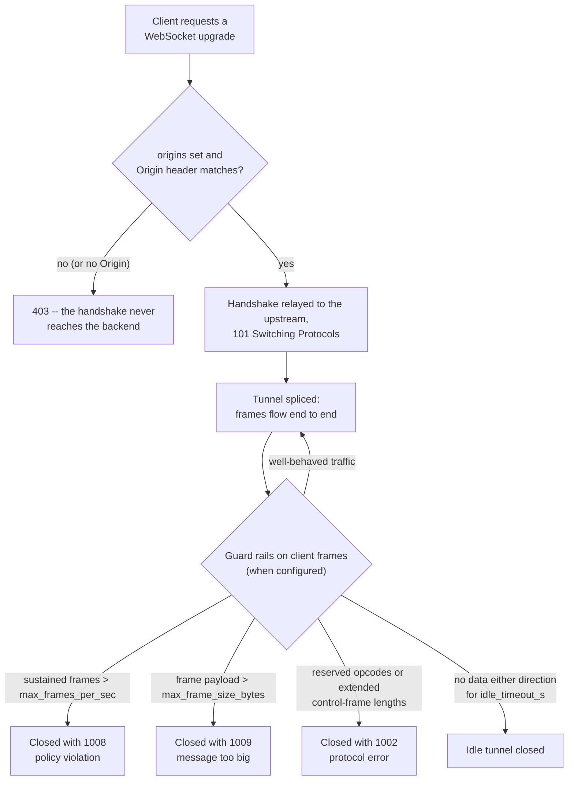

# WebSockets

Dwara tunnels [WebSocket](https://developer.mozilla.org/en-US/docs/Web/API/WebSocket)
traffic on the same listeners as everything else -- no special mode,
no separate port. A WebSocket app points at the gateway as it would
any upstream: by default an upgrade is transparent, with the gateway
relaying the handshake and splicing the connection into a managed
tunnel.

The one WebSocket-specific surface is an optional `websocket` block
on the route with independent controls: an origin allowlist that
restricts which sites may open connections, a frame-rate cap (a
frame is a WebSocket message unit) that protects a backend from a
flooding client, an idle timeout that reaps dormant tunnels, and a
per-frame size limit that guards against oversized messages.

Native gRPC over HTTP/2 is proxied on the same listeners too -- see
[gRPC proxying](./grpc).

## When to use this

Point a WebSocket app at the gateway when it should be reached
through the same listeners and routes as the rest of the API -- no
special config is needed for tunneling itself. Add the `websocket`
block when you need to restrict which sites may open connections
(origin allowlist), protect a backend from a flooding client
(frame-rate cap), reap idle connections (idle timeout), or reject
oversized messages (frame size limit).

## Configuration

All settings live on the route's `websocket` block. They are
independent -- any subset can be set:

```yaml
routes:
  - name: chat
    service: chat-svc
    match:
      path: { type: prefix, value: /chat }
    websocket:
      origins:
        - https://app.example.com
      max_frames_per_sec: 100
      idle_timeout_s: 300
      max_frame_size_bytes: 1048576
    action: { type: proxy }
```

| Field | Default | Description |
|---|---|---|
| `websocket.origins` | `[]` (every origin) | Exact-match allowlist of origins that may open a connection. Omit the block or leave the list empty to allow every origin. |
| `websocket.max_frames_per_sec` | unset (no cap) | Cap on sustained data frames (text/binary/continuation) per second from the client, with a one-second burst of the same size. Applies client-to-upstream only. |
| `websocket.idle_timeout_s` | unset (no timeout) | If no data flows in either direction for this many seconds, the tunnel is closed. Range: 1..=86400 (1 second to 24 hours). |
| `websocket.max_frame_size_bytes` | unset (no limit) | Maximum payload size of a single data frame. A frame exceeding this is closed with code 1009 (message too big). Range: 1..=16777216 (1 byte to 16 MiB). |

## Origin matching

A non-empty `origins` list admits **only** exact matches -- scheme
and host must match exactly, and `https://` and `http://` are
different origins. A handshake with no `Origin` header is
**rejected**: browsers always send one, so a missing origin means a
non-browser client you did not name. Denied handshakes get `403` and
never reach the backend.

## How it works



1. A client requests a WebSocket
   [upgrade](https://developer.mozilla.org/en-US/docs/Web/HTTP/Status/101)
   (Switching Protocols -- the handshake response that upgrades to
   WebSocket). The gateway relays the handshake and, once it
   succeeds, splices the two connections; traffic then flows through
   the tunnel.
2. If `origins` is non-empty, the handshake's `Origin` header must
   match an entry exactly. A denied handshake gets `403` and never
   reaches the backend.
3. If `max_frames_per_sec` is set, the gateway counts sustained data
   frames (text/binary/continuation) per second from the client on
   the upgraded connection, with a one-second burst of the same size.
4. A client past its allowance is closed with close code `1008`
   (policy violation) and disconnected; well-behaved clients that
   stay under the rate never notice. The cap applies
   client-to-upstream only.
5. If `idle_timeout_s` is set, the tunnel is closed when no data flows
   in either direction for the configured duration. Each read or
   write resets the idle timer.
6. If `max_frame_size_bytes` is set, a data frame whose payload exceeds
   the limit is closed with close code `1009` (message too big).
7. The frame scanner also enforces RFC 6455 protocol rules: reserved
   opcodes (0x3-0x7, 0xB-0xF) and control frames with extended
   lengths are closed with close code `1002` (protocol error).

## Observability

WebSocket policy decisions are observable in
[`/metrics`](./observability) as
`dwara_websocket_policy_total{route,outcome}` with outcomes
`origin_denied` (handshake gate), `rate_closed` (frame-rate policer),
`size_closed` (frame-size policer), and `protocol_closed` (reserved
opcode or malformed control frame).

For request-level limits on HTTP traffic, see
[Rate limiting](./rate-limiting).

## Runnable demo

A WebSocket echo upstream is proxied in [`demos/05-request-response/`](https://github.com/shristilabs/dwara/tree/main/demos/05-request-response)
(test script: `test-09-websocket.sh`) in the repository, behind a
route with an origin check and a frame-rate cap. The script verifies
the `/ws` route is reachable (a plain GET draws a 400/426, not a
404); a manual `websocat ws://localhost:8080/ws` session exercises
the echo. The category README covers prerequisites and teardown.
