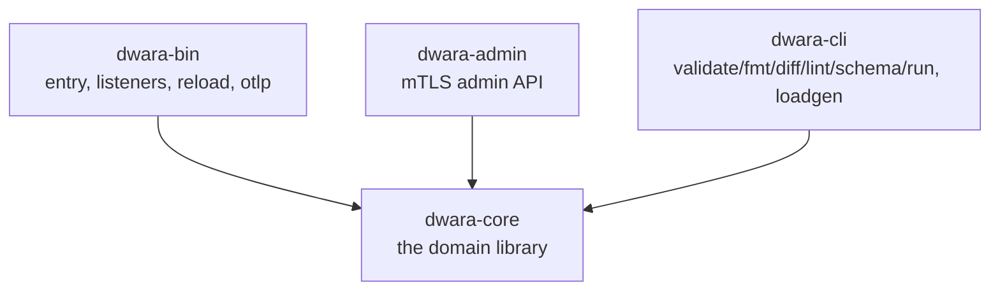
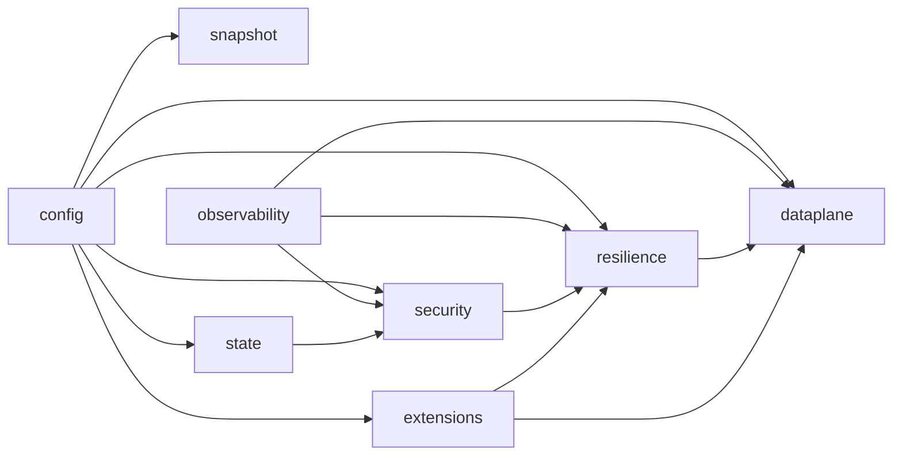
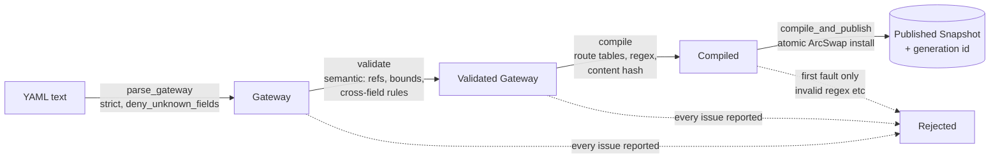

# Architecture

## Crates

`dwara-core` is the only crate with real domain logic. `dwara-bin`,
`dwara-admin`, and `dwara-cli` are presentation layers: they wire up I/O
(sockets, signals, CLI args) around `dwara-core`'s facade API and
contain no domain logic of their own. See
[`AGENTS.md`](../AGENTS.md#layout) for what each crate's `src/` files
do.

## Bounded contexts inside dwara-core

`dwara-core/src/` is organized as domain directories behind a facade
`lib.rs`, with a strict, CI-enforced dependency direction:

Read the arrows as "is depended on by" — `config` is the foundation
every other domain imports; `observability` depends on nothing (it
only exposes plain setters); `dataplane` is the top of the stack and
may import anything below it. `scripts/check_deps.py`, wired into CI,
fails the build on any import that runs the wrong way. See
[`AGENTS.md`](../AGENTS.md#code-organization) for the promotion path
(when a domain outgrows being a directory and becomes its own crate)
and the residual-test rules.

Why this shape: it's a deliberate hedge against the two failure modes
of "just put everything in one big `proxy.rs`" — (1) circular
dependencies between features that should be independently
comprehensible (a JWT bug should never require understanding the load
balancer), and (2) an inability to extract a domain into its own crate
later without a rewrite (the domain-promotion path is designed to be a
`git mv`, because the seams already exist).

## The config lifecycle

Every config — at startup, on a file-watch/`SIGHUP` reload, or via
`PATCH /config` on the admin API — goes through the same pipeline,
implemented in `snapshot/mod.rs`:

The pipeline is deliberately split into a **pure half** (`validate`,
`compile` — no side effects, testable without a running gateway) and an
**effectful half** (`compile_and_publish` — the only step that touches
the live `ArcSwap`). Rollback semantics are "atomic not-publish": on
any failure, the swap simply never happens, so the currently-published
snapshot is untouched. This is why a malformed config can never leave
the gateway serving a half-updated state — there is no partial-publish
code path to have a bug in.

Route matching is compiled into three structures, checked in a fixed
order regardless of declaration order (see `dwara_core::snapshot`):

1. **Exact** routes mount into a `matchit` radix router (path
   parameters like `/users/{id}` are native to the router).
2. **Regex** routes compile into one shared `regex::RegexSet`; first
   declaration order wins among simultaneous matches.
3. **Prefix** routes are kept as an ordered list and matched by
   longest-prefix at lookup time — deliberately NOT modeled as a
   `matchit` catch-all, which would pull path-parameter capture into
   prefix routes and blur the semantics.

The content hash backing generation identity (and the CLI's `diff`
subcommand) is a fast non-cryptographic `SipHash-1-3` over the
normalized YAML serialization — explicitly a change-detection hash, not
a security boundary.

## Request lifecycle

See the [dataplane and proxy](./features/dataplane-proxy.md) doc for
the full per-request flow through route resolution, policy, and the
proxy itself.

## Hot reload

`Snapshot` (routes, upstream pools, TLS material, auth state) lives
behind an `ArcSwap`. A reload replaces the `Arc` atomically; every
in-flight request keeps working against the `Arc` it loaded at the
start of the request, so a reload never causes a request to observe a
torn mix of old and new state. See
[Operations](../docs-site/guide/operations.md) in the end-user docs-site for the
operator-facing mechanics (debouncing, `SIGHUP`, certificate rotation
caveats).

## Extension points

Five swappable subsystem traits live in `dwara_core::extensions`
(`RateLimiter`, `ConfigSource`, `CacheStore`, `AnalyticsSink`,
`SecretSource`), each `async` and dyn-compatible, with local in-memory /
file / env implementations shipping in-tree. See
[Extension points](./features/extension-points.md).
