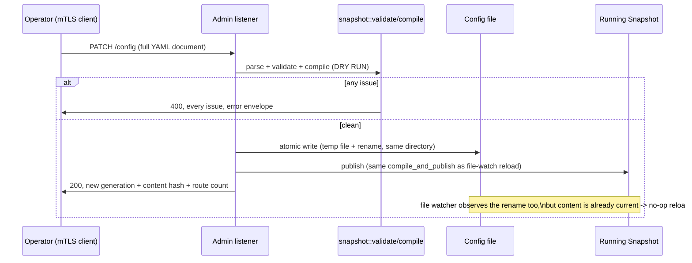

# Admin API

Source: `crates/dwara-admin/src/lib.rs` (DW-022, decision 6). Tests:
`admin_api` (dwara-admin), `admin_reload_coherence` (dwara-bin, covers
admin `PATCH /config` interacting with the file watcher's own reload
path).

The end-user-facing material (endpoints, mTLS certificate setup, the
dev fallback) is already written at
[docs-site: Admin API](../../docs-site/guide/admin-api.md) — this page
focuses on implementation: why mTLS-only, how `PATCH /config` is
actually implemented, and why the crate exists at all.

## Why a separate crate

`dwara-admin` is a presentation layer, just like `dwara-bin` and
`dwara-cli` (see [Architecture](../architecture.md#crates)) — it
consumes `dwara-core`'s facade and contains no domain logic of its
own. Splitting it out rather than adding an admin module to
`dwara-bin` follows the same extraction-seam reasoning as the
domain-promotion path in
[`AGENTS.md`](../../AGENTS.md#code-organization): the admin surface
has its own accept loop, its own TLS requirements, and (in principle)
its own release cadence, so keeping it as a separate crate from day
one means there was never a "someday we should split this out"
migration to do.

## Authentication is the TLS layer, not a token

The admin listener requires a client certificate chaining to the
configured CA; there is deliberately **no token layer** in v1 —
possession of a valid client certificate *is* the authorization
(decision 6). This is a stronger guarantee than an API-key header for
an operator surface: a token can be captured from a log line, a shell
history, or a proxy; a private key backing a client certificate
generally can't be extracted from the TLS handshake itself. The
tradeoff is operational, not technical — issuing and rotating client
certificates has more ceremony than rotating a token, which is exactly
why `DWARA_ADMIN_DEV=1` (loopback-only plaintext) exists as an escape
hatch for local development, and exactly why it must never be enabled
outside one.

**Security exposure worth internalizing as a contributor:** `GET
/config` returns the current published config as YAML, and that
document contains credential material (consumer secrets, Basic-auth
passwords, HMAC keys, JWT secrets) in **plaintext** — any client
holding a valid admin certificate can read it. The mTLS CA chain is
the entire access-control boundary for that exposure; admin client
certificates must be distributed and stored with the same care as the
secrets they can read back out.

## `PATCH /config`: dry-run then atomic write, reusing one pipeline

`PATCH /config` reuses the *exact same*
`snapshot::validate`/`compile`/`compile_and_publish` pipeline described
in [Architecture: the config lifecycle](../architecture.md#the-config-lifecycle)
— there is no admin-specific validation path to have a second bug in,
and no way for a config accepted via the admin API to differ in
meaning from one accepted via the file. The dry run happens *before*
anything touches disk: parse, validate, and compile all run against
the submitted document first, and only a clean result is written.

**Why the write is atomic (temp file + rename in the same directory,
not an in-place write):** a crash mid-write to the live file could
leave a torn document that the *next* startup or reload would fail to
parse. Temp-then-rename means the filesystem-level atomicity of
`rename(2)` guarantees the file on disk is always either the complete
old document or the complete new one — never a partial write — so a
crash immediately after `PATCH /config` returns 200 can never corrupt
the on-disk config.

**Why the response doesn't just say "success":** the response carries
the new generation id, content hash, and route count specifically so
an operator's automation can confirm *which* generation is now live
without a follow-up `GET /config` — the same generation identity used
everywhere else (metrics, `GET /health`, logs).

## Why full-document replacement, not a partial merge

`PATCH /config` requires the complete config document, not a
partial/merge patch. A silent merge of an unspecified subtree is a
classic footgun for exactly the kind of document this is: if an
operator submits a config missing, say, the `consumers` block, a
merge semantics would leave the *old* consumers in place while every
other field updates — invisible unless you already know to check. A
full-document replacement means "what you sent is what's now live,"
full stop, which is a much easier invariant for a human or a script to
reason about under pressure.

## Hardening posture, and its one asymmetry

The admin listener shares the dataplane's parser/amplification bounds
and pre-parse smuggling guard (see
[Protocol hardening](./protocol-hardening.md)) — the same
`HttpHardening` builder config is applied to its connection builder,
so there's exactly one hardening implementation to maintain, not two.

The one deliberate asymmetry: admin request bodies are **not** wrapped
in the slow-body inactivity-gap defense (`InboundBody`) that data-plane
requests get. The reasoning: the admin surface is mTLS-only (every
client already holds a CA-chained certificate — a much higher bar than
an anonymous dataplane client), and its bodies are small JSON/YAML
documents already capped mid-stream by `PATCH /config`'s
`MAX_PATCH_BODY` limit via a `Limited` body wrapper. Given both of
those, a per-connection body-stall defense would add nothing beyond
what the TLS requirement and the size cap already pin — so body-stall
protection stays a data-plane-only concern rather than being
duplicated here for no additional safety margin.

## Accept-loop supervision

The admin listener runs its own accept loop under the same
bounded panic-respawn supervisor the data-plane listeners use (see
[Operations: accept-loop supervision](../../docs-site/guide/operations.md#accept-loop-supervision))
— a panicked accept incarnation is respawned on the same socket up to
a fixed budget, after which the admin listener is given up on with a
loud ERROR log rather than silently going dark for the rest of the
process lifetime. Its bind set, like the data-plane listeners', is
fixed at startup — a change to `admin.bind` needs a restart.
