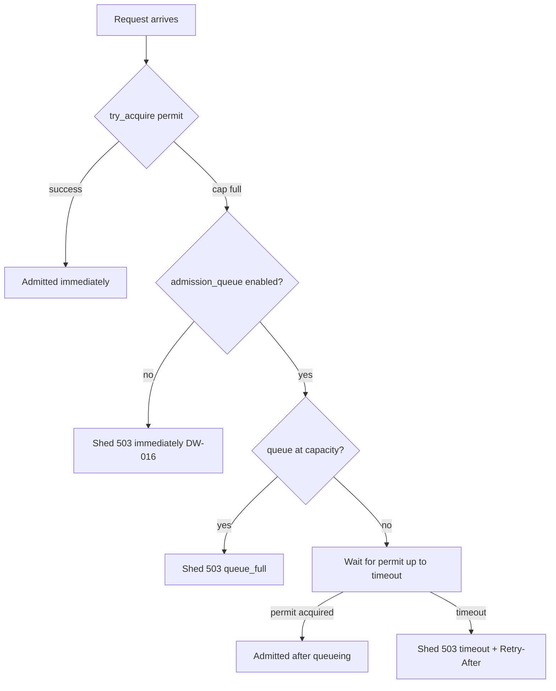

# Admission queues and backpressure

Source: `crates/dwara-core/src/dataplane/proxy.rs` (DW-053). Tests:
`admission_queue` (integration), `tests/unit/admission_queue.rs`
(config validation matrix).

## The problem: the cliff

DW-016 load shedding caps concurrent in-flight requests at
`gateway.max_concurrent_requests`. When the cap is saturated, the
next request is shed immediately with 503 "gateway saturated" — no
queueing, no waiting. Under a load spike this produces a **cliff**:
throughput is at the cap one moment, then every request over the cap
is shed the next. There is no middle ground where latency rises
gracefully before shedding begins.

## The solution: bounded admission queues

DW-053 adds an optional bounded admission queue. When the cap is full
and the queue is enabled, a request **waits** for a permit up to a
timeout instead of being immediately shed. This produces a graceful
degradation curve: as load increases past the cap, latency rises
(requests wait in the queue) before shedding begins (the queue fills
or the timeout fires).



## Configuration

```yaml
gateway:
  max_concurrent_requests: 100
  admission_queue:
    enabled: true           # default false; requires max_concurrent_requests
    max_queue_size: 200     # total queued requests; 1..=10000
    queue_timeout_ms: 50    # max wait for a permit; 1..=10000
    per_priority: true      # split capacity across priority classes (default true)
```

The queue is **opt-in** (`enabled: false` by default). It requires
`max_concurrent_requests` — validation rejects an enabled queue on an
uncapped gateway (the queue waits for a cap permit, so an uncapped
gateway has nothing to queue for). The bounds (`max_queue_size`
1..=10000, `queue_timeout_ms` 1..=10000) are enforced by validation in
`snapshot/mod.rs::validate`.

## How it works

The admission queue is not a separate data structure — it is a **timed
semaphore acquire**. When the immediate `try_acquire` on the cap
semaphore fails and the queue is enabled:

1. The request checks the queue depth (an `AtomicU32` on the
   `GlobalCap`). If the queue is at capacity, the request is shed
   immediately with 503 (the `queue_full` outcome).
2. Otherwise, the request increments the queue depth and calls
   `tokio::time::timeout(queue_timeout, semaphore.acquire_owned())`.
   The request parks on the semaphore's wait queue until a permit is
   released or the timeout fires.
3. If a permit is acquired within the timeout, the request is admitted
   (the `admitted` outcome). The queue depth is decremented.
4. If the timeout expires, the request is shed with 503 (the `timeout`
   outcome) and a `Retry-After` header (a small fixed value derived
   from `queue_timeout_ms`, in whole seconds, minimum 1).

The queue depth atomic lives on the `GlobalCap` (rebuilt per
generation), not on the dataplane — a reload that changes the queue
config simply swaps in a new state. In-flight waiters on the old
semaphore complete normally (the `Arc<Semaphore>` stays alive until
the last holder drops).

## Per-priority splitting

When `per_priority: true` (the default), the queue capacity is split:
half is reserved for high-priority requests (>= [`HIGH_PRIORITY`], i.e.
priority 8-10), and the other half is available to low-priority
requests. High-priority requests may queue up to `max_queue_size`;
low-priority requests may queue up to `max_queue_size / 2`. This
prevents a flood of low-priority requests from filling the queue and
starving high-priority traffic.

When `per_priority: false`, the queue is a single shared pool
(first-come-first-served) with no priority reservation.

The split composes with the DW-016 reserved bucket: high-priority
requests still try the reserved bucket first (immediate `try_acquire`),
then the general semaphore (timed acquire through the queue), then the
reserved semaphore (timed acquire through the queue).

## Dry-run interaction

`load_shed_dry_run: true` + `admission_queue.enabled: true` compose:
when a request would be shed (timeout or queue full), the dry-run flag
admits it over the cap instead — the same "observe what enforcement
would do" trade as DW-041. The queue timeout still fires (the request
waits up to `queue_timeout_ms`), but the would-shed is logged and
counted in `dwara_policy_dry_run_total{phase="load_shed"}` and the
request continues. No 503 is sent while dry-run is on.

## Metrics

Two new metric families (see [Observability](./observability.md)):

- `dwara_admission_queued_total{outcome}` — counter: outcomes are
  `admitted` (got permit after queueing), `timeout` (shed due to
  timeout), `queue_full` (shed because queue was at capacity).
- `dwara_admission_queue_depth` — gauge: current number of requests
  waiting in the queue.

The `shed_total{priority}` counter from DW-016 still counts every shed
(including queue-timeout and queue-full sheds). The new
`dwara_admission_queued_total` counter distinguishes the queue-specific
outcomes so an operator can see the degradation curve: rising
`admitted` means the queue is absorbing load; rising `timeout` means
the queue is saturating; rising `queue_full` means the queue itself is
overflowing.

## What does NOT change

- The request-path order is unchanged: admission queueing happens at
  the "gateway cap admission" step, same position as DW-016 load
  shedding (after rate limiting, before the breaker/endpoint pick).
- The reserved paths (`/healthz`, `/readyz`, `/metrics`) still bypass
  the cap and the queue.
- 404s still resolve before admission and never consume cap slots or
  queue slots.
- The permit lifetime is unchanged: a permit lives until the response
  body completes (the proxy path attaches it to the streaming body).
- The 503 response body is the same JSON envelope
  (`{error:{code:"gateway_saturated",...}}`); the only addition is the
  `Retry-After` header on queue-timeout and queue-full sheds.
