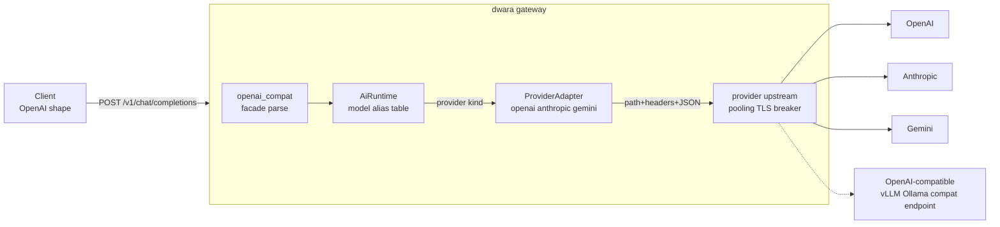

# AI provider adapters (DW-075)

The first link of the M4 AI spine: one client dialect in, three
provider dialects out. Clients send OpenAI chat-completions shaped
requests to a route whose action is `ai`; the gateway resolves the
request's `model` through the `ai:` block's alias table, translates to
the serving provider's wire format, places the call through the
provider's upstream, and translates the response back to the OpenAI
shape. The provider's model identifier never reaches the client; the
client's alias never reaches the provider.

Everything downstream in the AI pack builds on this translation layer:
DW-076 (routing/failover), DW-077 (streaming), DW-078 (token budgets),
DW-079 (cost attribution).

## Shape



### The three layers

- **`ai::openai_compat`** — the client-facing dialect: parses the
  inbound OpenAI request (preserving unknown parameters in
  `ChatRequest::other` for the lossless OpenAI-to-OpenAI path) and
  serializes canonical responses/errors/stream chunks back to the
  OpenAI shapes. Errors carry `error.request_id` so standard SDKs parse
  them and the gateway's correlation ID survives.
- **`ai::types`** — the canonical chat vocabulary every adapter shares:
  a superset of the OpenAI surface (messages, content parts, tools,
  tool calls, sampling knobs, usage, finish reasons, stream deltas).
  Token usage is PROVIDER-REPORTED ONLY (locked M4 decision — the
  gateway never estimates).
- **`ai::adapter::ProviderAdapter`** — the pure-translation seam.
  `build_request` turns a canonical request into a provider
  `ProviderRequest` (method, path, headers, JSON body — NO auth, the
  transport applies credentials from config); `parse_response`,
  `parse_error`, and `parse_stream_event` invert the provider's
  payloads. Implementations are stateless singletons
  (`ai::adapter::adapter_for`).

### Why the trait has no I/O

DW-076's failover composes on the CALL, not the adapter: a failover
layer can retry or reroute an already-translated request without
re-translating, and the adapters stay trivially testable against
recorded provider wire shapes (see `tests/ai_adapters.rs`). Transport
(endpoints, TLS trust, pooling, timeouts, breaker, health) is the
PROVIDER'S UPSTREAM — a standard `upstreams:` entry — so a provider
gets everything every other upstream gets and a multi-region provider
pool is just a multi-endpoint upstream.

### The compiled runtime

`ai::AiRuntime` is built at every dataplane refresh from the `ai:`
block: providers keyed by name (with `${...}` auth references RESOLVED,
the DW-045 compile-time contract — validation fails the generation
closed on an unresolvable reference) and the alias table
`alias -> (provider, provider_model)`. The runtime hangs off the
dataplane `Generation`, so a route table and its provider pool can
never come from different generations.

## Dialect notes

| | OpenAI | Anthropic | Gemini |
|---|---|---|---|
| Endpoint | `POST /v1/chat/completions` | `POST /v1/messages` | `POST /v1beta/models/{model}:generateContent` |
| System messages | inline | top-level `system` | `systemInstruction` |
| Tool calls | `tool_calls[]` (args as JSON string) | `tool_use` blocks (`input` object) | `functionCall` parts (`args` object) |
| Tool results | `role: tool` + `tool_call_id` | user turn + `tool_result` block | user turn + `functionResponse` part (NAME resolved from history by call id) |
| `max_tokens` | optional | REQUIRED (default 4096 substituted) | `generationConfig.maxOutputTokens` |
| Finish reasons | stop/length/tool_calls/content_filter | end_turn/max_tokens/tool_use/refusal | STOP/MAX_TOKENS/SAFETY/RECITATION |
| Usage | prompt/completion/total | input/output (total derived) | promptTokenCount/candidatesTokenCount |

Known translation limits (documented, deliberate): dialect-specific
request parameters (`seed`, `response_format`, ...) survive only the
OpenAI-to-OpenAI path; remote image URLs are dropped for Gemini (only
`data:` URIs translate to `inline_data` — fetching URLs would be a
side effect the gateway must not invent); response edge policies that
key on the PROXY action (`cache:`, response `masking:`) do not apply
to `ai` routes — the AI action owns its response shape end to end
(route `limits:` and the standard policy chain DO apply; they run
before the action).

## Streaming status (DW-075 scope)

Adapters translate provider SSE deltas (`parse_stream_event`) and the
in-house SSE framer (`ai::sse`, the locked no-new-dependency decision)
is verified against recorded streams — but the GATEWAY path answers
`stream: true` with 400 `streaming_not_supported` until DW-077 wires
the zero-buffer pass-through. The delta translation, usage extraction
from deltas, and OpenAI chunk serialization
(`openai_compat::stream_event_to_openai_chunk`) all exist and are
tested now so DW-077 composes on top without adapter changes.

## Configuration

```yaml
ai:
  providers:
    - name: openai
      kind: openai          # openai | anthropic | gemini
      upstream: openai-pool # a standard upstreams: entry
      auth:
        header: Authorization
        value: Bearer ${OPENAI_API_KEY}   # inline values redacted in echoes
    - name: claude
      kind: anthropic
      upstream: anthropic-pool
      auth:
        header: x-api-key
        value: ${ANTHROPIC_API_KEY}
  models:
    gpt-4o-mini:            # the alias clients send
      provider: openai
      provider_model: gpt-4o-mini-2024-07-18
    claude-sonnet:
      provider: claude
      provider_model: claude-sonnet-4-5

routes:
  - name: chat
    service: ai-svc        # required by the schema, never dialed
    match: { path: { type: prefix, value: /v1 } }
    action: { type: ai }
```

Validation: provider `upstream` refs must resolve; auth values must be
valid header values AND resolvable at compile time; model `provider`
refs must exist; an `ai` route action without an `ai:` block is
rejected; an `ai:` block with zero providers or zero models is
rejected (it could never serve anything).

## Metrics

- `dwara_ai_requests_total{provider,route,outcome}` — outcomes:
  success, provider_error, transport_error, translation_error
  (client-side rejections are not counted here; they never reach a
  provider).
- `dwara_ai_tokens_total{provider,kind}` — kind: prompt | completion,
  provider-reported values only.

## Where the code is

- `crates/dwara-core/src/ai/` — types, adapter trait, adapters
  (`adapters/{openai,anthropic,gemini}.rs`), facade, SSE framer,
  compiled runtime.
- `crates/dwara-core/src/config/ai.rs` — the `ai:` block schema.
- `crates/dwara-core/src/dataplane/ai_proxy.rs` — the route action:
  bounded body read, alias resolution, transport, response
  translation, error mapping.
- `crates/dwara-core/src/snapshot/mod.rs` — `validate_ai`.

## Tests

- `crates/dwara-core/tests/ai_adapters.rs` — per-adapter translation
  against recorded provider wire shapes (request build, response
  parse, error parse, SSE delta replay, tool-call fragment assembly),
  the cross-dialect "same canonical request serves all three" case,
  runtime compile/resolve, facade chunk shapes.
- `crates/dwara-core/tests/ai_gateway.rs` — end to end through the
  real gateway with mock providers speaking each dialect (they record
  path/auth/body they received): the three-provider done-when, error
  pass-through (429), unreachable provider 502, unknown model 404,
  malformed body / `stream: true` 400s, validation matrix, config
  redaction.

## Future links

- DW-076 wraps the provider call with failover (429/5xx) and weighted
  model-version canaries — no adapter changes needed.
- DW-077 wires `parse_stream_event` + `ai::sse` into a zero-buffer
  SSE pass-through and lifts the `stream: true` 400.
- DW-078/079 consume the provider-reported `Usage` this layer
  normalizes.
- DW-080 (Ent) layers credential pools behind the same
  `ProviderAdapter` seam.
