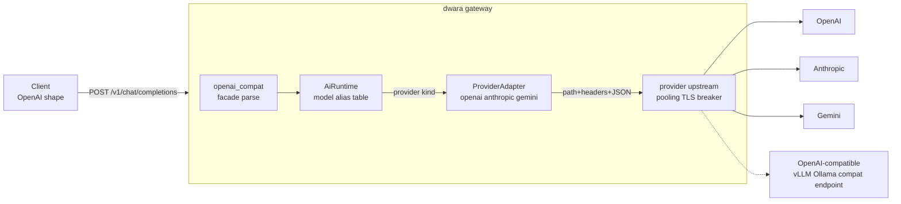

# AI provider adapters (DW-075)

The first link of the M4 AI spine: one client dialect in, three
provider dialects out. Clients send OpenAI chat-completions shaped
requests to a route whose action is `ai`; the gateway resolves the
request's `model` through the `ai:` block's alias table, translates to
the serving provider's wire format, places the call through the
provider's upstream, and translates the response back to the OpenAI
shape. The provider's model identifier never reaches the client; the
client's alias never reaches the provider.

Everything downstream in the AI pack builds on this translation layer:
DW-076 (routing/failover), DW-077 (streaming), DW-078 (token budgets),
DW-079 (cost attribution).

## Shape



### The three layers

- **`ai::openai_compat`** — the client-facing dialect: parses the
  inbound OpenAI request (preserving unknown parameters in
  `ChatRequest::other` for the lossless OpenAI-to-OpenAI path) and
  serializes canonical responses/errors/stream chunks back to the
  OpenAI shapes. Errors carry `error.request_id` so standard SDKs parse
  them and the gateway's correlation ID survives.
- **`ai::types`** — the canonical chat vocabulary every adapter shares:
  a superset of the OpenAI surface (messages, content parts, tools,
  tool calls, sampling knobs, usage, finish reasons, stream deltas).
  Token usage is PROVIDER-REPORTED ONLY (locked M4 decision — the
  gateway never estimates).
- **`ai::adapter::ProviderAdapter`** — the pure-translation seam.
  `build_request` turns a canonical request into a provider
  `ProviderRequest` (method, path, headers, JSON body — NO auth, the
  transport applies credentials from config); `parse_response`,
  `parse_error`, and `parse_stream_event` invert the provider's
  payloads. Implementations are stateless singletons
  (`ai::adapter::adapter_for`).

### Why the trait has no I/O

DW-076's failover composes on the CALL, not the adapter: a failover
layer can retry or reroute an already-translated request without
re-translating, and the adapters stay trivially testable against
recorded provider wire shapes (see `tests/ai_adapters.rs`). Transport
(endpoints, TLS trust, pooling, timeouts, breaker, health) is the
PROVIDER'S UPSTREAM — a standard `upstreams:` entry — so a provider
gets everything every other upstream gets and a multi-region provider
pool is just a multi-endpoint upstream.

### The compiled runtime

`ai::AiRuntime` is built at every dataplane refresh from the `ai:`
block: providers keyed by name (with `${...}` auth references RESOLVED,
the DW-045 compile-time contract — validation fails the generation
closed on an unresolvable reference) and the alias table
`alias -> (provider, provider_model)`. The runtime hangs off the
dataplane `Generation`, so a route table and its provider pool can
never come from different generations.

## Dialect notes

| | OpenAI | Anthropic | Gemini |
|---|---|---|---|
| Endpoint | `POST /v1/chat/completions` | `POST /v1/messages` | `POST /v1beta/models/{model}:generateContent` |
| System messages | inline | top-level `system` | `systemInstruction` |
| Tool calls | `tool_calls[]` (args as JSON string) | `tool_use` blocks (`input` object) | `functionCall` parts (`args` object) |
| Tool results | `role: tool` + `tool_call_id` | user turn + `tool_result` block | user turn + `functionResponse` part (NAME resolved from history by call id) |
| `max_tokens` | optional | REQUIRED (default 4096 substituted) | `generationConfig.maxOutputTokens` |
| Finish reasons | stop/length/tool_calls/content_filter | end_turn/max_tokens/tool_use/refusal | STOP/MAX_TOKENS/SAFETY/RECITATION |
| Usage | prompt/completion/total | input/output (total derived) | promptTokenCount/candidatesTokenCount |

Known translation limits (documented, deliberate): dialect-specific
request parameters (`seed`, `response_format`, ...) survive only the
OpenAI-to-OpenAI path; remote image URLs are dropped for Gemini (only
`data:` URIs translate to `inline_data` — fetching URLs would be a
side effect the gateway must not invent); response edge policies that
key on the PROXY action (`cache:`, response `masking:`) do not apply
to `ai` routes — the AI action owns its response shape end to end
(route `limits:` and the standard policy chain DO apply; they run
before the action).

## Streaming (DW-077)

`stream: true` now streams: the provider's SSE response is translated
frame-by-frame into OpenAI-shaped chunks and forwarded with ZERO added
buffering — each complete provider frame becomes client frames in the
same poll (`ai::stream::StreamTranslator` over `ai::sse`; the dataplane
`AiStreamBody` drives it over the upstream body, one poll in, one
frame out).

Shape: every provider delta is one `chat.completion.chunk` frame;
provider usage events accumulate (provider-reported only — the locked
decision, no estimation) and land in ONE terminal `choices: []` usage
chunk; the GATEWAY owns the `data: [DONE]` terminator (the provider's
own, even OpenAI's, is swallowed — uniform ordering: deltas, usage,
DONE). Usage reporting is forced on the provider call
(`stream_options.include_usage`) so metrics and the upcoming token
budgets always have counts, whether or not the client asked.

Interaction with failover (DW-076): the candidate chain applies until
the streaming response is returned — the COMMIT point (headers + first
chunks go to the client; a later candidate can no longer replace
anything). A provider abort AFTER the commit ends the stream cleanly:
a terminal OpenAI-shaped error chunk (`provider_stream_aborted`) then
`[DONE]`; already-forwarded content stands. A non-SSE 200 from a
misbehaving provider falls through to the buffered translate path.

Metrics: `dwara_ai_stream_chunks_total{provider}` (one per forwarded
delta chunk), `dwara_ai_first_token_seconds{provider}` (send to first
forwarded chunk), `dwara_ai_stream_duration_seconds{provider}`, and
the stream's provider-reported usage into `dwara_ai_tokens_total` with
the canary version label. The success outcome is recorded at stream
start; terminal metrics fire exactly once (clean end or client
hangup).

## Routing and failover (DW-076)

The alias table grew two routing shapes, both compiled into the
per-generation `AiRuntime` and resolved per request in `ai::routing`
(pure functions; the pick hash is an explicit FNV-1a so canary series
stay comparable across restarts and toolchains):

```yaml
ai:
  models:
    chat:                       # availability chain
      provider: openai
      provider_model: gpt-4o-mini-2024-07-18
      failover:
        - provider: anthropic   # tried, in order, when the primary
          provider_model: claude-sonnet-4-5   # answers 429/5xx or is
                                             # unreachable
    summarize:                  # weighted canary
      provider: openai
      provider_model: placeholder
      canary:
        - version: stable       # attribution label
          weight: 9
          provider: openai
          provider_model: gpt-4o-mini-2024-07-18
        - version: canary
          weight: 1
          provider: openai
          provider_model: gpt-4o-mini-2025-01-31
```

**Failover** walks `[primary, alternates...]` on RETRYABLE outcomes
only: 429, 5xx, transport errors, per-dialect translation rejections,
and provider-specific body failures (a malformed or over-cap 200 — a
runaway completion). Other provider errors (400, 401, 404) are
deterministic and final. Failover is invisible to the client by
construction — the provider response is read and translated whole
before any byte reaches the client. The chain never re-sends to a
provider/model pair that just failed (validation rejects duplicate
pairs); same-provider retries belong to the provider's upstream
breaker. When every candidate fails, the client sees the LAST
provider's answer — the closest to the truth of the outage. The chain
holds at most 4 alternates (validation): it is walked synchronously,
so every extra candidate adds a full provider round-trip to the
request's worst-case latency.

**Canary** picks exactly one version per request by the deterministic
weighted hash of the request id (the same cumulative-slot semantics as
`dataplane::split`): re-sends with the same id land on the same
version, and ratios converge statistically over distinct ids. A split
holds 2..=8 versions (validation — the DW-040 split bound: the pick
scans linearly and every version is a metrics label; one version is
not a split), each with weight >= 1 (park a version by removing the
entry). Ramp by re-balancing weights (90/10 to 95/5), never by
growing one side.

**Attribution** follows the serving provider and version everywhere:
`dwara_ai_requests_total` and `dwara_ai_tokens_total` carry a
`version` label (the canary version name, or `default` for plain
aliases), the access record's upstream follows the provider that
served, and the access log line carries `attempts` (the candidate
number that succeeded) — the input DW-079's cost metering reads.

The two shapes are mutually exclusive per alias (validation): failover
retries a canary request onto the stable version and silently undoes
the experiment — combine them on separate aliases instead.

## Configuration

```yaml
ai:
  providers:
    - name: openai
      kind: openai          # openai | anthropic | gemini
      upstream: openai-pool # a standard upstreams: entry
      auth:
        header: Authorization
        value: Bearer ${OPENAI_API_KEY}   # inline values redacted in echoes
    - name: claude
      kind: anthropic
      upstream: anthropic-pool
      auth:
        header: x-api-key
        value: ${ANTHROPIC_API_KEY}
  models:
    gpt-4o-mini:            # the alias clients send
      provider: openai
      provider_model: gpt-4o-mini-2024-07-18
    claude-sonnet:
      provider: claude
      provider_model: claude-sonnet-4-5

routes:
  - name: chat
    service: ai-svc        # required by the schema, never dialed
    match: { path: { type: prefix, value: /v1 } }
    action: { type: ai }
```

Validation: provider `upstream` refs must resolve; auth values must be
valid header values AND resolvable at compile time; model `provider`
refs must exist; an `ai` route action without an `ai:` block is
rejected; an `ai:` block with zero providers or zero models is
rejected (it could never serve anything).

## Metrics

- `dwara_ai_requests_total{provider,route,outcome,version}` —
  outcomes: success, provider_error, transport_error,
  translation_error; `version` is the canary version that served or
  `default` (client-side rejections are not counted here; they never
  reach a provider).
- `dwara_ai_tokens_total{provider,kind,version}` — kind: prompt |
  completion, provider-reported values only, attributed to the serving
  provider and version.

## Where the code is

- `crates/dwara-core/src/ai/` — types, adapter trait, adapters
  (`adapters/{openai,anthropic,gemini}.rs`), facade, SSE framer,
  routing (DW-076), compiled runtime.
- `crates/dwara-core/src/config/ai.rs` — the `ai:` block schema.
- `crates/dwara-core/src/dataplane/ai_proxy.rs` — the route action:
  bounded body read, alias resolution, transport, response
  translation, error mapping.
- `crates/dwara-core/src/snapshot/mod.rs` — `validate_ai`.

## Tests

- `crates/dwara-core/tests/ai_adapters.rs` — per-adapter translation
  against recorded provider wire shapes (request build, response
  parse, error parse, SSE delta replay, tool-call fragment assembly),
  the cross-dialect "same canonical request serves all three" case,
  runtime compile/resolve, facade chunk shapes.
- `crates/dwara-core/tests/ai_gateway.rs` — end to end through the
  real gateway with mock providers speaking each dialect (they record
  path/auth/body they received): the three-provider done-when, error
  pass-through (429), unreachable provider 502, unknown model 404,
  malformed body / `stream: true` 400s, validation matrix, config
  redaction.
- `crates/dwara-core/tests/ai_streaming.rs` — the DW-077 done-whens:
  three-dialect streaming e2e (chunk shape, content reassembly,
  terminal usage chunk, single gateway [DONE]), first-chunk latency
  bounded against the provider's own write instants (the zero-buffer
  proof: the client's first chunk arrives before the provider's LAST
  write), streamed usage equal to the provider's reported totals,
  mid-stream abort ending cleanly, failover before the commit point,
  and per-chunk metrics.
- `crates/dwara-core/tests/ai_routing.rs` — the DW-076 done-whens:
  failover on injected 429/500/transport-error (client sees success,
  both attempts attributed), exhaustion returns the last provider's
  answer, non-retryable 404 does NOT fail over, no-list passthrough,
  the 9:1 canary split over 200 distinct request ids converges and is
  deterministic per id, per-version metrics attribution, the routing
  validation matrix, and the compiled-plan unit case.

## Future links

- DW-077 wires `parse_stream_event` + `ai::sse` into a zero-buffer
  SSE pass-through and lifts the `stream: true` 400.
- DW-078/079 consume the provider-reported `Usage` this layer
  normalizes.
- DW-080 (Ent) layers credential pools behind the same
  `ProviderAdapter` seam.
