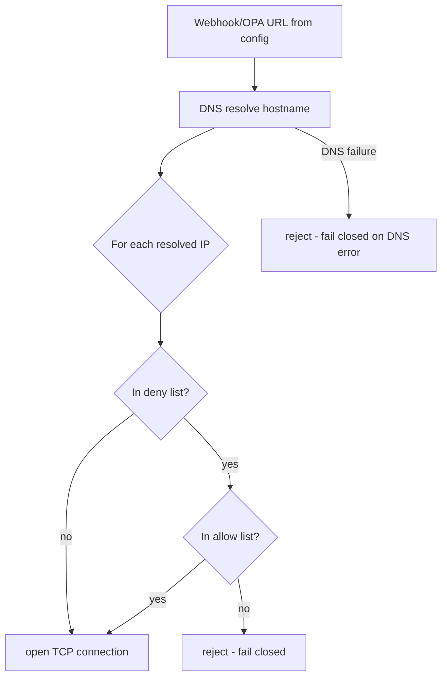
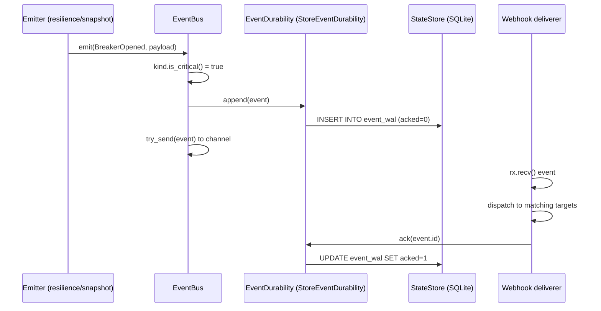

# Alert and event webhooks (DW-044)

> Implements issue DW-044 (M2, `edition/oss`, effort S). Sources:
> `crates/dwara-core/src/events/` (the bus and the deliverer), the
> emission sites in `resilience/{breaker,health}.rs` and
> `snapshot/mod.rs`, the wiring in `dataplane/proxy.rs` and
> `dwara-bin/src/main.rs`. Tests: `crates/dwara-core/tests/webhooks.rs`
> (end to end) and `crates/dwara-core/tests/unit/webhooks.rs` (envelope,
> bus, target compilation, retry machinery, validation). Operator docs:
> [docs-site webhooks guide](../../docs-site/guide/webhooks.md).

The gateway emits a small event at every state transition worth
alerting on — circuit breaker opened/half-open/closed, endpoint
ejected/recovered, config published/rejected — onto an in-process
bounded queue, and a background deliverer POSTs each event as one JSON
envelope to the configured webhook targets. The hard requirement the
whole design serves: **a webhook target can never affect the
dataplane** — not latency, not availability.

## Why a new domain (`events`)

The emission sites live in two domains that must not know about each
other: `snapshot` (config published/rejected — the publish pipeline)
and `resilience` (breaker/health transitions). `snapshot` sits low in
the dependency order (it may only import `config`), so the bus had to
sit BELOW it: the new `events` domain depends on `config` (the
`gateway.webhooks` schema types and their bounds) and `observability`
(delivery-outcome counters), and `snapshot`, `resilience`, and
`dataplane` import it. `check_deps.py` and the facade's table carry the
updated edges; the placement note in the script explains the
"below snapshot" constraint.

The deliverer does NOT read the `ConfigState` (that would be an
`events -> snapshot` edge and a cycle): the dataplane compiles the
current generation's targets — resolving `${...}` header references —
and pushes them to the deliverer over a `tokio::sync::watch` channel on
every `refresh`, so a config change applies to the next event with no
deliverer restart.

## The emission contract

`events::Emitter::emit` is a `try_send` onto a bounded
`tokio::sync::mpsc` channel (capacity 256) plus two atomics. When the
queue is full — or nobody is draining it — the event is DROPPED and
counted; there is no blocking path from any emission site. This is the
direct answer to "failure never blocks the dataplane": the breaker's
`check`/`report` wire and the reload path both emit inline (under the
breaker's own lock, where the transition was just written, so the event
can never disagree with the state).

Drop policy: drop-NEWEST at emit time. The alternatives were worse:
blocking backpressure violates the core requirement, and drop-oldest
would need a deque (and would discard the historical burst in favor of
new noise). The dropped count is surfaced as the scrape-time gauge
`dwara_events_dropped_total`, following the rate-limiter-eviction
precedent: the emit path bumps a plain atomic, only `/metrics` couples
it to the registry.

Emission sites and their payloads (all labels are bounded config
strings; there is no free-form payload field by design):

| Site | Event | Payload |
| --- | --- | --- |
| `Breaker::report` (Closed -> Open) | `breaker_opened` | upstream, `detail` naming the tripping rule (`consecutive_failures` / `error_ratio`) |
| `Breaker::report` (HalfOpen -> Open) | `breaker_opened` | upstream, `detail = half_open_probe_failed` |
| `Breaker::check` (Open -> HalfOpen) | `breaker_half_open` | upstream |
| `Breaker::report` (HalfOpen -> Closed) | `breaker_closed` | upstream, `detail = half_open_probe_succeeded` |
| `EndpointHealth::eject_locked` | `endpoint_ejected` | upstream, endpoint (`address:port`) |
| `EndpointHealth::recover_locked` | `endpoint_recovered` | upstream, endpoint |
| `ConfigState::compile_and_publish` (Ok) | `config_published` | generation, content_hash, route_count |
| `ConfigState::compile_and_publish` (Err) | `config_rejected` | issue_count, generation (still running) |
| dataplane quota phase (DW-033) | `quota_near_limit` | consumer (config-declared label), `detail` naming the budget (`daily`/`monthly`), used, limit |

Notes on the wiring:

- The breaker and each endpoint tracker hold an OPTIONAL
  pre-bound emitter (`Breaker::with_clock_and_events`,
  `EndpointHealth::with_events`, bound to the upstream/endpoint labels
  by the balancer at tracker construction — the tracker knows its state
  machine, not its own address). `None` is a documented no-op, so every
  existing direct/test construction is untouched.
- `ConfigState` carries the bus (`with_event_bus` / first-attach
  `attach_event_bus`). `DataPlane::new` adopts the state's bus or
  creates one AND attaches it back, so a live gateway always has exactly
  one bus shared by the publish pipeline and the dataplane state
  machines — which is also why a startup publish's event is queued for
  the deliverer that spawns a few lines later.
- Centralizing config events inside `compile_and_publish` covers every
  publish path (cold start, file-watch/SIGHUP reload, admin
  `POST /config`) with one emission site.

`quota_near_limit` (DW-033) fires when a consumer's request budget
crosses 80% of its window cap — edge-triggered ONCE per (consumer,
budget, window) from the dataplane's quota phase (the state domain
must not import events, so the emit lives on the caller; see
[Quotas and metering](./quotas.md)). The `consumer` payload field is a
CONFIG-DECLARED label (quota budgets attach to config consumers only in
this edition), the same trust class as `upstream` names — store-managed
(admin-entered) consumer names must never enter a payload.

Deliberately NOT emitted, with the hook point documented in
`events/mod.rs`: rate-limiter eviction (already a metric; an event per
eviction would be noise).

## The deliverer

`events::webhook::run_deliverer` is one background task (spawned by the
binary at startup and available to tests via
`DataPlane::spawn_webhook_deliverer`, so both share one wiring path).
Per event it serializes the envelope ONCE, filters targets by kind, and
dispatches each (event, target) pair as its own task under a
32-permit semaphore; a saturated semaphore drops-and-counts (an
unbounded delivery queue would just relocate the unbounded buffer from
the bus to the deliverer).

The retry/budget shape is lifted verbatim from the OTLP exporter client
(`dwara-bin/src/otlp.rs`, #133) — the strongest in-repo precedent for
"HTTP delivery that can never stretch past its budget":

- ONE total deadline per delivery (`timeout_ms`) covers connect, write,
  response-head read, and every backoff wait — a flapping or hung
  target cannot exceed the budget any more than a slow one could.
- Retryable outcomes: transport failures and 429/502/503/504; a
  seconds-form `Retry-After` replaces the computed backoff for that
  wait (HTTP-date form deliberately uninterpreted; a demanded zero
  falls back to the computed backoff so a hostile zero cannot
  busy-loop).
- Non-retryable: any other non-2xx (4xx, 500, and 3xx — redirects are
  not followed). Retrying an answer that is this delivery's fault is
  waste.
- Backoff doubles from `backoff_base_ms` up to `backoff_cap_ms`; a wait
  that would exhaust the remaining budget gives up instead of sleeping
  past it.

The HTTP client is hand-rolled over tokio (the active-health probe's
shape): `TcpStream`, optional `tokio-rustls` with the public webpki
roots and HTTP/1.1 ALPN, one written request, a status-line + headers
read capped at 8 KiB, `Connection: close`. No new dependencies; no
`trusted_ca_file` for webhook targets in v1 (documented scope: the
alerting fan-out is public SaaS).

### SSRF egress filter (SEC-13, #160)

[SSRF](https://en.wikipedia.org/wiki/Server-side_request_forgery)
(Server-Side Request Forgery — an attack where the server is tricked
into making requests to internal/private addresses it should not
reach) egress filtering was added in M5. By default, there is no
private-address filter (an internal alerting listener on `127.0.0.1`
or `10/8` is a normal shape). When the `gateway.ssrf_filter` block is
present, the gateway resolves the hostname at connection time and
rejects connections to private, loopback, link-local, and cloud-
metadata IP ranges.



The filter:

- Resolves the hostname at connection time (not at config validation)
  to mitigate [DNS rebinding](https://en.wikipedia.org/wiki/DNS_rebinding)
  (an attack where the DNS response changes between validation and
  connection, pointing the same hostname at a different — potentially
  private — IP).
- Checks every resolved IP address against the `deny` CIDR list.
- Applies the `allow` list after `deny`; an IP in both is allowed
  (exemptions for intentional internal destinations like an internal
  OPA server).
- Fails closed on DNS resolution errors or filter failures — the
  webhook/OPA delivery is aborted rather than allowed through.
- Runs before the TCP connection is opened, so header secrets are
  never disclosed to a rejected destination.

The filter is compiled per generation and passed into the webhook and
OPA runtime state. The same filter applies to OPA callouts (see
[cedar-opa-authz](./cedar-opa-authz.md)). The `ssrf_filter` config
block is always accepted by the parser; no feature gate is needed.

Egress posture without the filter: webhook URLs are operator
configuration, exactly like upstream endpoints — the gateway dials
exactly what the config names. The filter is a security hardening step
for deployments where webhook or OPA endpoints may be influenced by
untrusted input.

Outcomes land in `dwara_webhook_events_total{kind,outcome}` with
`outcome` exactly `delivered` / `failed` / `dropped` (dropped = never
tried: envelope over the 16 KiB byte cap — only reachable via absurd
config label lengths — or concurrency saturation). Cardinality is
bounded by construction: both labels are closed sets.

## Validation and redaction

`snapshot::validate` checks each `gateway.webhooks[]` entry: absolute
http(s) URL, non-empty known `events` (the message names the emitted
set, which includes `quota_near_limit` since DW-033), legal header
names/values with `${...}` references RESOLVED at validation time (the
DW-045 compile-time contract — an unresolvable reference fails the
generation closed, naming the reference, never the value), duplicate
URLs rejected (double delivery is always a mistake), and the retry
knobs within `config::limits` bounds. `Gateway::redacted` redacts
inline webhook header values with the same
`${redacted:sha256:<prefix>}` placeholder as credentials, so the
admin `GET /config` echo never leaks them.

## Failure isolation, summarized

| Threat | Bound |
| --- | --- |
| Slow/hung target | one delivery's `timeout_ms` (all attempts share it) |
| Dead target | `max_attempts` bounded retries, then `outcome="failed"` |
| Alert storm | 256-slot queue; overflow drops (counted), never blocks |
| Target pile-up | 32 concurrent deliveries; excess drops (counted) |
| Emit on the request path | `try_send` + atomics, no lock on the bus, no registry coupling |

The integration suite pins each row end to end against real local
receivers (including a target that accepts and never answers, and a
dead port), and the unit suite pins the retry machinery against
scripted sinks — the same shapes the OTLP exporter's white-box tests
use, expressed through the public `deliver` entry point.

## Event durability / WAL (REL-14, #249)

The in-memory event bus is intentionally not durable: a process crash
drops queued events. For critical events (breaker transitions,
endpoint ejections/recoveries, config publish/reject, quota
near-limit, canary promotions/rollbacks), REL-14 adds an optional
write-ahead log backed by the SQLite `StateStore`.

### Design

The `EventDurability` trait lives in the `events` domain (it can't
import `state` — dependency direction). The concrete implementation
`StoreEventDurability` lives in the `dataplane` domain (which owns
both the `StateStore` and the `EventBus`), adapting the store's WAL
methods to the trait.



### Wiring

The binary creates the `EventBus` before the `StateStore` (wiring
order: the bus must exist before the first `compile_and_publish`).
After the store opens, the binary calls
`event_bus.attach_durability(StoreEventDurability::new(store))`.
This retroactively attaches the durability layer and replays
un-acked events from the WAL into the channel for the next deliverer
to drain. The startup `config_published` event is already in the
channel and is delivered normally (it is not retroactively
persisted).

### Schema

Migration 010 adds the `event_wal` table:

```sql
CREATE TABLE event_wal (
    id           TEXT PRIMARY KEY,
    kind         TEXT NOT NULL,
    gateway      TEXT NOT NULL,
    timestamp_ms INTEGER NOT NULL,
    payload      TEXT NOT NULL,    -- JSON-serialized EventPayload
    acked        INTEGER NOT NULL DEFAULT 0
);
CREATE INDEX idx_event_wal_acked ON event_wal (acked, timestamp_ms);
```

### At-least-once semantics

The deliverer marks an event as acked AFTER dispatching to matching
targets. On restart, only un-acked events are replayed. This gives
at-least-once delivery: an event that was dispatched but not yet
acked when the process crashed will be re-delivered on the next
startup. Webhook targets should be idempotent (the event `id` is
stable across replays).

### Best-effort persistence

A SQLite write failure is logged (`event_wal_append_failed`) but
does not block the emit — the event still goes to the in-memory
channel. This preserves the "a webhook target can never affect the
dataplane" contract: the WAL is a reliability improvement, not a
new blocking dependency.

Code: `crates/dwara-core/src/events/mod.rs` (`EventDurability`
trait, `EventBus::with_durability`, `attach_durability`),
`crates/dwara-core/src/state/store.rs` (`append_event_wal`,
`ack_event_wal`, `unacked_events_wal`, `purge_acked_events_wal`),
`crates/dwara-core/src/dataplane/proxy.rs`
(`StoreEventDurability`), `crates/dwara-core/src/events/webhook.rs`
(`run_deliverer` ack call), `crates/dwara-bin/src/main.rs` (wiring).
