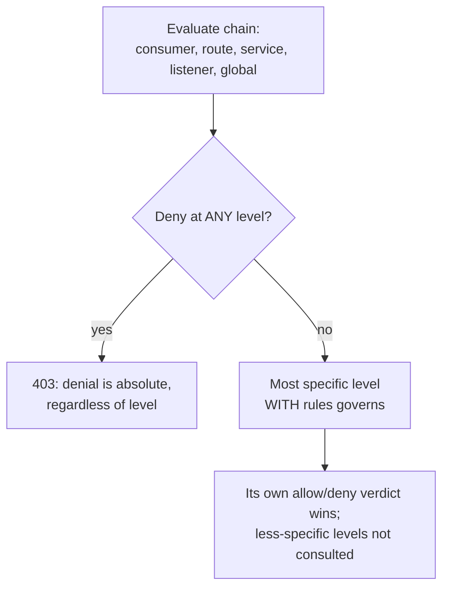

# Authentication and authorization

Source: `crates/dwara-core/src/security/{authn,authz}.rs` (DW-019,
DW-020; pepper and mTLS hardening per #124). Tests: `authn`, `authz`
(dwara-core).

Authentication answers "who is this caller?"; authorization answers
"is this caller allowed **here**?", evaluated only after authentication
— and only for requests that already resolved a route (unrouted 404s
never reach either chain; see the docs-site
[request pipeline](../../docs-site/architecture/overview.md#request-pipeline)).

## Authentication: four credential families, one trait

All four live behind one `Authenticator` trait:

```mermaid
flowchart LR
    Req[Request] --> Kind{Which credential?}
    Kind -->|X-API-Key| APIKEY[API key\nselector: hex(sha256(key))]
    Kind -->|Authorization: Basic| BASIC[Basic\nselector: hex(sha256(user))]
    Kind -->|Authorization: Bearer| JWT[JWT\nverified against JWKS]
    Kind -->|client cert on TLS conn| MTLS[mTLS\nsubject CN or fingerprint]
    APIKEY --> Verify[constant-time compare\nsha256: or hmac-sha256: hash]
    BASIC --> Verify
    JWT --> JWKSVerify[signature + iss/exp/nbf/aud]
    MTLS --> RustlsVerify[verified during TLS handshake,\nnever reaches authn unverified]
```

**API keys** (`X-API-Key: <key>`): the lookup selector is
`hex(sha256(key))` — never the plaintext key. The stored hash is
`hmac-sha256:<hex(HMAC-SHA256(pepper, key))>` when the deployment sets
`DWARA_CREDENTIAL_PEPPER` (#124), or legacy `sha256:<hex(sha256(key))>`
otherwise; either form is checked with a constant-time compare
(`subtle`). Optional memory-hard verification: a credential whose
stored hash is a PHC string (`$argon2id$...`, admin-supplied via the
state store) is verified with argon2id instead. **Why not argon2id
everywhere:** argon2 is memory-hard and tens of milliseconds per
verify by design — far too slow for a per-request hot path — so
config-declared keys are always fast-path hashed at seed time, and
argon2id is opt-in per credential for cases (typically operator/admin
credentials, not high-QPS service keys) where the extra cost is
acceptable.

**Basic** (`Authorization: Basic base64(user:pass)`): the username is
the selector (same selector space as API keys), the password is
verified through the *same* hashing path (peppered when configured).
Basic credentials only exist in the state store — config declares API
keys, not username/password pairs — and the resolved identity reports
with kind `api_key`. **Store-managed Basic credentials must use
argon2id PHC hashes**: a human-chosen password hashed with plain
unsalted sha256 is offline-dictionary bait, unlike a config-generated
random API key. Usernames remain enumerable regardless (the selector
has no secret input), so an attacker with store access can confirm
username guesses offline even without breaking any password.

**JWT** (`Authorization: Bearer <token>`): verified against the
provider's JWKS, fetched and cached, refreshed **before** a stale
cached set is used so retired issuer keys can't keep verifying
forever. An unknown `kid` mid-flight triggers a re-fetch (key
rotation without a restart), but refresh-triggered fetches are
throttled to one per `min(5s, refresh_secs)` so forged random-`kid`
tokens can't drive a fetch storm. `iss`/`exp`/`nbf` are validated with
`leeway_secs` skew tolerance; `aud` is validated **only** when the
provider configures an `audience` (#124) — a provider without one
accepts any or no `aud` claim. The algorithm allowlist (default
RS256/ES256) is enforced **before** any signature work, specifically
because `none` and `HS*` are classic asymmetric-confusion attack
vectors and must never be reachable regardless of what a token claims.

**mTLS** (#124): the client certificate negotiated on the connection
itself. On a terminate listener with `client_ca_file` set, rustls
verifies any presented certificate against that bundle during the TLS
handshake — an unverified certificate fails the handshake and never
reaches authn at all. A credential maps the verified certificate to a
consumer by subject CommonName (`by subject`) or SHA-256 fingerprint
(`by fingerprint`).

## Authorization: precedence and 401 vs. 403

Authorization rules attach at five levels — `consumers[].authorization`
(applies once authn identifies the consumer), `routes[].authorization`,
`services[].authorization`, `listeners[].authorization`, and the
gateway-level `authorization` (global) — evaluated through a frozen
precedence:



1. **A deny at any level wins** — a consumer-level deny beats a
   route-level allow and vice versa; denials are absolute, not
   overridable by a broader allow.
2. **Otherwise the most specific level with rules governs** — a level
   carrying no `Authz` (or an empty one) is transparent and simply
   defers to the next level down the specificity chain.

**403 vs. 401:** a denied authenticated (or anonymous-but-IP-gated)
request answers 403 "forbidden"; an anonymous request hitting a route
whose authorization carries identity rules answers 401 (identity rules
imply authentication is required). The one exception is an
**`ip_acl`-only** `Authz` block, which can grant anonymous access — a
documented exception, because an operator who writes only an IP ACL
clearly wants an IP gate, not a login wall. `auth_required` on a route
independently forces authentication regardless of what authorization
decides.

**Within one `Authz` block, deny wins**: `denied_consumers` /
`denied_groups` beat the corresponding `allowed_*` list; in the IP ACL,
the deny list is checked before the allow list.

**IP ACL uses the effective client IP** — the same
`X-Forwarded-For`-resolved address described in
[dataplane-proxy](./dataplane-proxy.md#host-header-and-forwarded-headers)
when the direct peer is a trusted proxy, otherwise the direct peer. A
spoofed `X-Forwarded-For` from an untrusted peer can never influence an
authorization decision, by construction (it's discarded before authz
ever sees it).

**Scopes and claims:** every `required_scopes` entry must appear in the
JWT `scope` claim (space-separated string or array, normalized to
space-separated by authn); API-key/Basic identities carry no claims
and never satisfy a scope rule. `required_claims` is exact string
equality on the stringified claim value — only string- and
number-valued claims are captured on the identity at all (authn drops
bool/null/object claims), so such claims can never satisfy a
`required_claims` entry. All comparisons (consumers, groups, scopes,
claims) are case-sensitive.

## Where to look next

- [Configuration](../../docs-site/guide/configuration.md#authentication-and-authorization)
  for the config shapes.
- `dwara-cli lint`'s `consumer-unused` rule flags a consumer bound to
  no authorization rule and no JWT provider — see [CLI](../../docs-site/guide/cli.md).
