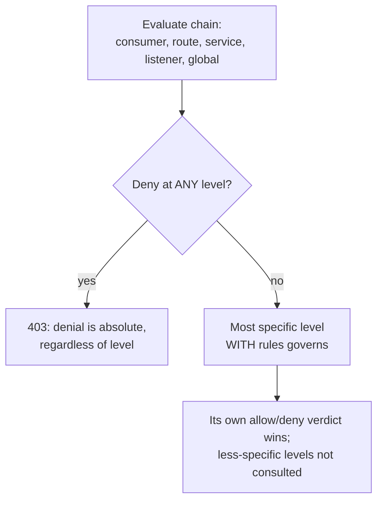

# Authentication and authorization

Source: `crates/dwara-core/src/security/{authn,authz}.rs` (DW-019,
DW-020; pepper and mTLS hardening per #124; HMAC request signing per
DW-036). Tests: `authn`, `authz`, `hmac_signing` (dwara-core).

Authentication answers "who is this caller?"; authorization answers
"is this caller allowed **here**?", evaluated only after authentication
— and only for requests that already resolved a route (unrouted 404s
never reach either chain; see the docs-site
[request pipeline](../../docs-site/architecture/overview.md#request-pipeline)).

## Authentication: five credential families, one trait

All five live behind one `Authenticator` trait:

```mermaid
flowchart LR
    Req[Request] --> Kind{Which credential?}
    Kind -->|X-API-Key| APIKEY[API key\nselector: hex(sha256(key))]
    Kind -->|Authorization: Basic| BASIC[Basic\nselector: hex(sha256(user))]
    Kind -->|Authorization: Bearer| JWT[JWT\nverified against JWKS]
    Kind -->|X-Dwara-Signature| HMAC[HMAC request signing\nkey_id -> secret]
    Kind -->|client cert on TLS conn| MTLS[mTLS\nsubject CN or fingerprint]
    APIKEY --> Verify[constant-time compare\nsha256: or hmac-sha256: hash]
    BASIC --> Verify
    JWT --> JWKSVerify[signature + iss/exp/nbf/aud]
    HMAC --> HmacVerify[HMAC-SHA256 over\ncanonical string v1]
    MTLS --> RustlsVerify[verified during TLS handshake,\nnever reaches authn unverified]
```

**API keys** (`X-API-Key: <key>`): the lookup selector is
`hex(sha256(key))` — never the plaintext key. A config-declared key
may be an inline value or a `${...}` secret reference resolved at
config-compile time (DW-045) — see [Secrets](./secrets.md). The stored hash is
`hmac-sha256:<hex(HMAC-SHA256(pepper, key))>` when the deployment sets
`DWARA_CREDENTIAL_PEPPER` (#124), or legacy `sha256:<hex(sha256(key))>`
otherwise; either form is checked with a constant-time compare
(`subtle`). Optional memory-hard verification: a credential whose
stored hash is a PHC string (`$argon2id$...`, admin-supplied via the
state store) is verified with argon2id instead. **Why not argon2id
everywhere:** argon2 is memory-hard and tens of milliseconds per
verify by design — far too slow for a per-request hot path — so
config-declared keys are always fast-path hashed at seed time, and
argon2id is opt-in per credential for cases (typically operator/admin
credentials, not high-QPS service keys) where the extra cost is
acceptable.

**Basic** (`Authorization: Basic base64(user:pass)`): the username is
the selector (same selector space as API keys), the password is
verified through the *same* hashing path (peppered when configured).
Basic credentials only exist in the state store — config declares API
keys, not username/password pairs — and the resolved identity reports
with kind `api_key`. **Store-managed Basic credentials must use
argon2id PHC hashes**: a human-chosen password hashed with plain
unsalted sha256 is offline-dictionary bait, unlike a config-generated
random API key. Usernames remain enumerable regardless (the selector
has no secret input), so an attacker with store access can confirm
username guesses offline even without breaking any password.

**JWT** (`Authorization: Bearer <token>`): verified against the
provider's JWKS, fetched and cached, refreshed **before** a stale
cached set is used so retired issuer keys can't keep verifying
forever. An unknown `kid` mid-flight triggers a re-fetch (key
rotation without a restart), but refresh-triggered fetches are
throttled to one per `min(5s, refresh_secs)` so forged random-`kid`
tokens can't drive a fetch storm. `iss`/`exp`/`nbf` are validated with
`leeway_secs` skew tolerance; `aud` is validated **only** when the
provider configures an `audience` (#124) — a provider without one
accepts any or no `aud` claim. The algorithm allowlist (default
RS256/ES256) is enforced **before** any signature work, specifically
because `none` and `HS*` are classic asymmetric-confusion attack
vectors and must never be reachable regardless of what a token claims.

**mTLS** (#124): the client certificate negotiated on the connection
itself. On a terminate listener with `client_ca_file` set, rustls
verifies any presented certificate against that bundle during the TLS
handshake — an unverified certificate fails the handshake and never
reaches authn at all. A credential maps the verified certificate to a
consumer by subject CommonName (`by subject`) or SHA-256 fingerprint
(`by fingerprint`).

**HMAC request signing** (DW-036): a per-request signature over the
request line, payload digest, timestamp, and nonce, presented in the
`X-Dwara-*` header family — the full contract is the dedicated section
below. Where a consumer with an API key proves knowledge of a static
secret, a signer additionally proves this *exact* request (method,
path, query, body) was constructed by the key holder after the
timestamp — a captured request cannot be modified or (within the
window) replayed.

**Family dispatch order** (composite, on request shape): `X-API-Key`
wins over `Authorization`; within `Authorization`, `Basic` and
`Bearer` are distinguished by the scheme token; a presented
`X-Dwara-Signature` engages the HMAC family after the
`Authorization` schemes; the client certificate is the AMBIENT
family, consulted only when no header credential was presented (a
header expresses explicit intent; the certificate is connection-level
context).

## HMAC request signing (DW-036 / #37)

The interop contract lives in the `security::authn` module docs
(`crates/dwara-core/src/security/authn.rs`) and is pinned by
`tests/hmac_signing.rs`, which re-implements the grammar from the
documentation ALONE — an independent conformance signer — so the docs
are the spec. The end-user material (how to configure a signer, a
worked signing example) is at
[docs-site: HMAC request signing](../../docs-site/guide/hmac-signing.md).

A consumer declares the credential in config:

```yaml
consumers:
  - name: signer
    credentials:
      - type: hmac
        key_id: signer-key-1            # public selector (X-Dwara-Key-Id)
        secret: ${file:/etc/dwara/secrets/signer.key}
```

The secret is inline or a `${...}` reference like an API key (DW-045;
inline values are redacted in every config echo — see
[Secrets](./secrets.md)), with one deliberate difference: it is never
hashed. Recomputing an HMAC needs the raw key bytes, so the resolved
secret lives only in the authenticator's in-memory key map
(zeroized on drop) — the state store never sees an `hmac` row, and
store-managed HMAC credentials are deliberately unsupported. The
credential pepper (#124) does not apply: it guards stored hashes, and
there is none.

### Wire format

Five request headers, all REQUIRED when `X-Dwara-Signature` is
presented — any missing or malformed one is a 401, like any other
presented-but-invalid credential (presenting the signature header is
the opt-in; unsigned requests pass through the family untouched):

| Header | Content |
|---|---|
| `X-Dwara-Key-Id` | the credential's `key_id` (public selector; 1..=128 visible-ASCII bytes) |
| `X-Dwara-Timestamp` | decimal Unix epoch seconds of signing (digits only) |
| `X-Dwara-Nonce` | opaque client string, 16..=256 visible-ASCII bytes, unique per request within the replay window (use >= 128 bits of entropy) |
| `X-Dwara-Body-Sha256` | lowercase hex SHA-256 of the request body (the empty body signs `e3b0c4...b855`, SHA-256 of the empty string) |
| `X-Dwara-Signature` | lowercase hex HMAC-SHA256(secret, canonical string) |

The `X-Dwara-*` headers are forwarded upstream untouched (the
`X-API-Key` precedent; only `X-Consumer-*` are stripped), and the
resolved identity drives `X-Consumer-*` injection and policy
evaluation exactly like the other families.

### Canonical string (v1) — the interop contract

A version line followed by the seven signed elements, each pair
joined by exactly one `\n` byte (no trailing newline). No element may
itself contain `\n` — the grammar guarantees it (visible ASCII
excludes control characters, the timestamp is digits, the digest is
hex, and hyper's parser rejects raw control bytes in a request
target):

```text
dwara-hmac-v1
<key id>            the X-Dwara-Key-Id value, exactly as presented
<method>            the HTTP method, uppercased (GET, POST, ...)
<path>              the request path EXACTLY as received: percent-encoding preserved, no normalization
<query>             the raw query string as received (no leading '?'), or an EMPTY line when absent
<timestamp>         the X-Dwara-Timestamp value, exactly as presented
<nonce>             the X-Dwara-Nonce value, exactly as presented
<body digest>       the X-Dwara-Body-Sha256 value, exactly as presented
```

Three load-bearing decisions:

- **Path/query exactly as received.** The signer cannot know what
  normalization a proxy chain might apply, so the only lossless
  contract is the raw bytes the client put on the wire. Query ORDER
  is signed: `?a=1&b=2` and `?b=2&a=1` are different canonical
  strings.
- **Body by digest, carried in a signed header.** The gateway
  verifies the MAC over headers only, then enforces the digest while
  STREAMING the body to the upstream — zero buffering, any body size.
  A mismatch aborts the upstream send mid-stream and answers 401; a
  tampered body never completes upstream. The route's
  `max_body_bytes` (DW-027, see
  [Edge policies](./edge-policies.md)) composes: the digesting
  wrapper sits inside the route's limit wrapper, so an over-cap body
  is still 413 first.
- **No other headers in v1.** The signed set already binds identity,
  the request line, the payload, freshness, and uniqueness; signing
  arbitrary header lists drags in canonicalization ambiguity every
  signer must replicate exactly. The `Host` header is NOT signed — it
  is a routing input, so a header-tampering party between signer and
  gateway (non-TLS listener or untrusted proxy hop) could retarget a
  validly signed request to a different host-matched route; TLS
  termination makes that party mostly hypothetical and the gateway
  rebuilds Host from the upstream pick (no cross-host forwarding). The
  versioned first line leaves room for a v2 with opt-in header
  (including Host) coverage without breaking v1 signers.
- **Redirect/Respond actions skip digest enforcement.** Digest
  verification guards the forward path; a signed request that resolves
  to a redirect or direct-response action forwards no body upstream,
  so the streaming digest check never runs (nothing is proxied, so
  there is no upstream integrity surface to protect).

### Verification order and failure posture

1. Header presence/format parse (401 on any malformed element).
2. Timestamp inside `±max_clock_skew_secs` — checked BEFORE any HMAC
   work; an expired window is not a MAC problem. Outside the window:
   401.
3. Key lookup, then `HMAC-SHA256(secret, canonical)` compared to the
   presented signature with `subtle::ConstantTimeEq` over the full
   32-byte digests — no early return on a byte mismatch. A key-miss
   computes a dummy MAC first (fixed zero key) so the timing shape of
   "unknown key" matches "wrong signature" and key existence is not
   readable from latency; both answer the same 401 shape (envelope
   code `unauthorized`, challenge `WWW-Authenticate:
   Dwara-HMAC-SHA256 realm="dwara"`) as every other family.
4. Nonce replay check, AFTER a successful MAC: the nonce is
   remembered under `key_id + '\n' + nonce` for twice the skew
   window, and a remembered nonce inside its TTL is a 401. Burned
   only on VALID signatures — junk traffic cannot flood legitimate
   nonces out of the cache.

### Clock skew and the replay window

The window is gateway-level config (`hmac_auth.max_clock_skew_secs`,
default 300 — ±5 minutes; validated 1..=3600). It bounds both the
accepted timestamp drift and the nonce TTL (2x the window): a
timestamp stays acceptable for at most one full window after its
request was first seen, so the doubled TTL covers the boundary with
margin. Replay protection is therefore only as strong as the nonce
cache's retention.

The nonce cache is in-memory, sharded (16 shard locks, the GCRA
store's pattern), TTL-expired, and capped at 4,096 entries per shard
(`MAX_NONCE_CACHE_ENTRIES_PER_SHARD`) with soonest-expiry-first
eviction: under a nonce flood the cache degrades fail-open to
eviction — the documented GCRA trade (an availability DoS must not
become a gateway outage). It is also PER-INSTANCE: dwara M2 is a
single-process deployment, and a multi-instance fleet behind one VIP
would let a replayed request hit a cold instance. A shared nonce
store is the enterprise/Redis seam (DW-031's world); the boundary is
documented here so operators do not mistake per-instance replay
protection for fleet-wide.

## Authorization: precedence and 401 vs. 403

Authorization rules attach at five levels — `consumers[].authorization`
(applies once authn identifies the consumer), `routes[].authorization`,
`services[].authorization`, `listeners[].authorization`, and the
gateway-level `authorization` (global) — evaluated through a frozen
precedence:



1. **A deny at any level wins** — a consumer-level deny beats a
   route-level allow and vice versa; denials are absolute, not
   overridable by a broader allow.
2. **Otherwise the most specific level with rules governs** — a level
   carrying no `Authz` (or an empty one) is transparent and simply
   defers to the next level down the specificity chain.

**403 vs. 401:** a denied authenticated (or anonymous-but-IP-gated)
request answers 403 "forbidden"; an anonymous request hitting a route
whose authorization carries identity rules answers 401 (identity rules
imply authentication is required). The one exception is an
**`ip_acl`-only** `Authz` block, which can grant anonymous access — a
documented exception, because an operator who writes only an IP ACL
clearly wants an IP gate, not a login wall. `auth_required` on a route
independently forces authentication regardless of what authorization
decides.

**Within one `Authz` block, deny wins**: `denied_consumers` /
`denied_groups` beat the corresponding `allowed_*` list; in the IP ACL,
the deny list is checked before the allow list.

**IP ACL uses the effective client IP** — the same
`X-Forwarded-For`-resolved address described in
[dataplane-proxy](./dataplane-proxy.md#host-header-and-forwarded-headers)
when the direct peer is a trusted proxy, otherwise the direct peer. A
spoofed `X-Forwarded-For` from an untrusted peer can never influence an
authorization decision, by construction (it's discarded before authz
ever sees it).

**Scopes and claims:** every `required_scopes` entry must appear in the
JWT `scope` claim (space-separated string or array, normalized to
space-separated by authn); API-key/Basic identities carry no claims
and never satisfy a scope rule. `required_claims` is exact string
equality on the stringified claim value — only string- and
number-valued claims are captured on the identity at all (authn drops
bool/null/object claims), so such claims can never satisfy a
`required_claims` entry. All comparisons (consumers, groups, scopes,
claims) are case-sensitive.

## Where to look next

- [Configuration](../../docs-site/guide/configuration.md#authentication-and-authorization)
  for the config shapes.
- `dwara-cli lint`'s `consumer-unused` rule flags a consumer bound to
  no authorization rule and no JWT provider — see [CLI](../../docs-site/guide/cli.md).

## Key rotation workflows (DW-046)

Source: state store schema v5 + `security::authn` + the admin
credential endpoints. Tests: `authn` rotation cases, `store`
retirement lifecycle, `admin_api` credential endpoints.

The frozen rotation procedure (zero failed requests mid-window):

1. **Issue** `POST /consumers/{name}/credentials {"key": "<new>"}` —
   hashed with the dataplane's pepper state (16..=512 bytes enforced).
   The dual-validity window OPENS: old and new keys authenticate
   simultaneously from the next request.
2. **Switch clients** to the new key at your leisure. Both keys work.
3. **Retire the old key** `POST /credentials/{id}/retire` — empty body
   for immediate, `{"at_ms": <epoch ms>}` to schedule the far edge.
   Retirement is lazy (no sweeper): the SQL lookup filters it and the
   registry re-checks cached rows, so the boundary lands on time.
   Retirement can only move EARLIER; to postpone, issue another key.
   `GET /consumers/{name}/credentials` lists rows with lifecycle
   stamps only (never selector/hash material).

JWKS rotation is bridged by `retired_key_grace_secs` (default 24 h,
0 disables, capped 7 days): when a fetch delivers a changed kid set,
the superseded set keeps verifying dropped kids through the grace —
issuers remove old keys while previously-issued tokens still carry
them. An identical-kid re-fetch never extends the grace. Config-only
deployments rotate by editing the config (two credential entries)
and reloading.
