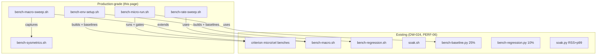

# Production-grade benchmarking

dwara has a three-tier benchmarking system (micro / macro / soak)
described in [`cli.md`](./cli.md). This page documents the
production-grade benchmarking scripts that extend that system with
environment tuning, system-metrics capture, and rate-sweep analysis
for capacity planning and full performance characterization.

The existing harnesses (`bench-macro.sh`, `bench-regression.sh`,
`soak.sh`) are designed for quick developer feedback and CI regression
gating. The scripts documented here are designed for dedicated
benchmark hosts where the goal is absolute numbers, per-feature
overhead measurement, and saturation-point discovery.

## Phase 0: Environment setup

[`scripts/bench-env-setup.sh`](../../scripts/bench-env-setup.sh)
detects the OS, applies OS-specific tuning, builds release binaries,
and optionally captures machine-specific baselines.

```sh
# Tune + build (no baselines)
scripts/bench-env-setup.sh

# Tune + build + capture baselines for this machine
BENCH_MACHINE=myhost scripts/bench-env-setup.sh --baseline

# Build with enterprise features
BENCH_FEATURES_ENT=1 scripts/bench-env-setup.sh
```

### What it tunes

| Platform | Tuning | Notes |
|---|---|---|
| macOS | `ulimit -n 65536` | System-wide hard limit may need `launchctl`; stay at 10k connections |
| Linux | `ulimit -n 1048576`, TCP sysctls | `ip_local_port_range`, `somaxconn`, `tcp_tw_reuse`, `tcp_max_syn_backlog`, `netdev_max_backlog`; requires root for sysctls (skipped silently if denied) |
| Linux (bare metal) | CPU frequency scaling | `cpupower governor=performance`, `intel_pstate/no_turbo=1`; best-effort, no-op on VMs |

### Baseline capture

With `--baseline`, the script runs the micro and macro regression
harnesses and writes the results as new baselines using the existing
gate scripts:

- Micro: `cargo bench --bench micro -- --output-format bencher | bench-baseline.py --write ... --force --machine <label>`
- Macro: `bench-regression.sh | bench-regression.py --write ... --force --machine <label>`

The machine label is recorded in the baseline JSON's `meta.machine`
field. The regression gates fail-open (`--expect-machine`) when the
baseline machine differs from the current machine, so baselines must
be bootstrapped on each machine class once.

### Environment variables

| Variable | Default | Purpose |
|---|---|---|
| `BENCH_MACHINE` | auto-detected | Machine label for baseline capture |
| `BENCH_SKIP_TUNE` | `0` | Set to 1 to skip OS tuning |
| `BENCH_SKIP_BUILD` | `0` | Set to 1 to skip release build |
| `BENCH_FEATURES_ENT` | `0` | Set to 1 to build with `--features ent` |
| `BENCH_FD_LIMIT` | 65536 (macOS) / 1048576 (Linux) | File descriptor limit to request |

## Phase 1: Micro-benchmark regression

[`scripts/bench-micro-run.sh`](../../scripts/bench-micro-run.sh)
runs the criterion micro-benchmarks (`micro` + `cel`), gates the
micro results against the checked-in baseline, and saves raw output
to timestamped files for later analysis.

```sh
# Run + gate against baseline
scripts/bench-micro-run.sh

# Capture a new baseline
BENCH_MACHINE=myhost scripts/bench-micro-run.sh --write

# Run with enterprise features
BENCH_FEATURES_ENT=1 scripts/bench-micro-run.sh

# Fail-open if baseline was captured on a different machine
BENCH_EXPECT_MACHINE=ubuntu-latest scripts/bench-micro-run.sh
```

### What it covers

The 11 micro-benchmarks in `crates/dwara-core/benches/micro.rs`
measure per-primitive hot-path cost (DW-024):

| Benchmark | What it measures | Baseline (ubuntu-latest) |
|---|---|---|
| `route/find_full_prefix_hit` | Prefix trie lookup | 225 ns |
| `route/find_full_exact_param` | Parameterized exact match | 229 ns |
| `route/find_full_regex_hit` | Regex set match | 128 ns |
| `route/find_full_miss` | Total miss (all paths scanned) | 215 ns |
| `config/validate_100_routes` | Config validation (100 routes) | 40,696 ns |
| `config/compile_100_routes` | Full compile (validate + compile + hash) | 1,218,883 ns |
| `headers/strip_hop_by_hop_30` | Hop-by-hop header stripping (30 headers) | 955 ns |
| `balancer/pick_wrr_5` | Weighted round-robin pick (5 endpoints) | 21 ns |
| `balancer/pick_ketama_5` | IP-hash (ketama) pick (5 endpoints) | 35 ns |
| `ratelimit/gcra_hit` | GCRA rate-limit check (2 stacked windows) | 92 ns |
| `authn/apikey_verify_sha256_ct` | API-key verify (sha256 + constant-time compare) | 394 ns |

The 5 CEL benchmarks in `crates/dwara-core/benches/cel.rs` (DW-058)
measure the CEL expression evaluator. They have no checked-in
regression baseline; the raw output is saved for manual comparison.

### Output

Raw criterion output is saved to `bench-results/micro-<timestamp>.txt`
and `bench-results/cel-<timestamp>.txt`. The gate uses
`scripts/bench-baseline.py` with a 25% tolerance (configurable via
`BENCH_TOLERANCE`).

### Environment variables

| Variable | Default | Purpose |
|---|---|---|
| `BENCH_MACHINE` | auto-detected | Machine label for `--write` |
| `BENCH_FEATURES_ENT` | `0` | Set to 1 to build with `--features ent` |
| `BENCH_OUTPUT_DIR` | `bench-results/` | Directory for raw output files |
| `BENCH_TOLERANCE` | baseline's (0.25) | Regression tolerance override |
| `BENCH_EXPECT_MACHINE` | unset | Fail-open if baseline machine differs |

## Phase 2: Macro throughput and latency

Two new scripts extend the existing macro harness with system-metrics
capture and rate-sweep analysis.

### Enhanced concurrency sweep

[`scripts/bench-macro-sweep.sh`](../../scripts/bench-macro-sweep.sh)
extends `bench-macro.sh` (DW-024) with per-run system metrics (RSS,
fd count, CPU%), gateway `/metrics` scraping, and best-of-N
methodology for noise reduction on dedicated hardware.

```sh
# Default: 10s at 10/100/1000 connections
scripts/bench-macro-sweep.sh

# Full sweep with system metrics
scripts/bench-macro-sweep.sh 30 1 10 100 500 1000 5000 10000

# Best-of-3 (run each level 3 times, keep best RPS)
BENCH_BEST_OF=3 scripts/bench-macro-sweep.sh 30 100 1000 10000

# JSON output with system metrics for machine analysis
BENCH_JSON=1 scripts/bench-macro-sweep.sh 30 1000 5000 10000 > results.jsonl

# Per-protocol
BENCH_PROTOCOL=h2 scripts/bench-macro-sweep.sh 30 100 1000 10000
```

The JSON output includes a `sysmetrics` object per run:

```json
JSON: {"protocol":"h1","workload":"throughput","connections":1000,"duration_s":30,"rate":0,"requests":3000000,"errors":0,"rps":100000.0,"p50_ns":100,"p90_ns":200,"p99_ns":500,"p999_ns":2000,"sysmetrics":{"rss_kb":25600,"fd_count":1024,"cpu_pct":45.2}}
```

The macro regression harness (`bench-regression.sh`) merges the same
`sysmetrics` block (gateway RSS, fd count, CPU%) into each `JSON:` line
it forwards, so the checked-in baseline
(`scripts/bench-macro-baseline.json`) displays CPU/memory alongside
rps/latency per workload. Capture is display-only: the gate compares
`rps` and `p99_ns` only (CPU% is too noisy on a shared CI runner to gate
on). Set `BENCH_SYSMETRICS=0` to disable.

### Rate-limited sweep

[`scripts/bench-rate-sweep.sh`](../../scripts/bench-rate-sweep.sh)
sweeps target request rates at fixed concurrency to find the
throughput saturation knee — the point where actual RPS stops
scaling proportionally with the target rate.

```sh
# Default: 10s, 1000 connections, 1k-100k rps
scripts/bench-rate-sweep.sh

# Custom rates
scripts/bench-rate-sweep.sh 15 500 1000 5000 10000 25000 50000 100000

# JSON output
BENCH_JSON=1 scripts/bench-rate-sweep.sh 15 1000 5000 25000 100000 > rate-sweep.jsonl
```

The output table shows target rate, actual RPS, utilization
(actual/target), and latency percentiles. The saturation knee is
marked where utilization drops below 95%:

```
TARGET_RPS      ACTUAL_RPS      REQUESTS    ERRORS    P50(us)    P99(us)  P999(us)    UTIL_%
----------------------------------------------------------------------------------
1000            1000           10000          0         50        100       200    100.0
5000            5000           50000          0         55        120       250    100.0
10000           9998          100000          0         60        150       300    100.0
25000          24000          240000          0         80        300       800     96.0
50000          35000          350000          0        120        600      1500     70.0 <-- saturation knee (util < 95%)
100000         38000          380000          0        150        900      2000     38.0
```

### System metrics helper

[`scripts/bench-sysmetrics.sh`](../../scripts/bench-sysmetrics.sh)
provides portable functions for sampling RSS, fd count, and CPU%
on both macOS and Linux. It is sourced by `bench-macro-sweep.sh` and
can be used standalone:

```sh
# Sample a PID every 1s for 10s
scripts/bench-sysmetrics.sh 12345 1 10

# Sourced in other scripts
source scripts/bench-sysmetrics.sh
rss=$(sample_rss_kb "$PID")
fds=$(sample_fd_count "$PID")
```

It also provides `scrape_metrics` which fetches the gateway
`/metrics` endpoint and extracts key counters (`active_requests`,
`requests_total`, `rate_limited_total`, `shed_total`,
`dwara_cache_lookups_total`).

### Environment variables (macro sweep)

| Variable | Default | Purpose |
|---|---|---|
| `BENCH_GATEWAY_PORT` | `18080` | Gateway port |
| `BENCH_ECHO_PORT` | `18081` | Echo upstream port |
| `BENCH_PROTOCOL` | `h1` | Wire protocol (h1/h2/h3) |
| `BENCH_WORKLOAD` | `throughput` | Workload (throughput/pool-reuse/streaming) |
| `BENCH_BEST_OF` | `1` | Run each level N times, keep best RPS |
| `BENCH_JSON` | `0` | Emit JSON: lines |
| `BENCH_H3_FEATURE` | `0` | Build with `--features h3` |
| `BENCH_SYSMETRICS` | `1` | Capture system metrics |
| `BENCH_METRICS_URL` | auto | Gateway `/metrics` URL |

## Relationship to existing infrastructure



The production-grade scripts do not replace the existing harnesses.
They layer on top: `bench-env-setup.sh` builds and captures baselines
that the existing gates consume; `bench-micro-run.sh` wraps the
existing criterion benches with output capture; `bench-macro-sweep.sh`
extends `bench-macro.sh` with system metrics and best-of-N; and
`bench-rate-sweep.sh` is a new analysis tool for capacity planning.

## Owning files

| Script | Purpose |
|---|---|
| [`scripts/bench-env-setup.sh`](../../scripts/bench-env-setup.sh) | Phase 0: OS tuning, build, baseline capture |
| [`scripts/bench-micro-run.sh`](../../scripts/bench-micro-run.sh) | Phase 1: micro + cel regression runner |
| [`scripts/bench-macro-sweep.sh`](../../scripts/bench-macro-sweep.sh) | Phase 2: enhanced concurrency sweep with system metrics |
| [`scripts/bench-rate-sweep.sh`](../../scripts/bench-rate-sweep.sh) | Phase 2: rate-limited sweep for saturation knee |
| [`scripts/bench-sysmetrics.sh`](../../scripts/bench-sysmetrics.sh) | System metrics capture helper (RSS, fd, CPU, /metrics) |
| [`scripts/bench-macro.sh`](../../scripts/bench-macro.sh) | Existing: macro load rig (DW-024) |
| [`scripts/bench-regression.sh`](../../scripts/bench-regression.sh) | Existing: macro regression harness (PERF-06) |
| [`scripts/bench-baseline.py`](../../scripts/bench-baseline.py) | Existing: micro regression gate (25% tolerance) |
| [`scripts/bench-regression.py`](../../scripts/bench-regression.py) | Existing: macro regression gate (10% tolerance) |
| [`scripts/soak.sh`](../../scripts/soak.sh) | Existing: soak harness (REL-03) |
| [`crates/dwara-core/benches/micro.rs`](../../crates/dwara-core/benches/micro.rs) | 11 criterion micro-benchmarks |
| [`crates/dwara-core/benches/cel.rs`](../../crates/dwara-core/benches/cel.rs) | 5 CEL evaluator benchmarks |
| [`crates/dwara-cli/src/loadgen.rs`](../../crates/dwara-cli/src/loadgen.rs) | Custom dependency-free load generator |
