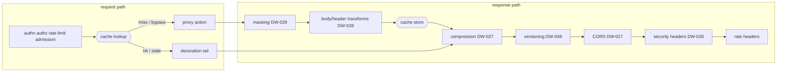

# Response caching (DW-037)

> Implements issue DW-037 (M2, feature analysis 5-Protocol "response
> caching") and DW-038 (5-Traffic "request coalescing", below).
> Sources: `crates/dwara-core/src/config/cache.rs` (the
> `RouteCache` shape, bounds, and `CompiledRouteCache` with the
> policy-derived vary folds and the DW-038 coalescing wait), the engine
> in `crates/dwara-core/src/dataplane/response_cache.rs` (lookup/store
> stages, keys, the entry envelope, epochs, stale-while-revalidate,
> request coalescing), the moka backend on the `CacheStore` seam
> (`crates/dwara-core/src/extensions/cache.rs`), the wiring in
> `dataplane/proxy.rs` (lookup after admission, store after the DW-028
> transforms, coalescing around the miss), the admin purge endpoint
> (`crates/dwara-admin/src/lib.rs`), and validation in
> `src/snapshot/mod.rs` (`validate_route_cache`).
> Tests: `crates/dwara-core/tests/caching.rs` (30, end to end through
> the real dataplane — ten of them the DW-038 pins) and
> `crates/dwara-core/tests/unit/response_cache.rs` (8,
> envelope/key/validator/veto grammar), plus the three purge tests in
> `crates/dwara-admin/tests/admin_api.rs`.
> Operator docs: [docs-site caching guide](../../docs-site/guide/caching.md).

An optional `cache` block on a proxy Route opts that route's cacheable
GET traffic into a local response cache held behind the
[`CacheStore`](./extension-points.md) extension seam (DW-004 — the
edition keystone; DW-068's Redis-backed store swaps in without touching
call sites). Default-off: a route without the block never buffers,
never stamps, never stores — byte-identical behavior to before.

```yaml
routes:
  - name: catalog
    service: catalog-service
    match:
      path: { type: prefix, value: /api/catalog }
    action: { type: proxy }
    cache:
      ttl_secs: 30                      # required, 1..=86400
      stale_while_revalidate_secs: 60   # optional, 0..=86400
      max_body_bytes: 1048576           # optional, default 1 MiB, 1..=16 MiB
      vary: [x-tenant]                  # optional extra key dimensions
      coalescing: { wait_ms: 5000 }     # optional (DW-038), default 5 s, 1..=60000
```

## Where the cache sits, and why exactly there



- **Lookup AFTER the policy phases**: a replayed response still
  consumed a rate-limit token and an admission slot, and the consumer
  identity (part of the key) only exists after authn. No policy is
  bypassed by a hit — the review posture for the whole feature.
- **Lookup BEFORE the breaker/endpoint pick**: a hit contacts no
  upstream, so it owes them nothing.
- **Store AFTER masking and transforms**: the stored bytes are exactly
  what THIS consumer would receive. Masking (DW-029) and the DW-028
  transforms are route-scoped, so replaying them per consumer is
  consistent — and the epoch invalidation below kills every entry the
  moment a route's shaping changes (pinned by test:
  `transform_change_never_replays_stale_shaped_bytes`).
- **Store BEFORE compression**: cached bodies are identity bytes;
  DW-027's compression re-negotiates `Accept-Encoding` per request on
  replay. The decoration tail from compression onward re-runs on every
  replayed response — security headers, CORS, versioning stamps, rate
  headers can never be bypassed by a hit.

## Cacheability (deterministic, closed rules)

A REQUEST is cacheable when: the route has a `cache` block and a proxy
action; the method is GET; the request carries no body, no
`Authorization`, no `Cookie`, and no `Upgrade`. Everything else stamps
`x-cache: bypass` (and counts `dwara_cache_lookups_total{outcome=
"bypass"}`) and flows through untouched — including HEAD in v1, whose
no-body replay framing deserves its own machinery.

A RESPONSE is storable when: the status is exactly 200; there is no
`Set-Cookie`; `Cache-Control` carries none of `no-store` / `private` /
`no-cache` (the only origin directives honored — the OPERATOR owns the
entry's lifetime via `ttl_secs`, deliberately not the origin); the body
is identity (no `Content-Encoding` — the gateway compresses on replay,
and a stored coded body could not be re-negotiated); and the response's
`Vary` is `*`-free and a subset of the route's effective vary set.

## Keys and the variance model

The key is `sha256("dwara-rc-v1" | route | epoch | consumer | path |
query | vary-name=value...)` — hex, never logged (paths and queries
carry tokens). The consumer component is what makes DW-029 interaction
safe: two consumers — or one consumer's group variants — can never see
each other's stored bytes.

Variance is DECLARED, not discovered: RFC 9111's response-driven
`Vary` requires enumerating stored entries (a two-level lookup) that an
opaque key-value `CacheStore` cannot express. The effective vary set is
the route's configured `vary` plus the dimensions the gateway's own
policies already promise: `Accept` when the route selects on
`match.accept` (DW-048), `Origin` when the route carries CORS (DW-027).
`Accept-Encoding` is deliberately NEVER a key dimension (stored bodies
are identity); the folded set is re-advertised through the tail's
`Vary` merges on every replay, and an upstream `Vary` naming anything
outside the set vetoes storage (the cache cannot prove it would key
correctly — `vary_uncovered`).

## Freshness, stale-while-revalidate, ETag

Fresh for `ttl_secs` (`x-cache: hit`, `Age` stamped). A client
`If-None-Match` matching the stored validator on a fresh entry answers
304 straight from the cache (weak comparison, RFC 9110 8.8.3). Within
`stale_while_revalidate_secs` past expiry the entry serves stale
(`x-cache: stale`) while ONE background revalidation runs per key (a
bounded in-flight set, at most 32 distinct keys — a mass expiry cannot
stampede; DW-038's request coalescing generalizes this later). Past the
window the fetch is conditional: the stored validator rides upstream as
`If-None-Match` (only when the client sent none — a client conditional
always wins the forwarded request), and an upstream 304 refreshes the
entry and serves the STORED body as 200 (`x-cache: revalidated` —
RFC 9111 4.3.4 forbids answering a 304 to a client that asked no
conditional).

The background revalidation is a minimal synthetic GET (the
vary-relevant headers plus the stored validator) through the full
forward path, then the same masking/transform/store stages. The shapes
that could not be reconstructed — body-bearing, credentialed, upgrade —
are exactly the shapes the request rules never cache.

## Request coalescing (DW-038)

Issue DW-038 (feature analysis 5-Traffic): collapse concurrent
identical cacheable GETs into ONE upstream call — the Varnish-style
"request coalescing" / single-flight miss. Done-when, pinned by
`concurrent_misses_collapse_to_one_upstream_call`: eight concurrent
misses on a coalescing-enabled route produce exactly one upstream
call; one response carries `x-cache: miss`, seven carry `x-cache:
hit` (the followers replayed the leader's stored entry).

Scope is deliberately the miss path of cache-enabled routes ONLY
(the issue's words: "concurrent identical CACHEABLE GETs"). A route
without a `cache` block never coalesces; a request shape the cache
bypasses (non-GET, credentialed, body-bearing, upgrade) never
coalesces (pinned by `bypassed_shapes_never_join_a_coalescing_leader`)
— in both cases there is no shared CACHEABLE outcome to
hand a follower, and inventing one (sharing unstored streamed bodies)
would break the zero-buffering posture. HEAD follows DW-037's bypass
rule for the same reason.

```text
miss + coalescing enabled
   |
   v
attach: key already has a leader? ---- yes --> FOLLOWER: park (<= wait_ms)
   | no, map has room                                     | leader publishes
   v                                                       v
LEADER: normal fetch + store ------------------------> re-read store:
   | no room (256 keys in flight)                    entry? replay as hit
   v                                                  else: own fetch
SOLO: normal fetch, never joined
```

Design decisions, each load-bearing:

- **The coalescing key IS the cache key** (route epoch, consumer,
  path, query, vary — `derive_key`): a follower can only be handed an
  outcome computed for a byte-identical request shape of its own
  consumer and generation. Per-consumer isolation (the DW-029 masking
  interaction) is inherited from the key, not reimplemented; pinned by
  `distinct_vary_values_never_coalesce` (vary dimension) and
  `consumers_never_coalesce_across_identities` (consumer identity).
- **The STORE is the share point.** The leader's store stage
  completes before its guard publishes; a woken follower re-reads the
  store and replays the entry with the same `serve_from_entry` path a
  hit uses. No response objects, bodies, or channels cross tasks —
  the follower's replay is literally a cache hit that happened while
  it waited, so every replay guarantee (post-mask bytes, decoration
  tail re-run, Age stamping) holds by construction.
- **Failures are never inherited** (pinned by
  `unstoreable_leader_outcome_never_reaches_followers`): a leader that
  finishes without a storable outcome (vetoed, non-200, over-cap,
  upstream error) publishes nothing, and every follower runs its own
  fetch through the full proxy path — route retry policy included.
  A follower never sees the leader's error, and never sees an unstored
  body that would have had to be buffered to be shared.
- **Epoch flip strands followers open** (pinned by
  `epoch_flip_midflight_strands_followers_open`): the follower checks
  the epoch FIRST on wake; a purge or config change mid-flight sends
  it to its own fetch — a dead generation's answer is never served,
  and the leader's own store write was already dropped by the store
  stage's epoch guard.
- **Bounded waiting** (`coalescing.wait_ms`, default 5 s, validated
  1..=60000; pinned by `follower_timeout_fails_open_to_its_own_fetch`):
  on expiry the follower simply fetches. Coalescing gave up; the
  client must never learn about it.
- **Bounded map** (`MAX_COALESCING_KEYS = 256` leader slots; pinned
  by `leader_map_saturation_fails_open`): slots hold-while-in-flight,
  remove-at-completion, refuse-at-capacity — an in-flight leader is
  never preempted (its followers are parked on it). Past the cap a
  miss never joins: an uncounted independent fetch.
- **The publish is a Drop guard** (`CoalesceLead`): a leader that
  panics or whose future is cancelled (client disconnect) still
  removes its slot and wakes its followers — they find nothing
  shareable and fetch on their own. The DW-037 `InflightGuard`
  pattern, applied to publication.
- **No interaction risk with SWR revalidation** (pinned by
  `swr_revalidation_and_coalescing_do_not_deadlock`): the revalidation
  in-flight set and the coalescing leader map are disjoint state with
  no shared locks and no cross-waiters — the revalidation path
  (`spawn_revalidate` -> `store_stage`) never touches the coalescing
  map, and a coalescing follower never waits on a revalidation. A
  parked background revalidation on one key cannot delay a coalesced
  miss on another.

Placement: coalescing resolves inside the cache-miss arm of the
lookup, which sits AFTER maintenance/limits/authn/authz/rate
limiting/admission and BEFORE the proxy action — so a maintenance 503
short-circuits before coalescing exists, and a follower has already
paid its own policy dues (rate-limit token, admission slot) before it
parks. No policy is bypassed by following, and short-circuit
responses are never coalesced.

## Invalidation: epochs, not sweeps

Entries record the route's cache EPOCH at store time; a lookup under a
different epoch is a miss and drops the entry. Epochs advance on:

- **Purge** (`POST /cache/purge` on the admin API, body
  `{"route": "<name>"}` or `{"all": true}`): an O(1) map write — which
  is why purge is under 100 ms at ANY store size; the opaque backend is
  never enumerated. The response names what was invalidated and the
  epoch it reached.
- **A config publish that changes a route** (`Route`-equality diff at
  every `DataPlane::refresh`): stored bytes were shaped by the old
  masking/transform/cache policy, so any change to the route's
  definition invalidates that route's entries. Unchanged routes — and
  unrelated config edits — leave the cache warm. This is stricter than
  "only cache-block changes flush": a transforms-only edit also
  invalidates, because replaying old-shaped bytes would be wrong.

Unreachable entries cost nothing but memory until the store's
byte-weighed eviction reclaims them.

## Runtime state, not config

The store, the epoch map, the revalidation in-flight set, and the
coalescing leader map live on the
[`DataPlane`](./dataplane-proxy.md) (like the priority counters), so a
reload never drops a warm cache. A changed `cache` block applies to NEW
lookups — freshness is computed from the CURRENT policy at read time —
and the epoch rule retires entries stored under the old one (and
strands any in-flight coalescing waiters into their fail-open fetch,
above).

## Bounds (the zero-buffering edge)

The moka backend is bounded BY BYTES (64 MiB default capacity; the
weigher counts key + value + a fixed per-entry overhead), per-entry TTL
(policy TTL + SWR window + 60 s slack — read-side expiry always fires
first), and one hour of time-to-idle. Response buffering happens only
on the store path of a cache-enabled route, capped at
`max_body_bytes`: a body that crosses the cap mid-stream stops
buffering and streams on through the buffered prefix plus the untouched
remainder — exactly as if no cache existed (`over_cap` store outcome).

## Metrics (closed label sets)

| Family | Labels | Meaning |
| --- | --- | --- |
| `dwara_cache_lookups_total` | `outcome` = hit / stale / miss / bypass | one per request on a cache-configured route, decided at lookup |
| `dwara_cache_stores_total` | `outcome` = stored / vetoed / over_cap / error | one per cacheable fetch that reached the store stage |
| `dwara_cache_revalidated_total` | — | responses served from the stored body after an upstream 304 |
| `dwara_cache_purges_total` | `scope` = route / all | purge operations |
| `dwara_cache_entries` | — | scrape-time snapshot of the store's approximate entry count |
| `dwara_coalescing_leaders_total` | — | misses that became the coalescing leader (DW-038) |
| `dwara_coalescing_followers_total` | `outcome` = served / fell_back_timeout / fell_back_unshared / fell_back_epoch | follower resolutions; a closed four-value set |
| `dwara_coalescing_saved_upstream_calls_total` | — | upstream calls avoided (one per served follower) |
| `dwara_coalescing_waiters` | — | requests currently parked as followers |

The four coalescing families total seven series, fixed (the label set
is closed; no route, consumer, or key labels — the same cardinality
discipline as the cache families).

`x-cache` values on responses: `hit`, `stale`, `miss`, `bypass`,
`revalidated` (a miss resolved by a 304 confirmation — the lookup
counter logged it as a miss).
