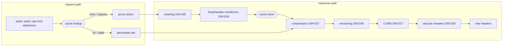

# Response caching (DW-037)

> Implements issue DW-037 (M2, feature analysis 5-Protocol "response
> caching"). Sources: `crates/dwara-core/src/config/cache.rs` (the
> `RouteCache` shape, bounds, and `CompiledRouteCache` with the
> policy-derived vary folds), the engine in
> `crates/dwara-core/src/dataplane/response_cache.rs` (lookup/store
> stages, keys, the entry envelope, epochs, stale-while-revalidate),
> the moka backend on the `CacheStore` seam
> (`crates/dwara-core/src/extensions/cache.rs`), the wiring in
> `dataplane/proxy.rs` (lookup after admission, store after the DW-028
> transforms), the admin purge endpoint (`crates/dwara-admin/src/lib.rs`),
> and validation in `src/snapshot/mod.rs` (`validate_route_cache`).
> Tests: `crates/dwara-core/tests/caching.rs` (20, end to end through
> the real dataplane) and `crates/dwara-core/tests/unit/
> response_cache.rs` (8, envelope/key/validator/veto grammar), plus the
> three purge tests in `crates/dwara-admin/tests/admin_api.rs`.
> Operator docs: [docs-site caching guide](../../docs-site/guide/caching.md).

An optional `cache` block on a proxy Route opts that route's cacheable
GET traffic into a local response cache held behind the
[`CacheStore`](./extension-points.md) extension seam (DW-004 — the
edition keystone; DW-068's Redis-backed store swaps in without touching
call sites). Default-off: a route without the block never buffers,
never stamps, never stores — byte-identical behavior to before.

```yaml
routes:
  - name: catalog
    service: catalog-service
    match:
      path: { type: prefix, value: /api/catalog }
    action: { type: proxy }
    cache:
      ttl_secs: 30                      # required, 1..=86400
      stale_while_revalidate_secs: 60   # optional, 0..=86400
      max_body_bytes: 1048576           # optional, default 1 MiB, 1..=16 MiB
      vary: [x-tenant]                  # optional extra key dimensions
```

## Where the cache sits, and why exactly there



- **Lookup AFTER the policy phases**: a replayed response still
  consumed a rate-limit token and an admission slot, and the consumer
  identity (part of the key) only exists after authn. No policy is
  bypassed by a hit — the review posture for the whole feature.
- **Lookup BEFORE the breaker/endpoint pick**: a hit contacts no
  upstream, so it owes them nothing.
- **Store AFTER masking and transforms**: the stored bytes are exactly
  what THIS consumer would receive. Masking (DW-029) and the DW-028
  transforms are route-scoped, so replaying them per consumer is
  consistent — and the epoch invalidation below kills every entry the
  moment a route's shaping changes (pinned by test:
  `transform_change_never_replays_stale_shaped_bytes`).
- **Store BEFORE compression**: cached bodies are identity bytes;
  DW-027's compression re-negotiates `Accept-Encoding` per request on
  replay. The decoration tail from compression onward re-runs on every
  replayed response — security headers, CORS, versioning stamps, rate
  headers can never be bypassed by a hit.

## Cacheability (deterministic, closed rules)

A REQUEST is cacheable when: the route has a `cache` block and a proxy
action; the method is GET; the request carries no body, no
`Authorization`, no `Cookie`, and no `Upgrade`. Everything else stamps
`x-cache: bypass` (and counts `dwara_cache_lookups_total{outcome=
"bypass"}`) and flows through untouched — including HEAD in v1, whose
no-body replay framing deserves its own machinery.

A RESPONSE is storable when: the status is exactly 200; there is no
`Set-Cookie`; `Cache-Control` carries none of `no-store` / `private` /
`no-cache` (the only origin directives honored — the OPERATOR owns the
entry's lifetime via `ttl_secs`, deliberately not the origin); the body
is identity (no `Content-Encoding` — the gateway compresses on replay,
and a stored coded body could not be re-negotiated); and the response's
`Vary` is `*`-free and a subset of the route's effective vary set.

## Keys and the variance model

The key is `sha256("dwara-rc-v1" | route | epoch | consumer | path |
query | vary-name=value...)` — hex, never logged (paths and queries
carry tokens). The consumer component is what makes DW-029 interaction
safe: two consumers — or one consumer's group variants — can never see
each other's stored bytes.

Variance is DECLARED, not discovered: RFC 9111's response-driven
`Vary` requires enumerating stored entries (a two-level lookup) that an
opaque key-value `CacheStore` cannot express. The effective vary set is
the route's configured `vary` plus the dimensions the gateway's own
policies already promise: `Accept` when the route selects on
`match.accept` (DW-048), `Origin` when the route carries CORS (DW-027).
`Accept-Encoding` is deliberately NEVER a key dimension (stored bodies
are identity); the folded set is re-advertised through the tail's
`Vary` merges on every replay, and an upstream `Vary` naming anything
outside the set vetoes storage (the cache cannot prove it would key
correctly — `vary_uncovered`).

## Freshness, stale-while-revalidate, ETag

Fresh for `ttl_secs` (`x-cache: hit`, `Age` stamped). A client
`If-None-Match` matching the stored validator on a fresh entry answers
304 straight from the cache (weak comparison, RFC 9110 8.8.3). Within
`stale_while_revalidate_secs` past expiry the entry serves stale
(`x-cache: stale`) while ONE background revalidation runs per key (a
bounded in-flight set, at most 32 distinct keys — a mass expiry cannot
stampede; DW-038's request coalescing generalizes this later). Past the
window the fetch is conditional: the stored validator rides upstream as
`If-None-Match` (only when the client sent none — a client conditional
always wins the forwarded request), and an upstream 304 refreshes the
entry and serves the STORED body as 200 (`x-cache: revalidated` —
RFC 9111 4.3.4 forbids answering a 304 to a client that asked no
conditional).

The background revalidation is a minimal synthetic GET (the
vary-relevant headers plus the stored validator) through the full
forward path, then the same masking/transform/store stages. The shapes
that could not be reconstructed — body-bearing, credentialed, upgrade —
are exactly the shapes the request rules never cache.

## Invalidation: epochs, not sweeps

Entries record the route's cache EPOCH at store time; a lookup under a
different epoch is a miss and drops the entry. Epochs advance on:

- **Purge** (`POST /cache/purge` on the admin API, body
  `{"route": "<name>"}` or `{"all": true}`): an O(1) map write — which
  is why purge is under 100 ms at ANY store size; the opaque backend is
  never enumerated. The response names what was invalidated and the
  epoch it reached.
- **A config publish that changes a route** (`Route`-equality diff at
  every `DataPlane::refresh`): stored bytes were shaped by the old
  masking/transform/cache policy, so any change to the route's
  definition invalidates that route's entries. Unchanged routes — and
  unrelated config edits — leave the cache warm. This is stricter than
  "only cache-block changes flush": a transforms-only edit also
  invalidates, because replaying old-shaped bytes would be wrong.

Unreachable entries cost nothing but memory until the store's
byte-weighed eviction reclaims them.

## Runtime state, not config

The store, the epoch map, and the in-flight set live on the
[`DataPlane`](./dataplane-proxy.md) (like the priority counters), so a
reload never drops a warm cache. A changed `cache` block applies to NEW
lookups — freshness is computed from the CURRENT policy at read time —
and the epoch rule retires entries stored under the old one.

## Bounds (the zero-buffering edge)

The moka backend is bounded BY BYTES (64 MiB default capacity; the
weigher counts key + value + a fixed per-entry overhead), per-entry TTL
(policy TTL + SWR window + 60 s slack — read-side expiry always fires
first), and one hour of time-to-idle. Response buffering happens only
on the store path of a cache-enabled route, capped at
`max_body_bytes`: a body that crosses the cap mid-stream stops
buffering and streams on through the buffered prefix plus the untouched
remainder — exactly as if no cache existed (`over_cap` store outcome).

## Metrics (closed label sets)

| Family | Labels | Meaning |
| --- | --- | --- |
| `dwara_cache_lookups_total` | `outcome` = hit / stale / miss / bypass | one per request on a cache-configured route, decided at lookup |
| `dwara_cache_stores_total` | `outcome` = stored / vetoed / over_cap / error | one per cacheable fetch that reached the store stage |
| `dwara_cache_revalidated_total` | — | responses served from the stored body after an upstream 304 |
| `dwara_cache_purges_total` | `scope` = route / all | purge operations |
| `dwara_cache_entries` | — | scrape-time snapshot of the store's approximate entry count |

`x-cache` values on responses: `hit`, `stale`, `miss`, `bypass`,
`revalidated` (a miss resolved by a 304 confirmation — the lookup
counter logged it as a miss).
