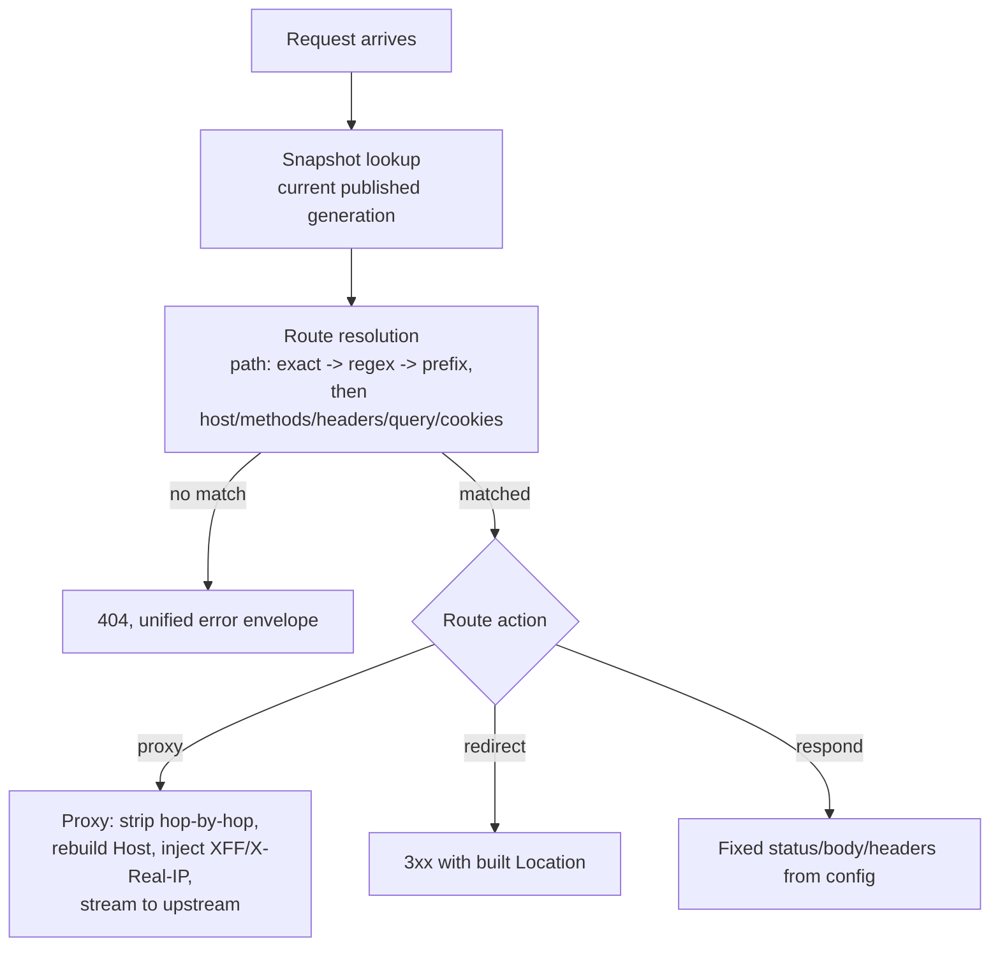

# Dataplane and proxy

Source: `crates/dwara-core/src/dataplane/proxy.rs` (DW-009),
`dataplane/hardening.rs` (DW-023). Tests: `proxy`, `proxy_coverage`
(dwara-core); `hello_listener`, `protocol_hardening` (dwara-bin).

## Per-request flow

The full gateway-wide ordering (auth, rate limiting, admission,
breaker) around this diagram is documented from the operator's angle
in the docs-site
[architecture overview](../../docs-site/architecture/overview.md#request-pipeline); this
page focuses on what happens inside the `proxy` action itself once
policy has already let the request through.

## Streaming, zero default buffering

No code on the proxy path collects a request or response body. The
request body streams to the pooled upstream client frame-by-frame; the
upstream's response is forwarded untouched (after hop-by-hop stripping)
using hyper's natural frame-based backpressure — the gateway never
spawns an unbounded buffering task to "help" a slow consumer. This is
what makes Server-Sent Events and large uploads/downloads work through
the gateway without a size cap, and it is a repo-wide invariant (see
[`AGENTS.md`](../../AGENTS.md#conventions): "any change that introduces
buffering must be opt-in and size-capped").

## Host header and forwarded headers

The outbound `Host` header is rebuilt to the **upstream's** authority
(`address:port` of the picked endpoint), never the inbound host — a
deliberate v1 choice: the gateway, not the client, names the origin it
actually dials, so a backend never receives a `Host` value that
doesn't correspond to where the connection really came from.

`X-Forwarded-For` / `X-Real-IP` follow one frozen rule each:

- **`X-Forwarded-For`**: if the direct TCP peer is inside
  `gateway.trusted_proxies`, the inbound `X-Forwarded-For` value is
  kept and the peer is appended (`"<inbound>, <peer>"`). Otherwise
  (including the default empty trusted-proxies list — trust nobody by
  default) the inbound header is **discarded** and replaced with
  exactly the peer address. This is what stops a spoofed forwarding
  chain from an untrusted client ever reaching the upstream.
- **`X-Real-IP`**: always the direct peer. When the peer is itself a
  trusted proxy this reads as "the last trusted hop"; when the peer is
  the client, it reads as the client. One rule, no configuration
  surface, so there's nothing to misconfigure.

This same effective-client-IP resolution is reused by IP-ACL
authorization (see [authn/authz](./authn-authz.md)) and `ip_hash` load
balancing — one notion of "who is really calling" shared across every
subsystem that needs it.

## Route matching precedence

See [Architecture: the config lifecycle](../architecture.md#the-config-lifecycle)
for how exact/regex/prefix routes are compiled; the cross-kind order
(exact beats regex beats prefix, always) is fixed regardless of
declaration order specifically so that a config author can't
accidentally reorder their way into a different route winning.

## Path rewrite

A `proxy` action carries at most one `rewrite` (no chaining — chained
rewrites would make "what path actually reaches the upstream" require
simulating N steps instead of reading one block):

- `strip_prefix` — removes the route's matched prefix; an empty result
  becomes `/`.
- `replace_prefix` — swaps a literal prefix for a replacement (falls
  through unchanged if the request path doesn't start with `prefix`).
- `regex` — replaces the first match of `pattern`, substitution may
  reference numbered/named capture groups or the route's own
  `{param}` captures. The pattern is compiled (and thus any invalid
  regex is caught) at config-compile time, never at request time — a
  bad regex fails a `dwara-cli validate`, not a live request under
  load.

The query string is always re-attached verbatim after any path
rewrite — rewrites are path-only by design.

## Protocol upgrades

An HTTP/1.1 request carrying an `Upgrade` header is forwarded with
`Upgrade`/`Connection` intact; a `101` response from the upstream
upgrades both connections (`hyper::upgrade::on` on each side) and
splices them byte-for-byte with `tokio::io::copy_bidirectional` until
either side closes — generic tunneling, not WebSocket-specific logic.
An `Upgrade` request arriving over HTTP/2 or h2c is answered `501 Not
Implemented`: extended CONNECT (the h2-native upgrade mechanism) is
out of scope for v1.

## Upstream error classification

Failure details are logged server-side only; the client sees a
classified status with no upstream internals:

| Cause | Status |
| --- | --- |
| Connect timeout / per-attempt read timeout | 504 |
| Endpoint refused / pool failure / no endpoints | 502 |
| Invalid upstream TLS configuration | 500 |

A **mid-body** abort (the upstream connection dies partway through a
response body already streaming to the client) is different from all
of the above: the attempt already resolved its headers, so it is
final — not retryable — and any bytes already forwarded to the client
end abruptly with no synthesized tail (HTTP/1.1 truncation semantics).
It is still reported as a passive-health failure for the endpoint that
was picked (closing what would otherwise be a gap between "the
response looked fine at header time" and "the stream then died"), so a
chronically flaky-mid-stream endpoint still gets ejected by
[passive health](./resilience.md#passive-health-outlier-detection).

## Retries, from the proxy's side

Retry policy itself lives on the upstream (see
[Resilience](./resilience.md#retries)); what matters here is where
retries slot into the per-request flow: the balancer re-picks an
endpoint for every attempt (so health ejection naturally routes a
retry away from a just-failed endpoint), and each attempt gets its own
`read_ms` deadline.

## Protocol hardening

Two independent defenses wrap every serving surface (data-plane and
admin listeners alike), documented from the operator's side in
[Operations](../../docs-site/guide/operations.md#protocol-hardening). Two implementation
details worth knowing as a contributor:

- CL+TE smuggling needs **no explicit defense code** in this module:
  hyper 1.x's HTTP/1 parser already rejects a request carrying both
  `Content-Length` and `Transfer-Encoding`, and dwara never passes raw
  bytes to an upstream — every forwarded request is rebuilt from
  hyper-parsed parts, so a "smuggled second request" would require
  hyper itself to mis-parse the first one. Both properties are pinned
  by smuggling-corpus integration tests in `dwara-bin`.
- The pre-parse sniff that inspects the first request head is a
  **per-read**, not a total-head-budget, defense: a client trickling
  one byte at a time, each individual read inside
  `DWARA_HTTP1_HEADER_TIMEOUT_MS`, keeps every sniff read "successful."
  The fallback for that case is hyper's own per-head
  `header_read_timeout`, installed on the connection builder with the
  same knob value and a `TokioTimer` (hyper disables that timeout
  entirely when no timer is configured) — the sniff owns each
  individual read, hyper owns the head as a whole, so neither a
  stalled connection nor a slow trickle can hold a listener resource
  hostage indefinitely.
