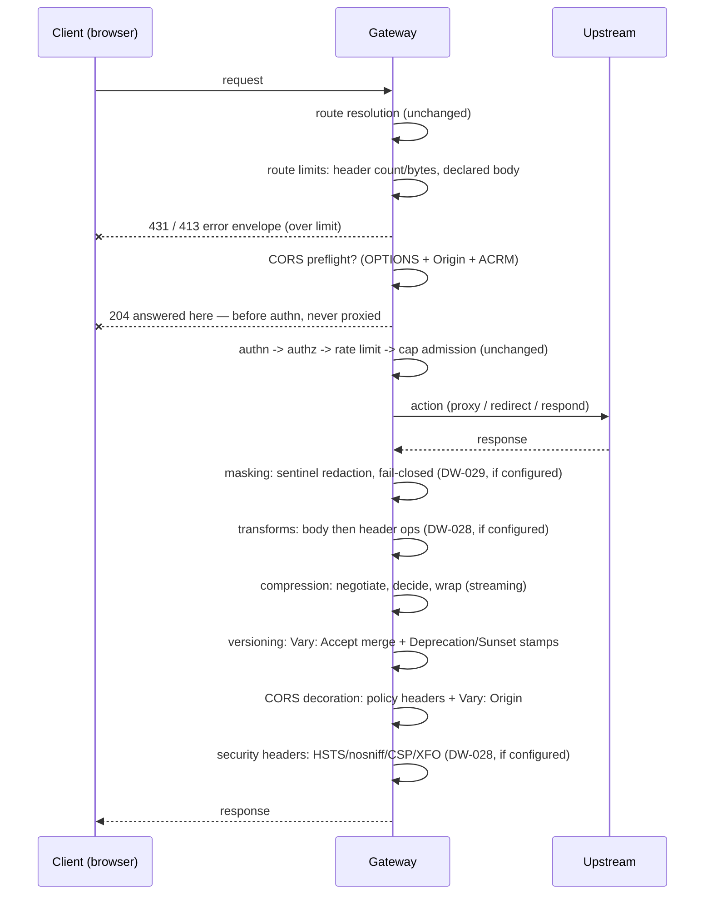

# Route edge policies: CORS, compression, request limits

Source: `crates/dwara-core/src/dataplane/cors.rs`,
`dataplane/compression.rs`, and the route-limit half of
`dataplane/hardening.rs` (DW-027, issue #28). Config types in
`src/config/mod.rs` (plus the snapshot-compiled matchers
`CompiledCorsOrigins` / `CompiledContentTypeFilter`), validation in
`src/snapshot/mod.rs`. Tests: `cors_compression_limits` (dwara-core,
22 tests) and `tests/unit/hardening.rs` (`merge_vary` folding).

Three optional blocks on a Route — `cors`, `compression`, `limits` —
govern what crosses the gateway's edge: the browser cross-origin
contract, the response's wire size, and how large a request may be.
All three are default-off; a route without a block behaves exactly as
it did before DW-027 (bytes forwarded untouched, no CORS headers).

## Why route blocks, not Policy attachments

The frozen Policy machinery (consumer > route > service > listener >
global, deny-anywhere-wins) exists for **restrictions that stack**:
an authorization deny at any level is absolute, and rate-limit rules
at all attached levels AND together (#123). Those composition rules
work because every level is voicing a veto.

These three blocks are different: each produces **one transformation
of one request/response pair** — one preflight answer, one encoding
decision, one limit set. There is nothing to compose. Two different
origin lists cannot both govern one `Access-Control-Allow-Origin`;
"most specific wins" would silently ignore a configured level, and
"AND together" would fabricate a policy no level actually wrote. One
route, one policy — so the blocks are inline on the route (no
`policies:` indirection) and auditing a route's edge behavior means
reading that route.

Limits are the closest of the three to a stacking restriction, but a
route's `max_body_bytes` describes **its own upstream's contract**
(the largest upload that backend accepts), which only the route
knows; caller-volume caps are already rate limiting's job.

## The request path through the edge

Interception points, in order (see `proxy::handle`):

1. **Route limits** (`hardening::check_route_limits`): immediately
   after route resolution — header count first, then header bytes,
   then the declared body size. 431 (`request_headers_too_large`) /
   413 (`request_body_too_large`) in the JSON envelope. Before the
   CORS preflight check and before authn: an oversized head cannot
   buy a preflight answer, and a declared-oversized body is rejected
   with **zero upstream contact**.
2. **CORS preflight short-circuit** (`cors::is_preflight` +
   `cors::preflight_response`): an `OPTIONS` request carrying both
   `Origin` and `Access-Control-Request-Method` on a CORS-configured
   route is answered 204 by the gateway and never forwarded. Runs
   **before authn** on purpose: browsers send preflights without
   credentials, so gating them on authn would break every
   credentialed route; they are also pure metadata probes, so
   admitting them to the concurrency cap would let a hostile page
   burn slots cheaply. A preflight that fails policy validation is
   still short-circuited — 204 with **no** CORS headers (fail-closed;
   the browser reads that as a failed preflight). A plain `OPTIONS`
   without the markers is not intercepted and proxies normally.
3. Auth pipeline and the action run unchanged (see
   [authn-authz](./authn-authz.md),
   [dataplane-proxy](./dataplane-proxy.md)).
4. **Response side, after the action**: compression first
   (`compression::decide` + `wrap_response` — it rewrites the
   response's framing: drops `Content-Length`, sets
   `Content-Encoding`, merges `Vary: Accept-Encoding`), then the
   API-versioning stamps (`Vary: Accept` merge on accept-selected
   routes + the Deprecation/Sunset headers — see
   [API versioning](./versioning.md)), then CORS
   decoration (`cors::decorate_actual` — additive headers only),
   then the existing rate-limit response headers. Each stage appends
   only after the previous one's rewrites, so the client-facing
   header set is the composition of all of them.

## CORS

One `Cors` policy, two phases (the `cors.rs` module docs own the full
rationale):

- **Origins**: a closed set of exact origins compared in normalized
  form, or the single entry `*`. The normalization grammar lives in
  `config::normalize_origin` (lowercase scheme/host, default port
  dropped, no userinfo, no path/query) so validation and the runtime
  matcher share one grammar — the same shared-grammar precedent as
  `config::net.rs` for IP/CIDR. Config entries are normalized once at
  snapshot-compile time into `config::CompiledCorsOrigins` (stored per
  route in the `RouteTable`), so the request path normalizes only the
  request's own `Origin`. Subdomain wildcards (`*.example.com`) are
  deliberately not offered in v1: an explicit origin list is auditable,
  a wildcard is not.
- **Preflight response**: `Access-Control-Allow-Origin` echoes the
  request origin under a specific list (the allowed set is closed, so
  the echo IS the policy decision); `*` only under the wildcard
  config. `Access-Control-Allow-Headers` echoes the requested list
  under a `*` headers policy, the configured list otherwise. Always
  carries `Vary: Origin, Access-Control-Request-Method,
  Access-Control-Request-Headers` so a shared cache cannot serve one
  origin's preflight answer to another.
- **Actual responses** (every action: proxy, redirect, respond):
  `Access-Control-Allow-Origin`, `Access-Control-Allow-Credentials`
  and `Access-Control-Expose-Headers` when configured, and
  `Vary: Origin` merged into any existing `Vary` — all existing
  `Vary` lines folded — (`hardening::merge_vary`). A request whose
  origin is not allowed
  gets no CORS headers — same-origin and no-cors reads never consult
  CORS. Decoration is applied to **action responses**; the gateway's
  own error envelopes (the 401/403/429/413/431 short-circuits above)
  return before the decoration point, so a browser may surface them
  as opaque network errors rather than the underlying status.
- **Routes must list `OPTIONS` in `match.methods`**: a preflight
  whose route method list excludes `OPTIONS` never resolves the route
  at all (404, the documented request-path order) — the method match
  runs before any CORS logic.

Validation (snapshot): non-empty origin list; `*` alone (never mixed
with specific origins); `*` origins or `*` headers never combined
with `allow_credentials` (the Fetch spec forbids wildcard-credentialed
responses); valid method tokens and header names; every origin must
normalize (userinfo-bearing authorities such as
`https://user@host` are rejected — browsers never send them).

## Compression

One `Compression` policy per route, two steps (the `compression.rs`
module docs own the full rationale):

- **Negotiation** (`negotiate`): the first algorithm of the policy's
  preference order the request's `Accept-Encoding` accepts wins;
  `q=0` codings are refusal, `*` accepts any. No acceptable overlap
  means identity — the gateway never answers 406 over compression.
  Note the spelling split: config entries are the lowercase variant
  names (`gzip`, `brotli`, `zstd`), while the wire token for brotli
  is `br`.
- **Eligibility** (`decide`): never 1xx/204/304 (body-less), never
  101 (the body becomes the tunneled connection), never a body that
  already carries `Content-Encoding` (double-compressing a jpeg grows
  it and corrupts content negotiation), never a zero length, never
  below `min_size` when the size is known — a declared
  `Content-Length` or the body's exact size hint (the gateway's own
  respond/redirect bodies carry no `Content-Length`, but their size is
  exact, so a tiny static body or an empty 302 is never wrapped in a
  ~23-byte gzip container). Responses of unknown length (streaming)
  are always candidates. Content-type rules: an include list
  (empty = all) of lowercase prefixes, then an exclude list that wins
  after it — "compress everything `text/` except
  `text/event-stream`" is expressible; both lists are precompiled
  (lowercased once at snapshot-compile time into
  `config::CompiledContentTypeFilter`).
- **Encoding** (`CompressedBody`): chunk-by-chunk — every data frame
  goes through the codec and is flushed (sync-flush for
  gzip/brotli, block flush for zstd), and whatever the codec produced
  becomes the next frame. The gateway never buffers a whole body to
  compress it; the only buffering is the codec's own bounded working
  set. Per-chunk flush costs a little ratio and buys streaming
  correctness: a trickling upstream (SSE) reaches the client per
  chunk. Trailers observed on the inner stream are re-emitted after
  the compressed bytes — the codec is finished and its tail bytes
  drained as DATA frames BEFORE the trailers frame goes out (h2
  upstreams deliver trailers; data-after-trailers is a framing
  violation). A codec failure mid-stream ends the response
  like an upstream abort — already-forwarded frames stand, no
  synthesized tail.
- **Cache correctness**: `Content-Length` is dropped on compression
  (the encoded length differs); `Vary: Accept-Encoding` is merged
  into **every** non-already-encoded response on the route,
  compressed or not, so a shared cache keys skipped candidates
  (too small, wrong type, no acceptable coding) alongside their
  compressed siblings. The merge (`hardening::merge_vary`) folds
  every existing `Vary` field line into one value — upstreams that
  send `Vary` as several lines lose no tokens through the gateway.
- **One `level` field, three ranges**: validation bounds `level` to
  0-22; the per-algorithm clamp (gzip 0-9, brotli 0-11, zstd 0-22)
  happens at encode time so a single config value works across
  algorithms. Absent `level` uses per-algorithm defaults 6/5/3 —
  zstd 3 and brotli 5 sit at the fast end of their useful range, the
  right bias for a per-route default on a hot proxy path.

**Why std-codec wrappers instead of tower-http layers:** the dataplane
owns its streaming contract — `ProxyBody` (now `Full` / `Upstream` /
`Compressed`) carries the DW-014 write-timeout knobs, trailer
pass-through, and upgrade semantics, and a tower layer would wrap
responses in its own body type outside that contract. Per-chunk flush
control (the SSE property above) needs the wrapper to own the codec.
And tower-http is a large dependency tree for one layer; the three
Write-based encoders (flate2, brotli, zstd) are the primitives, all
permissively licensed (`deny.toml` clean) — the addition was flagged
per the AGENTS.md dependency rule.

## Limits

Enforcement lives in `hardening.rs` beside the process-wide parser
bounds (see [protocol hardening](./protocol-hardening.md); those env
knobs still apply beneath the route limits):

- `max_header_count` counts header **field lines**, not distinct
  names — the same reading as hyper's own max-headers bound: a header
  sent twice counts twice.
- `max_header_bytes` is the sum of all header name + value bytes.
- `max_body_bytes` has two halves: a `Content-Length` above the cap
  is rejected 413 before any upstream contact; a body of unknown
  length (chunked, h2 without content-length) is wrapped in the
  counting `LimitedBody`, which errors the moment the running total
  crosses the cap — the client gets 413 when the failure precedes
  the upstream's response headers, a torn stream otherwise. The
  wrapper is a thin passthrough when no cap is set, so the proxy
  wraps unconditionally.

Validation: a `limits` block with no field set is rejected (always an
authoring mistake — omit the block); every set value must be > 0.

`limits.dry_run` (DW-041) stages the block against live traffic
instead of enforcing it: the cheap up-front checks above still
evaluate, every would-be 413/431 is logged and counted, and the
request proceeds — with the streaming `LimitedBody` guard left
unarmed (the one blind spot). See
[maintenance mode and policy dry-run](./maintenance-dry-run.md).

## Config, reload, tests

All three blocks are strict-schema (`deny_unknown_fields`) additive
Route fields; `config-reference.json` is regenerated with them. They
carry no runtime state, so a hot reload swaps them atomically with
the route table — no counters to survive, nothing to migrate.

Tests: `crates/dwara-core/tests/cors_compression_limits.rs` — 22
integration tests against a live gateway and real backends,
including preflight fail-closed shapes, the OPTIONS-not-in-methods
404, q-value and wildcard negotiation, 204/304 never compressed,
limits' 413-before-upstream-contact and mid-stream abort, the
compression + CORS composition on one route, respond/redirect bodies
respecting `min_size` through their exact size hint, multi-line
upstream `Vary` folding, and (over a real h2 TLS upstream) the
codec-tail-before-trailers ordering of compressed streams.

For the operator-facing configuration shapes, see the docs-site
[guide](../../docs-site/guide/edge-policies.md).
