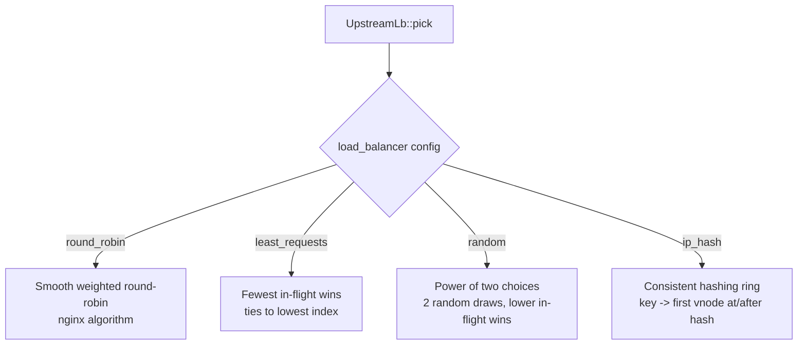
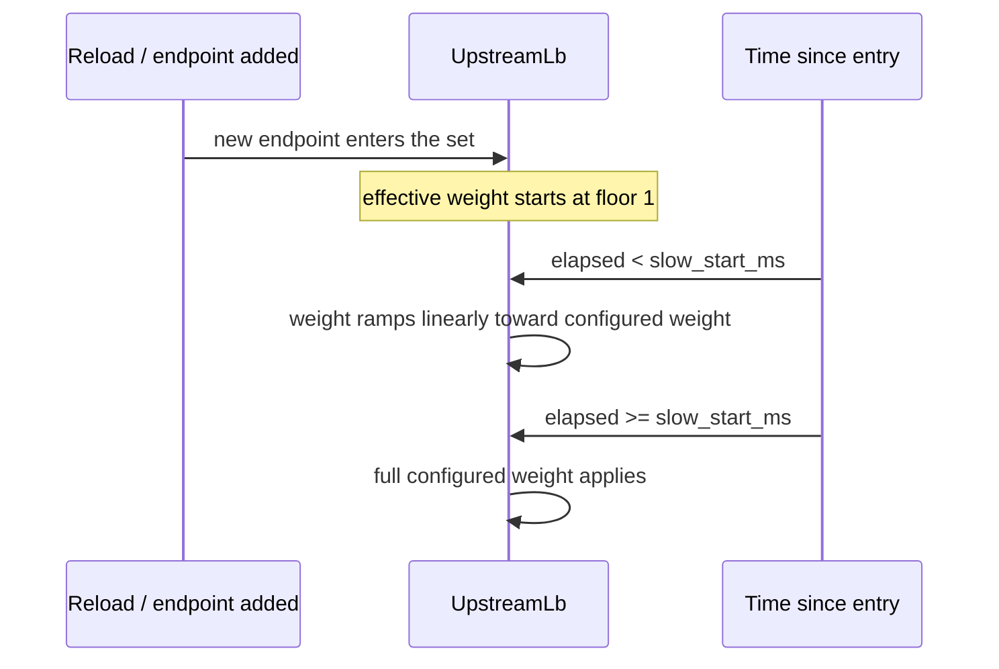

# Load balancing

Source: `crates/dwara-core/src/dataplane/balance.rs` (DW-011). Tests:
`balancing`, `swap_stress` (concurrent rebuild-under-load).

## Lock-free by construction

One `UpstreamLb` per upstream holds its endpoint set behind an
`ArcSwap` (`LbState`), so `UpstreamLb::pick` is lock-free on the hot
path: it loads the current state snapshot and runs the configured
algorithm with no mutex anywhere in the pick. Endpoint mutation happens
only on a config reload, via `UpstreamLb::rebuild`, which swaps in a
new state atomically — this is the same swap-not-mutate pattern the
config `Snapshot` and the TLS material use (see
[Architecture](../architecture.md#hot-reload) and
[TLS](./tls.md#hot-reload)), applied one level further down: an
in-flight request holding an older `LbState` keeps working against it
even while a reload rebuilds the set underneath.

## The four algorithms

- **`round_robin`** — smooth weighted round-robin: each pick adds every
  endpoint's effective weight to its running `current_weight`, selects
  the maximum, and subtracts the total from the winner. Weights
  `{5,1,2}` produce the classic interleave `a a b a c a a` — over any
  full period (sum of weights) each endpoint is picked exactly its
  weight many times. Deterministic, not random — useful when you need
  a reproducible traffic split.
- **`least_requests`** — the endpoint with the fewest in-flight
  requests wins (ties to lowest index). **Slow start does not apply
  here**, deliberately: least-conn already balances on observed load
  rather than static weights, so a ramping endpoint naturally receives
  less traffic while others are busier — the same conservative effect
  slow-start would add, without inventing a weight model for an
  algorithm that doesn't use weights.
- **`random`** — "power of two choices": two distinct endpoints are
  drawn uniformly at random and the one with the lower in-flight count
  wins (ties to lower index). At large fan-out this converges toward
  least-conn's behavior at a fraction of the coordination cost (no
  need to track a running weight state), which is why it scales well
  with many endpoints.
- **`ip_hash`** — consistent hashing (ketama): each endpoint is hashed
  onto a ring with vnode count proportional to weight
  (`KETAMA_VNODES` = 160 per weight unit, so a weight-*w* endpoint gets
  160·*w* vnodes); a pick hashes its key (the client IP, plumbed in
  from the proxy) and takes the first ring entry at or after that
  hash. Because vnodes are additive rather than max-normalized, adding
  or removing an endpoint remaps only ~1/(*n*+1) of keys for equal
  weights, and keys between unchanged endpoints stay put — the whole
  point of consistent hashing over a plain `hash % n`. **Why not
  `DefaultHasher`:** the ring and key hashing use a hand-rolled,
  fully-specified FNV-1a + murmur3-style finalizer instead, because
  `DefaultHasher` is SipHash with no cross-Rust-version stability
  guarantee — building a sticky-session ring on it would silently
  remap every session after a toolchain bump, defeating the point of
  "sticky." With no key available (e.g. the TLS-passthrough path,
  which never sees an HTTP client IP the way terminate does), `ip_hash`
  falls back to smooth weighted round-robin.

## In-flight counting

Every endpoint carries an `AtomicU64` in-flight counter, incremented at
dispatch and decremented when the response **headers** resolve — not
when the streaming body completes, since the pool cannot observe body
completion without wrapping every body (a cost the zero-buffering
proxy path, see [Dataplane and proxy](./dataplane-proxy.md), is
built to avoid). This is a documented approximation: it biases
`least_requests`/`random` slightly optimistic during long-lived
streams (a slow SSE connection looks "finished" to the balancer well
before it actually is).

## Slow start

`slow_start_ms` (default 0, off) ramps a newly-added endpoint's
effective weight from a floor of 1 up to its configured weight over
the window, measured from the moment it entered the set. It applies to
smooth WRR directly, and to `ip_hash` only through weight (vnode
counts scale with the ramping weight) — endpoints already in the set
when `slow_start_ms` is newly enabled do **not** retroactively ramp,
because their carried entry instant predates the window; only genuinely
new addresses ramp.

## State across reload

Balancer state (in-flight counters, ejection status from
[passive health](./resilience.md#passive-health-outlier-detection),
slow-start ramp progress) is carried across a config reload, keyed by
upstream name — the same pattern the retry budget and breaker state
use (see [Resilience: config reload semantics](./resilience.md#config-reload-semantics)).
A reload changes the *policy* (algorithm, weights) without resetting
*observed reality* about each endpoint.
