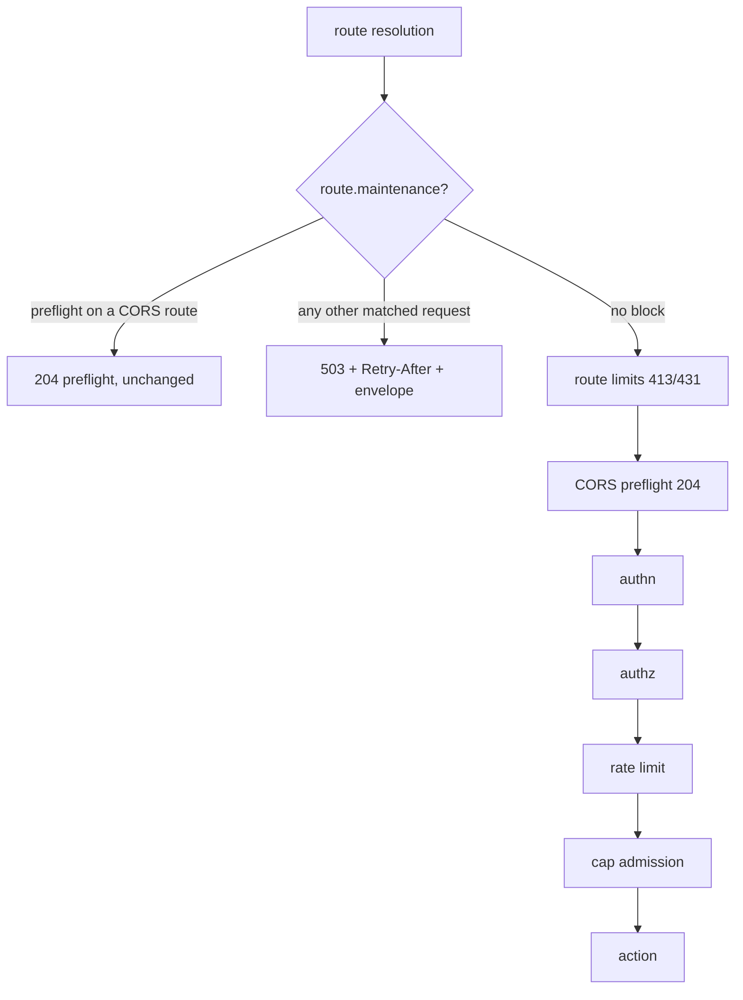

# Maintenance mode and policy dry-run

Source: `crates/dwara-core/src/dataplane/proxy.rs` (enforcement
points), `crates/dwara-core/src/config/mod.rs` (schema:
`Maintenance`, the `dry_run` fields, `Gateway::load_shed_dry_run`),
`crates/dwara-core/src/security/authz.rs` (level-aware resolver),
`crates/dwara-core/src/extensions/rate_limiter.rs` (live/dry
evaluation split), `crates/dwara-core/src/observability.rs` (the
report). Tests: `maintenance_dry_run` (dwara-core integration),
`unit/{authz,rate_limiter}.rs` (resolver and engine split).

Two operator levers with one shared philosophy: the gateway must be
able to refuse traffic **deliberately** (maintenance) and to
**preview** a refusal before committing to it (dry run). Both are
DW-041; both are plain config, hot-toggled through the ordinary
reload pipeline (file watch, SIGHUP, or admin `PATCH /config` —
publish + `DataPlane::refresh`; no new admin endpoint was needed,
which is why none was added).

## Maintenance: position in the request path

The check sits IMMEDIATELY after route resolution — the earliest
point at which the route is known — and BEFORE the route's request
limits. That order is the load-bearing decision:

- Maintenance is a statement about the **route's availability**, not
  about any request's shape. If route limits ran first, an over-limit
  request during maintenance would get a 431 — the client would
  conclude its request was malformed, fix the headers, and still be
  refused. The 503 is both the cheapest answer (no header counting,
  no body-cap evaluation for a request that will be refused anyway)
  and the only honest one.
- **Preflights are exempt**: a CORS preflight (`OPTIONS` +
  `Origin` + `Access-Control-Request-Method`) on a CORS-configured
  route keeps its 204. A preflight is a Fetch-protocol handshake
  about the *gateway's* cross-origin policy, answered from static
  config and sent by browsers without credentials. Answering it 503
  surfaces in the browser as an opaque CORS failure and hides the
  very envelope the operator wants clients to see — the actual
  request's 503, which carries the policy's CORS actual-response
  headers precisely so browser clients can read the maintenance
  message cross-origin. A preflight-shaped request on a route
  WITHOUT a `cors` block is not intercepted by the preflight path
  and therefore DOES get the 503.
- **Reserved paths** (`/healthz`, `/readyz`, `/metrics`) answer
  before route resolution, so probes and scrapes keep working
  through maintenance — an orchestrator must not restart a
  deliberately idling gateway. **Unrouted** traffic still 404s
  (maintenance is per-route).
- The response is `503` + `Retry-After` (default 60 s; validation
  rejects 0 — that would invite an immediate retry stampede against
  a route the operator just took down) + the uniform JSON envelope
  with code `maintenance` and the operator-optional `message`.

`maintenance: {}` is the minimal spelling — the block form (not a
bare `maintenance: true`) keeps the schema one strict shape and
leaves room for the two optional fields without an untagged enum.

## Dry run: flag placement per phase

Four policy phases can reject on today's request path, and each got
a per-attachment flag at the place the attachment is declared:

| Phase | Flag | Would-be status |
| --- | --- | --- |
| route limits (413/431) | `routes[].limits.dry_run` | 413 / 431 |
| authorization | `authorization.dry_run` at any of the five levels (consumer/route/service/listener/global) | 401 / 403 |
| rate limiting | `policies[].dry_run` (the named bundle) | 429 |
| load shedding | `gateway.load_shed_dry_run` | 503 |

- **Route limits**: the cheap up-front checks (header count/bytes, a
  declared `Content-Length`) are evaluated and reported; the
  streaming `max_body_bytes` guard is left UNARMED in dry run — a
  chunked body that would have been aborted mid-stream flows through,
  because the counting wrapper's only observable action IS the
  abort. This is the one documented blind spot.
- **Authorization**: the flag lives on the `Authz` block itself, so
  each of the five precedence levels is independently live or dry.
  `authz::resolve` walks the chain and returns the enforcement
  verdict plus the first (most specific) dry would-deny.
- **Rate limiting**: attachments are BY NAME (`policies: [name]` at
  five levels), so the flag sits on the named bundle — marking the
  bundle dries every attachment of it uniformly. The engine's
  `evaluate` splits live and dry rules into separate accumulators in
  ONE pass: live rules alone decide the 429 and the
  `X-RateLimit-*` headers; dry rules contribute nothing to the
  response and report through `dry_denied`.
- **Load shedding**: the cap is a bare `max_concurrent_requests`
  integer (additive-only schema; no block to hang a flag on), so the
  flag is a sibling `load_shed_dry_run` — rejected by validation
  when no cap is set (an uncapped gateway never sheds; the flag
  would be a silent no-op reading as coverage).

### The invariant: dry run never makes enforcement more permissive

Every enforcement point checks the flag of the rule THAT WOULD HAVE
REJECTED, not a global switch, and the evaluators are built so a
live rejection always survives:

- The authz resolver walks PAST a dry deny and stops only at a live
  one — a route-level dry deny cannot mask a service-level live
  deny.
- The rate engine keeps separate live/dry accumulators — a live
  bundle 429s a request even while a dry sibling on the same route
  is only reporting.
- The load-shed path only relaxes when the would-shed itself is
  flagged; `shed_total`, the per-priority shed counters, and
  `rec.shed` stay untouched in dry run (the request was admitted,
  not shed).

Authentication is deliberately OUT of scope: a 401 on an invalid or
missing credential is identity verification, not a policy decision,
and `auth_required` is likewise a hard gate. Monitor mode is for
previewing policy, not for accidentally turning off auth.

## The dry-run report

No endpoint, no buffer — the metric and the log events are the
report (§9.3; the events/webhook surface is a later milestone):

- `dwara_policy_dry_run_total{phase,route}` on `/metrics`. Label
  cardinality is config-bounded: `phase` is a four-value closed set,
  `route` is route names (plus the literal `unrouted` for the
  pre-404 listener/global policy pass). There is deliberately no
  consumer label, matching every other family.
- One `dwara::policy` warn event per would-have-rejected request:
  `code=policy_dry_run`, `phase`, `would_be_status`, `route`,
  `consumer` (`anonymous` when unknown), `request_id`, and the
  phase's own `detail` (which limit crossed, the authz reason and
  level, the retry-after the rate limit would have sent, the shed
  priority). The request id ties the event to the request's trace
  and access line — the request PROCEEDED, so its access line shows
  the real (2xx) outcome while this event shows what policy WOULD
  have done.

Reading it operationally: scrape
`rate(dwara_policy_dry_run_total[10m]) > 0` as "this policy would be
rejecting traffic right now" before flipping the flag off, and grep
`dwara::policy` for the per-request detail when the aggregate isn't
enough.

## Why the log line lives in `observability`

The rate-limit engine and the authz module are below the
observability seam in the dependency graph (`extensions` may not
import `observability` at all — see
[Observability](./observability.md#why-this-domain-depends-on-nothing)).
The engines therefore return structured verdicts
(`RateLimitEvaluation::dry_denied`, `authz::Resolved::would_deny`)
and the DATAPLANE turns them into the counter increment and the log
event — the same recording pattern as the breaker and rate-limiter
gauges. Keeping the emit in one place also keeps the redaction
guarantee in one place: the event's field list is exhaustive and
contains no headers, no query string, no credential material.
