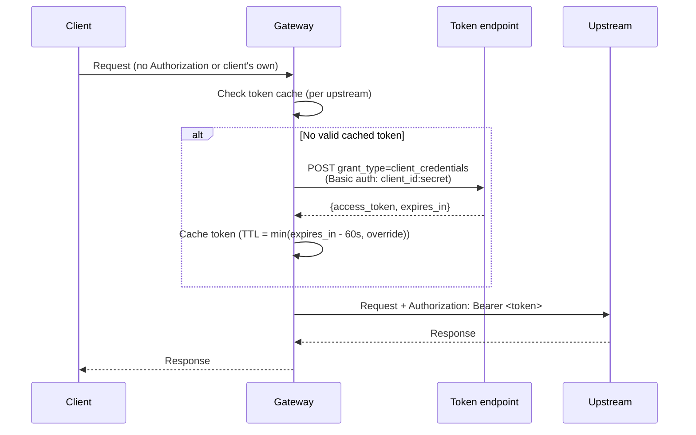
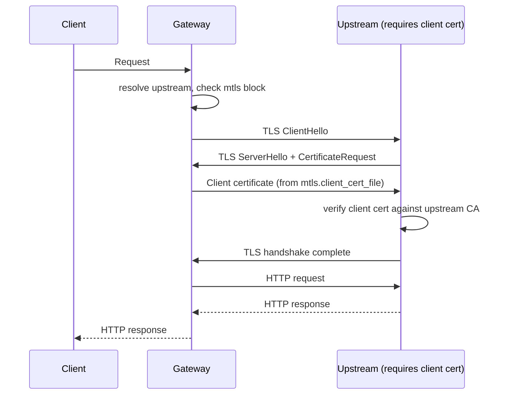

# OAuth2 client-credentials proxying and mTLS consumer mapping (DW-035)

> Implements issue DW-035 (M2, `edition/oss`, effort M) over the
> authentication foundation shipped by DW-019 (#124). Sources:
> `crates/dwara-core/src/security/oauth2.rs` (the OAuth2 token client,
> cache, and connector — its module docs carry the full flow), the
> `MtlsConsumerMap` in `crates/dwara-core/src/security/authn.rs`
> (gateway-level certificate-to-consumer resolution), the certificate
> metadata extractors in `crates/dwara-core/src/security/tls.rs`
> (`fingerprint_colon_hex`, `issuer_cn_of_leaf`, `not_after_unix_secs`),
> the forward-path injection in `crates/dwara-core/src/dataplane/proxy.rs`
> (`inject_client_cert_headers`, the OAuth2 Bearer replacement block),
> validation in `snapshot/mod.rs` (OAuth2 endpoint/credential checks,
> mTLS mapping fingerprint grammar, forward-header prefix validation),
> and the config types in `config/mod.rs` (`OAuth2ClientCredentials`,
> `OAuth2Mtls`, `MtlsConsumerMapping`, `MtlsFingerprintMapping`,
> `MtlsForwardHeaders`). Tests:
> `crates/dwara-core/tests/oauth2_mtls.rs` (end to end: token forwarded
> as Bearer, token cached, expiry re-fetch, token-endpoint error 502,
> mTLS consumer mapping by fingerprint and subject CN, unmapped cert
> 401, X-Client-Cert-* headers present, spoofed inbound headers
> stripped, custom prefix) and `crates/dwara-core/tests/unit/oauth2_mtls.rs`
> (fingerprint computation, TTL formula, config validation matrix,
> MtlsConsumerMap resolution through the authenticator, header-name
> derivation, OAuth2 client build errors, Debug redaction). Operator
> docs: [docs-site OAuth2 and mTLS guide](../../docs-site/guide/oauth2-mtls.md).

DW-019 (#124) gave the gateway mTLS client-certificate authentication:
a listener with `client_ca_file` verifies a presented certificate, and
a per-consumer `mtls` credential maps it to a consumer by subject CN or
fingerprint. DW-035 adds two independent capabilities on top of that
foundation:

1. **OAuth2 client-credentials proxying** — the gateway itself obtains
   an access token from an external token endpoint and forwards it to
   the upstream as `Bearer`, replacing any client-supplied
   `Authorization` header. This is for service-to-service calls where
   the gateway authenticates to the upstream with a token it obtains,
   not one the client carries.

2. **Gateway-level mTLS consumer mapping** — a gateway-level table maps
   verified client certificates to consumers by fingerprint or subject
   CN, independent of the per-consumer `mtls` credential registry. Plus
   `X-Client-Cert-*` identity-forwarding headers that carry certificate
   metadata to the upstream, with inbound spoofing prevention.

## OAuth2 client-credentials flow

The gateway acts as an OAuth2 client itself (RFC 6749 section 4.4). For
an upstream with an `oauth2_client_credentials` block, the forward path
in `proxy.rs` acquires an access token before contacting the upstream:



The token REPLACES any client-supplied `Authorization` header — the
upstream sees the gateway's token, not the client's. A token-endpoint
failure (network error, non-2xx, malformed body) surfaces as 502
`oauth2_token_unavailable`; the gateway never forwards without a token
(never proxying unauthenticated). The error envelope never leaks the
token endpoint's response body or headers.

### Caching

The token cache (`OAuth2TokenCache`) is a `Mutex<HashMap<UpstreamName,
CachedToken>>` on the dataplane, keyed by the token endpoint URL. It
persists across config reloads (the JWKS cache precedent): a reload
rebuilds the per-upstream `OAuth2Client` objects (their TLS config may
change) but reuses cached tokens. Refresh is lazy — on the first
request after expiry, no background task.

The cache TTL is `min(expires_in - 60s, token_cache_ttl_s)` (or just
`expires_in - 60s` when no override is set), clamped to at least 1 s.
The 60 s skew (`REFRESH_SKEW`) avoids using a token that expires while
an in-flight request is still streaming. Concurrent fetches for the
same upstream serialize on a per-upstream `tokio::Mutex` (the JWKS
refresh-lock precedent) so a fetch-storm cannot be driven by concurrent
requests.

### mTLS to the token endpoint

An optional `mtls` block configures a client certificate for the TLS
handshake to the token endpoint itself (RFC 8705 `tls_client_auth`).
The cert/key files are loaded at build time so a broken bundle disables
that upstream's OAuth2 at build instead of failing every request. The
token endpoint's server certificate is verified against the webpki
public roots by default; a private-CA token endpoint is not supported
in this edition (deferred until an operator asks for it).

## Gateway-level mTLS consumer mapping

The `MtlsConsumerMap` (in `authn.rs`) resolves a verified client
certificate to a consumer name by fingerprint (colon-separated hex) or
subject CommonName, independent of the per-consumer `mtls` credential
registry. It is built from `MtlsConsumerMapping` at authenticator build
time when `enabled: true`.

Resolution order (in `MtlsConsumerMap::resolve`):

1. **Subject-CN map first** — survives certificate re-issue under the
   same CN. When the certificate's subject CN matches a
   `subject_cn_mapping` entry, that consumer wins.
2. **Fingerprint map** — exact DER match. The fingerprint is the
   colon-separated SHA-256 hex of the certificate DER (the
   operator-facing config format).

When the mapping is enabled with entries but the certificate matches
NO entry, the request is rejected 401 `mtls_consumer_not_mapped` — the
certificate was verified but is not a known caller. This path does NOT
fall through to the per-consumer credential registry: the gateway-level
mapping is authoritative when enabled. When the mapping is absent or
disabled, certificates are matched only through consumers' `mtls`
credentials (the DW-019 path).

The mTLS family is the AMBIENT family — consulted only when NO header
credential was presented (a header expresses explicit intent and wins;
the certificate is connection-level context). See the
[authn-authz](./authn-authz.md) page for the full family precedence.

## X-Client-Cert-* identity forwarding

When `mtls_forward_headers` is enabled and the connection presented a
verified client certificate, the gateway adds four headers to the
upstream request carrying metadata from the verified certificate:

| Header | Content |
|---|---|
| `X-Client-Cert-Fingerprint` | SHA-256 of the cert DER, lowercase colon-separated hex (always present) |
| `X-Client-Cert-Subject-CN` | Subject CommonName (present when the cert carries a decodable CN) |
| `X-Client-Cert-Issuer-CN` | Issuer CommonName (present when the issuer carries a decodable CN) |
| `X-Client-Cert-Not-After` | Certificate expiry as an RFC 3339 timestamp (`YYYY-MM-DDTHH:MM:SSZ`) |

The prefix is configurable (default `X-Client-Cert`); the gateway adds
`<prefix>-Fingerprint`, `<prefix>-Subject-CN`, `<prefix>-Issuer-CN`,
and `<prefix>-Not-After`.

### Spoofing prevention

These headers are GATEWAY-SET. Any inbound headers whose names start
with the configured prefix (case-insensitive) are STRIPPED from the
client request before the gateway adds its own. A client cannot claim
certificate identity upstream — the gateway overwrites any inbound
headers with the prefix. This is the "without headers spoofing" part of
the done-when: the upstream sees the GATEWAY's computed values, never
the client's.

The certificate metadata extraction (`subject_cn_of_leaf`,
`issuer_cn_of_leaf`, `not_after_unix_secs`, `fingerprint_colon_hex` in
`tls.rs`) is hand-rolled DER walking — no X.509 parser dependency. The
certificate is already verified at the TLS layer when extraction runs;
these functions only read the values for the forwarding headers.

## Configuration

```yaml
# OAuth2 client-credentials on an upstream
upstreams:
  - name: api
    endpoints:
      - address: 10.0.0.5
        port: 8443
    oauth2_client_credentials:
      token_endpoint: https://idp.example.com/oauth2/token
      client_id: dwara-gateway
      client_secret: ${IDP_CLIENT_SECRET}     # inline or ${...} reference (DW-045)
      scopes: ["read", "write"]               # optional, space-joined in the request
      token_cache_ttl_s: 300                  # optional override; min(expires_in - 60, this)
      mtls:                                   # optional RFC 8705 client cert
        client_cert: /certs/gateway-client.crt.pem
        client_key: /certs/gateway-client.key.pem

# Gateway-level mTLS consumer mapping
mtls_consumer_mapping:
  enabled: true
  consumers:
    - fingerprint: "ab:cd:ef:00:11:22:33:44:55:66:77:88:99:aa:bb:cc:dd:ee:ff:..."
      consumer: acme
  subject_cn_mapping:
    acme-client: acme                         # survives re-issue under the same CN

# X-Client-Cert-* forwarding
mtls_forward_headers:
  enabled: true
  prefix: X-Client-Cert                       # default; configurable
```

### Validation

OAuth2 client-credentials (`upstreams[].oauth2_client_credentials`):

- `token_endpoint`: must be an absolute `http(s)://` URL.
- `client_id` / `client_secret`: must not be empty.
- `token_cache_ttl_s`: must be > 0 when set.
- `mtls.client_cert` / `mtls.client_key`: must be readable files at
  compile time (the OAuth2 client builder loads them at build; a parse
  failure logs and disables that upstream's OAuth2, the upstream still
  proxies without the Bearer token).

mTLS consumer mapping (`gateway.mtls_consumer_mapping`):

- `consumers[].fingerprint`: 64 hex digits with optional `:` separators
  (SHA-256 of the certificate DER).
- `consumers[].consumer`: must reference a consumer in the `consumers`
  list.
- `subject_cn_mapping`: keys must not be empty; values must reference a
  defined consumer.

mTLS forward headers (`gateway.mtls_forward_headers`):

- `prefix`: must not be empty; the four derived names
  (`<prefix>-Fingerprint`, etc.) must be valid HTTP header names.

All three blocks are opt-in (`enabled: false` by default) and
`deny_unknown_fields`. Disabled blocks are not validated (the operator
turned them off).

## Error posture

- **Token-endpoint failure** (network, non-2xx, malformed body): 502
  `oauth2_token_unavailable`. The gateway never forwards without a
  token. The error envelope never leaks the token endpoint's response.
- **Unmapped certificate** (mapping enabled, no match): 401
  `mtls_consumer_not_mapped`. The certificate was verified but is not
  a known caller.
- **OAuth2 client build failure** (broken mTLS cert/key files): the
  upstream's OAuth2 is disabled at build time with an ERROR log; the
  upstream still proxies, just without the Bearer token (the request
  reaches the upstream with whatever `Authorization` the client sent,
  subject to the authn family's pass-through rules).

The [authn-authz](./authn-authz.md) page covers the five credential
families and their precedence; the [dataplane and proxy](./dataplane-proxy.md)
page covers the forward path where the token injection and header
forwarding run.

## Upstream mTLS client certificates (SEC-03, #156)

M5 adds the ability for the gateway to present a client certificate
when connecting to upstream TLS servers that require client
authentication ([mTLS](https://en.wikipedia.org/wiki/Mutual_authentication) — mutual TLS, where both sides present certificates).
This is distinct from the OAuth2 mTLS flow above (which authenticates
to a token endpoint): this is the gateway presenting its identity to
the upstream during the TLS handshake itself.



The `mtls` block on an upstream configures the client certificate
chain and private key:

```yaml
upstreams:
  - name: secure-backend
    protocol: https
    mtls:
      client_cert_file: /path/to/client.crt
      client_key_file: /path/to/client.key
    endpoints:
      - address: 10.0.0.1
        port: 8443
```

### Implementation

The cert and key files are loaded at config compile time using rustls
`with_client_auth_cert`, producing a `ClientConfig` that presents the
client certificate during the TLS handshake. If the files cannot be
loaded, the gateway logs an error and the upstream's TLS handshake
will fail (the upstream rejects the connection if it requires mTLS) —
there is no silent fallback to no-client-auth.

### Protocol restriction

mTLS is only valid for `https` and `http2` upstreams. Validation
rejects `mtls` on `http1` upstreams (no TLS is negotiated, so a client
certificate has no handshake to be presented in). The cert and key
files must exist and be readable at compile time; validation names the
offending field if not.

### Interaction with certificate pinning

When both `mtls` and `cert_pinning` (SEC-04) are configured on the same
upstream, pinning takes precedence in the current implementation: the
custom pinning verifier is used and the client certificate is not
presented. This is a known limitation documented in
[extism-pdk-bot-hooks](./extism-pdk-bot-hooks.md#upstream-tls-certificate-pinning-sec-04-157);
a future change will combine the custom pinning verifier with client
auth so both can be active simultaneously.

### Alternatives

- **OAuth2 client credentials:** if the upstream accepts a Bearer token
  instead of a client certificate, use `oauth2_client_credentials`
  (above) instead of mTLS.
- **Service mesh (Istio, Linkerd):** delegate mTLS to the service mesh
  sidecar. The gateway connects plaintext to the sidecar, which handles
  mTLS transparently.
- **SPIFFE/SPIRE:** use [SPIFFE](https://spiffe.io/) SVIDs (SPIFFE
  Verifiable Identity Documents) instead of static client certificates
  for automatic rotation and workload identity. More infrastructure;
  better for service-to-service mTLS at scale.
