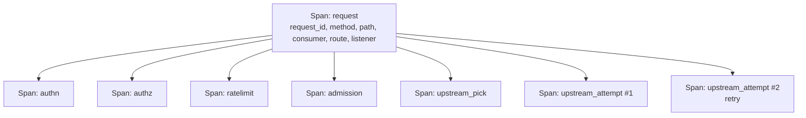

# Observability

Source: `crates/dwara-core/src/observability.rs` (DW-021),
`crates/dwara-bin/src/otlp.rs` (feature-gated OTLP exporter). Tests:
`observability` (dwara-core); `otlp_export` (feature-gated),
`otlp_inert` (dwara-bin).

The end-user-facing material (log fields, metric names, the error
envelope shape, how to enable OTLP) is already written at
[docs-site: Observability](../../docs-site/guide/observability.md) —
this page covers *why* it's built the way it is, not the field-by-field
*what*.

## Why this domain depends on nothing

`observability` sits alone at the bottom of the dependency graph in
[Architecture](../architecture.md#bounded-contexts-inside-dwara-core):
every other domain depends on it, and it depends on none of them. It
achieves this by exposing **plain setters only** — recording a
counter, opening a span, emitting a log field — never types or logic
borrowed from security, resilience, or the dataplane. That's what lets
`security::authn` and `dataplane::proxy` both report into the same
metrics registry without either domain needing to know the other
exists, and it's why a change to, say, the breaker's state machine
never has to touch this file.

## Span structure

Every request opens a root span named `request` carrying
`request_id`, `method`, `path` (already redacted — see below),
`consumer`, `route`, and `listener`, with a child span per phase:
`authn`, `authz`, `ratelimit`, `admission`, `upstream_pick` (emitted
inside the upstream handle, at the point the pick actually happens —
not in the proxy module, since only the handle knows which endpoint it
chose), and one `upstream_attempt` span per send (so a retried request
shows multiple attempt spans under one request span).

This structure is proven by an in-process span-capture test that
asserts one trace shows every phase — the goal is that whatever
exports spans downstream (currently: the JSON log formatter; behind
the `otlp` feature: an actual trace exporter) sees a complete,
correctly-nested picture without needing dataplane-specific knowledge.

## Why OTLP is feature-gated, not default

`opentelemetry` + `opentelemetry-otlp` were evaluated and deliberately
**not** included in the default build: they bring their own HTTP
transport and codegen weight against the musl release binary's <25MB
size budget (see [Installation](../../docs-site/guide/installation.md#docker-images))
and against a compute-conscious CI posture. The span *structure* ships
unconditionally (proven by the capture test above); only the
*exporter* is feature-gated. Because the environment variable
(`DWARA_OTLP_ENDPOINT`) is a binary-level knob and the `tracing`
subscriber the exporter must hook into lives in `dwara-bin`, the
exporter itself lives in `dwara-bin/src/otlp.rs`, not in this module —
keeping `dwara-core::observability` dependency-light was the explicit
design goal, not an accident of where the code happened to land. In a
default build, `DWARA_OTLP_ENDPOINT` is read and validated but stays
inert; a build with the `otlp` feature wires the same spans to export
over HTTP/protobuf.

## OTLP metrics export (DW-073)

The same `otlp` cargo feature and the same `DWARA_OTLP_ENDPOINT` env
var additionally export metrics over OTLP (http/protobuf to
`/v1/metrics`). This is additive to the Prometheus `/metrics` default
(DW-021): Prometheus stays the default; OTLP metrics are opt-in for
orgs standardized on OpenTelemetry.

The periodic exporter gathers the prometheus registry on each tick,
converts the metric families to OTLP protobuf (counters as monotonic
Sums, gauges as Gauges, histograms as Histograms with explicit bounds),
and POSTs to the collector. The export interval defaults to 15s;
`DWARA_OTLP_METRICS_INTERVAL_SECS` overrides it (production keeps the
default). On shutdown, a final flush fires before exit. The
`service.name` resource attribute is set to `dwara` on every export.

One endpoint, two signals: traces go to `/v1/traces`, metrics go to
`/v1/metrics`, both from the same base endpoint.

## Sampling: why 5xx always bypasses it

`DWARA_ACCESS_LOG_SAMPLE` (default 1.0) governs only **non-error**
access-log lines. Responses with status ≥ 500 are logged unconditionally
regardless of the configured sample rate, and a malformed value for the
knob itself falls back to 1.0 rather than erroring — the design intent
is that a broken or aggressively-tuned sampling knob must never be able
to silence visibility into actual failures. Sampling is a volume
control for "everything is fine" traffic, never for "something broke."

`bytes_in`/`bytes_out` are deliberately **omitted** from the access log,
not just unpopulated: the proxy path is zero-buffering by design (see
[Dataplane and proxy](./dataplane-proxy.md#streaming-zero-default-buffering)),
so exact body sizes aren't cheaply available for a streamed body without
adding the buffering/counting the proxy is built to avoid. Omitting the
field is an honest signal that the data isn't available, rather than
reporting a wrong or partial number that looks authoritative.

## Redaction: implementation, not just policy

The redaction rules quoted in the end-user docs
([Observability: logs](../../docs-site/guide/observability.md#logs))
are enforced *in this module*, once, rather than left to every call
site to remember: paths are stripped of their query string before
they're ever attached to a span or log field, and the field lists for
`Authorization`/`Proxy-Authorization`/`Cookie`/`Set-Cookie`/`X-API-Key`
are exhaustive at the point where request metadata is captured — a new
credential type added elsewhere in the codebase inherits this
redaction automatically as long as it flows through the same span/log
attachment points, rather than needing its own redaction logic.

## Metrics: gauges instead of counters for hot-path-adjacent state

Several metrics that sound like counters are implemented as **gauges**
that snapshot an underlying atomic at scrape time —
`upstream_fail_open_picks`, `dwara_rate_limiter_evictions_total`, and
`dwara_rate_limiter_live_keys` all work this way. The reason is the
same in each case: the value they report is already maintained as a
plain atomic on the actual hot path (the balancer's fail-open counter,
the rate limiter's eviction counter), and wiring that hot path directly
into the Prometheus registry's counter API would couple a
performance-critical increment to the metrics crate on every request.
A gauge that reads the atomic only when `/metrics` is scraped keeps the
registry coupling entirely off the hot path.

## Error envelope: one shape, everywhere

Every gateway-generated non-success body uses
`{"error":{"code","message","request_id"}}`, including the reserved
`/healthz`/`/readyz` responses — they're aligned to the same shape
specifically so an operator (or a log-scraping alert rule) never needs
a special case for reserved-path errors versus dataplane errors.
`message` is always a classification string ("upstream unavailable"),
never raw error text from `hyper` or an upstream — the boundary between
"safe to show a caller" and "internal detail" is enforced once, here,
rather than trusted to every call site that produces an error.
