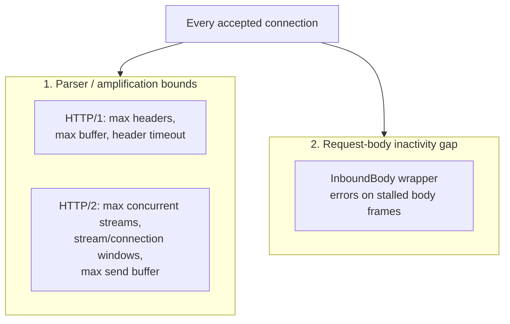

# Protocol hardening

Source: `crates/dwara-core/src/dataplane/hardening.rs` (DW-023).
Tests: `protocol_hardening` (dwara-bin). Applied identically to every
serving surface — data-plane listeners and the admin listener alike
(see [Admin API: hardening posture](./admin-api.md#hardening-posture-and-its-one-asymmetry)
for the one deliberate exception).

The end-user-facing knob table already lives at
[docs-site: Operations](../../docs-site/guide/operations.md#protocol-hardening)
and is covered from the proxy's-eye view in
[Dataplane and proxy](./dataplane-proxy.md#protocol-hardening) — this
page is the implementation-focused version: two independent defense
families, why each bound is where it is, and how the pieces compose.

## Two families of defense

**1. Parser/amplification bounds** on hyper's connection builders, so
a single hostile connection can't pin unbounded memory or parse cost.
Each bound targets one specific attack shape:

| Knob (env) | Default | Attack it bounds |
| --- | --- | --- |
| `DWARA_HTTP1_MAX_HEADERS` | 100 | header-count bombs (N header lines per request) |
| `DWARA_HTTP1_MAX_BUF_KIB` | 64 KiB | single-header/line size bombs — hyper's read-buffer cap; an oversized header line is a 431-class parse failure, not unbounded allocation |
| `DWARA_HTTP1_HEADER_TIMEOUT_MS` | 10000 | slowloris — a connection sending headers slower than this is closed before it ever reaches a route |
| `DWARA_H2_MAX_CONCURRENT_STREAMS` | 128 | stream floods over one h2 connection (also advertised to the peer in `SETTINGS`, so a well-behaved peer self-limits before even trying) |
| `DWARA_H2_STREAM_WINDOW_KIB` | 1024 (1 MiB) | per-stream receive buffering a malicious h2 peer can force by withholding window updates |
| `DWARA_H2_CONNECTION_WINDOW_KIB` | 4096 (4 MiB) | connection-wide h2 receive buffering |
| `DWARA_H2_MAX_SEND_BUF_KIB` | 1024 (1 MiB) | outbound h2 send buffer per connection — write amplification / memory pinning by a peer that advertises a window but never actually reads |

**Deliberately left at hyper's own defaults, not exposed as knobs:**
`max_frame_size` (16 KiB — the *minimum legal value* per the HTTP/2
spec; hyper already refuses anything larger, so there's no smaller
value to expose) and HTTP/2 `max_headers` (hyper-util's h2 builder has
no such knob at all — the header list size is already bounded
indirectly by the flow-control windows above, so there was nothing to
add a redundant cap for).

A `TokioTimer` is explicitly installed on the HTTP/1 connection
builder for one specific reason: hyper disables `header_read_timeout`
entirely when no timer is configured, so without this, the slowloris
knob above would silently do nothing.

**2. Request-body inactivity gap** (`DWARA_REQUEST_BODY_TIMEOUT_MS`,
default 30000, `0` disables): the inbound request body handed to the
dataplane is wrapped in `InboundBody`, which errors when the gap
between two consecutive body frames exceeds the configured duration.
This is deliberately a **gap** timeout, not a total-time budget — the
semantics mirror the response-side `write_ms` wrapper
(`UpstreamBody`) on purpose, so a contributor who understands one
already understands the other. A legitimate slow upload (a large file
crawling over a poor connection) that keeps making *some* progress
every few seconds never trips it; a client that sends headers and then
holds the connection open indefinitely — pinning a concurrency slot
and an upstream connection for nothing — gets cut off once the gap
elapses. When it fires, the in-flight upstream attempt fails as a
transport-class error (the proxy answers 502 and closes), and the
request's global concurrency slot releases immediately rather than
waiting out whatever budget the stalled client might otherwise have
consumed.

## CL+TE smuggling needs no code here

Deliberately absent from this module: any explicit check for a
request carrying both `Content-Length` and `Transfer-Encoding`.
hyper 1.x's own HTTP/1 parser already rejects such a request (400,
connection closed) before it reaches any dwara code, and the gateway
never hands raw bytes to an upstream — every forwarded request is
rebuilt from hyper's already-parsed parts (see
[Dataplane and proxy: protocol hardening](./dataplane-proxy.md#protocol-hardening)),
so a "smuggled second request" would require hyper itself to
mis-parse the first one. Both of those properties (hyper's rejection,
and the rebuild-not-passthrough forwarding model) are pinned by a
smuggling-corpus integration test suite in `dwara-bin`, rather than
re-verified here — this module's job is the bounds above, not
re-implementing a defense hyper already provides.

## How the sniff and hyper's own timeout compose

There's a subtlety worth internalizing before touching
`DWARA_HTTP1_HEADER_TIMEOUT_MS`: the pre-parse sniff that inspects a
connection's first request head is a **per-read** timeout, not a
total-head budget. A client that trickles exactly one byte at a time,
each individual byte arriving just inside the configured timeout,
keeps every single sniff read "successful" — the sniff alone would
never catch that pattern. The actual defense for that specific case is
hyper's own **per-head** `header_read_timeout`, installed on the
connection builder with the *same* knob value and the `TokioTimer`
noted above — it bounds the total time one request head may take,
regardless of how the bytes are paced. The two compose deliberately:
the sniff owns judging each individual read (and is what lets dwara
hand a connection off to hyper instead of racing hyper for the same
bytes), while hyper owns the head as a whole — so neither a single
stalled read nor a slow byte-at-a-time trickle can hold a listener
resource hostage indefinitely.

## One posture, resolved once, logged once

Every knob above is an environment variable read **once at startup**
and applied **process-wide** — not per-listener, and not
per-request. An invalid value falls back to its documented default
rather than failing startup, on the reasoning that hardening exists to
make the gateway *more* robust, and a typo in a hardening knob should
never be the reason the whole process refuses to start. The resolved
values (whatever they ended up being, defaults or overrides) are
logged once at startup under the `protocol_hardening` code, so an
operator debugging "why did this connection get closed" can always
find out exactly what bound was actually in effect without having to
cross-reference environment variables against documentation defaults.
