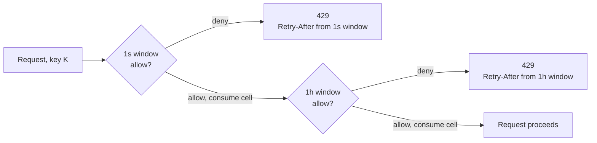

# Rate limiting

Source: `crates/dwara-core/src/extensions/rate_limiter.rs` (DW-017,
#122). Tests: `rate_limit` (dwara-core). Metrics:
`rate_limited_total{route}`,
[`dwara_rate_limiter_evictions_total`, `dwara_rate_limiter_live_keys`](../../docs-site/guide/observability.md#metrics).

## The extension contract

Rate limiting is implemented behind the `RateLimiter` trait (see
[Extension points](./extension-points.md#ratelimiter)), so the
semantics below split into "what any implementation must guarantee"
and "what the shipped GCRA implementation does":

- `check` is the hot path: non-blocking beyond a backend round-trip,
  and **atomic** — concurrent `check` calls for the same key are
  linearized by the implementation (ordering across distinct keys is
  unspecified).
- `check` both decides *and* reserves in one call: a returned
  `allowed: true` means the cost is already deducted from the key's
  budget. There is no separate "commit" step, and no refund path in
  v1 — a request that's allowed by the limiter but then fails for some
  other reason still spent its budget.
- Failures map to `ExtensionsError::Backend`; the trait deliberately
  does not prescribe fail-open vs. fail-closed — that's a caller
  policy decision, not a limiter one.

## GCRA: why not a token bucket you refill on a timer

The shipped `GcraRateLimiter` implements the trait using `governor`'s
GCRA (Generic Cell Rate Algorithm) cells over a custom sharded keyed
store. GCRA is mathematically equivalent to a token bucket but is
computed from a single "theoretical arrival time" value per key rather
than requiring a background refill tick per bucket — which is exactly
why it composes well with a lock-per-shard design instead of a global
ticking clock.

## Stacked windows within one rule

A single rule may stack several windows (e.g. 10 requests/second *and*
100/hour): each window is an independent GCRA cell for the same key,
and the decision is the **AND** of all windows — denied if *any*
window denies, with `Retry-After` taken from the denying (binding)
window.

**Documented trade-off:** windows are evaluated shortest-first and
evaluation stops at the first denial — a request denied by the hourly
window has *already* consumed one token from the second window's
bucket. This is deliberately fail-fast and slightly **stricter** than
a fully-atomic all-windows decision would be (governor's API has no
non-consuming peek), never more permissive, and the wasted consumption
is bounded to the shortest window's bucket — which also happens to
replenish the fastest, so the waste self-heals quickest.

## Multiple applicable rules

When several rules apply to one request (e.g. a route-attached policy
*and* a service-attached policy), a denial in one rule does not stop
evaluation of the others: every applicable rule's state advances
regardless. The reported `Retry-After` is the **maximum** wait across
all denying rules (so a compliant client never retries into a second
429 early), while the `Limit`/`Remaining` response headers come from
the first (binding) denying rule — headers show the tightest
constraint in resolution order, `Retry-After` shows the longest wait.

## Bounded key-space eviction (#122)

Every window's keyed state lives in a `GcraShardStore`: a fixed number
of independently lock-guarded shards, replacing `governor`'s default
unbounded `DashMap`-backed store (whose key set a reload could only
reset wholesale, not bound). Each shard caps at
`MAX_RATE_LIMITER_KEYS_PER_SHARD` keys — so a window's worst-case
memory is `shards × cap`, making an `[ip]`-selector limiter
memory-bounded for the process lifetime even under a key-spray attack
(many distinct fake IPs, each touched once).

The eviction sweep runs **inline**, on the shard lock a reservation
already holds — no background task, no per-request O(cap) scan:

1. When a shard hits its cap, it first drops **idle** cells (keys
   untouched for at least one full-refill window — a GCRA cell that
   old is indistinguishable from a fresh one, so dropping it changes
   no decision for anyone).
2. If the shard is still crowded after that (every key fresh —
   sustained spray), it evicts the idlest half by `(last_touch, key)`
   ordering, down to half the cap, so the O(cap) sweep amortizes to
   O(1) per insertion.

Idle-first ordering means a key under active enforcement (recently
denied, hence recently touched) is evicted only when a shard holds
more than a cap-full of keys *all* touched within one refill window —
and losing such a cell only resets that key's bucket to fresh, which
can only be **more** permissive for that key going forward, never
stricter. This is the documented fail-open trade under spray: an
attacker who succeeds in evicting their own tracked state has, at
worst, reset their own limiter.

## Legacy field mapping and burst

A policy's legacy `rate_limit { requests, window_seconds }` field
compiles to one rule with selector `[route]` and a single window of
`requests` per `window_seconds` (burst defaulting to `requests`).
Under GCRA, a window with rate `10/s` and `burst: 20` is a bucket that
replenishes one token every 100ms with a 20-token capacity: 20 rapid
requests pass immediately (the burst), and sustained traffic above
10/s starts drawing 429s once the bucket empties — the first window of
traffic can therefore admit up to `burst + replenished-during-window`
requests, which is the standard, expected GCRA shape, not a bug.

## Where it sits in the request pipeline

Rate limiting runs after route resolution but before gateway-cap
admission and the circuit breaker — see the docs-site
[request pipeline](../../docs-site/architecture/overview.md#request-pipeline).
Listener- and global-attached limits also apply to requests that will
ultimately 404, so a flood of garbage paths is capped before it turns
into a wall of unrouted responses.
