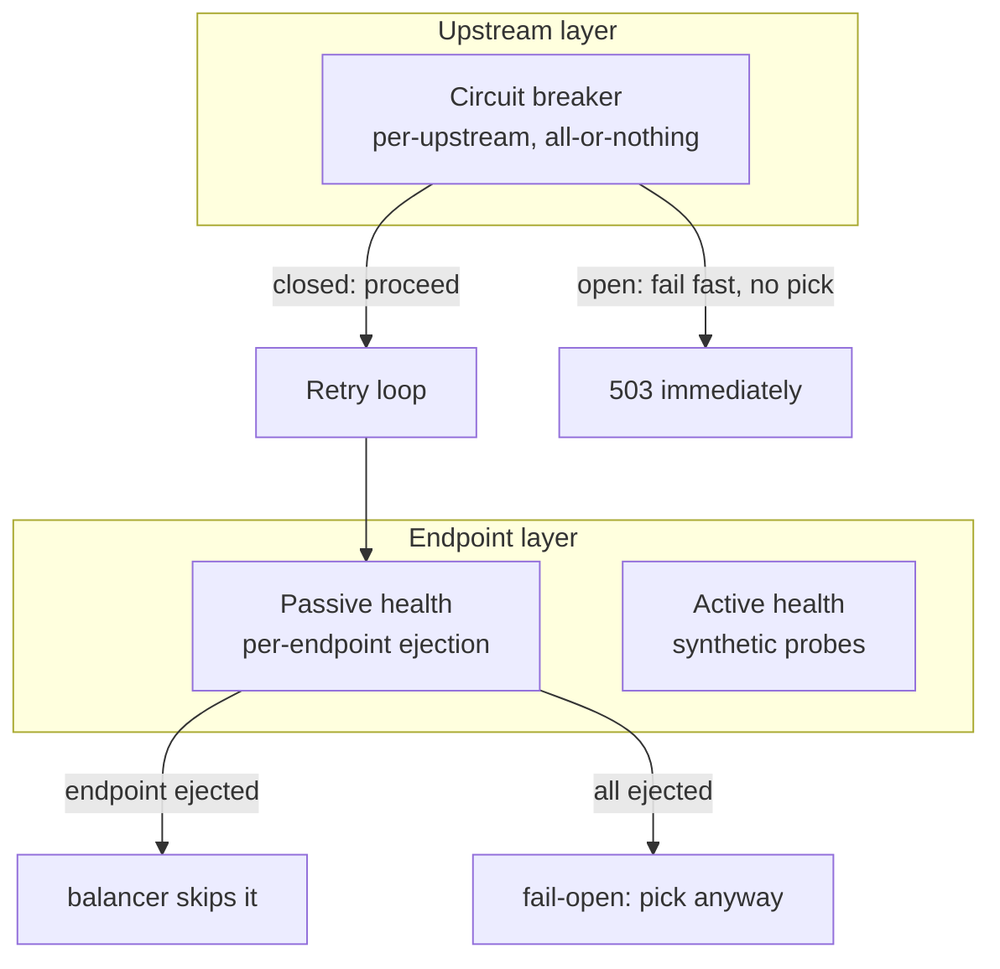

# Resilience: health, retries, circuit breaking, load shedding

Source: `crates/dwara-core/src/resilience/{health,retries,breaker}.rs`
(DW-012, DW-014, DW-015), `dataplane/balance.rs` (DW-011, load
shedding lives on the gateway-cap path documented in
[Architecture](../architecture.md)). Tests: `passive_health`,
`active_health`, `retries_timeouts`, `breaker_caps`, `load_shedding`
(dwara-core) pin each feature in isolation; the cross-feature
end-to-end fault-injection suite is `chaos_resilience` (dwara-core,
#173, REL-02) — see [Chaos / e2e resilience
suite](#chaos--e2e-resilience-suite) below.

Three layers gate traffic to a struggling upstream, at three different
granularities, and it's the composition — not any one layer — that
matters most to understand:



A breaker-open period short-circuits **before** the balancer is
consulted at all, so it ejects nothing at the endpoint layer (passive
health never even sees the traffic it isn't sending). Conversely,
endpoint ejections never open the breaker on their own — the breaker
only reacts to the aggregate outcome stream flowing through it. The
two layers observe overlapping signals but never consume each other's
state.

## Passive health / outlier detection

Passive health watches **real traffic outcomes** — there is no
synthetic probing while an endpoint is serving. Every dispatched
request's outcome is classified when its response headers resolve (or
on a transport error) and reported to the picked endpoint's tracker.
The load balancer consults that tracker on every pick (lock-free,
atomics only) and skips ejected endpoints.

**Outcome classification:** transport errors (connect timeout,
refused, reset, client framing errors) and HTTP status ≥ 500 are
failures; everything 1xx–4xx is a success. Notably, **429 and 408 are
successes** — they describe caller or queueing pressure, not the
endpoint's own health, and ejecting an endpoint for returning 429 would
remove capacity at exactly the moment backpressure is needed.

**Ejection triggers on either:**

- `consecutive_failures` (default 5) failures in a row, regardless of
  volume, or
- a rolling `window_ms` (default 60s) failure ratio ≥ `failure_ratio`
  (default 0.5), gated by a minimum `failure_min_volume` (default 20)
  observations — the volume gate exists specifically so a 2-of-3 blip
  on low traffic can't eject an endpoint that's actually fine.

**Recovery is half-open:** after `eject_ms` (default 30s), the next
pick admits `half_open_probes` (default 1) trial requests; a success
restores health and clears failure history (so old failures can't
immediately re-eject it); a failure re-ejects for another full
`eject_ms`.

**Fail-open:** if every endpoint of an upstream is ejected, picks fall
back to the full set rather than blackholing traffic — a deliberate
choice, because a gateway that returns 503 for a fully-ejected pool has
converted an upstream brownout into a guaranteed outage. The balancer
counts these fallback picks (`upstream_fail_open_picks` metric) so the
degraded state is still visible.

## Active health

Active probes report through the same tracker via a separate entry
point (`report_probe`) that drives the same ejection/recovery state
machine **without** inserting an observation into the rolling window —
synthetic probe outcomes never mix into the real-traffic failure
ratio. This keeps "how often is this endpoint actually failing real
requests" and "did the last synthetic probe succeed" as two inputs to
one state machine rather than one blended, harder-to-reason-about
signal.

## Retries

All retry knobs live on the **upstream** (`upstreams[].retries`) — v1
has no per-route override, keeping "how much should we retry against
this backend" a property of the backend, not of every route that
happens to target it.

**Retry budget:** each upstream owns a rolling 10-second window of
`(timestamp, is_retry)` events. A retry is permitted only while
`(retries + 1) * 100 <= percent * totals` holds, checked and reserved
atomically under one lock so the invariant is never transiently
violated by concurrent requests. Charging the retry **before** it
happens is a deliberately conservative bias: a fresh window with low
volume grants few or no retries rather than allowing a burst — the
budget exists to protect an upstream that's already struggling, so it
errs toward under- rather than over-granting.

**Backoff:** nominal delay before retry *n* is
`min(base * 2^(n-1), cap)`; the actual sleep applies **full jitter**
(AWS-style — a uniform random draw from `[0, nominal]`), which avoids
the thundering-herd resynchronization that decorrelated jitter can
produce while still bounding the worst case by the nominal delay.

**Cross-attempt total deadline (REL-01):** `upstreams[].retries.
total_deadline_ms` caps the wall-clock time from the first attempt to
the last, INCLUDING backoff delays between attempts. When set, a retry
whose backoff would cross the deadline is aborted and the last
response/error is returned to the client; the backoff sleep is clamped
to the remaining slice so the loop never sleeps past the deadline. The
per-attempt `read_ms` timeout still bounds each individual attempt, so
the two compose: `read_ms` caps one attempt, `total_deadline_ms` caps
the whole chain. A deadline-aborted retry charges nothing against the
retry budget (the reservation is taken only when a retry will actually
run). Absent (the default) leaves the cross-attempt budget unbounded —
worst case the retry loop adds up to
`attempts * (read_ms + backoff_cap_ms)` of latency to a single request
(each attempt pays its own read timeout plus at most the backoff cap
before it), the v1 behavior kept for backwards compatibility. Validation
rejects `0` (omit the field for unbounded) and caps the value at
`MAX_RETRY_TOTAL_DEADLINE_MS` (600_000ms = 10min); beyond that the
per-upstream circuit breaker and timeouts are the right tool, not a
wider retry deadline. The gate lives in the proxy retry loop
(`dataplane/proxy.rs`), measuring elapsed time from a single `Instant`
captured before the first attempt; the pure clock-agnostic helper is
`retry_sleep_under_total_deadline` in `resilience/retries.rs`. Standard
in Envoy and NGINX.

## Connection pool and HTTP/2 tuning (DP-03)

The outbound hyper-util client is built once per upstream in
`dataplane/upstream.rs::build_handle`. A pool timer is ALWAYS installed
on the builder — hyper-util silently no-ops idle-timeout eviction
without one, so the timer is required infrastructure, not an opt-in
knob. The optional `upstreams[].pool` block layers operator-tuned knobs
on top of that baseline; every field is optional and the block itself
is optional, so an omitted field keeps hyper-util's built-in default
(the same value the gateway used before this block existed) and the
addition is purely backwards-compatible. Source:
`crates/dwara-core/src/config/mod.rs` (`UpstreamPoolConfig`),
`crates/dwara-core/src/snapshot/mod.rs` (bounds validation),
`crates/dwara-core/src/dataplane/upstream.rs` (builder wiring).

```yaml
upstreams:
  - name: up
    protocol: http2
    endpoints:
      - address: 127.0.0.1
        port: 8080
    pool:
      pool_idle_timeout_ms: 45000      # default 90s
      pool_max_idle_per_host: 32       # default hyper-util default
      http2_keep_alive_interval_ms: 15000  # default disabled (no PINGs)
      http2_keep_alive_timeout_ms: 5000     # default 20s
      http2_adaptive_window: true      # default false
      max_concurrent_streams: 128      # default usize::MAX
```

The knobs split by protocol effect:

- **Pool knobs** (`pool_idle_timeout_ms`, `pool_max_idle_per_host`)
  apply to every protocol — `http1`/`https` connections reuse the same
  hyper-util connection pool, so idle-timeout and per-host idle limits
  shape them too. `pool_max_idle_per_host` only shapes the idle
  fraction; the per-upstream `connection_cap` still bounds the total
  (active + idle) connections.
- **HTTP/2 knobs** (`http2_keep_alive_interval_ms`,
  `http2_keep_alive_timeout_ms`, `http2_adaptive_window`,
  `max_concurrent_streams`) are only effective on an `http2` upstream,
  but hyper-util accepts them on the builder regardless, so they are
  wired unconditionally rather than gated on `http2_only` — they are
  inert when no h2 connection is negotiated. `max_concurrent_streams`
  maps to hyper-util's `http2_initial_max_send_streams` (the h2
  client's own send-concurrency cap, distinct from the
  SETTINGS_MAX_CONCURRENT_STREAMS value the client advertises to the
  server); a finite value bounds head-of-line blocking when one stream
  stalls. `http2_keep_alive_timeout_ms` does nothing when
  `http2_keep_alive_interval_ms` is absent.

Validation rejects zero where zero is meaningless
(`pool_idle_timeout_ms`, `http2_keep_alive_interval_ms`,
`http2_keep_alive_timeout_ms`, `max_concurrent_streams` — omit the
field for the hyper default) and caps each value at
`MAX_POOL_IDLE_TIMEOUT_MS` (600000 ms),
`MAX_POOL_MAX_IDLE_PER_HOST` (1024),
`MAX_HTTP2_KEEP_ALIVE_INTERVAL_MS` (600000 ms),
`MAX_HTTP2_KEEP_ALIVE_TIMEOUT_MS` (600000 ms), and
`MAX_POOL_MAX_CONCURRENT_STREAMS` (1000000); each rejected knob names
its field (`pool.<field>`) in the validation issue. The h2-only knobs
are accepted on any protocol (the runtime ignores them for non-h2
upstreams), so validation only checks bounds — protocol gating is a
runtime concern, not an authoring error.

## Request hedging (DW-063)

Hedging sends a **speculative duplicate** request to a different
endpoint after a tail-latency threshold, racing the primary and the
hedge copy; the first response (headers resolved) wins and the loser is
cancelled. This cuts p99 latency at the cost of bounded extra upstream
load — the hedge only fires when the primary is already slower than
expected, and at most `hedge_max` copies (default 1) are sent per
request.

```yaml
upstreams:
  - name: up
    endpoints:
      - address: 127.0.0.1
        port: 8080
      - address: 127.0.0.1
        port: 8081
    retries:
      buffer_max_bytes: 65536
      hedge:
        hedge_after_ms: 50
        hedge_max: 1
```

**How it works:**

1. The primary request is sent to the load balancer's pick.
2. A timer fires after `hedge_after_ms`. If the primary has already
   resolved (success or error), no hedge is sent.
3. If the timer fires first, up to `hedge_max` hedge copies are spawned
   (each to an independently-picked endpoint) and raced against the
   primary in a `JoinSet`.
4. The first `Ok` (headers resolved) wins; the remaining tasks are
   aborted. If all hedges error, the primary is awaited directly.

**Requirements and constraints:**

- **Replayable body:** hedging requires `buffer_max_bytes > 0` so the
  request body can be replayed to the hedge copy. Over-cap bodies that
  can't be buffered disable hedging for that request (the primary
  streams normally, no hedge).
- **Idempotent methods only:** GET, HEAD, OPTIONS, TRACE, PUT are
  hedged unconditionally; POST is hedged only when `retry_post` is also
  true (the same semantics as retries — a hedge is a replay, and
  replaying a non-idempotent side-effecting request is unsafe).
- **Not charged against the retry budget:** the budget prevents retry
  storms after failures; hedging is a proactive performance
  optimization that runs on every slow request. The `hedge_max` config
  alone bounds the amplification factor.
- **First attempt only:** hedging runs on the initial attempt
  (`done_tries == 0`). Retried attempts (after a failure) do not hedge
  — a retry is already a second chance, and hedging a retry would
  compound the amplification.

**Validation:**

- `hedge_after_ms` must be in `[1, MAX_HEDGE_AFTER_MS]` (default upper
  bound 60000ms).
- `hedge_max` must be in `[1, MAX_HEDGE_COPIES]` (default upper bound 4).
- A `hedge` block with `buffer_max_bytes == 0` is rejected — hedging
  requires a replayable body.

**Metric:** `dwara_hedge_sent_total{upstream}` counts every hedge copy
sent (not every hedged request) — use it to monitor the extra load
hedging generates.

## Circuit breaking

The breaker gates an **entire upstream** (not one endpoint) when it's
failing as a whole:

- **Closed** (healthy): failures are counted two ways at once — a
  consecutive-failure streak and a rolling 60s error ratio. Either trip
  condition (streak ≥ `consecutive_failures`, default 5; or window
  holds ≥ `error_volume` observations, default 20, with
  `failures/observations >= error_ratio`, default 0.5) opens the
  breaker.
- **Open**: every request to the upstream fails fast with `503` and a
  `Retry-After` header (whole seconds until half-open, minimum 1) — no
  endpoint pick, no retries, nothing reaches the network. Requests
  already in flight when the breaker opened are left to complete
  normally.
- **Half-open**: after `open_ms` (default 30000ms) the next request(s)
  (up to `half_open_probes`, default 1, concurrently) are admitted as
  trial probes. One success closes the breaker (all counters and the
  window reset); a failure re-opens it for another `open_ms`. A
  retried request consumes one probe slot **per attempt** — each
  attempt is its own trial.

Failure classification for the breaker is deliberately identical to
passive health's (transport errors and ≥500 are failures; 1xx–4xx are
successes) specifically so operators reason about one notion of
"failure" across both layers instead of two subtly different ones. A
mid-body abort after headers already resolved does not open the
breaker — the exchange was already classified at header time (though
it's still reported to endpoint health, closing the same gap discussed
in [dataplane-proxy](./dataplane-proxy.md#upstream-error-classification)).

Breaker timing is wall-clock (`SystemTime`), so an NTP step can
lengthen or shorten an Open period in principle — a documented, not
"fixed," tradeoff.

## Load shedding

The gateway-wide `max_concurrent_requests` cap (see
[Configuration: global settings](../../docs-site/guide/configuration.md#global-settings))
is priority-aware: a route's `priority` (0–10, default 5) determines
which requests get shed first once the cap is under pressure. This
runs in the request pipeline **after** rate limiting and **before**
the circuit breaker — see the docs-site
[architecture overview](../../docs-site/architecture/overview.md#request-pipeline) for
exactly where it sits relative to every other stage.

`gateway.load_shed_dry_run` (DW-041) previews the cap before
enforcing it: a would-shed is admitted over the cap and reported
(`dwara_policy_dry_run_total{phase="load_shed"}` plus a
`dwara::policy` warn event) instead of 503'd — the shed counters stay
untouched, since the request was admitted, not shed. See
[maintenance mode and policy dry-run](./maintenance-dry-run.md).

## Config reload semantics

Breaker state (current state, failure streak, rolling window) and the
retry budget both survive a config reload, keyed by upstream name —
exactly like the load balancer's own endpoint state (see
[load balancing](./load-balancing.md)). The intent across all three is
the same: a reload changes *policy* (what the rules are) without
resetting *observed reality* (what's actually been happening to this
upstream), so a reload can never be used to "launder" a struggling
upstream back to a clean slate.

## Mirroring and fault injection (DW-062)

Two route-scoped features for traffic testing that sit at the start of
the proxy action, before any upstream contact:

### Shadow traffic mirroring (`routes[].mirror`)

Fire-and-forget duplicate requests to a named mirror upstream. The
mirror response is discarded and the task is detached — it never
impacts the primary request's latency. A percentage controls sampling
(0 = never, 100 = always).

```yaml
routes:
  - name: api
    service: svc
    match: { path: { type: prefix, value: /api } }
    action: { type: proxy }
    mirror:
      upstream: shadow-upstream
      percentage: 10   # 10% of requests are mirrored
```

For v1, the mirror carries the request shape (method, path, headers)
but an empty body — this avoids body buffering entirely and has truly
zero latency impact. The mirror upstream must exist in the `upstreams`
list. The `dwara_mirror_sent_total{upstream}` counter tracks mirror
copies sent.

### Fault injection (`routes[].fault_injection`)

Percentage-based delays and aborts for chaos testing:

```yaml
routes:
  - name: api
    service: svc
    match: { path: { type: prefix, value: /api } }
    action: { type: proxy }
    fault_injection:
      abort:
        percentage: 5
        status: 503       # 5% of requests get a 503
      delay:
        percentage: 10
        fixed_ms: 500     # 10% of requests get a 500ms delay
```

- **Abort** short-circuits with the configured HTTP status (100-599)
  without contacting the upstream. The abort is evaluated first; if it
  does not fire, the delay is applied.
- **Delay** injects a fixed latency (1-300000ms) before the request is
  forwarded. The request still succeeds (the delay is not an abort).
- Both are sampled by percentage (a random draw per request).
- An aborted request is never mirrored (the abort runs before the
  mirror spawn).
- An empty `fault_injection` block (no `abort` and no `delay`) is
  rejected by validation — omit the block instead.

## Chaos / e2e resilience suite

The focused suites (`passive_health`, `active_health`,
`retries_timeouts`, `breaker_caps`, `load_shedding`) pin each
resilience feature in isolation against a single injected fault. The
chaos suite (`crates/dwara-core/tests/chaos_resilience.rs`, #173,
REL-02) is the continuously-verified promise layer on top of them: it
drives **real fault injection** (killed backends, injected 5xx,
induced latency, mid-stream config reload) through the full proxy
path and asserts the resilience machinery behaves end to end, not in
isolation. Each test crosses feature boundaries the way a real outage
would, and asserts **both** the client-visible behavior (status
codes, zero drops) and the internal state machines (`Breaker::state`,
`EndpointHealth::ejections`, `RetryBudget::retries`,
`PriorityCounters`) so a silent regression in either layer is caught.

What the suite covers:

- **Breaker transitions** — flip a live backend to failing, verify the
  breaker opens (fail-fast 503 + `Retry-After`, no backend attempt),
  flip it back, wait past `open_ms`, and verify the half-open probe
  closes it; plus the open -> half-open -> re-open cycle when the
  probe fails.
- **Outlier ejection + failover + recovery** — two endpoints, one
  flippable; inject failures, verify the bad endpoint is ejected
  (`ejections > 0`) and traffic fails over to the healthy endpoint,
  then flip it back and verify recovery via a half-open probe (no new
  ejections).
- **Retry-budget bounds** — warm the budget denominator with
  successful requests, inject a burst of failures, and verify the
  in-window retry count never exceeds the budget invariant
  `retries * 100 <= percent * totals` (the budget, not the attempt
  cap, is the binding constraint).
- **Load shedding** — overload `max_concurrent_requests` with
  concurrent requests; the excess is shed immediately (503
  `gateway_saturated`) while the admitted ones complete 200, and
  slots are released afterward (no permanent lock-up).
- **Zero-dropped across in-process reload** — steady concurrent
  traffic through a mid-stream `compile_and_publish` + `refresh` (the
  file-watch/SIGHUP seam); zero requests dropped or failed across the
  generation swap.
- **Combined breaker + outlier ejection** — a failing endpoint trips
  passive-health ejection (failover to the good endpoint) while the
  per-upstream breaker stays closed (one healthy endpoint keeps it
  healthy), pinning the layer independence under live fault
  injection.

The binary-upgrade zero-downtime path (SIGUSR2) is **not** in this
suite — it is covered by dwara-bin's `zero_downtime_upgrade` suite
(see [zero-downtime upgrade](./zero-downtime-upgrade.md)); the chaos
suite pins the in-process reload seam instead.

### CI posture

The suite is gated to a **separate** CI job
(`.github/workflows/chaos.yml`) that is scheduled weekly (Wednesdays
05:11 UTC) and manually dispatchable only — it deliberately has **no**
push/pull_request triggers. The fault-injection timing (killed
backends, induced latency, mid-stream reload) is slower and noisier
than the per-PR gate, so it must not block routine merges. `ci.yml`
remains the per-PR gate; the focused resilience suites run there and
pin each feature in isolation. The chaos schedule is offset from
`bench.yml` (Mon 03:17) and `fuzz.yml` (Thu 04:23) so the three
never contend for runners. Determinism in the suite comes from
bounded readiness polls (never a sleep used as synchronization),
ephemeral loopback ports unique by construction, and tiny timing
windows with generous margins.
