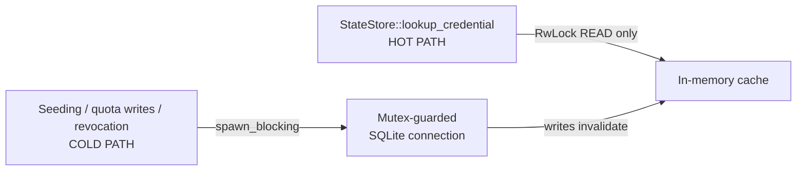
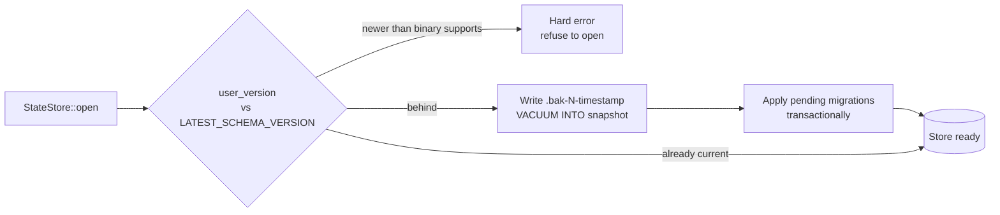

# State store

Source: `crates/dwara-core/src/state/{store,migrations}.rs` (DW-018,
DW-115). Tests: `store` (dwara-core, includes white-box residuals
directly in `state/store.rs` — raw-SQL introspection of the store's
own connection; see
[`AGENTS.md`](../../AGENTS.md#code-organization) for why those stay in
`src/`).

## What it's for

Durable state for the gateway's **control identity layer**: consumers,
credential records (pre-hashed secrets — see
[Authentication and authorization](./authn-authz.md)), and quota
counters. It is opt-in (`DWARA_STATE_DB`) and, by design, backend-neutral:
the schema and method semantics are written so a future multi-instance
edition could swap in a different backend behind the same API surface
without touching call sites — the same extension-point philosophy as
[Extension points](./extension-points.md), just not exposed as a
public trait yet because the store is deep enough that the
authentication/state boundary is the more useful seam today.

## Threading model

`rusqlite` is synchronous, and `StateStore` owns exactly **one** writer
connection behind a `std::sync::Mutex`. Every method is a short,
non-blocking critical section — the store's own SQLite operations are
all primary-key/index lookups or small transactions, never a scan.

The **hot path** — credential lookup on every authenticated request —
takes only an `RwLock` read on the in-memory cache and touches no
SQLite after warmup, so it's safe to call inline on any async thread.
Cold-path operations (seeding, quota writes, revocation) are expected
to be wrapped in `tokio::task::spawn_blocking` by callers, since they
do touch the synchronous Mutex-guarded connection.

## Cache coherence: single-process only

The in-memory cache is coherent for writes made **through the same**
`StateStore` handle — a write invalidates the entries it affects. A
second process, or a second handle to the same database file, will
**not** see those invalidations: this is single-process coherence
only, a deliberate v1/OSS boundary, not an oversight. A multi-instance
deployment sharing one state file would need an external shared
cache/invalidation layer on top — that's an edition-boundary concern
layered above this module, not something the schema needs to solve.

## Never sees plaintext secrets

The store never receives a plaintext credential value. Every stored
credential arrives pre-hashed with a lookup `selector` (computed
upstream by the authenticator — see
[Authentication and authorization](./authn-authz.md)): a hash for API
keys/Basic, a JWT `kid`/issuer, or an mTLS subject/fingerprint match
value. Hashing is authn's job, not the store's; the store just persists
whatever hash format `config::credentials` produces — peppered
`hmac-sha256:<hex>` when a deployment configures
`DWARA_CREDENTIAL_PEPPER`, legacy `sha256:<hex>` otherwise — and
upgrades legacy rows to the peppered format in place on their next
successful verification (`StateStore::rehash_credential`).

## Migrations: versioned, transactional, forward-only

Schema evolution is one ordered list of `UP` migrations applied by
`rusqlite_migration`, tracked in `PRAGMA user_version`:

There are **no down migrations**. Rolling a gateway binary back onto a
newer-schema data directory is a hard error at open, and downgrading
in place is unsupported — the documented rebuild path if you need to
go backward is: stop the gateway, locate the newest `<db>.bak-<version>-<timestamp>`
backup (every migration writes one before running, as a consistent
`VACUUM INTO` snapshot at the pre-migration version), replace the live
file with it, and restart. If no backup exists, consumers and
credentials are re-seedable straight from config
(`sync_consumers_from_config`) — so the honest v1 answer for "how do I
go back" is "restore a backup, or let config re-seed a fresh store."

Migrations must be strictly **additive** (create table/index, add
column with a default) so that every historical database migrates
forward with zero data loss, and an existing migration is never edited
after the fact — databases already in the wild have recorded having
applied it. Adding a new migration is one `M::up` entry plus bumping
`LATEST_SCHEMA_VERSION`; the test suite opens a hand-built v1 database
through every version to `HEAD` to guard the additive-only invariant.

## Why SQLite/bundled, not an external database

The OSS binary is fully static — `rusqlite`'s `bundled` feature
compiles SQLite into the binary itself, so there's no system
`libsqlite3` dependency at build or deploy time. This matches the
single-static-binary deployment model documented in
[Installation](../../docs-site/guide/installation.md) (the `scratch`
Docker image carries no base OS layer at all) — introducing an
external database dependency for the OSS edition would break that
deployment story for a feature (stored credentials) that most
deployments don't even need, which is exactly why the store stays
opt-in behind `DWARA_STATE_DB`.
