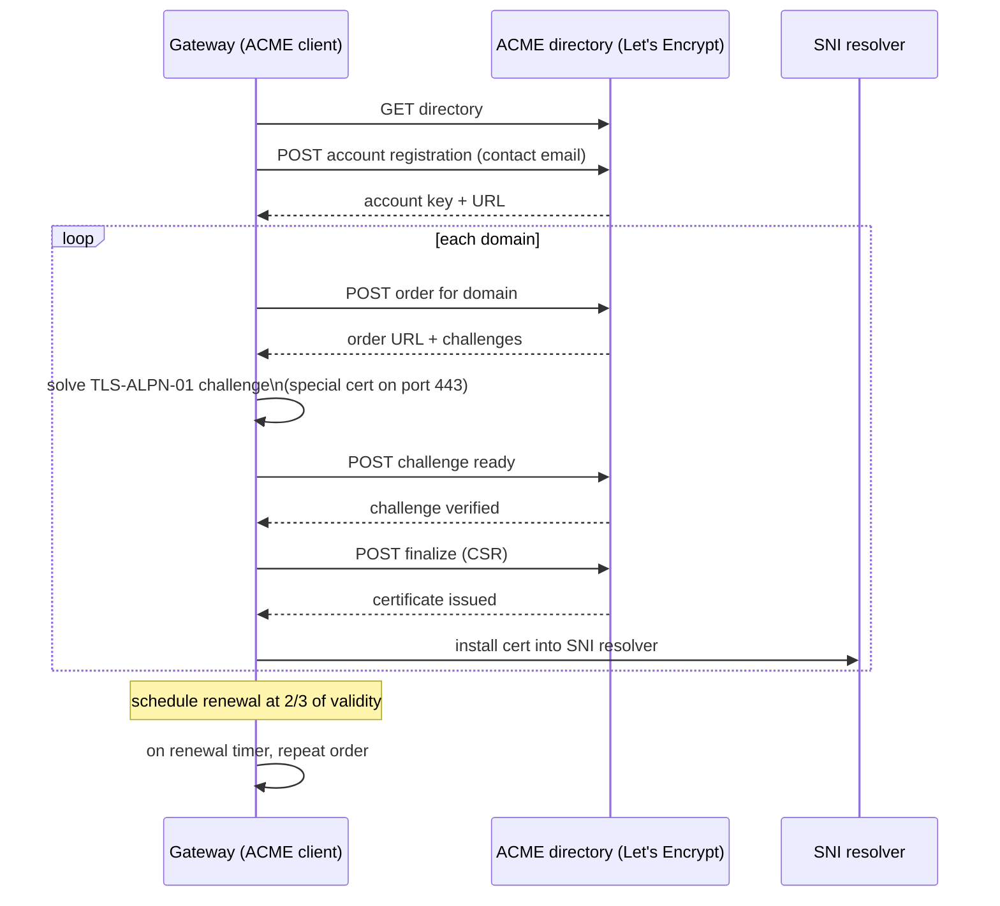

# TLS

Source: `crates/dwara-core/src/security/tls.rs` (DW-007),
`crates/dwara-core/src/security/acme.rs` (SEC-02, #155). Tests:
`tls_validation`, `trusted_ca` (dwara-core), `tls_listener`, `tls_edges`
(dwara-bin).

## Responsibilities

One module owns everything TLS-shaped in the gateway:

- installing the process-global crypto provider (aws-lc-rs) before the
  first `rustls` object is constructed,
- building a hot-reloadable `rustls::ServerConfig` for a terminate
  listener, with SNI-based certificate selection,
- outbound trust for HTTPS dials (upstreams, JWKS fetches, active
  health probes) — the default webpki public root set, or a per-entity
  PEM-bundle root store,
- the minimal ClientHello SNI parser and byte-splice that back TLS
  passthrough.
- ACME certificate automation (SEC-02, #155) — automated issuance and
  renewal from [ACME](https://en.wikipedia.org/wiki/Automated_Certificate_Management_Environment)-compatible certificate authorities like
  [Let's Encrypt](https://letsencrypt.org/), feature-gated behind the
  `acme` cargo feature.

## Terminate: multi-SNI

A terminate listener carries a fallback `cert_file`/`key_file` pair
plus an optional `certificates` list, each entry matched by SNI:

```yaml
listeners:
  - name: https
    port: 8443
    tls:
      mode: terminate
      cert_file: /etc/dwara/certs/default.crt.pem
      key_file: /etc/dwara/certs/default.key.pem
      certificates:
        - server_name: api.example.com
          cert_file: /etc/dwara/certs/api.crt.pem
          key_file: /etc/dwara/certs/api.key.pem
```

**Why SNI dispatch instead of one cert per listener:** a single bind
address is a scarce resource (ports, and often a single public IP);
hosting multiple TLS-terminated domains behind it without SNI would
mean one listener (and one config block) per certificate. TLS 1.2 and
1.3 are both enabled at rustls's default (modern) cipher-suite policy —
v1 does not expose cipher/version override knobs.

## Passthrough

A passthrough listener never decrypts the connection. It:

1. Peeks (never consumes) bytes from the socket, reassembling a
   ClientHello that may be fragmented across multiple TLS records, up
   to `MAX_HELLO_BYTES` (64 KiB) — a bound chosen so a hostile client
   can't pin unbounded memory building a fake, endlessly-fragmented
   hello.
2. Extracts the SNI value to pick an upstream via the normal load
   balancer.
3. Splices the connection's bytes to the chosen upstream verbatim; the
   upstream performs its own TLS handshake against the original
   client.

```mermaid
sequenceDiagram
    participant C as Client
    participant L as dwara listener
    participant U as Upstream

    C->>L: TCP connect
    C->>L: ClientHello (may span several TLS records)
    L->>L: peek + reassemble, extract SNI (bytes not consumed)
    L->>L: pick upstream via SNI + load balancer
    L->>U: TCP connect
    L->>C: splice bytes verbatim (both directions)
    Note over C,U: dwara never sees plaintext;\nupstream terminates TLS itself
```

**Why passthrough exists at all** (rather than "always terminate and
re-encrypt"): some deployments need the upstream to see the original,
unmodified TLS session — its own certificate presented to the client,
client-cert mTLS negotiated directly with the origin, or compliance
requirements that the gateway never hold key material for that domain.
Passthrough listeners never serve `/healthz`/`/readyz`/`/metrics` (they
don't speak HTTP at all — see [Operations](../../docs-site/guide/operations.md)).

## Hot reload

`TlsTermination` keeps the current `Arc<rustls::ServerConfig>` behind
an `ArcSwap`. Each accepted connection clones the *current* `Arc` into
a fresh `TlsAcceptor`, so a swap only affects handshakes that start
after it — in-flight TLS sessions keep their negotiated configuration,
and no existing connection is ever dropped by a certificate rotation.
This is the same swap-not-mutate pattern the config `Snapshot` uses
(see [Architecture](../architecture.md#hot-reload)), applied one level
down to just the TLS material.

## Outbound trust (per-entity, #121)

By default, outbound HTTPS dials (to upstreams, JWKS providers, and
their active health probes) trust the Mozilla webpki public root set
compiled into the binary — no CA bundle ships with the image. When an
upstream or JWT provider configures `trusted_ca_file`, that PEM bundle
**replaces** the public roots for that entity only; it does not add to
them. Rationale: additive trust would mean any deployment that adds one
private CA also implicitly trusts every public CA for that entity,
which is a broader trust grant than most private-CA deployments intend
(they typically want to say "only my CA," not "my CA plus the whole
public web").

- Validation-time: `check_trusted_ca_file` (in `snapshot/mod.rs`)
  parses the bundle at config-validate time and rejects a missing,
  unreadable, or certificate-free file, naming the offending field —
  so a broken trust bundle fails a `dwara-cli validate` or a `PATCH
  /config` dry run, not a live request.
- Runtime fail-closed: the empty-root-store-plus-ERROR-log path (for an
  upstream) or provider-disabled path (for a JWT provider) exists only
  as a backstop for the microsecond validate-vs-build race — it is
  never a silent fallback to the public roots.
- Active HTTPS health probes inherit their upstream's trust roots (kept
  on the upstream handle), so a probe against a private-CA upstream
  doesn't independently need its own trust configuration.
- Bundle files are **not** file-watched (only the main config file and
  listener terminate cert/key files are) — rotating a trust bundle
  needs a `SIGHUP` or a config change to take effect.

## ACME certificate automation (SEC-02, #155)

[ACME](https://en.wikipedia.org/wiki/Automated_Certificate_Management_Environment)
(Automated Certificate Management Environment) is the protocol that
[Let's Encrypt](https://letsencrypt.org/) and other certificate
authorities use to issue TLS certificates automatically. Instead of an
operator manually generating a CSR, submitting it to a CA, verifying
domain ownership, and installing the certificate, the gateway
negotiates all of that directly with the CA over HTTPS — and renews
the certificate before it expires, with no human intervention.

The implementation lives in `crates/dwara-core/src/security/acme.rs`
and is feature-gated behind the `acme` cargo feature (default OFF). The
config block (`listeners[].tls.acme`) is always accepted by the parser;
when the feature is OFF, validation warns that the block is inert.

> **Implementation status:** The `acme` feature is **config-accepted,
> runtime stubbed**. The config schema (`AcmeConfig`) parses and
> validates, and validation warns when the feature is off, but the ACME
> client itself is not yet implemented. No account registration,
> challenge completion, certificate issuance, or renewal task is wired
> into the listener startup path. A future change will add an ACME
> client dependency (rustls-acme or instant-acme, license-checked
> against `deny.toml`) and connect `build_acme_state` to the TLS
> listener. Until then, use an external ACME client (certbot, lego,
> cert-manager) and point the gateway at the resulting certificate
> files. The sections below describe the intended design.

### Architecture (intended design)

The following describes the intended architecture once the ACME client
is implemented. None of this is wired today (see the status note
above).



### Challenge types

- **`tls-alpn-01`** (default): the TLS terminator handles the challenge
  during the TLS handshake on port 443 by presenting a special
  challenge certificate with an ACME-specific extension. No separate
  HTTP listener is needed. This is the recommended default because it
  works behind most load balancers and in containerized environments
  where port 80 is not available.
- **`http-01`**: requires a separate HTTP listener on port 80 (or port
  forwarding from a load balancer). Use this only when TLS-ALPN-01 is
  not viable.

### State management

The ACME client persists its account key and issued certificates to a
configurable `state_dir` (default `./acme-state`). This survives
restarts: the account key is created once and reused; certificates are
loaded from disk on startup and renewed only when they approach
expiry.

### Renewal

Renewal is scheduled at 2/3 of the certificate's validity period (e.g.,
for a 90-day Let's Encrypt certificate, renewal starts at day 60). On
failure, the client logs the error and retries with exponential
backoff. Existing certificates continue to serve during renewal
failures — the gateway never drops TLS because a renewal attempt
failed.

### Staging

Set `staging: true` to use the Let's Encrypt staging directory.
Staging certificates are not trusted by browsers but are not subject
to the production rate limits (50 certificates per domain per week).
Test the ACME configuration with staging first, then switch to
production.

### Alternatives and tradeoffs

- **External ACME client** (certbot, lego, acme.sh): run an external
  client and place certificates in the gateway's cert paths. No
  gateway-integrated automation, but avoids adding an ACME client
  dependency to the gateway binary.
- **cert-manager (Kubernetes):** use cert-manager to obtain
  certificates and mount them as secrets. Decouples certificate
  management from the gateway entirely.
- The `acme` feature adds an ACME client dependency (rustls-acme or
  instant-acme, license-checked against `deny.toml`). The config types
  and state management are always available; the full client (account
  registration, challenge completion, certificate issuance) requires
  enabling the feature.

Operator docs: [docs-site ACME guide](../../docs-site/guide/acme.md).

## Testing notes

TLS behavior is covered process-level: `tls_listener`/`tls_edges` spawn
the real `dwara` binary and drive real TLS handshakes (multi-SNI
selection, passthrough splicing, hot-reload-without-drop);
`tls_validation`/`trusted_ca` exercise the validate-time PEM checks
directly against `dwara-core`.
