# Request/response transforms and security headers (DW-028)

> Implements issue DW-028 (M2, feature analysis 4.12 "transforms" and
> the 5-Security "security header injection" row). Sources:
> `crates/dwara-core/src/config/transforms.rs` (the config shapes, the
> RFC 6901 pointer grammar, and the security-header policy), the
> runtime application in `crates/dwara-core/src/dataplane/transforms.rs`,
> the wiring in `dataplane/proxy.rs`, validation in
> `src/snapshot/mod.rs`, and the per-route pointer precompute in
> `src/snapshot/mod.rs` (the `CompiledJsonTransform` tables). Tests:
> `crates/dwara-core/tests/transforms.rs` (15, end to end through the
> real dataplane) and `crates/dwara-core/tests/unit/transforms.rs` (21,
> grammar and runtime helpers). Operator docs: [docs-site transforms
> guide](../../docs-site/guide/transforms.md).

Two optional blocks on a Route — `transforms` and `security_headers` —
let an operator shape what crosses the gateway: header and query
manipulation on the forwarded request, header and JSON-body
manipulation on the route's responses, and a fixed set of standard
hardening headers stamped on every response the route emits. Both are
default-off; a route without the blocks forwards bytes and headers
untouched, exactly as before DW-028.

## The streaming contract (the issue's done-when)

"Streaming is preserved unless a transform explicitly buffers." The
surface splits exactly along that line:

- Header ops, query ops, and security headers never touch a body. A
  route carrying only these forwards and streams byte-identically to a
  route with no transforms block at all — SSE, upgrades, and large
  downloads keep their natural backpressure.
- The JSON body transform (`body.json`) is the ONE explicitly
  buffering transform. It opts the route in, applies only to JSON
  bodies (content-type gated), and buffers at most `max_bytes` — a
  hard cap enforced both against a declared `Content-Length` and
  against the live stream, frame by frame. Over-cap fails CLOSED
  (413 request-side, 502 response-side), never "transform what fit"
  and never a silent passthrough: a skipped policy transform is a
  fail-open data leak in the masking direction (DW-029 builds its
  field-redaction machinery on exactly this surface).

## Why the grammar lives in `config`

`config/transforms.rs` is config-contract grammar in the same sense as
`net.rs` (IP/CIDR) and `versioning.rs` (HTTP-date, media type):
validation (`snapshot::validate`) and the runtime
(`dataplane::transforms`) must agree on ONE parsing of these strings —
what `/items/0` addresses, which header names are forbidden, which
media types are JSON — so the grammar sits in `config`, the lowest
consuming domain, and both sides call the same functions. The
snapshot then compiles every body-transform pointer ONCE at publish
(`CompiledJsonTransform`; the same lockstep precompute contract as the
CORS/compression/deprecation tables), so the request path applies
parsed tokens and never re-parses config strings. Header and query ops
carry no grammar to compile — their whole cost is a map walk.

## Where each piece runs

```mermaid
flowchart TB
    subgraph forward["Forward path (inside the proxy action)"]
        A[DW-010 path rewrite] --> B[query ops<br/>the only thing that may change the query]
        B --> C[hop-by-hop stripping +<br/>trusted headers X-Forwarded/X-Consumer]
        C --> D[header ops<br/>may remove the trust headers]
        D --> E[JSON body transform<br/>BEFORE retry buffering]
    end
    subgraph tail["Response decoration tail"]
        F[body transform first] --> G[header ops]
        G --> H[compression DW-027] --> I[versioning stamps DW-048]
        I --> J[CORS decoration DW-027]
        J --> K[security headers DW-028]
        K --> L[rate headers]
    end
```

Request side: matching, limits, authn, and rate limiting all evaluated
the ORIGINAL request — the ops shape the request the upstream
receives, and reordering that is a policy change this block cannot
make. The body transform runs BEFORE retry buffering, so a retried
attempt replays the TRANSFORMED bytes; and it reads through the
route-limit and HMAC-digest wrappers (both still see the client's
original bytes — enforcement and policy are separable by design: the
digest binds what the client signed, the transform shapes what the
upstream receives).

Response side: the body transform runs first so compression encodes
the transformed bytes and its eligibility check sees the final
`Content-Type` a header op may have set. Response header/body
transforms apply to ACTION responses only (proxy, redirect, respond) —
like deprecation stamps, they describe the upstream's output, not the
request. Security headers are the deliberate exception: they stamp
EVERY route-matched response, gateway short-circuits included (see
below).

## Header ops

`set` (replace every value with one), `add` (append, keeping
existing), `rename` (move every value of `from` onto `to`), `remove`
(drop every value) — applied in that frozen order regardless of YAML
key order, with BTreeMap iteration keeping multi-entry application
deterministic. `remove` after `rename` lets an op clean up what
earlier ops placed.

The sharp edge is deliberate: request-side ops run AFTER the trusted
`X-Forwarded-*`/`X-Consumer-*` injection, so an op may remove or
rename those headers — the operator owns the upstream's contract, and
an upstream that must not see consumer identity has a mechanism. What
the operator may NOT touch is framing and hop-by-hop state:
validation rejects `content-length`, `transfer-encoding`,
`connection`, `keep-alive`, `te`, `trailer`, `upgrade`,
`proxy-connection`, `proxy-authenticate`, `proxy-authorization` in
both directions (an op forcing a framing value disagreeing with the
actual body is a request-smuggling primitive; a response op stripping
`content-encoding` without decoding would corrupt the body), plus
`host` request-side (the gateway names the origin it dials) and
`content-encoding` response-side (only the compression pipeline may
manage it). The lists live in `is_forbidden_request_header` /
`is_forbidden_response_header`.

## Query ops

The original query splits into pairs WITHOUT decoding: untouched
pairs — including their exact percent-encoding spelling — survive
byte-verbatim; only pairs a named op touches are (re-)encoded, by the
gateway's RFC 3986 percent-encoder. Key matching is on raw bytes (the
config key `a` matches `a=1`, never `%61=1`). Same op order as
headers: `set` replaces every pair of a key with one pair appended at
the end (position cannot be preserved for a replaced key), `rename`
re-labels in place, `add` appends, `remove` drops. The path is not
this block's to touch — that is DW-010's `path_rewrite`.

## The JSON body transform

RFC 6901 pointers against a parsed document, ops applied in listed
order (each sees the previous op's result). `set` writes any JSON
value at a pointer (creating the final key in an existing object
parent; replacing an existing element in an array parent); `remove`
deletes. The root pointer (`""`) is valid for `set` (whole-document
replacement) and rejected for `remove` at validation.

Gates, cheapest first: no compiled policy for the route, non-JSON
content type (`application/json` and the `application/*+json` family,
parameters ignored), a body already carrying `Content-Encoding` (the
transform does not decode), a declared-empty body. Only then does
anything buffer. Failure behavior is uniform fail-closed:

| Condition | Request side | Response side |
| --- | --- | --- |
| Over `max_bytes` (declared or streamed) | 413 | 502 |
| JSON-typed body does not parse | 400 | 502 |
| Pointer does not resolve | 400 | 502 |
| Route's own body limit tripped mid-buffer | the limit's 413 | — |
| HMAC digest mismatch (DW-036 wrapper) | the signature family's 401 | — |
| Upstream stream dies mid-body | — | clean 502 envelope |

Pointer strictness is the design decision worth restating: an
unresolved pointer is schema drift, and in the remove direction a
silent miss is exactly the leak the policy exists to prevent. The
offending pointer is named server-side in the log; the client envelope
stays generic. Two response-side consequences of buffering before
headers reach the client: an upstream death mid-body answers a CLEAN
502 instead of a torn stream, and upstream trailers are dropped (they
described the pre-transform body — a stale checksum beside replaced
bytes would be a lie). Both body transforms rewrite `Content-Length`
to the transformed body's exact length, and exactly one component —
this module — ever writes framing headers (header ops are barred from
them; see above).

## Security headers

Each present field stamps exactly one standard hardening header,
REPLACING any upstream-sent value — the gateway is the source of
truth at its edge, the same rule as the deprecation and
`X-RateLimit-*` headers:

- `hsts_max_age_secs` — `Strict-Transport-Security: max-age=<secs>`
  (RFC 6797), with optional `hsts_include_subdomains` and
  `hsts_preload` directives.
- `nosniff` — `X-Content-Type-Options: nosniff`.
- `content_security_policy` — `Content-Security-Policy` verbatim (the
  operator authors the policy).
- `frame_options` — `X-Frame-Options: DENY` or `SAMEORIGIN` (the
  obsolete `ALLOW-FROM` is deliberately absent).

They stamp every route-matched response — action responses AND
gateway short-circuits (401/403/413/429/503, CORS preflights): unlike
deprecation stamps, which announce API lifecycle, these harden every
byte the edge sends, and a browser parsing an error page deserves the
same guarantees as one parsing a 200. Not stamped: the pre-route
framing 400 and unrouted 404s (no route to consult). They apply LAST
in the decoration tail, after operator transforms — an operator who
needs a per-route exception omits the field here and sets it via
transforms.

## Validation

`snapshot::validate` checks each block, accumulating every issue (the
standard fail-closed publish pipeline):

- No empty containers at any level — a transforms block that
  transforms nothing is an authoring mistake (omit it), and so is an
  empty headers/query/body sub-block, an empty `json.ops`, or a
  `security_headers` block carrying no policy.
- Header names must be `HeaderName`-representable; `set`/`add` values
  `HeaderValue`-representable; `rename from == to` rejected.
- Forbidden framing/hop-by-hop names rejected per side (the smuggling
  and body-corruption guards above).
- Query names/values plain ASCII without the structural bytes (`&`,
  `=`, `#`, space in names; `&`, `#` in values) — everything else the
  encoder handles.
- `max_bytes >= 1` (deliberately no upper bound: the operator owns the
  route's memory budget, the same stance as `limits.max_body_bytes`);
  every pointer parses as RFC 6901; no `remove` at the root.
- `hsts_max_age_secs != 0` (max-age=0 is the RFC 6797 deletion signal
  — delete the field instead); `include_subdomains`/`preload` require
  a max-age; `preload` additionally requires `include_subdomains`
  (the preload list rejects entries without it); CSP non-empty.

The integration suite pins the pipeline end to end — what the upstream
receives (headers, query, transformed bytes), what the client
receives, every fail-closed status row above, and the streaming
guarantee (a route whose transforms touch no body forwards streams
byte-exactly); the unit suite pins the pointer grammar, op ordering,
percent-encoding, forbidden-name lists, media-type gate, and
security-header emission.
