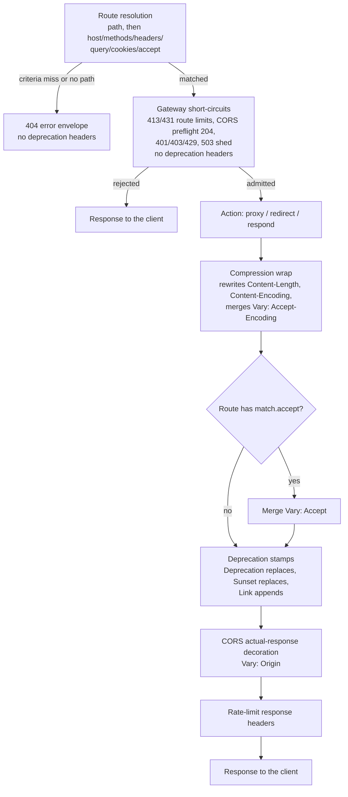

# API versioning aids

Source: `crates/dwara-core/src/config/versioning.rs` (the shared
HTTP-date and media-type grammar) and
`crates/dwara-core/src/dataplane/versioning.rs` (the Accept matcher and
the header stamping), DW-048, issue #49. Config types in
`src/config/mod.rs` (`RouteMatch::accept`, `Deprecation`,
`CompiledDeprecation`), validation in `src/snapshot/mod.rs`
(`validate_deprecation`, the `match.accept` check), runtime hooks in
`src/dataplane/proxy.rs` (`route_applies`, the response decoration
tail). Tests: `tests/versioning.rs` (15 live-dataplane integration +
8 validation) and `tests/unit/versioning.rs` (19 unit). The module
`//!` docs on both versioning files carry the full rationale; this page
summarizes it and adds the cross-module view.

## The honest split: patterns vs code

Most versioning shapes were already expressible with the DW-010 router,
and DW-048 deliberately re-implements none of them. The code that
exists is exactly the two things the router could not do: Accept
media-type selection (`match.accept`) and Deprecation/Sunset header
automation (the per-route `deprecation` block).

### Path-segment versions (`/v1/users`, `/v2/users`)

Plain path routes plus the canonical precedence (exact > regex >
prefix; longest prefix wins), with `rewrite.replace_prefix` stripping
the version segment toward a version-agnostic upstream:

```yaml
routes:
  - name: users-v1
    service: users
    match: { path: { type: prefix, value: /v1 } }
    action:
      type: proxy
      rewrite: { type: replace_prefix, prefix: /v1, replacement: "" }
```

Each version owns its prefix, so each version's rewrite strips its own
segment; `/v1/users` and `/v2/users` both reach `/users` upstream
(`path_versions_route_independently_and_rewrite_the_version_segment`).

### Version-header constraint (`X-API-Version: "2"`)

The exact header matcher (`match.headers`) already expresses "this
route additionally requires that header value". Note it is exact
byte-equality of the whole header value — no lists, no parameters.

### Version-in-query (`?version=2`)

`match.query` covers it (name-only matches on presence; a `value`
requires an exact raw match).

All three shapes are pinned as the documented patterns in
`tests/versioning.rs`; see also
[dataplane-proxy: route matching precedence](./dataplane-proxy.md#route-matching-precedence)
and [path rewrite](./dataplane-proxy.md#path-rewrite).

## `match.accept`: media-type version selection

The versioned-media-type convention embeds the version in the subtype
(`application/vnd.acme.v2+json`). The exact header matcher cannot
select on it — `Accept: application/vnd.acme.v2+json,
application/json;q=0.8` is one header value, not the byte string
`application/vnd.acme.v2+json` — so `match.accept` names one bare
media type and the route applies when any Accept entry names that
type/subtype:

```yaml
match:
  path: { type: prefix, value: /media/v2 }
  accept: application/vnd.acme.v2+json
```

Semantics (frozen):

- **Config side**: a bare `type/subtype` — both halves non-empty RFC
  9110 tokens, no parameters (`;...`), no wildcards. Validation
  rejects anything else as an authoring error — a value that cannot
  match is always a mistake — and compile stores the NORMALIZED value
  (trimmed, lowercased via `config::versioning::normalize_media_type`)
  as the route's comparison key (`RouteTable::accept_media_types`), so
  a padded config value matches exactly like a trimmed one and the hot
  path never re-normalizes.
- **Request side**: any comma-separated entry of ANY `Accept` header
  line matches, case-insensitively, with media-type parameters and
  q-values ignored. q is not implemented at all, which means `q=0`
  still selects the versioned route (RFC 9110 section 12.5.1 gives
  `q=0` the meaning "not acceptable"; treating it as a match is a
  pinned v1 decision — see
  `tests/unit/versioning.rs::accept_matcher_ignores_q_values_including_q_zero`).
  One caveat on the list split: entries are separated by a naive comma
  scan, so a quoted-string accept extension containing a comma
  (`application/foo;note="a, text/html"`) can split mid-string and
  false-match the `text/html` route — pathological, but known.
- **Wildcards and a missing Accept never match.** Version selection
  requires the client to NAME the version; an unconstrained client
  (`Accept: */*`, `Accept: application/json`, no Accept at all) falls
  through to the unversioned default route — which must therefore live
  on another path (see the limitation below).
- **Like every non-path criterion**: AND-ed with the rest of `match`
  and applied AFTER path resolution. A miss does not fall through to
  another candidate.
- **Parameter-form versioning** (`application/vnd.acme+json;version=2`)
  is deliberately unsupported: Accept entries mix media-type parameters
  with accept-extensions, and separating them reliably is parser work
  out of proportion to an S-sized aid.

### Caching correctness: `Vary: Accept`

A response whose route was selected by `match.accept` varies with the
request's `Accept`, so the decoration tail merges `Vary: Accept` into
every response of such a route — the same reasoning as CORS's
`Vary: Origin`. The merge is `hardening::merge_vary`, which folds all
existing `Vary` lines into one value; composed with compression
(`Accept-Encoding`) and CORS (`Origin`) each token appears exactly
once (`tests/versioning.rs::folded_vary_carries_each_token_exactly_once`).

## The v1 same-path limitation

Non-path criteria are applied after path resolution and a criteria
miss does NOT fall through to another candidate (the frozen DW-010
model; duplicate exact templates are additionally rejected at compile).
Consequences, pinned by tests:

- A criteria miss is a **404**, not a routing retry
  (`exact_version_header_criterion_selects_and_rejects`,
  `accept_matcher_selects_on_type_subtype_ignoring_list_and_q`).
- An equal-prefix sibling is **not** a fallback: path resolution picks
  the first-declared route on the equal-length tie, and a criteria miss
  on the winner 404s rather than trying the sibling
  (`equal_prefix_sibling_is_not_an_accept_fallback`).
- Therefore multiple versions of ONE path cannot be selected by header
  or Accept in v1. A version family uses **distinct paths** (`/v1/`,
  `/v2/`, optionally constrained further by `match.headers` /
  `match.accept`), with the unversioned default on its own path — or a
  single route serving one version.

Candidate iteration across same-path routes is a router model change,
out of scope for this aid; noted for the future.

## The `deprecation` block

An optional block on a Route that automates the RFC deprecation signal
headers on every response of the route. Header values are precomputed
once at snapshot-compile into `config::CompiledDeprecation` (the
HTTP-dates are parsed here, never per response; the RFC 9745 structured
date is rendered from the parsed seconds).

| Field | Emits | Rules |
| --- | --- | --- |
| `since` | `Deprecation: @<unix-seconds>` (RFC 9745 structured date) | IMF-fixdate HTTP-date. A past date is normal (the deprecation is in effect); a date before 1970 cannot form the structured date and is rejected. Required by `uri`. |
| `sunset` | `Sunset: <HTTP-date>` verbatim (RFC 8594) | IMF-fixdate only. Rejected at compile if in the past or before `since` (equal is allowed — a same-day deprecation-and-removal). |
| `uri` | `Link: <uri>; rel="deprecation"` (the RFC 9745 companion link), appended | Requires `since` (the link documents the `Deprecation` header). Must be an absolute `http(s)` URL carrying no `<`, `>`, or `"` byte (it is emitted inside a Link header). |

RFC 9745 carries no URI inside the `Deprecation` field — the
human-readable notice travels in the companion `Link`.

Semantics (frozen; see `config::Deprecation`'s doc comment):

- **Stamped on the route's ACTION responses** — proxy, redirect, and
  respond alike, in the response decoration tail after compression
  wrapping (the codec only rewrites `Content-Length`,
  `Content-Encoding`, and `Vary`, so these headers pass through
  verbatim) and beside the CORS headers (independent families).
- **NOT stamped on gateway short-circuits** — 413/431 limit
  rejections, CORS preflights, authn/authz/rate-limit rejections, and
  503 sheds describe the gateway's opinion of the REQUEST, not the
  route's lifecycle. (The eager HMAC body-digest 401 is an action-path
  response and DOES carry the stamps.) Unrouted traffic (404) never
  matched the route at all.
- **Replace vs append**: the gateway is the source of truth for the
  headers it is configured to emit (the same rule as `X-RateLimit-*`).
  On a route WITH a `deprecation` block, an upstream-sent
  `Deprecation`/`Sunset` is replaced. On a route WITHOUT one, upstream
  values pass through untouched. `Link` is appended — a list header;
  upstream links survive, with the gateway's deprecation link LAST
  (`gateway_deprecation_link_appends_after_upstream_links` pins the
  byte order).
- **Unbuildable values are skipped, never panic**: validation has
  already rejected them for publishable configs, so `decorate`
  skipping one is only a generation-tear backstop, the same posture as
  the respond-action headers
  (`tests/unit/versioning.rs::decorate_skips_unbuildable_link_values_without_panicking`).

## Validation: fail-closed by design

`snapshot::validate_deprecation` and the `match.accept` check reject,
naming the offending field:

- A `deprecation` block with neither `since` nor `sunset` (no effect —
  omit it), mirroring the `limits` rule.
- Any date that is not an IMF-fixdate HTTP-date. The grammar
  (`config::versioning::parse_http_date`) enforces the fixed field
  shapes, the literal `GMT` zone only (not `UT`/`UTC`/`Z`/offsets),
  day-of-month bounds with the leap-year rule (2000 yes, 1900 no),
  and **weekday consistency** — a day-name that disagrees with the
  date it names is a typo'd date. The obsolete RFC 850 and asctime
  forms are rejected. Rationale (module docs): this parses
  operator-authored config strings echoed verbatim into `Sunset`, and
  RFC 9110 generators MUST send IMF-fixdate — accepting only that one
  form keeps the emitted header canonical.
- `sunset` already in the past, and `sunset` before `since`. The
  past-sunset check reads the wall clock at compile time: it is a
  policy gate, not a per-request one.
- `since` before 1970 (cannot render as `@<seconds>`).
- `uri` without `since`, or not an absolute `http(s)` URL, or carrying
  a `<`/`>`/`"` byte. Schemes and hosts are case-insensitive (the
  emitted Link keeps the configured spelling verbatim).
- A `match.accept` that is not a bare `type/subtype` (wildcards,
  parameters, bare tokens).

**The hot-reload consequence** is the point of fail-closed: a rejected
config never publishes, so a reload carrying a stale (past) sunset is
rejected wholesale and the running generation keeps serving until the
date is fixed — a long-lived deployment cannot silently re-publish a
removal that already happened. The flip side is equally deliberate:
**the runtime does not enforce sunset**. A published generation keeps
emitting its headers after the sunset date passes; changing or
removing the signals is a republish
(`tests/unit/versioning.rs::compiled_deprecation_carries_no_wall_clock`
pins that compile itself carries no wall clock).

## Decoration tail order

Where the versioning work sits in the response path (see
`proxy::handle` / the decoration tail in `proxy.rs`):



The versioning stamps sit after compression (the codec would otherwise
rewrite around them) and before CORS decoration; the order between
versioning and CORS is incidental — the two families never touch the
same headers. See [edge policies](./edge-policies.md) for the sibling
stages of the tail.

### Preflight interplay (accept + cors on one route)

A route carrying BOTH `match.accept` and a `cors` block cannot be
preflighted by accident: browsers send `Accept: */*` (or nothing) for
preflights, a wildcard never names the version, so route resolution
misses and the request 404s BEFORE the CORS preflight short-circuit.
With the media type named, the route applies and the preflight
short-circuits as usual (204 with the CORS headers, and no
deprecation-family headers — a preflight is a short-circuit)
(`preflight_on_accept_and_cors_route_needs_the_named_media_type`).

## Config, reload, tests

`match.accept` and `deprecation` are additive strict-schema
(`deny_unknown_fields`) Route fields; `config-reference.json` is
regenerated with them. They carry no runtime state beyond the compiled
header values, so a hot reload swaps them atomically with the route
table — nothing to migrate, no counters to survive.

Test inventory: `tests/versioning.rs` — the three already-expressible
patterns as documented shapes; Accept selection (list/q/case, wildcard
and missing-header 404s, `Vary: Accept`); the deprecation headers on
proxied/respond/redirect actions; replace-vs-append against an
upstream that sends its own deprecation family; the short-circuit
exclusion; survival through compression; the all-policies composition
with each `Vary` token exactly once; the preflight interplay; the
equal-prefix no-fallback rule; and the validation matrix.
`tests/unit/versioning.rs` — the HTTP-date grammar (RFC example,
epoch/far-future, weekday consistency, leap years, obsolete forms,
non-GMT zones), the media-type grammar (case/padding normalization,
wildcards, parameters, tchar classes), the Accept matcher in
isolation (multi-line headers, non-UTF-8 lines, `q=0`), and
`CompiledDeprecation` / `decorate` at the header-map level.

For the operator-facing configuration shapes, see the docs-site
[API versioning guide](../../docs-site/guide/api-versioning.md).
