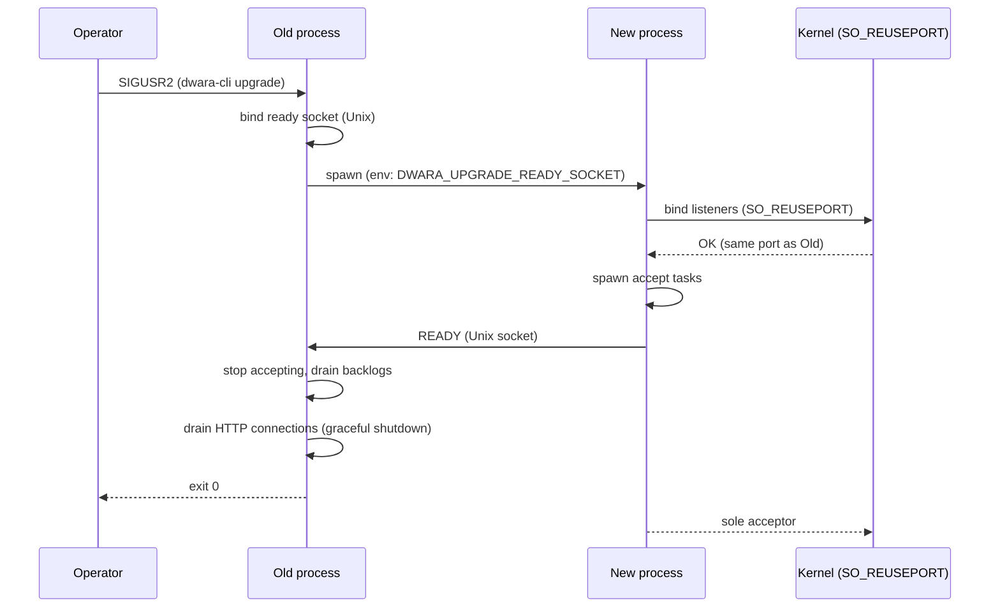

# Zero-downtime binary upgrade

Source: `crates/dwara-bin/src/upgrade.rs` (DW-049).
Tests: `zero_downtime_upgrade` (dwara-bin).
Operator guide: [docs-site: Zero-downtime upgrade](../../docs-site/guide/zero-downtime-upgrade.md).

Dwara can swap its binary under load with zero failed requests and zero
reset connections. The mechanism is a SO_REUSEPORT hand-off triggered by
`SIGUSR2`, modeled on the nginx/Envoy upgrade path but without FD
passing — SO_REUSEPORT removes the need to transfer file descriptors,
so the coordination is a single byte frame over a Unix domain socket.

## Design

### Why SO_REUSEPORT + readiness signal (not FD passing)

The story offered two approaches: SO_REUSEPORT hand-off or FD passing
via SCM_RIGHTS. FD passing is portable but requires `sendmsg`/`recvmsg`
with ancillary data (SCM_RIGHTS) — platform-specific syscall plumbing
with no safe std/tokio wrapper. SO_REUSEPORT is available on both Linux
and macOS, is a single `setsockopt` call (socket2 wraps it), and lets
the new process re-bind the same ports independently. The only
coordination needed is a readiness signal so the old process knows when
the new process is accepting before it stops accepting itself — and
that signal is a plain `READY\n` frame over a Unix domain socket (no
ancillary data, portable std/tokio I/O).

### The hand-off sequence

### SO_REUSEPORT bind

`upgrade::bind_with_reuse_port` creates a `socket2::Socket`, sets
`SO_REUSEADDR` and `SO_REUSEPORT`, binds, listens, then converts to a
tokio `TcpListener`. `listeners::bind_listener` calls it for every
configured listener. The second process's bind succeeds because both
sockets carry `SO_REUSEPORT`.

### Readiness coordination

- `initiate_upgrade` (old process, on SIGUSR2): binds a Unix domain
  socket at `/tmp/dwara-upgrade-{pid}.sock`, spawns the child with
  `DWARA_UPGRADE_READY_SOCKET` set, then `await_ready` waits for the
  child to connect and send `READY\n` (bounded by
  `DWARA_UPGRADE_READY_TIMEOUT_SECS`, default 30).
- `signal_ready` (new process, on startup): if
  `DWARA_UPGRADE_READY_SOCKET` is set, connects to that socket and sends
  `READY\n` AFTER all accept tasks are spawned. Then clears the env var
  so a future upgrade from this process uses a fresh socket.

### Drain reuse

On `READY`, the old process sends the same `watch::channel(())` shutdown
signal that SIGTERM/SIGINT use. The existing drain path runs unchanged:
per-listener backlog flush, hyper graceful shutdown, analytics/record
stream flush. The new process is already accepting, so the drain has no
refused connections and no resets.

### Failed upgrade is safe

If the child cannot spawn (bad `DWARA_UPGRADE_BINARY`) or does not
signal READY within the timeout, `initiate_upgrade` returns `Err`, the
old process logs `upgrade_failed`, and **keeps running**. The SIGUSR2
handler stays armed for a retry.

### PID file

`DWARA_PID_FILE` makes the gateway write its PID (atomic temp + rename)
once accept tasks are running. The new process overwrites it after
signaling READY, so the PID file always names the live acceptor. The
`dwara upgrade` CLI reads it to find the process to signal.

### Process group isolation

The spawned child is started in its own process group
(`Command::process_group(0)`), so a SIGINT/SIGTERM sent to the old
process's foreground group (e.g. Ctrl-C in a terminal) does not cascade
to the new gateway.

## What is NOT drained

Passthrough splices share the same documented limitation as SIGTERM: a
raw TLS byte splice has no drain signaling, so in-flight passthrough
connections on the old process run until it exits. Everything else
(HTTP/1, HTTP/2, h2c) drains via hyper graceful shutdown.

## Test coverage

`crates/dwara-bin/tests/zero_downtime_upgrade.rs` drives the real binary:

- **upgrade_under_load_zero_failures_and_zero_resets**: steady
  concurrent traffic, SIGUSR2 mid-flight, both processes accepting
  during the hand-off, old process drains and exits 0, new process is
  the sole acceptor — zero failures, zero resets, PID file points to
  the new process.
- **old_process_drains_inflight_request_before_exit**: a request
  accepted by the old process just before SIGUSR2 must complete (200)
  even as the old process drains.
- **failed_upgrade_keeps_old_process_running**: a bad
  `DWARA_UPGRADE_BINARY` makes the spawn fail; the old process keeps
  running and serving with zero traffic failures.

Logs are redirected to a temp FILE (not a pipe) because the upgrade
child inherits the old process's stdout FD — a pipe would never reach
EOF (the child holds the write end) and `read_to_end` would deadlock.
