# Networking fundamentals

This page is a reference for the networking concepts that dwara's
codebase builds on. It is not a tutorial — it is the shared vocabulary
contributors need to read the feature docs and source comments without
reaching for an external textbook. Each section ends with a pointer to
where the concept surfaces in the codebase.

## Contents

- [OSI model and TCP/IP stack](#osi-model-and-tcpip-stack)
- [DNS resolution](#dns-resolution)
- [Evolution of HTTP versions](#evolution-of-http-versions)
- [TLS handshake](#tls-handshake)
- [Connection lifecycle](#connection-lifecycle)
- [Proxying and the request pipeline](#proxying-and-the-request-pipeline)

## OSI model and TCP/IP stack

The [OSI model](https://en.wikipedia.org/wiki/OSI_model) is a
seven-layer abstraction that describes how data moves from an
application down to the physical wire. dwara operates at layers 4-7
(transport through application) and never touches layers 1-3 (physical,
data-link, network) directly — the OS and the NIC own those.

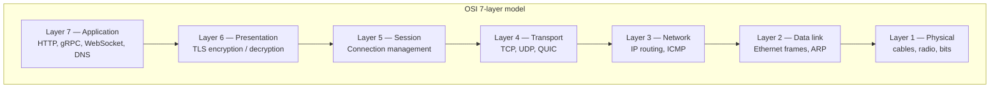

In practice the internet collapses the seven layers into the
four-layer [TCP/IP model](https://en.wikipedia.org/wiki/Internet_protocol_suite):

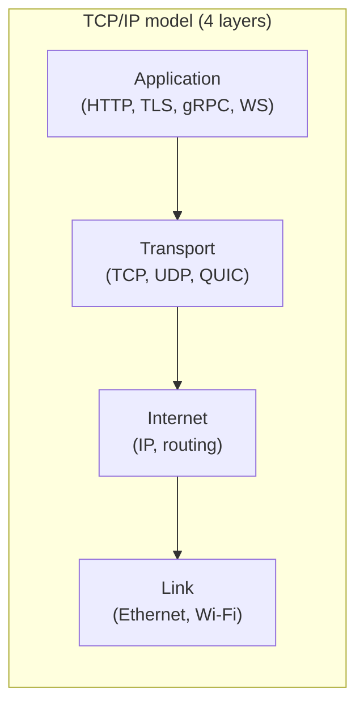

Where dwara sits:

| OSI layer | TCP/IP layer | dwara's role |
|---|---|---|
| 7 — Application | Application | HTTP/1.1, HTTP/2, HTTP/3, gRPC, WebSocket routing and policy |
| 6 — Presentation | Application | TLS terminate / passthrough (rustls, aws-lc-rs) |
| 5 — Session | Application | Connection pooling, keep-alive, WebSocket upgrade |
| 4 — Transport | Transport | TCP listeners, UDP L4 proxying, QUIC (HTTP/3 ingress) |
| 3 — Network | Internet | Delegated to the OS; dwara reads/writes sockets |
| 2 — Data link | Link | OS / NIC — not in dwara's scope |
| 1 — Physical | Link | Hardware — not in dwara's scope |

The key insight for contributors: dwara is a **layer 7 proxy with layer
4 listening**. It accepts TCP/UDP connections (layer 4), terminates TLS
(layer 6), then parses and routes HTTP/gRPC/WebSocket frames (layer 7).
The L4 TCP/UDP proxying feature (`crates/dwara-core/src/dataplane/l4.rs`,
DW-103) is the exception — it forwards raw bytes without parsing the
application layer.

See: [Architecture](./architecture.md), [L4 proxying](./features/l4-proxying.md),
[TLS](./features/tls.md).

## DNS resolution

[DNS](https://en.wikipedia.org/wiki/Domain_Name_System) translates a
hostname like `api.upstream.example` into an IP address. dwara uses DNS
for two things: resolving upstream hostnames in the config, and
[dynamic upstream discovery](./features/dynamic-discovery.md) (DW-024)
where a pool of endpoints is refreshed from DNS A/SRV records on a
background timer.

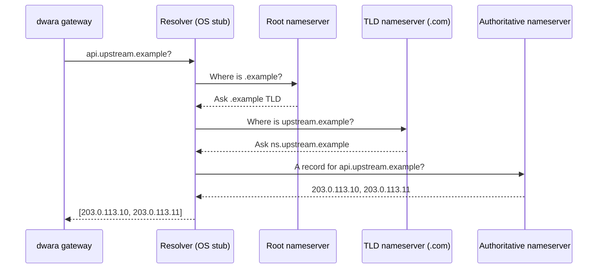

The resolution shown above is **recursive**: the OS resolver (usually
`getaddrinfo` via libc, or a custom resolver in dwara's case) walks the
DNS tree from the root down. In practice, the OS resolver is almost
always configured to forward to a caching recursive resolver (systemd
`resolved`, a corporate DNS server, or `8.8.8.8`), so the gateway sees a
single round-trip.

dwara's DNS usage:

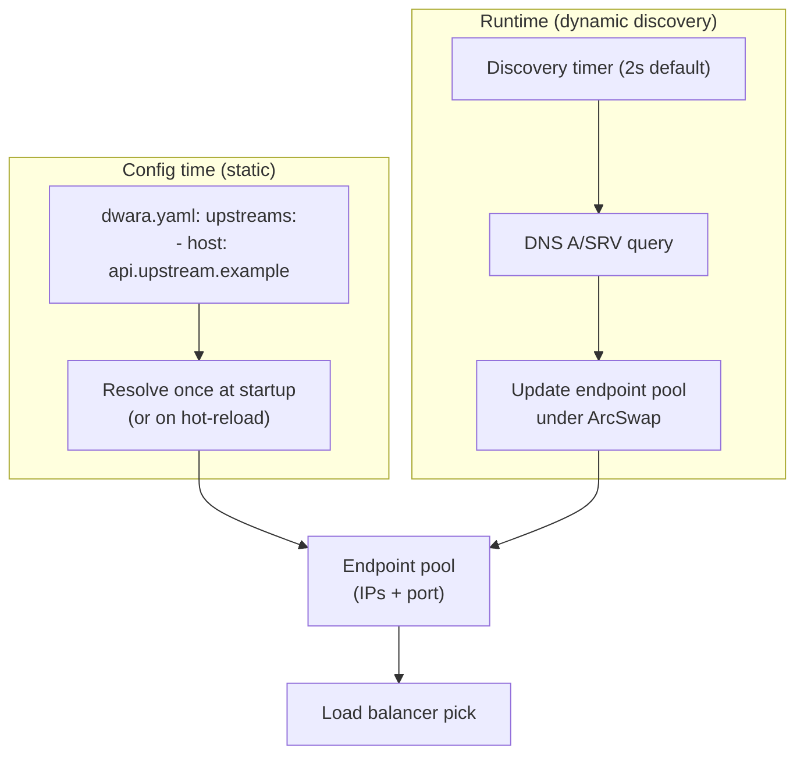

Key behaviors:

- **Static upstreams** are resolved at startup (and on hot-reload). If
  DNS returns multiple A records, all IPs enter the endpoint pool.
- **Dynamic discovery** (DW-024) re-resolves on a timer so the pool
  tracks DNS changes without a reload. The resolver uses
  `hickory-resolver` (a pure-Rust async DNS client) to avoid blocking
  the tokio runtime on `getaddrinfo`.
- **Happy Eyeballs** (RFC 8305, DW-024) races IPv4 and IPv6 connections
  in parallel when DNS returns both, picking whichever connects first
  to avoid the dual-stack stall.

See: [Dynamic upstream discovery](./features/dynamic-discovery.md),
[Load balancing](./features/load-balancing.md).

## Evolution of HTTP versions

dwara supports HTTP/1.1, HTTP/2, and HTTP/3 (ingress and upstream).
Understanding the evolution clarifies why the codebase has separate
code paths for each.

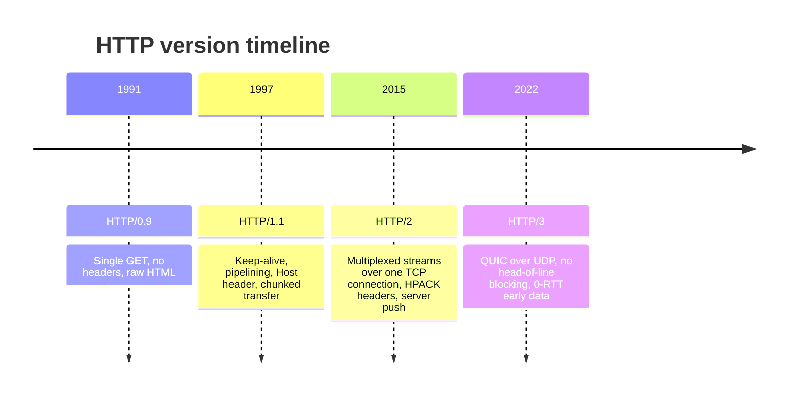

### HTTP/1.1

[HTTP/1.1](https://datatracker.ietf.org/doc/html/rfc9112) (RFC 9112,
formerly RFC 7230) added:

- **Keep-alive** — a TCP connection is reused across multiple requests
  instead of one connection per request.
- **Pipelining** — a client can send multiple requests without waiting
  for responses, but responses must arrive in order (head-of-line
  blocking at the application layer).
- **Host header** — virtual hosting: multiple sites on one IP.
- **Chunked transfer encoding** — streaming bodies without a known
  Content-Length.

dwara's HTTP/1.1 path is in `crates/dwara-core/src/dataplane/proxy.rs`.
It streams request and response bodies chunk-by-chunk with no buffering
beyond the OS socket buffer.

### HTTP/2

[HTTP/2](https://datatracker.ietf.org/doc/html/rfc9113) (RFC 9113,
formerly RFC 7540) introduced:

- **Multiplexed streams** — multiple concurrent requests/responses over
  a single TCP connection, each with a unique stream ID.
- **HPACK header compression** — a static + dynamic Huffman table
  compresses headers, reducing overhead for small payloads.
- **Binary framing** — frames are binary, not text, with a fixed
  9-byte header (length, type, flags, stream ID).
- **Server push** — the server can send responses the client has not
  asked for yet (deprecated in practice; dwara does not push).

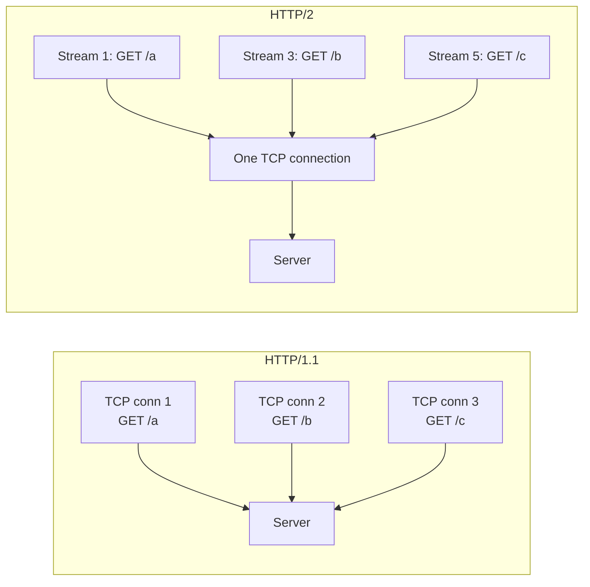

HTTP/2 still runs over TCP, so a lost packet stalls all streams
(head-of-line blocking at the TCP layer). HTTP/3 fixes this.

dwara's HTTP/2 path uses `h2` (the Rust crate) for both ingress (ALPN
negotiation on a TLS connection) and upstream (h2c cleartext or TLS).
See `crates/dwara-core/src/dataplane/proxy.rs` and
`crates/dwara-bin/src/listeners.rs`.

### HTTP/3

[HTTP/3](https://datatracker.ietf.org/doc/html/rfc9114) (RFC 9114)
runs over [QUIC](https://datatracker.ietf.org/doc/html/rfc9000) (RFC
9000), which is itself over UDP:

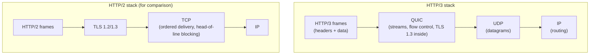

Key differences from HTTP/2:

- **No head-of-line blocking** — each QUIC stream is independently
  ordered; a lost packet stalls only one stream, not all of them.
- **TLS 1.3 is built into QUIC** — there is no separate TLS layer; the
  handshake is part of the QUIC connection establishment.
- **0-RTT early data** — a client that has connected before can send
  request data in its first flight, before the handshake completes.
  dwara's `alt_svc` header advertises HTTP/3 so browsers discover it.
- **Connection migration** — a QUIC connection survives a client IP
  change (Wi-Fi to cellular) because the connection ID is independent
  of the 4-tuple.

dwara's HTTP/3 ingress is in `crates/dwara-bin/src/h3.rs` (DW-088) and
the upstream transport in `crates/dwara-core/src/dataplane/h3_upstream.rs`
(DW-108).

See: [H3/QUIC upstream transport](./features/h3-quic-upstream.md),
[Dataplane and proxy](./features/dataplane-proxy.md).

## TLS handshake

[TLS](https://en.wikipedia.org/wiki/Transport_Layer_Security) is the
protocol that encrypts the connection. dwara terminates TLS (decrypts
it) on terminate-mode listeners and passes it through unmodified on
passthrough-mode listeners.

### TLS 1.2 handshake

The classic full handshake is two round-trips:

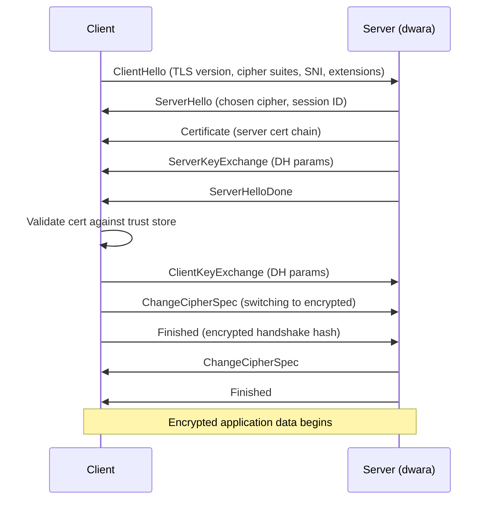

### TLS 1.3 handshake

[TLS 1.3](https://datatracker.ietf.org/doc/html/rfc8446) (RFC 8446)
collapses the handshake to one round-trip by sending key exchange
parameters in the first flight:

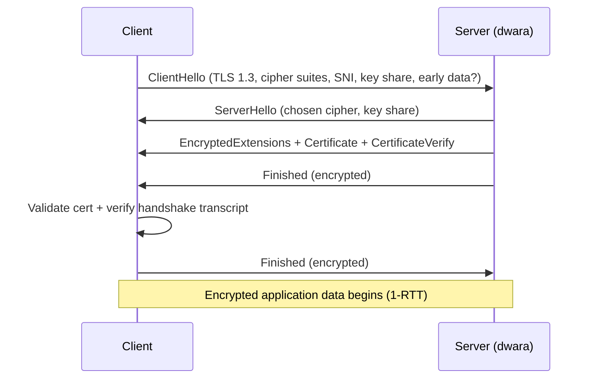

With **0-RTT** (early data), a returning client can send application
data in its very first flight, before the server has even responded:

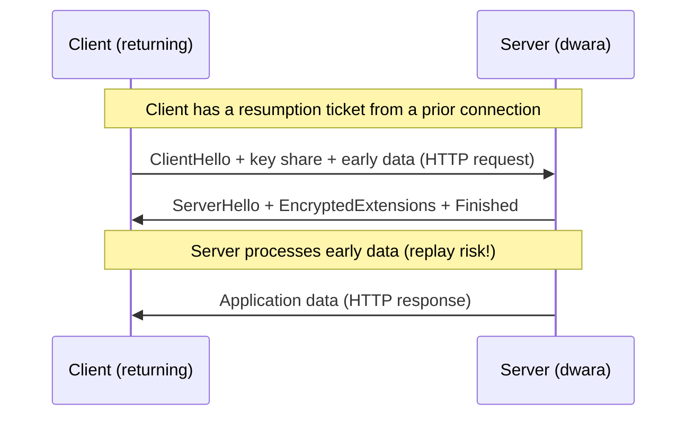

0-RTT is **not forward-secret** and is **replayable** — an attacker can
capture and replay the early data. dwara's HTTP/3 ingress (DW-088)
configures an `early_data` policy to control whether 0-RTT requests are
accepted.

### SNI and certificate selection

[Server Name Indication](https://datatracker.ietf.org/doc/html/rfc6066)
(SNI, RFC 6066) is a TLS extension that lets the client tell the server
which hostname it wants *during* the ClientHello, before the
certificate is sent. Without SNI, a server with multiple certificates
on one IP would not know which cert to present.

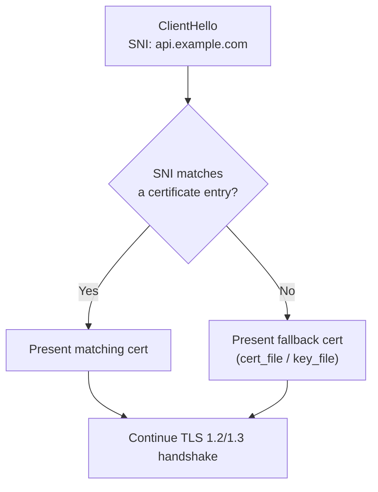

dwara's multi-SNI terminate listener (`crates/dwara-core/src/security/tls.rs`,
DW-007) holds a fallback `cert_file`/`key_file` pair plus an optional
`certificates` list, each matched by SNI. For TLS passthrough, the
gateway reads the SNI from the ClientHello bytes *without* terminating
TLS and routes the raw TCP stream to the upstream that owns that
hostname — see [TLS](./features/tls.md).

### ALPN

[Application-Layer Protocol Negotiation](https://datatracker.ietf.org/doc/html/rfc7301)
(ALPN, RFC 7301) is another TLS extension that lets the client and
server agree on the application protocol *during* the handshake, so the
server knows whether to speak HTTP/1.1 or HTTP/2 without a trial
request:

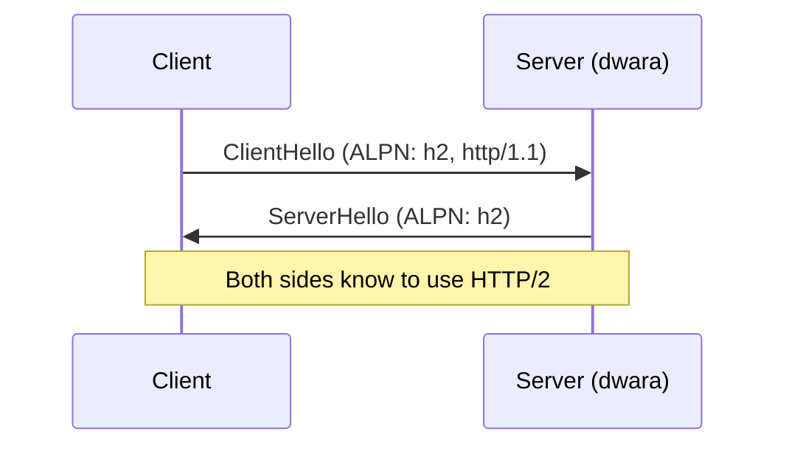

dwara advertises `h2` and `http/1.1` on terminate listeners so a
browser can negotiate HTTP/2 over the same TLS connection. HTTP/3 is
discovered out-of-band via the `Alt-Svc` header, not ALPN (HTTP/3 is
over QUIC/UDP, not TCP).

See: [TLS](./features/tls.md), [Post-quantum TLS](./features/post-quantum-tls.md),
[FIPS mode](./features/fips-mode.md).

## Connection lifecycle

A TCP connection goes through a defined lifecycle. dwara manages this
for both inbound (client to gateway) and outbound (gateway to upstream)
connections.

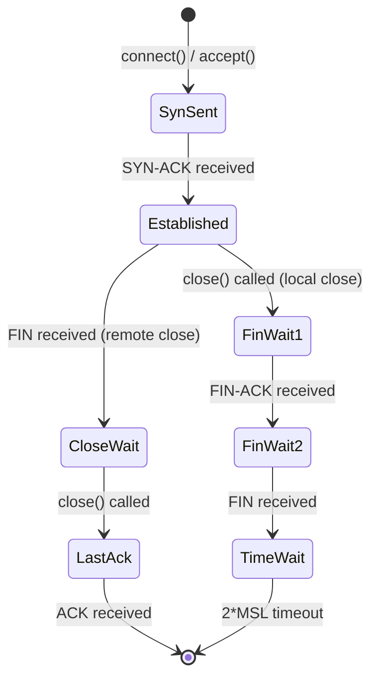

Key states for a proxy:

- **Established** — the normal data transfer phase. dwara streams
  request/response bytes here.
- **CloseWait** — the remote end closed; dwara must finish draining
  its read buffer and then close.
- **TimeWait** — the local end closed; the OS holds the socket for
  2*MSL (typically 60-120s) to absorb stray packets. This is why a
  gateway that opens many short-lived connections can exhaust port
  numbers — connection pooling and keep-alive avoid it.

dwara's graceful shutdown (`crates/dwara-bin/src/main.rs`) drains
in-flight requests before closing listeners: it stops accepting new
connections, lets established connections finish their responses, then
closes. The `DWARA_SHUTDOWN_TIMEOUT_SECS` env var bounds the drain.

See: [Operations](../docs-site/guide/operations.md),
[Protocol hardening](./features/protocol-hardening.md).

## Proxying and the request pipeline

Tying the layers together: here is what happens when a client sends an
HTTPS request through dwara to an upstream.

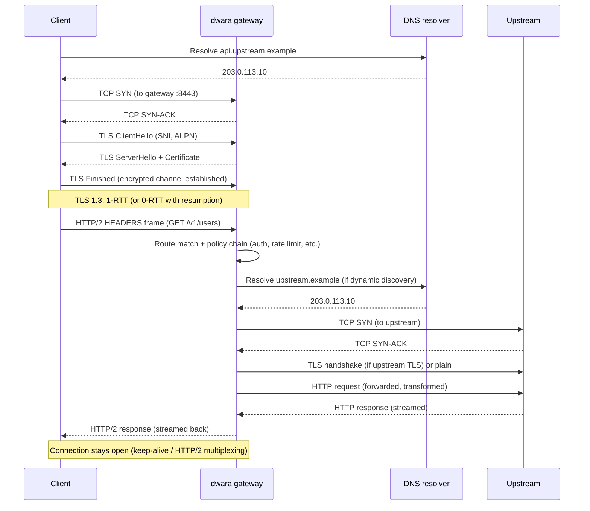

The pipeline inside the gateway, once a request is parsed:

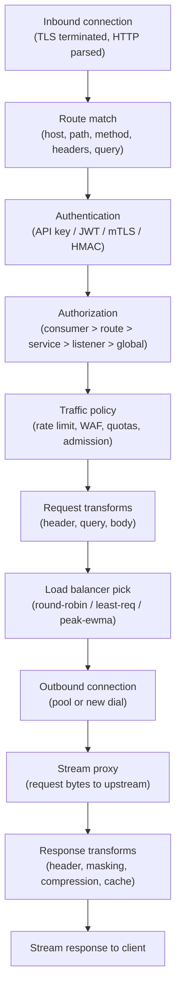

Each box is a phase in `crates/dwara-core/src/dataplane/proxy.rs`. The
order matters: authentication before authorization, policy before
transforms, load balancing after the route is known. A request can be
short-circuited at any phase (401, 403, 429, 503) and never reach the
upstream.

See: [Architecture](./architecture.md),
[Dataplane and proxy](./features/dataplane-proxy.md),
[Authentication and authorization](./features/authn-authz.md),
[Resilience](./features/resilience.md).
